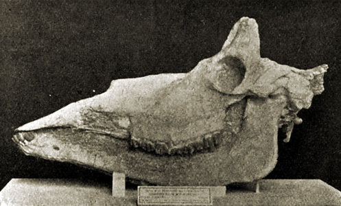

---
title: Giraffoidea
---

# [[Giraffoidea]] 

## #has_/text_of_/abstract 

> **Giraffoidea** is a superfamily that includes the families Climacoceratidae, Prolibytheriidae, and Giraffidae. 
> 
> The only extant members in the superfamily are the giraffes and okapi. 
> The Climacoceratidae are also placed in the superfamily, 
> but were originally placed within the family Palaeomerycidae.
>
> [Wikipedia](https://en.wikipedia.org/wiki/Giraffoidea) 

## Phylogeny 

-   « Ancestral Groups  
    -   [Ruminants](../Ruminants.md)
    -  [Artiodactyla](../../Artiodactyla.md))
    -  [Eutheria](../../../Eutheria.md))
    -  [Mammal](../../../../Mammal.md))
    -   [Therapsida](../../../../../Therapsida.md)
    -   [Synapsida](../../../../../../Synapsida.md)
    -   [Amniota](../../../../../../../Amniota.md)
    -   [Terrestrial Vertebrates](../../../../../../../../Terrestrial.md)
    -   [Sarcopterygii](../../../../../../../../../Sarc.md)
    -   [Gnathostomata](../../../../../../../../../../Gnath.md)
    -   [Vertebrata](../../../../../../../../../../../Vertebrata.md)
    -   [Craniata](../../../../../../../../../../../../Craniata.md)
    -   [Chordata](../../../../../../../../../../../../../Chordata.md)
    -   [Deuterostomia](../../../../../../../../../../../../../../Deutero.md)
    -  [Bilateria](../../../../../../../../../../../../../../../Bilateria.md))
    -  [Animals](../../../../../../../../../../../../../../../../Animals.md))
    -  [Eukarya](../../../../../../../../../../../../../../../../../Eukarya.md))
    -   [Tree of Life](../../../../../../../../../../../../../../../../../Tree_of_Life.md)

-   ◊ Sibling Groups of  Ruminantia
    -   [Bovidae](Bovidae.md)
    -   [Moschidae](Moschidae.md)
    -   Giraffoidea
    -   [Antilocapridae](Antilocapridae.md)
    -   [Miscellaneous fossil         pecorans](Miscellaneous_fossil_pecorans)
    -   [Tragulidae](Tragulidae.md)

-   » Sub-Groups
    -   [Giraffidae](Giraffoidea/Giraffidae.md)

	-   *Canthumeryx* †
	-   *Climacoceras* †
	-   *Georgiomeryx* †
	-   *[Giraffidae](Giraffoidea/Giraffidae.md "go to ToL page")*
	-   *Giraffokeryx* †
	-   *Injanatherium* †
	-   *Lorancameryx* †
	-   *Nyanzameryx* †
	-   *Orangemeryx* †
	-   *Progiraffa* †
	-   *Propalaeomeryx* †
	-   *Propalaeoryx* †
	-   *Sperrgebietomeryx* †
	-   *Teruelia* †

## Title Illustrations

)

-----------------------------
Scientific Name ::     Samotherium
Location ::           Samos, Greece
Reference            Lankester, E. R. 1905. Extinct Animals. Archibald Constable & Co. Ltd., London
Specimen Condition   Fossil \-- Period: Miocene
Body Part            skull
-----------------------------

## Confidential Links & Embeds: 

### #is_/same_as ::[Giraffoidea](Giraffoidea.md)) 

### #is_/same_as :: [Giraffoidea.public](/_public/bio/bio~Domain/Eukarya/Animals/Bilateria/Deutero/Chordata/Craniata/Vertebrata/Gnath/Sarc/Tetrapods/Amniota/Synapsida/Therapsida/Mammal/Eutheria/Artiodactyla/Ruminants/Giraffoidea.public.md) 

### #is_/same_as :: [Giraffoidea.internal](/_internal/bio/bio~Domain/Eukarya/Animals/Bilateria/Deutero/Chordata/Craniata/Vertebrata/Gnath/Sarc/Tetrapods/Amniota/Synapsida/Therapsida/Mammal/Eutheria/Artiodactyla/Ruminants/Giraffoidea.internal.md) 

### #is_/same_as :: [Giraffoidea.protect](/_protect/bio/bio~Domain/Eukarya/Animals/Bilateria/Deutero/Chordata/Craniata/Vertebrata/Gnath/Sarc/Tetrapods/Amniota/Synapsida/Therapsida/Mammal/Eutheria/Artiodactyla/Ruminants/Giraffoidea.protect.md) 

### #is_/same_as :: [Giraffoidea.private](/_private/bio/bio~Domain/Eukarya/Animals/Bilateria/Deutero/Chordata/Craniata/Vertebrata/Gnath/Sarc/Tetrapods/Amniota/Synapsida/Therapsida/Mammal/Eutheria/Artiodactyla/Ruminants/Giraffoidea.private.md) 

### #is_/same_as :: [Giraffoidea.personal](/_personal/bio/bio~Domain/Eukarya/Animals/Bilateria/Deutero/Chordata/Craniata/Vertebrata/Gnath/Sarc/Tetrapods/Amniota/Synapsida/Therapsida/Mammal/Eutheria/Artiodactyla/Ruminants/Giraffoidea.personal.md) 

### #is_/same_as :: [Giraffoidea.secret](/_secret/bio/bio~Domain/Eukarya/Animals/Bilateria/Deutero/Chordata/Craniata/Vertebrata/Gnath/Sarc/Tetrapods/Amniota/Synapsida/Therapsida/Mammal/Eutheria/Artiodactyla/Ruminants/Giraffoidea.secret.md)

