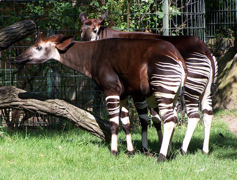

---
aliases:
- Okapia
- Okapi
- Okapis
title: "Okapia johnstoni"
---

## Phylogeny 

-   « Ancestral Groups  
    -   [Giraffidae](../Giraffidae.md)
    -   [Giraffoidea](../../Giraffoidea.md)
    -   [Ruminants](../../../Ruminants.md)
    -  [Artiodactyla](../../../../Artiodactyla.md))
    -  [Eutheria](../../../../../Eutheria.md))
    -  [Mammal](../../../../../../Mammal.md))
    -   [Therapsida](../../../../../../../Therapsida.md)
    -   [Synapsida](../../../../../../../../Synapsida.md)
    -   [Amniota](../../../../../../../../../Amniota.md)
    -   [Terrestrial Vertebrates](../../../../../../../../../../Terrestrial.md)
    -   [Sarcopterygii](../../../../../../../../../../../Sarc.md)
    -   [Gnathostomata](../../../../../../../../../../../../Gnath.md)
    -   [Vertebrata](../../../../../../../../../../../../../Vertebrata.md)
    -   [Craniata](../../../../../../../../../../../../../../Craniata.md)
    -   [Chordata](../../../../../../../../../../../../../../../Chordata.md)
    -   [Deuterostomia](../../../../../../../../../../../../../../../../Deutero.md)
    -  [Bilateria](../../../../../../../../../../../../../../../../../Bilateria.md))
    -  [Animals](../../../../../../../../../../../../../../../../../../Animals.md))
    -  [Eukarya](../../../../../../../../../../../../../../../../../../../Eukarya.md))
    -   [Tree of Life](../../../../../../../../../../../../../../../../../../../Tree_of_Life.md)

-   ◊ Sibling Groups of  Giraffidae
    -   [Giraffe](Giraffe.md)
    -   Okapia johnstoni

-   » Sub-Groups 

# Okapia johnstoni

## Okapi 

 

## #has_/text_of_/abstract 

> The okapi (; **Okapia** johnstoni), also known as the forest giraffe, Congolese giraffe and zebra giraffe, is an artiodactyl mammal that is endemic to the northeast Democratic Republic of the Congo in central Africa. However, non-invasive genetic identification has suggested that a population has occurred south-west of the Congo River as well. It is the only species in the genus Okapia. Although the okapi has striped markings reminiscent of zebras, it is most closely related to the giraffe. The okapi and the giraffe are the only living members of the family Giraffidae.
>
> The okapi stands about 1.5 m (4 ft 11 in) tall at the shoulder and has a typical body length around 2.5 m (8 ft 2 in). Its weight ranges from 200 to 350 kg (440 to 770 lb). It has a long neck, and large, flexible ears. Its coat is a chocolate to reddish brown, much in contrast with the white horizontal stripes and rings on the legs, and white ankles. Male okapis have short, distinct horn-like protuberances on their heads called ossicones, less than 15 cm (5.9 in) in length. Females possess hair whorls, and ossicones are absent.
>
> Okapis are primarily diurnal, but may be active for a few hours in darkness. They are essentially solitary, coming together only to breed. Okapis are herbivores, feeding on tree leaves and buds, grasses, ferns, fruits, and fungi. Rut in males and estrus in females does not depend on the season. In captivity, estrus cycles recur every 15 days. The gestational period is around 440 to 450 days long, following which usually a single calf is born. The juveniles are kept in hiding, and nursing takes place infrequently. Juveniles start taking solid food from three months, and weaning takes place at six months.
>
> Okapis inhabit canopy forests at altitudes of 500–1,500 m (1,600–4,900 ft). The International Union for the Conservation of Nature and Natural Resources classifies the okapi as endangered. Major threats include habitat loss due to logging and human settlement. Illegal mining and extensive hunting for bushmeat and skin have also led to a decline in populations. The Okapi Conservation Project was established in 1987 to protect okapi populations.
>
> [Wikipedia](https://en.wikipedia.org/wiki/Okapi) 

## Title Illustrations

------------------------------------------------------------------
 
Scientific Name ::     Okapia johnstoni
Location ::           captive at Berlin Zoo, Germany
Acknowledgements     This image is licensed under the [Attribution-NonCommercial-ShareAlike 2.0 Creative Commons License](http://creativecommons.org/licenses/by-nc-sa/2.0/).
Specimen Condition   Live Specimen
Image Use ::    [Attribution-NonCommercial-ShareAlike 2.0 Creative Commons License](http://creativecommons.org/licenses/by-nc-sa/2.0/).
Copyright ::            © 2004 [Phil](http://flickr.com/people/philbull11/)

## Confidential Links & Embeds: 

### #is_/same_as ::[Okapi](Okapi.md)) 

### #is_/same_as :: [Okapi.public](/_public/bio/bio~Domain/Eukarya/Animals/Bilateria/Deutero/Chordata/Craniata/Vertebrata/Gnath/Sarc/Tetrapods/Amniota/Synapsida/Therapsida/Mammal/Eutheria/Artiodactyla/Ruminants/Giraffoidea/Giraffidae/Okapi.public.md) 

### #is_/same_as :: [Okapi.internal](/_internal/bio/bio~Domain/Eukarya/Animals/Bilateria/Deutero/Chordata/Craniata/Vertebrata/Gnath/Sarc/Tetrapods/Amniota/Synapsida/Therapsida/Mammal/Eutheria/Artiodactyla/Ruminants/Giraffoidea/Giraffidae/Okapi.internal.md) 

### #is_/same_as :: [Okapi.protect](/_protect/bio/bio~Domain/Eukarya/Animals/Bilateria/Deutero/Chordata/Craniata/Vertebrata/Gnath/Sarc/Tetrapods/Amniota/Synapsida/Therapsida/Mammal/Eutheria/Artiodactyla/Ruminants/Giraffoidea/Giraffidae/Okapi.protect.md) 

### #is_/same_as :: [Okapi.private](/_private/bio/bio~Domain/Eukarya/Animals/Bilateria/Deutero/Chordata/Craniata/Vertebrata/Gnath/Sarc/Tetrapods/Amniota/Synapsida/Therapsida/Mammal/Eutheria/Artiodactyla/Ruminants/Giraffoidea/Giraffidae/Okapi.private.md) 

### #is_/same_as :: [Okapi.personal](/_personal/bio/bio~Domain/Eukarya/Animals/Bilateria/Deutero/Chordata/Craniata/Vertebrata/Gnath/Sarc/Tetrapods/Amniota/Synapsida/Therapsida/Mammal/Eutheria/Artiodactyla/Ruminants/Giraffoidea/Giraffidae/Okapi.personal.md) 

### #is_/same_as :: [Okapi.secret](/_secret/bio/bio~Domain/Eukarya/Animals/Bilateria/Deutero/Chordata/Craniata/Vertebrata/Gnath/Sarc/Tetrapods/Amniota/Synapsida/Therapsida/Mammal/Eutheria/Artiodactyla/Ruminants/Giraffoidea/Giraffidae/Okapi.secret.md)

