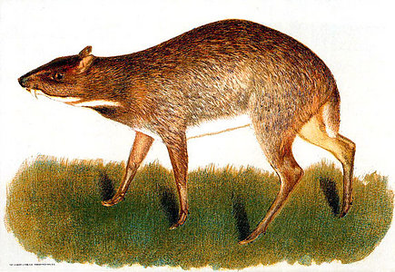

---
title: Tragulidae
---

## Phylogeny 

-   « Ancestral Groups  
    -   [Ruminants](../Ruminants.md)
    -  [Artiodactyla](../../Artiodactyla.md))
    -  [Eutheria](../../../Eutheria.md))
    -  [Mammal](../../../../Mammal.md))
    -   [Therapsida](../../../../../Therapsida.md)
    -   [Synapsida](../../../../../../Synapsida.md)
    -   [Amniota](../../../../../../../Amniota.md)
    -   [Terrestrial Vertebrates](../../../../../../../../Terrestrial.md)
    -   [Sarcopterygii](../../../../../../../../../Sarc.md)
    -   [Gnathostomata](../../../../../../../../../../Gnath.md)
    -   [Vertebrata](../../../../../../../../../../../Vertebrata.md)
    -   [Craniata](../../../../../../../../../../../../Craniata.md)
    -   [Chordata](../../../../../../../../../../../../../Chordata.md)
    -   [Deuterostomia](../../../../../../../../../../../../../../Deutero.md)
    -  [Bilateria](../../../../../../../../../../../../../../../Bilateria.md))
    -  [Animals](../../../../../../../../../../../../../../../../Animals.md))
    -  [Eukarya](../../../../../../../../../../../../../../../../../Eukarya.md))
    -   [Tree of Life](../../../../../../../../../../../../../../../../../Tree_of_Life.md)

-   ◊ Sibling Groups of  Ruminantia
    -   [Bovidae](Bovidae.md)
    -   [Moschidae](Moschidae.md)
    -   [Giraffoidea](Giraffoidea.md)
    -   [Antilocapridae](Antilocapridae.md)
    -   [Miscellaneous fossil         pecorans](Miscellaneous_fossil_pecorans)
    -   Tragulidae

-   » Sub-Groups 

# [[Tragulidae]] 

## Chevrotains, Mouse Deer 

## #has_/text_of_/abstract 

> Chevrotains, or mouse-deer, are small, even-toed ungulates that make up the family **Tragulidae**, and are the only living members of the infraorder Tragulina. The 10 extant species are placed in three genera, but several species also are known only from fossils. The extant species are found in forests in South and Southeast Asia; a single species, the water chevrotain, is found in the rainforests of Central and West Africa. In November 2019, conservation scientists announced that they had photographed silver-backed chevrotains (Tragulus versicolor) in a Vietnamese forest for the first time since the last confirmed sightings in 1990.
>
> They are solitary, or live in loose groupings or pairs, and feed almost exclusively on plant material. Chevrotains are the smallest hoofed mammals in the world. The Asian species weigh between 1–4 kg (2–9 lb), while the African chevrotain is considerably larger, at 7–16 kg (15–35 lb). With an average length of 45 cm (18 in) and an average height of 30 cm (12 in), the Java mouse-deer is the smallest surviving ungulate (hoofed) mammal, as well as the smallest artiodactyl (even-toed ungulate). Despite their common name of "mouse deer", they are not closely related to true deer.
>
> [Wikipedia](https://en.wikipedia.org/wiki/Chevrotain) 

### Distribution

Tropical forests of central Africa, India, and south-eastern Asia.

## Title Illustrations

---------------------------------------)
Scientific Name ::  Tragulus napu
Reference         Miller, G. S. 1909. The mouse deer of the Rhio-Linga Archipelago. Proceedings of the US National Museum 37:1-9.

## Confidential Links & Embeds: 

### #is_/same_as ::[Tragulidae](Tragulidae.md)) 

### #is_/same_as :: [Tragulidae.public](/_public/bio/bio~Domain/Eukarya/Animals/Bilateria/Deutero/Chordata/Craniata/Vertebrata/Gnath/Sarc/Tetrapods/Amniota/Synapsida/Therapsida/Mammal/Eutheria/Artiodactyla/Ruminants/Tragulidae.public.md) 

### #is_/same_as :: [Tragulidae.internal](/_internal/bio/bio~Domain/Eukarya/Animals/Bilateria/Deutero/Chordata/Craniata/Vertebrata/Gnath/Sarc/Tetrapods/Amniota/Synapsida/Therapsida/Mammal/Eutheria/Artiodactyla/Ruminants/Tragulidae.internal.md) 

### #is_/same_as :: [Tragulidae.protect](/_protect/bio/bio~Domain/Eukarya/Animals/Bilateria/Deutero/Chordata/Craniata/Vertebrata/Gnath/Sarc/Tetrapods/Amniota/Synapsida/Therapsida/Mammal/Eutheria/Artiodactyla/Ruminants/Tragulidae.protect.md) 

### #is_/same_as :: [Tragulidae.private](/_private/bio/bio~Domain/Eukarya/Animals/Bilateria/Deutero/Chordata/Craniata/Vertebrata/Gnath/Sarc/Tetrapods/Amniota/Synapsida/Therapsida/Mammal/Eutheria/Artiodactyla/Ruminants/Tragulidae.private.md) 

### #is_/same_as :: [Tragulidae.personal](/_personal/bio/bio~Domain/Eukarya/Animals/Bilateria/Deutero/Chordata/Craniata/Vertebrata/Gnath/Sarc/Tetrapods/Amniota/Synapsida/Therapsida/Mammal/Eutheria/Artiodactyla/Ruminants/Tragulidae.personal.md) 

### #is_/same_as :: [Tragulidae.secret](/_secret/bio/bio~Domain/Eukarya/Animals/Bilateria/Deutero/Chordata/Craniata/Vertebrata/Gnath/Sarc/Tetrapods/Amniota/Synapsida/Therapsida/Mammal/Eutheria/Artiodactyla/Ruminants/Tragulidae.secret.md)

