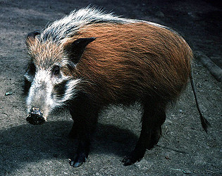

---
title: Suinae
---

# [[Suinae]] 

 

## #has_/text_of_/abstract 

> **Suinae** is a subfamily of artiodactyl mammals that includes several of the extant members of Suidae and their closest relatives – the domestic pig and related species, such as babirusas. Several extinct species within the Suidae are classified in subfamilies other than Suinae. However, the classification of the extinct members of the Suoidea – the larger group that includes the Suidae, the peccary family (Tayassuidae), and related extinct species – is controversial, and different classifications vary in the number of subfamilies within Suidae and their contents. Some classifications, such as the one proposed by paleontologist Jan van der Made in 2010, even exclude from Suinae some extant taxa of Suidae, placing these excluded taxa in other subfamilies.
>
> [Wikipedia](https://en.wikipedia.org/wiki/Suinae) 

## Phylogeny 

-   « Ancestral Groups  
    -  [Suidae](../Suidae.md))
    -  [Artiodactyla](../../Artiodactyla.md))
    -  [Eutheria](../../../Eutheria.md))
    -  [Mammal](../../../../Mammal.md))
    -   [Therapsida](../../../../../Therapsida.md)
    -   [Synapsida](../../../../../../Synapsida.md)
    -   [Amniota](../../../../../../../Amniota.md)
    -   [Terrestrial Vertebrates](../../../../../../../../Terrestrial.md)
    -   [Sarcopterygii](../../../../../../../../../Sarc.md)
    -   [Gnathostomata](../../../../../../../../../../Gnath.md)
    -   [Vertebrata](../../../../../../../../../../../Vertebrata.md)
    -   [Craniata](../../../../../../../../../../../../Craniata.md)
    -   [Chordata](../../../../../../../../../../../../../Chordata.md)
    -   [Deuterostomia](../../../../../../../../../../../../../../Deutero.md)
    -  [Bilateria](../../../../../../../../../../../../../../../Bilateria.md))
    -  [Animals](../../../../../../../../../../../../../../../../Animals.md))
    -  [Eukarya](../../../../../../../../../../../../../../../../../Eukarya.md))
    -   [Tree of Life](../../../../../../../../../../../../../../../../../Tree_of_Life.md)

-   ◊ Sibling Groups of  Suidae
    -   Suinae
    -   [Hyotheriinae](Hyotheriinae.md)
    -   [Kubanochoerinae](Kubanochoerinae.md)
    -   [Listriodontinae](Listriodontinae.md)
    -   [Palaeochoerinae](Palaeochoerinae.md)
    -   [Tetraconodontinae](Tetraconodontinae.md)

-   » Sub-Groups
    -   [Pig](Suinae/Pig.md)
    -  [Babyrousa babyrussa](Suinae/Babyrousa_babyrussa.md))
    -   [Warthog](Suinae/Warthog.md)
    -  [Potamochoerus](Suinae/Potamochoerus.md))

	-   *Eumaiochoerus* †
	-   *Hippohyus* †
	-   *Hippopotamodon* †
	-   *Kolpochoerus* †
	-   *Korynochoerus* †
	-   *Metridiochoerus* †
	-   *Microstonyx* †
	-   *Molarochoerus* †
	-   *Potamochoeroides* †
	-   *Propotamochoerus* †
	-   *Sinohyus* †
	-   *Sivahyus* †
	-   *Stylochoerus* †

## Title Illustrations

-------------------------------------------------------------------------
 
Scientific Name ::     Potamochoerus porcus
Location ::           Arusha, Tanzania
Comments             Young captive specimen probably from the Mt Meru population.
Specimen Condition   Live Specimen
Identified By        David Bygott
Life Cycle Stage ::     Young adult
View                 Lateral
Copyright ::            © 2005 [David Bygott](mailto:davidbygott@yahoo.com) 

## Confidential Links & Embeds: 

### #is_/same_as ::[Suinae](Suinae.md)) 

### #is_/same_as :: [Suinae.public](/_public/bio/bio~Domain/Eukarya/Animals/Bilateria/Deutero/Chordata/Craniata/Vertebrata/Gnath/Sarc/Tetrapods/Amniota/Synapsida/Therapsida/Mammal/Eutheria/Artiodactyla/Suidae/Suinae.public.md) 

### #is_/same_as :: [Suinae.internal](/_internal/bio/bio~Domain/Eukarya/Animals/Bilateria/Deutero/Chordata/Craniata/Vertebrata/Gnath/Sarc/Tetrapods/Amniota/Synapsida/Therapsida/Mammal/Eutheria/Artiodactyla/Suidae/Suinae.internal.md) 

### #is_/same_as :: [Suinae.protect](/_protect/bio/bio~Domain/Eukarya/Animals/Bilateria/Deutero/Chordata/Craniata/Vertebrata/Gnath/Sarc/Tetrapods/Amniota/Synapsida/Therapsida/Mammal/Eutheria/Artiodactyla/Suidae/Suinae.protect.md) 

### #is_/same_as :: [Suinae.private](/_private/bio/bio~Domain/Eukarya/Animals/Bilateria/Deutero/Chordata/Craniata/Vertebrata/Gnath/Sarc/Tetrapods/Amniota/Synapsida/Therapsida/Mammal/Eutheria/Artiodactyla/Suidae/Suinae.private.md) 

### #is_/same_as :: [Suinae.personal](/_personal/bio/bio~Domain/Eukarya/Animals/Bilateria/Deutero/Chordata/Craniata/Vertebrata/Gnath/Sarc/Tetrapods/Amniota/Synapsida/Therapsida/Mammal/Eutheria/Artiodactyla/Suidae/Suinae.personal.md) 

### #is_/same_as :: [Suinae.secret](/_secret/bio/bio~Domain/Eukarya/Animals/Bilateria/Deutero/Chordata/Craniata/Vertebrata/Gnath/Sarc/Tetrapods/Amniota/Synapsida/Therapsida/Mammal/Eutheria/Artiodactyla/Suidae/Suinae.secret.md)

