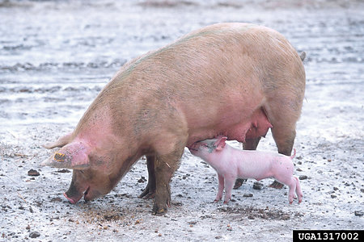

---
title: "Sus scrofa"
---

# *Sus scrofa*

## Wild boar 

## Phylogeny 

-   « Ancestral Groups  
    -   [Pig](../Pig.md)
    -  [Suinae](../../Suinae.md))
    -  [Suidae](../../../Suidae.md))
    -  [Artiodactyla](../../../../Artiodactyla.md))
    -  [Eutheria](../../../../../Eutheria.md))
    -  [Mammal](../../../../../../Mammal.md))
    -   [Therapsida](../../../../../../../Therapsida.md)
    -   [Synapsida](../../../../../../../../Synapsida.md)
    -   [Amniota](../../../../../../../../../Amniota.md)
    -   [Terrestrial Vertebrates](../../../../../../../../../../Terrestrial.md)
    -   [Sarcopterygii](../../../../../../../../../../../Sarc.md)
    -   [Gnathostomata](../../../../../../../../../../../../Gnath.md)
    -   [Vertebrata](../../../../../../../../../../../../../Vertebrata.md)
    -   [Craniata](../../../../../../../../../../../../../../Craniata.md)
    -   [Chordata](../../../../../../../../../../../../../../../Chordata.md)
    -   [Deuterostomia](../../../../../../../../../../../../../../../../Deutero.md)
    -  [Bilateria](../../../../../../../../../../../../../../../../../Bilateria.md))
    -  [Animals](../../../../../../../../../../../../../../../../../../Animals.md))
    -  [Eukarya](../../../../../../../../../../../../../../../../../../../Eukarya.md))
    -   [Tree of Life](../../../../../../../../../../../../../../../../../../../Tree_of_Life.md)

-   ◊ Sibling Groups of  Sus
    -   Sus scrofa

-   » Sub-Groups 

## Title Illustrations

------------------------------
Scientific Name ::     Sus scrofa
Comments             domesticated pigs
Acknowledgements     Photograph courtesy [InsectImages.org](http://www.insectimages.org/) (#1317002)
Specimen Condition   Live Specimen
Source Collection    [InsectImages.org](http://www.insectimages.org/)
Copyright ::            © Scott Bauer, USDA ARS
------------------------------

## Confidential Links & Embeds: 

### #is_/same_as ::[Sus_scrofa](Sus_scrofa.md)) 

### #is_/same_as :: [Sus_scrofa.public](/_public/bio/bio~Domain/Eukarya/Animals/Bilateria/Deutero/Chordata/Craniata/Vertebrata/Gnath/Sarc/Tetrapods/Amniota/Synapsida/Therapsida/Mammal/Eutheria/Artiodactyla/Suidae/Suinae/Pig/Sus_scrofa.public.md) 

### #is_/same_as :: [Sus_scrofa.internal](/_internal/bio/bio~Domain/Eukarya/Animals/Bilateria/Deutero/Chordata/Craniata/Vertebrata/Gnath/Sarc/Tetrapods/Amniota/Synapsida/Therapsida/Mammal/Eutheria/Artiodactyla/Suidae/Suinae/Pig/Sus_scrofa.internal.md) 

### #is_/same_as :: [Sus_scrofa.protect](/_protect/bio/bio~Domain/Eukarya/Animals/Bilateria/Deutero/Chordata/Craniata/Vertebrata/Gnath/Sarc/Tetrapods/Amniota/Synapsida/Therapsida/Mammal/Eutheria/Artiodactyla/Suidae/Suinae/Pig/Sus_scrofa.protect.md) 

### #is_/same_as :: [Sus_scrofa.private](/_private/bio/bio~Domain/Eukarya/Animals/Bilateria/Deutero/Chordata/Craniata/Vertebrata/Gnath/Sarc/Tetrapods/Amniota/Synapsida/Therapsida/Mammal/Eutheria/Artiodactyla/Suidae/Suinae/Pig/Sus_scrofa.private.md) 

### #is_/same_as :: [Sus_scrofa.personal](/_personal/bio/bio~Domain/Eukarya/Animals/Bilateria/Deutero/Chordata/Craniata/Vertebrata/Gnath/Sarc/Tetrapods/Amniota/Synapsida/Therapsida/Mammal/Eutheria/Artiodactyla/Suidae/Suinae/Pig/Sus_scrofa.personal.md) 

### #is_/same_as :: [Sus_scrofa.secret](/_secret/bio/bio~Domain/Eukarya/Animals/Bilateria/Deutero/Chordata/Craniata/Vertebrata/Gnath/Sarc/Tetrapods/Amniota/Synapsida/Therapsida/Mammal/Eutheria/Artiodactyla/Suidae/Suinae/Pig/Sus_scrofa.secret.md)

