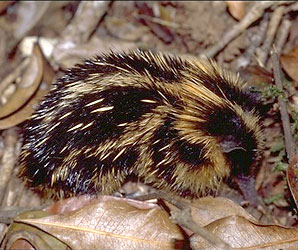

---
title: Tenrecidae
---

# [[Tenrecidae]]

## tenrecs, Madagascar \"hedgehogs\" 

## #has_/text_of_/abstract 

> A tenrec is a mammal belonging to any species within the afrotherian family **Tenrecidae**, which is endemic to Madagascar. Tenrecs are a very diverse group, as a result of adaptive radiation, and exhibit convergent evolution, some resemble hedgehogs, shrews, opossums, rats, and mice. They occupy aquatic, arboreal, terrestrial, and fossorial environments. Some of these species, including the greater hedgehog tenrec, can be found in the Madagascar dry deciduous forests. However, the speciation rate in this group has been higher in humid forests.
>
> All tenrecs are believed to descend from a common ancestor that lived 29–37 million years ago after rafting over from Africa. The split from their closest relatives, African otter shrews, is estimated to have occurred about 47–53 million years ago.
>
> [Wikipedia](https://en.wikipedia.org/wiki/Tenrec)

### Information on the Internet

-   [Family     Tenrecidae](http://animaldiversity.ummz.umich.edu/site/accounts/information/Tenrecidae.html).
    University of Michigan Animal Diversity Web.
-   University of Texas Digimorph:
    -   [Lowland Streaked Tenrec         Skeleton](http://www.digimorph.org/specimens/Hemicentetes_semispinosus/body/)
    -   [Lowland Streaked Tenrec         Head](http://www.digimorph.org/specimens/Hemicentetes_semispinosus/head/)

## Phylogeny 

-   « Ancestral Groups  
    -  [Insectivora](../Insectivora.md))
    -  [Eutheria](../../Eutheria.md))
    -  [Mammal](../../../Mammal.md))
    -   [Therapsida](../../../../Therapsida.md)
    -   [Synapsida](../../../../../Synapsida.md)
    -   [Amniota](../../../../../../Amniota.md)
    -   [Terrestrial Vertebrates](../../../../../../../Terrestrial.md)
    -   [Sarcopterygii](../../../../../../../../Sarc.md)
    -   [Gnathostomata](../../../../../../../../../Gnath.md)
    -   [Vertebrata](../../../../../../../../../../Vertebrata.md)
    -   [Craniata](../../../../../../../../../../../Craniata.md)
    -   [Chordata](../../../../../../../../../../../../Chordata.md)
    -   [Deuterostomia](../../../../../../../../../../../../../Deutero.md)
    -  [Bilateria](../../../../../../../../../../../../../../Bilateria.md))
    -  [Animals](../../../../../../../../../../../../../../../Animals.md))
    -  [Eukarya](../../../../../../../../../../../../../../../../Eukarya.md))
    -   [Tree of Life](../../../../../../../../../../../../../../../../Tree_of_Life.md)

-   ◊ Sibling Groups of  Insectivora
    -   [Chrysochloridae](Chrysochloridae.md)
    -   Tenrecidae

-   » Sub-Groups
    -  [Micropotamogale](Tenrecidae/Micropotamogale.md))
    -  [Oryzorictes](Tenrecidae/Oryzorictes.md))
    -  [Microgale](Tenrecidae/Microgale.md))
    -  [Geogalinae](Tenrecidae/Geogalinae.md))

## Title Illustrations

------------------------------------------------------------------------------)
Scientific Name ::     Hemicentetes semispinosus (Tenrecidae)
Location ::           Perinet Reserve (Madagascar)
Comments             Lowland streaked tenrec
Creator              Gerald and Buff Corsi
Specimen Condition   Live Specimen
Source Collection    [CalPhotos](http://calphotos.berkeley.edu/)
Copyright ::            © 2000 [California Academy of Sciences](http://www.calacademy.org/) 

## Confidential Links & Embeds: 

### #is_/same_as ::[Tenrecidae](Tenrecidae.md)) 

### #is_/same_as :: [Tenrecidae.public](/_public/bio/bio~Domain/Eukarya/Animals/Bilateria/Deutero/Chordata/Craniata/Vertebrata/Gnath/Sarc/Tetrapods/Amniota/Synapsida/Therapsida/Mammal/Eutheria/Insectivora/Tenrecidae.public.md) 

### #is_/same_as :: [Tenrecidae.internal](/_internal/bio/bio~Domain/Eukarya/Animals/Bilateria/Deutero/Chordata/Craniata/Vertebrata/Gnath/Sarc/Tetrapods/Amniota/Synapsida/Therapsida/Mammal/Eutheria/Insectivora/Tenrecidae.internal.md) 

### #is_/same_as :: [Tenrecidae.protect](/_protect/bio/bio~Domain/Eukarya/Animals/Bilateria/Deutero/Chordata/Craniata/Vertebrata/Gnath/Sarc/Tetrapods/Amniota/Synapsida/Therapsida/Mammal/Eutheria/Insectivora/Tenrecidae.protect.md) 

### #is_/same_as :: [Tenrecidae.private](/_private/bio/bio~Domain/Eukarya/Animals/Bilateria/Deutero/Chordata/Craniata/Vertebrata/Gnath/Sarc/Tetrapods/Amniota/Synapsida/Therapsida/Mammal/Eutheria/Insectivora/Tenrecidae.private.md) 

### #is_/same_as :: [Tenrecidae.personal](/_personal/bio/bio~Domain/Eukarya/Animals/Bilateria/Deutero/Chordata/Craniata/Vertebrata/Gnath/Sarc/Tetrapods/Amniota/Synapsida/Therapsida/Mammal/Eutheria/Insectivora/Tenrecidae.personal.md) 

### #is_/same_as :: [Tenrecidae.secret](/_secret/bio/bio~Domain/Eukarya/Animals/Bilateria/Deutero/Chordata/Craniata/Vertebrata/Gnath/Sarc/Tetrapods/Amniota/Synapsida/Therapsida/Mammal/Eutheria/Insectivora/Tenrecidae.secret.md)

