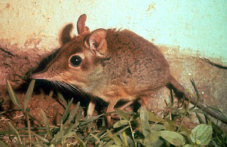
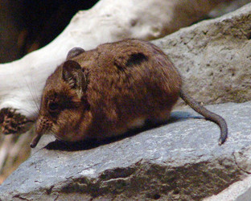

---
title: Macroscelididae
---

## Macroscelidea 

# [[Macroscelididae]]

## Elephant shrews, Sengis 

## #has_/text_of_/abstract 

> Elephant shrews, also called jumping shrews or sengis, are small insectivorous mammals native to Africa, belonging to the family **Macroscelididae**, in the order Macroscelidea. Their traditional common English name "elephant shrew" comes from a perceived resemblance between their long noses and the trunk of an elephant, and their superficial similarity with shrews (family Soricidae) in the order Eulipotyphla. However, phylogenetic analysis has revealed that elephant shrews are not properly classified with true shrews, but are in fact more closely related to elephants than to shrews. In 1997, the biologist Jonathan Kingdon proposed that they instead be called "sengis" (singular sengi), a term derived from the Bantu languages of Africa, and in 1998, they were classified into the new clade Afrotheria.
>
> 
>
> They are widely distributed across the southern part of Africa, and although common nowhere, can be found in almost any type of habitat, from the Namib Desert to boulder-strewn outcrops in South Africa to thick forest. One species, the North African elephant shrew, remains in the semi-arid, mountainous country in the far northwest of Africa. The Somali elephant shrew went unobserved from 1968 to 2020 but was rediscovered by a group of scientists in Djibouti.
>
> [Wikipedia](https://en.wikipedia.org/wiki/Elephant%20shrew)

### Information on the Internet

-   [Elephant     Shrews](http://www.calacademy.org/research/bmammals/eshrews/index.html).
    California Academy of Sciences.
-   [Golden-rumped elephant-shrew (Rhynchocyon     chrysopygus)](http://www.arkive.org/species/GES/mammals/Rhynchocyon_chrysopygus/more_info.html).
    ARKive.org. Check out the movies!
-   [Order     Macroscelidea](http://animaldiversity.ummz.umich.edu/chordata/mammalia/macroscelidea.html).
    Animal Diversity Web. University of Michigan Museum of Zoology.
-   [Afrotheria Specialist     Group](http://www.calacademy.org/research/bmammals/afrotheria/ASG.html).
    IUCN - The World Conservation Union. Species Survival Commission.
-   [Elephant     Shrews](http://www.uq.edu.au/%7Eanpwooda/pages/el-shrws.html). A
    page by Peter Woodall, an elephant shrew researcher at the
    University of Queensland, Brisbane, Australia.

## Phylogeny 

-   « Ancestral Groups  
    -  [Eutheria](../Eutheria.md))
    -  [Mammal](../../Mammal.md))
    -   [Therapsida](../../../Therapsida.md)
    -   [Synapsida](../../../../Synapsida.md)
    -   [Amniota](../../../../../Amniota.md)
    -   [Terrestrial Vertebrates](../../../../../../Terrestrial.md)
    -   [Sarcopterygii](../../../../../../../Sarc.md)
    -   [Gnathostomata](../../../../../../../../Gnath.md)
    -   [Vertebrata](../../../../../../../../../Vertebrata.md)
    -   [Craniata](../../../../../../../../../../Craniata.md)
    -   [Chordata](../../../../../../../../../../../Chordata.md)
    -   [Deuterostomia](../../../../../../../../../../../../Deutero.md)
    -  [Bilateria](../../../../../../../../../../../../../Bilateria.md))
    -  [Animals](../../../../../../../../../../../../../../Animals.md))
    -  [Eukarya](../../../../../../../../../../../../../../../Eukarya.md))
    -   [Tree of Life](../../../../../../../../../../../../../../../Tree_of_Life.md)

-   ◊ Sibling Groups of  Eutheria
    -   [Edentata](Edentata.md)
    -   [Pholidota](Pholidota.md)
    -  [Lagomorpha](Glires/Lagomorpha.md))
    -   [Rodentia](Rodentia.md)
    -   Macroscelididae
    -   [Primates](Primates.md)
    -   [Scandentia](Scandentia.md)
    -   [Chiroptera](Chiroptera.md)
    -   [Dermoptera](Dermoptera.md)
    -   [Insectivora](Insectivora.md)
    -   [Carnivora](Carnivora.md)
    -   [Artiodactyla](Artiodactyla.md)
    -   [Whale](Whale.md)
    -   [Tubulidentata](Tubulidentata.md)
    -   [Perissodactyla](Perissodactyla.md)
    -   [Hyracoidea](Hyracoidea.md)
    -   [Sirenia](Sirenia.md)
    -   [Proboscidea](Eukaryotes/Animals/Bilateria/Deutero/Chordata/Craniata/Vertebrata/Gnath/Sarc/Terrestrial/Amniota/Synapsida/Therapsida/Mammal/Eutheria/Proboscidea.md)

-   » Sub-Groups
    -  [Rhynchocyon](Macroscelididae/Rhynchocyon.md))

## Title Illustrations

------------------------------------------------------------------------------)
Scientific Name ::     Elephantulus
Location ::           Nairobi (Kenya)
Creator              Lloyd Glenn Ingles
Specimen Condition   Live Specimen
Source Collection    [CalPhotos](http://calphotos.berkeley.edu/)
Copyright ::            © 2001 [California Academy of Sciences](http://www.calacademy.org/) 

------------------------------------------------------------------------------)
Scientific Name ::                    Macroscelides proboscideus
Location ::                          Grzimekhaus in Frankfurt Zoo
Acknowledgements                    This image is licensed under the [Attribution-NonCommercial-ShareAlike 2.0                                       Creative Commons License](http://creativecommons.org/licenses/by-nc-sa/2.0/).\
								  source: [flickr:                                       Kurzohrrüsselspringer](http://flickr.com/photos/joachim_s_mueller/138405085/)
Specimen Condition                  Live Specimen
Source Collection                   [Flickr](http://flickr.com/)
Image Use ::                    This image is licensed under the
								  [Attribution-NonCommercial-ShareAlike 2.0 Creative Commons                                       License](http://creativecommons.org/licenses/by-nc-sa/2.0/).

Copyright ::                           © 2006 [Joachim S. Müller](http://flickr.com/people/joachim_s_mueller/)

## Confidential Links & Embeds: 

### #is_/same_as ::[Macroscelididae](Macroscelididae.md)) 

### #is_/same_as :: [Macroscelididae.public](/_public/bio/bio~Domain/Eukarya/Animals/Bilateria/Deutero/Chordata/Craniata/Vertebrata/Gnath/Sarc/Tetrapods/Amniota/Synapsida/Therapsida/Mammal/Eutheria/Macroscelididae.public.md) 

### #is_/same_as :: [Macroscelididae.internal](/_internal/bio/bio~Domain/Eukarya/Animals/Bilateria/Deutero/Chordata/Craniata/Vertebrata/Gnath/Sarc/Tetrapods/Amniota/Synapsida/Therapsida/Mammal/Eutheria/Macroscelididae.internal.md) 

### #is_/same_as :: [Macroscelididae.protect](/_protect/bio/bio~Domain/Eukarya/Animals/Bilateria/Deutero/Chordata/Craniata/Vertebrata/Gnath/Sarc/Tetrapods/Amniota/Synapsida/Therapsida/Mammal/Eutheria/Macroscelididae.protect.md) 

### #is_/same_as :: [Macroscelididae.private](/_private/bio/bio~Domain/Eukarya/Animals/Bilateria/Deutero/Chordata/Craniata/Vertebrata/Gnath/Sarc/Tetrapods/Amniota/Synapsida/Therapsida/Mammal/Eutheria/Macroscelididae.private.md) 

### #is_/same_as :: [Macroscelididae.personal](/_personal/bio/bio~Domain/Eukarya/Animals/Bilateria/Deutero/Chordata/Craniata/Vertebrata/Gnath/Sarc/Tetrapods/Amniota/Synapsida/Therapsida/Mammal/Eutheria/Macroscelididae.personal.md) 

### #is_/same_as :: [Macroscelididae.secret](/_secret/bio/bio~Domain/Eukarya/Animals/Bilateria/Deutero/Chordata/Craniata/Vertebrata/Gnath/Sarc/Tetrapods/Amniota/Synapsida/Therapsida/Mammal/Eutheria/Macroscelididae.secret.md)

