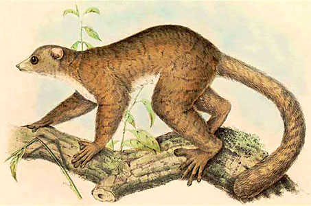

---
title: Lepilemur
---

# [[Lepilemur]]

## Lepilemuridae: Sportive Lemurs, Weasel Lemurs 
)

## #has_/text_of_/abstract 

> The sportive lemurs are the medium-sized primates that make up the family **Lepilemur**idae. The family consists of only one extant genus, Lepilemur. They are closely related to the other lemurs and exclusively live on the island of Madagascar. For a time, this family was named Megaladapidae, but the current name was given precedence since the extinct genus Megaladapis was removed from the family.
>
> [Wikipedia](https://en.wikipedia.org/wiki/Sportive%20lemur)

## Phylogeny 

-   « Ancestral Groups  
    -  [Strepsirrhini](../Strepsirrhini.md))
    -  [Primates](../../Primates.md))
    -  [Eutheria](../../../Eutheria.md))
    -  [Mammal](../../../../Mammal.md))
    -   [Therapsida](../../../../../Therapsida.md)
    -   [Synapsida](../../../../../../Synapsida.md)
    -   [Amniota](../../../../../../../Amniota.md)
    -   [Terrestrial Vertebrates](../../../../../../../../Terrestrial.md)
    -   [Sarcopterygii](../../../../../../../../../Sarc.md)
    -   [Gnathostomata](../../../../../../../../../../Gnath.md)
    -   [Vertebrata](../../../../../../../../../../../Vertebrata.md)
    -   [Craniata](../../../../../../../../../../../../Craniata.md)
    -   [Chordata](../../../../../../../../../../../../../Chordata.md)
    -   [Deuterostomia](../../../../../../../../../../../../../../Deutero.md)
    -  [Bilateria](../../../../../../../../../../../../../../../Bilateria.md))
    -  [Animals](../../../../../../../../../../../../../../../../Animals.md))
    -  [Eukarya](../../../../../../../../../../../../../../../../../Eukarya.md))
    -   [Tree of Life](../../../../../../../../../../../../../../../../../Tree_of_Life.md)

-   ◊ Sibling Groups of  Strepsirrhini
    -   [Lemuridae](Lemuridae.md)
    -   [Indridae](Indridae.md)
    -   [Palaeopropithecidae](Palaeopropithecidae.md)
    -   [Cheirogaleidae](Cheirogaleidae.md)
    -   Lepilemur
    -   [Lorisiformes](Lorisiformes.md)

-   » Sub-Groups 

	-   *Lepilemur dorsalis*
	-   *Lepilemur ruficaudatus*
	-   *Lepilemur edwardsi*
	-   *Lepilemur leucopus*
	-   *Lepilemur mustelinus*
	-   *Lepilemur microdon*
	-   *Lepilemur septentrionalis*

## Title Illustrations

------------------------------------------------)
  Scientific Name ::  Lepilemur mustelinus
  Location ::        Madagascar
  Reference         Pollen, F. P. L. and van Dam, D. C. 1868. Récherches sur la Faune de Madagascar et de ses Dépendances. 2me partie. J. K. Steenhoff ed. Leyden.

## Confidential Links & Embeds: 

### #is_/same_as ::[Lepilemur](Lepilemur.md)) 

### #is_/same_as :: [Lepilemur.public](/_public/bio/bio~Domain/Eukarya/Animals/Bilateria/Deutero/Chordata/Craniata/Vertebrata/Gnath/Sarc/Tetrapods/Amniota/Synapsida/Therapsida/Mammal/Eutheria/Primates/Strepsirrhini/Lepilemur.public.md) 

### #is_/same_as :: [Lepilemur.internal](/_internal/bio/bio~Domain/Eukarya/Animals/Bilateria/Deutero/Chordata/Craniata/Vertebrata/Gnath/Sarc/Tetrapods/Amniota/Synapsida/Therapsida/Mammal/Eutheria/Primates/Strepsirrhini/Lepilemur.internal.md) 

### #is_/same_as :: [Lepilemur.protect](/_protect/bio/bio~Domain/Eukarya/Animals/Bilateria/Deutero/Chordata/Craniata/Vertebrata/Gnath/Sarc/Tetrapods/Amniota/Synapsida/Therapsida/Mammal/Eutheria/Primates/Strepsirrhini/Lepilemur.protect.md) 

### #is_/same_as :: [Lepilemur.private](/_private/bio/bio~Domain/Eukarya/Animals/Bilateria/Deutero/Chordata/Craniata/Vertebrata/Gnath/Sarc/Tetrapods/Amniota/Synapsida/Therapsida/Mammal/Eutheria/Primates/Strepsirrhini/Lepilemur.private.md) 

### #is_/same_as :: [Lepilemur.personal](/_personal/bio/bio~Domain/Eukarya/Animals/Bilateria/Deutero/Chordata/Craniata/Vertebrata/Gnath/Sarc/Tetrapods/Amniota/Synapsida/Therapsida/Mammal/Eutheria/Primates/Strepsirrhini/Lepilemur.personal.md) 

### #is_/same_as :: [Lepilemur.secret](/_secret/bio/bio~Domain/Eukarya/Animals/Bilateria/Deutero/Chordata/Craniata/Vertebrata/Gnath/Sarc/Tetrapods/Amniota/Synapsida/Therapsida/Mammal/Eutheria/Primates/Strepsirrhini/Lepilemur.secret.md)

