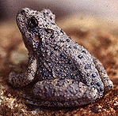

---
aliases:
- Amphibians
- Amphibian
- Amphibia
Archive_of_Our_Own_tag:
- amphibian
- Amphibians
code_of_nomenclature: '[[_Standards/WikiData/WD~International_Code_of_Zoological_Nomenclature,13011]]'
Commons_category: Amphibia
described_by_source:
- '[[_Standards/WikiData/WD~Brockhaus_and_Efron_Encyclopedic_Dictionary,602358]]'
- '[[_Standards/WikiData/WD~Encyclopædia_Britannica_11th_edition,867541]]'
- '[[_Standards/WikiData/WD~Encyclopedic_Lexicon,4532135]]'
- "[[_Standards/WikiData/WD~The_New_Student's_Reference_Work,16082057]]"
- '[[_Standards/WikiData/WD~Small_Brockhaus_and_Efron_Encyclopedic_Dictionary,19180675]]'
- '[[_Standards/WikiData/WD~Meyers_Konversations-Lexikon,_4th_edition_(1885–1890),19219752]]'
- '[[_Standards/WikiData/WD~Great_Soviet_Encyclopedia_(1926–1947),20078554]]'
- '[[_Standards/WikiData/WD~The_Domestic_Encyclopædia;_Or,_A_Dictionary_Of_Facts,_And_Useful_Knowledge,56441911]]'
EPPO_Code: 1AMPHC
GS1_GPC_code: 10005458
has_id_wikidata: Q10908
has_use: '[[_Standards/WikiData/WD~biological_pest_control,116890]]'
Iconclass_notation: 25F5
image: "http://commons.wikimedia.org/wiki/Special:FilePath/Amphibia.png"
instance_of:
- '[[_Standards/WikiData/WD~taxon,16521]]'
ITIS_TSN: 173420
Krugosvet_article: nauka_i_tehnika/biologiya/ZEMNOVODNIE.html
main_food_source:
- '[[_Standards/WikiData/WD~Gastropoda,4867740]]'
- '[[_Standards/WikiData/WD~worm,47253]]'
MeSH_tree_code: B01.050.150.900.090
montage_image: "http://commons.wikimedia.org/wiki/Special:FilePath/Examples%20of%20Amphibia.png"
OmegaWiki_Defined_Meaning: 162
parent_taxon: '[[_Standards/WikiData/WD~Batrachomorpha,2521462]]'
Provenio_UUID:
- 2c8b2bd3-c61d-4e11-90a1-65ca8c618173
start_time: -370000000-01-01
studied_in:
- '[[_Standards/WikiData/WD~herpetology,174416]]'
- '[[_Standards/WikiData/WD~batrachology,4869597]]'
subreddit:
- Amphibians
taxon_common_name:
- dvoživke
- البَرْمائِيَّات
- القَوَازِبُ
- Земнаводныя
- Земноводни
- Divelfenneg
- Amfibis
- obojživelníci
- Amphibien
- Αμφίβια
- Amphibians
- Anfibios
- Sammakkoeläimet
- Amphibiens
- Amfiibie
- anfíbios
- "דו חיים"
- Kétéltűek
- Երկկենցաղներ
- Anfibi
- 両生綱
- 양서강
- Водоземци
- amfibier
- Amfibieën
- płazy
- Anfíbios
- Amfibieni
- Земноводные
- Obojživelníky
- Groddjur
- สัตว์ครึ่งบกครึ่งน้ำ
- สัตว์สะเทินน้ำสะเทินบก
- "İki yaşamlılar"
- Земноводні
- "lớp lưỡng cư or động vật lưỡng cư"
- 兩棲綱
taxon_name: Amphibia
taxon_rank: '[[_Standards/WikiData/WD~class,37517]]'
this_taxon_is_source_of: '[[_Standards/WikiData/WD~amphibian_as_food,124813117]]'
title: "Living Amphibians"
topic_s_main_category: '[[_Standards/WikiData/WD~Q8878457,8878457]]'
topic_s_main_template: '[[_Standards/WikiData/WD~Template_Amphibians,6677674]]'
topic_s_main_Wikimedia_portal: '[[_Standards/WikiData/WD~Portal_Amphibians,21813728]]'
UMLS_CUI: C0002668
---

# [[Amphibia]]

Frogs and toads, salamanders and newts, and caecilians 

 

#is_/same_as :: [[../../../../../../../../../../../../WikiData/WD~Amphibia,10908|WD~Amphibia,10908]] 

## #has_/text_of_/abstract 

> **Amphibian**s are ectothermic, anamniotic, four-limbed vertebrate animals 
> that constitute the class Amphibia. 
> 
> In its broadest sense, it is a paraphyletic group encompassing 
> all tetrapods excluding the amniotes 
> (tetrapods with an amniotic membrane, such as modern reptiles, birds and mammals). 
> 
> All extant (living) amphibians belong to the monophyletic subclass Lissamphibia, with three living orders: Anura (frogs and toads), Urodela (salamanders), and Gymnophiona (caecilians). Evolved to be mostly semiaquatic, amphibians have adapted to inhabit a wide variety of habitats, with most species living in freshwater, wetland or terrestrial ecosystems (such as riparian woodland, fossorial and even arboreal habitats). Their life cycle typically starts out as aquatic larvae with gills known as tadpoles, but some species have developed behavioural adaptations to bypass this.
>
> Young amphibians generally undergo metamorphosis from an aquatic larval form with gills to an air-breathing adult form with lungs. Amphibians use their skin as a secondary respiratory interface and some small terrestrial salamanders and frogs lack lungs and rely entirely on their skin. They are superficially similar to reptiles like lizards, but unlike reptiles and other amniotes, require access to water bodies to breed. With their complex reproductive needs and permeable skins, amphibians are often ecological indicators to habitat conditions; in recent decades there has been a dramatic decline in amphibian populations for many species around the globe.
>
> The earliest amphibians evolved in the Devonian period from tetrapodomorph sarcopterygians (lobe-finned fish with articulated limb-like fins) that evolved primitive lungs, which were helpful in adapting to dry land. They diversified and became ecologically dominant during the Carboniferous and Permian periods, but were later displaced in terrestrial environments by early reptiles and basal synapsids (predecessors of mammals). The origin of modern lissamphibians, which first appeared during the Early Triassic, around 250 million years ago, has long been contentious. The most popular hypothesis is that they likely originated from temnospondyls, the most diverse group of prehistoric amphibians, during the Permian period. Another hypothesis is that they emerged from lepospondyls. A fourth group of lissamphibians, the Albanerpetontidae, became extinct around 2 million years ago.
>
> The number of known amphibian species is approximately 8,000, of which nearly 90% are frogs. The smallest amphibian (and vertebrate) in the world is a frog from New Guinea (Paedophryne amauensis) with a length of just 7.7 mm (0.30 in). The largest living amphibian is the 1.8 m (5 ft 11 in) South China giant salamander (Andrias sligoi), but this is dwarfed by prehistoric temnospondyls such as Mastodonsaurus which could reach up to 6 m (20 ft) in length. The study of amphibians is called batrachology, while the study of both reptiles and amphibians is called herpetology.
>
> [Wikipedia](https://en.wikipedia.org/wiki/Amphibian)

### Information on the Internet

-   [AmphibiaTree](http://www.amphibiatree.org/). The mission of this
    project is the realization of a comprehensive phylogeny of all taxa
    of extant and extinct amphibians.
-   [Amphibian Species of the     World](http://research.amnh.org/herpetology/amphibia/index.html)
-   [AmphibiaWeb](http://elib.cs.berkeley.edu/aw/).
-   [Declining Amphibian Population Task     Force](http://www.open.ac.uk/daptf/index.htm)
-   [Australian Herpetological     Directory](http://www.jcu.edu.au/school/tbiol/zoology/herp/herp2.shtml)
-   [California Academy of Sciences     Herpetology](http://www.calacademy.org/research/herpetology/)
-   [Biodiversity and Biological Collections Web Server Herpetology     Resources](http://biodiversity.uno.edu/cgi-bin/hl?herp)
-   [Society for the Study of Amphibians and     Reptiles](http://www.ukans.edu/%7Essar/)
-   [livingunderworld.org](http://www.livingunderworld.org/)
-   [Herps of Panama](http://home.earthlink.net/%7Eitec/Herps.html)

## Introduction

This group, which includes all living amphibians, as well as their
extinct relatives, goes by two formal names: Lissamphibia or Amphibia.

## Phylogeny 

-   « Ancestral Groups  
    -   [Terrestrial Vertebrates](../Terrestrial.md)
    -   [Sarcopterygii](../../Sarc.md)
    -   [Gnathostomata](../../../Gnath.md)
    -   [Vertebrata](../../../../Vertebrata.md)
    -   [Craniata](../../../../../Craniata.md)
    -   [Chordata](../../../../../../Chordata.md)
    -   [Deuterostomia](../../../../../../../Deutero.md)
    -   [Bilateria](../../../../../../../../Bilateria.md)
    -   [Animals](../../../../../../../../../Animals.md)
    -   [Eukarya](../../../../../../../../../../Eukarya.md)
    -   [Tree of Life](../../../../../../../../../../Tree_of_Life.md)

-   ◊ Sibling Groups of  Terrestrial Vertebrates
    -   [Amniota](Amniota.md)
    -   [Solenodonsaurus         janenschi](Solenodonsaurus_janenschi)
    -   Living Amphibians
    -   [Seymouriamorpha](Seymouriamorpha.md)
    -   [Temnospondyli](Temnospondyli.md)
    -   [Baphetidae](Baphetidae.md)
    -   [Crassigyrinus scoticus](Crassigyrinus_scoticus)
    -   [Ichthyostega](Ichthyostega.md)
    -   [Acanthostega gunnari](Acanthostega_gunnari)

-   » Sub-Groups
    -   [Salientia](Amphibia/Salientia.md)
    -   [Caudata](Amphibia/Caudata.md)
	-   *Gymnophiona* [(Caecilians)]

## Title Illustrations

---------

Scientific Name ::     Hyla arenicolor
Specimen Condition   Live Specimen

## Confidential Links & Embeds: 

### #is_/same_as :: [Amphibia](Amphibia.md) 

### #is_/same_as :: [Amphibians.public](/_public/bio/bio~Domain/Eukarya/Animals/Bilateria/Deutero/Chordata/Craniata/Vertebrata/Gnath/Sarc/Tetrapods/Amphibians.public.md) 

### #is_/same_as :: [Amphibians.internal](/_internal/bio/bio~Domain/Eukarya/Animals/Bilateria/Deutero/Chordata/Craniata/Vertebrata/Gnath/Sarc/Tetrapods/Amphibians.internal.md) 

### #is_/same_as :: [Amphibians.protect](/_protect/bio/bio~Domain/Eukarya/Animals/Bilateria/Deutero/Chordata/Craniata/Vertebrata/Gnath/Sarc/Tetrapods/Amphibians.protect.md) 

### #is_/same_as :: [Amphibians.private](/_private/bio/bio~Domain/Eukarya/Animals/Bilateria/Deutero/Chordata/Craniata/Vertebrata/Gnath/Sarc/Tetrapods/Amphibians.private.md) 

### #is_/same_as :: [Amphibians.personal](/_personal/bio/bio~Domain/Eukarya/Animals/Bilateria/Deutero/Chordata/Craniata/Vertebrata/Gnath/Sarc/Tetrapods/Amphibians.personal.md) 

### #is_/same_as :: [Amphibians.secret](/_secret/bio/bio~Domain/Eukarya/Animals/Bilateria/Deutero/Chordata/Craniata/Vertebrata/Gnath/Sarc/Tetrapods/Amphibians.secret.md)

