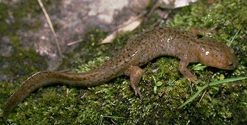

---
title: Hynobiidae
---

# [[Hynobiidae]] 

## #has_/text_of_/abstract 

> The Asiatic salamanders (family **Hynobiidae**) are primitive salamanders found all over Asia, and in European Russia. They are closely related to the giant salamanders (family Cryptobranchidae), with which they form the suborder Cryptobranchoidea. About half of hynobiids currently described are endemic to Japan, but their range also covers parts of China, Russia, Afghanistan and Iran.
>
> Hynobiid salamanders practice external fertilization, or spawning. And, unlike other salamander families which reproduce internally, male hynobiids focus on egg sacs rather than females during breeding. The female lays two egg sacs at a time, each containing up to 70 eggs. Parental care is common.
>
> A few species have very reduced lungs, or no lungs at all. Larvae can sometimes have reduced external gills if they live in cold and very oxygen-rich water.
>
> Fossils of hynobiids are known from the Miocene to the present in Asia and Eastern Europe, though fossils of Cryptobranchoids more closely related to hynobiids than to giant salamanders extend back to the Middle Jurassic.
>
> [Wikipedia](https://en.wikipedia.org/wiki/Asiatic%20salamander) 

### Information on the Internet

-   [AmphibiaWeb:     Hynobiidae](http://amphibiaweb.org/lists/Hynobiidae.shtml).

## Introduction

[Allan Larson, David Wake, and Tom Devitt](http://www.tolweb.org/) 

Hynobiids are small to medium sized (up to 200 mm in *Ranodon*)
salamanders found primarily in Asia with one species distributed in
European Russia ([AmphibiaWeb: Hynobiidae](http://amphibiaweb.org/lists/Hynobiidae.shtml)).  These
salamanders have a biphasic life cycle with aquatic larvae and
metamorphosed adults that are terrestrial or aquatic. Larvae have
external gills, four pairs of gill slits and caudal fins. Metamorphosed
adults are terrestrial during nonreproductive periods, except for the
genera *Batrachuperus, Liua,* and *Pachyhynobius,* which live in water
(Zhao et al., 1988). Metamorphosed adults have well-developed lungs
except for the genus *Onychodactylus,* which is lungless. Hynobiids have
external fertilization, an angular bone in the lower jaw, and large
numbers of microchromosomes; these traits are considered ancestral for
salamanders and have caused some authors to postulate that hynobiids
resemble the most recent common ancestor of all salamanders more closely
than do salamanders of the other families (Hecht and Edwards, 1977).

Hynobiids comprise the only family of salamanders whose current
geographic distribution is entirely Asian. They are easily distinguished
from other Asian salamanders which include rough-skinned newts (family
Salamandridae) and giant, nonmetamorphic salamanders of the family
Cryptobranchidae.

Eggs may be deposited in streams or ponds, varying among species. Eggs
are laid in arc-shaped, gelatinous sacs and attached to stones or
vegetation in the water, where they are fertilized. The number, size and
arrangement of eggs in the gelatinous sacs vary among genera and are
used as taxonomic characters for examining intergeneric relationships
(Zhao et al., 1988).

### Characteristics

#### Diagnosis

Hynobiids are moderate-sized to small salamanders and have a biphasic
life cycle with aquatic larvae and metamorphosed adults. While there are
no derived morphological features for this group, all hynobiids exhibit
the following characters: 1) septomaxillae present; 2) lacrimal present;
3) vomerine teeth that are not parallel to marginal teeth row; and 4)
ribs unicapitate (www.amphibiaweb.org). Larvae have external gills, four
pairs of gill slits, and a caudal fin; all of these characteristics are
lost at metamorphosis, and eyelids are acquired. Eggs are laid in
arc-shaped, gelatinous masses in water and their fertilization is
external. Lungs are present and well developed except in the genus
*Onychodactylus,* which has no lungs.

#### Detailed Characteristics of the Hynobiidae

The morphological characters given below are the ones standardly used to
diagnose the salamander family Hyobiidae and to assess its phylogenetic
relationships to other salamanders. The individual characteristics in
most cases are shared with other salamanders and should not be
interpreted as synapomorphies of the Hynobiidae. Absence of
characteristics found in other salamanders is noted where it is
important for distinguishing hynobiids from other salamanders and/or
determining their relationships to other salamanders. These
characteristics were assembled from a large number of original sources
by Duellman and Trueb (1986), Larson (1991) and Larson and Dimmick
(1993).

###### Morphology of the Skull

The premaxilla may consist of separated, paired bones, or these bones
may be fused to form a single premaxillary bone. Bilaterally paired
nasal bones each ossify from 2 anlagen, one positioned medially and the
other laterally on the skull; the paired nasal bones abut each other,
partially bisected by short posterior processes of the premaxillae.
Maxillary bones are present and usually well developed. Bilaterally
paired septomaxillary bones are present. Lacrimal bone is present.
Quadratojugal bone is absent. Pterygoid bone is absent. Internal carotid
foramina are absent from parasphenoid bones. The angular bone is
separated from the mandible. The columella and operculum appear as
separate ear bones detached from the otic capsule in some species,
whereas others lack the operculum. Replacement of vomerine teeth
proceeds from the posterior of the vomer. Teeth have a distinct crown
and pedicel. Origin of the levator mandibulae anterior superficialis
muscle includes the exoccipital.

###### Inner ear

A basilaris complex is present in the inner ear. The recessus
amphibiorum is oriented horizontally in the inner ear. The otic sac is
bulbar and unvascularized. The amphibian periotic canal lacks fibrous
connective tissue. The periotic cistern is large. The periotic cistern
does not protrude into the fenestra.

###### Hyobranchial Structures

The first hypobranchial and first ceratobranchial (alternatively
homologized as the first ceratobranchial and first epibranchial,
respectively) are fused together. The second ceratobranchial
(alternatively homologized as the second epibranchial) comprises two
elements. Lungs and an ypsiloid cartilage are present except in
*Onychodactylus.* Larvae have four pairs of gill slits.

###### Characteristics of the Trunk and Vertebral Column

The scapula and coracoid bones of the pectoral girdle are fused to form
the scapulocoracoid. Vertebral centra are amphicoelous. Ribs are
unicapitate. Neural arches of vertebrae lack foramina, and spinal nerves
exit intervertebrally. The pubotibialis and puboischiotibialis muscles
are fused together. Anterior glomeruli of the kidney are reduced or
absent.

###### Reproductive Characters

Fertilization is external. Ciliated epithelium is present in the cloacal
tube and/or anterior cloacal chamber of females. Epidermal lining is
present in the anterior cloacal chamber of females. Evaginations are
absent from the dorsolateral walls of the male cloacal tube. Anterior
ventral glands are present in the cloacae of females. No spermathecae
are present in the female cloacal chamber. Glands secreting into the
dorsal walls of the female cloaca are absent. Anterior ventral glands
are present in male cloacae. Posterior ventral glands are absent from
male cloacae. Kingsbury\'s glands are absent from male cloacae. Dorsal
pelvic glands are absent in males. Lateral pelvic glands are absent in
males. Glands secreting into the male cloacal orifice are absent.
Parental care of eggs is by males.

The diploid number of chromosomes is 40, 56, 60 or 62 (see Morescalchi,
1975).

### Classification

The family Hyobiidae contains approximately 50 species assigned to ten
genera (number of species in parentheses): *Batrachuperus* (6),
*Hynobius* (30), *Liua* (2), *Onychodactylus* (2), *Pachyhynobius* (1),
*Paradactylodon* (3), *Protohynobius* (1), *Pseudohynobius* (2),
*Ranodon* (1), and *Salamandrella* (2) (Frost, 1985; Duellman, 1993;
Zhang et al., 2006; [AmphibiaWeb: Hynobiidae](http://amphibiaweb.org/lists/Hynobiidae.shtml)).
*Pachypalaminus* and *Xenobius* are no longer recognized (synonymized
with *Hynobius* and *Pachyhynobius*, respectively).

The family Hynobiidae is fairly closely related to the family
Cryptobranchidae (Larson, 1991; Larson and Dimmick, 1993), with which it
forms the caudate suborder Cryptobranchoidea (see Duellman and Trueb,
1986). Hynobiids are divided into two subfamilies, the Protohynobiinae
(*Protohynobius*) and the Hynobiinae (all others).\

### Discussion of Phylogenetic Relationships

The phylogeny presented here is inferred from 15 complete mitochondrial
genome sequences (Zhang et al., 2006). Zhang et al. (2006) resurrected
the genus *Paradactylodon* and assigned to it three species from Central
Asia (Afghanistan and Iran) formerly assigned to *Batrachuperus* (*B.
mustersi*, *B. persicus*, and *B. gorganensis*). For additional
discussion of hynobiid phylogeny, see Larson et al. (2003).\

## Phylogeny 

-   « Ancestral Groups  
    -   [Caudata](../Caudata.md)
    -   [Living Amphibians](Living_Amphibians)
    -   [Terrestrial Vertebrates](../../../Terrestrial.md)
    -   [Sarcopterygii](../../../../Sarc.md)
    -   [Gnathostomata](../../../../../Gnath.md)
    -   [Vertebrata](../../../../../../Vertebrata.md)
    -   [Craniata](../../../../../../../Craniata.md)
    -   [Chordata](../../../../../../../../Chordata.md)
    -   [Deuterostomia](../../../../../../../../../Deutero.md)
    -  [Bilateria](../../../../../../../../../../Bilateria.md))
    -  [Animals](../../../../../../../../../../../Animals.md))
    -  [Eukarya](../../../../../../../../../../../../Eukarya.md))
    -   [Tree of Life](../../../../../../../../../../../../Tree_of_Life.md)

-   ◊ Sibling Groups of  Caudata
    -   [Plethodontidae](Plethodontidae.md)
    -   [Amphiumidae](Amphiumidae.md)
    -   [Dicamptodontidae](Dicamptodontidae.md)
    -   [Ambystomatidae](Ambystomatidae.md)
    -   [Salamandridae](Salamandridae.md)
    -   [Rhyacotritonidae](Rhyacotritonidae.md)
    -   [Proteidae](Proteidae.md)
    -   [Cryptobranchidae](Cryptobranchidae.md)
    -   Hynobiidae
    -   [Sirenidae](Sirenidae.md)

-   » Sub-Groups 

## Title Illustrations

---------------------------)
Scientific Name ::     Batrachuperus yenyuanensis
Location ::           China
Comments             The specimen was photographed on land although the species is aquatic.
Specimen Condition   Live Specimen
Copyright ::            © 1996 J. Robert Macey

## Confidential Links & Embeds: 

### #is_/same_as ::[Hynobiidae](Hynobiidae.md)) 

### #is_/same_as :: [Hynobiidae.public](/_public/bio/bio~Domain/Eukarya/Animals/Bilateria/Deutero/Chordata/Craniata/Vertebrata/Gnath/Sarc/Tetrapods/Amphibians/Caudata/Hynobiidae.public.md) 

### #is_/same_as :: [Hynobiidae.internal](/_internal/bio/bio~Domain/Eukarya/Animals/Bilateria/Deutero/Chordata/Craniata/Vertebrata/Gnath/Sarc/Tetrapods/Amphibians/Caudata/Hynobiidae.internal.md) 

### #is_/same_as :: [Hynobiidae.protect](/_protect/bio/bio~Domain/Eukarya/Animals/Bilateria/Deutero/Chordata/Craniata/Vertebrata/Gnath/Sarc/Tetrapods/Amphibians/Caudata/Hynobiidae.protect.md) 

### #is_/same_as :: [Hynobiidae.private](/_private/bio/bio~Domain/Eukarya/Animals/Bilateria/Deutero/Chordata/Craniata/Vertebrata/Gnath/Sarc/Tetrapods/Amphibians/Caudata/Hynobiidae.private.md) 

### #is_/same_as :: [Hynobiidae.personal](/_personal/bio/bio~Domain/Eukarya/Animals/Bilateria/Deutero/Chordata/Craniata/Vertebrata/Gnath/Sarc/Tetrapods/Amphibians/Caudata/Hynobiidae.personal.md) 

### #is_/same_as :: [Hynobiidae.secret](/_secret/bio/bio~Domain/Eukarya/Animals/Bilateria/Deutero/Chordata/Craniata/Vertebrata/Gnath/Sarc/Tetrapods/Amphibians/Caudata/Hynobiidae.secret.md)

