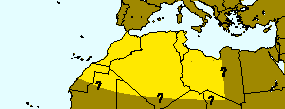

---
title: "Rana saharica"
---

## Phylogeny 

-   « Ancestral Groups  
    -   [Western Palearctic water         frogs](Western_Palearctic_water_frogs)
    -   [Rana (Pelophylax)](Rana_%28Pelophylax%29)
    -   [Rana](../../../../Rana.md)
    -   [\'Ranidae\'](%27Ranidae%27)
    -   [Neobatrachia](../../../../../../Neobatrachia.md)
    -   [Salientia](../../../../../../../Salientia.md)
    -   [Living Amphibians](Living_Amphibians)
    -   [Terrestrial Vertebrates](../../../../../../../../../Terrestrial.md)
    -   [Sarcopterygii](../../../../../../../../../../Sarc.md)
    -   [Gnathostomata](../../../../../../../../../../../Gnath.md)
    -   [Vertebrata](../../../../../../../../../../../../Vertebrata.md)
    -   [Craniata](../../../../../../../../../../../../../Craniata.md)
    -   [Chordata](../../../../../../../../../../../../../../Chordata.md)
    -   [Deuterostomia](../../../../../../../../../../../../../../../Deutero.md)
    -  [Bilateria](../../../../../../../../../../../../../../../../Bilateria.md))
    -  [Animals](../../../../../../../../../../../../../../../../../Animals.md))
    -  [Eukarya](../../../../../../../../../../../../../../../../../../Eukarya.md))
    -   [Tree of Life](../../../../../../../../../../../../../../../../../../Tree_of_Life.md)

-   ◊ Sibling Groups of  Western Palearctic water frogs
    -   Rana saharica
    -   [Rana perezi](Rana_perezi)
    -   [Rana epeirotica](Rana_epeirotica)
    -   [Rana shqiperica](Rana_shqiperica)
    -   [Rana lessonae](Rana_lessonae)
    -   [Rana cretensis](Rana_cretensis)
    -   [Rana cerigensis](Rana_cerigensis)
    -   [Rana bedriagae](Rana_bedriagae)
    -   [Rana ridibunda](Rana_ridibunda)

-   » Sub-Groups 

# *Rana saharica* [Boulenger 1913] 

[Peter Beerli](http://www.tolweb.org/)

Containing group: [Western Palearctic water frogs](../../Western Palearctic water frogs)

### Information on the Internet

[Peter Beerli\'s Water Frog Info-Pool](http://waterfrogs.csit.fsu.edu/)

### Distribution

This species occurs in bigger Oases in the Sahara. Its eastern
distribution is unknown. The southernmost known locality is Tamanrasset
near the Hoggar massif in the center of the Sahara.

### Voice

The following recordings a short sequences of longer recordings. These
files are size reduced (MULAW 8-bit encoded) from 16-bit encoded sound
files. \[[A single call](http://www.tolweb.org/tree/Eukarya/animals/chordata/salientia/ranidae/rana_%28pelophylax%29/pbsounds/saharica.short.au),
[Several calls](http://www.tolweb.org/tree/Eukarya/animals/chordata/salientia/ranidae/rana_%28pelophylax%29/pbsounds/saharica.au)\].

### Synonyms

Valid name: *Rana (Pelophylax) saharica* Boulenger in Hartert 1913

Synonyms: Rana esculenta var. latastei Camerano 1882, Rana esculenta
var. saharica Boulenger in Hartert 1913, Rana zavattarii Scortecci 1936,
Rana ridibunda riodeoroi Salvador and Peris 1975.

### References

Beerli, P. 1994. Genetic isolation and calibration of an average protein
clock in western Palearctic water frogs of the Aegean region.
Dissertation Universität Zürich 1994.
\[[Summary](http://www.tolweb.org/accessory/Genetic_Isolation_in_Western_Palearctic_Water_Frogs?acc_id=580)\]

Buckley, D., B. Arano, P. Herrero, G. Llorente, and M. Esteban. 1994.
Morrocan water frogs vs. *R. perezi*: allozyme studies show up their
differences. In: M. Ogielska (Ed.): II International Symposium on
Ecology and Genetics of European water frogs, 18-25 September 1994,
Wroclaw, Poland. Zoologica Poloniae 39(3-4).

Dubois, A., and A. Ohler. 1994. Frogs of the subgenus *Pelophylax*
(Amphibia, Anura, genus *Rana*): a catalogue of available and valid
scientific names, with comments on the name-bearing types, complete
synonymies. proposed common names, and maps showing all type localities.
In: M. Ogielska (Ed.): II International Symposium on Ecology and
Genetics of European water frogs, 18-25 September 1994, Wroclaw, Poland.
Zoologica Poloniae 39(3-4).

## Confidential Links & Embeds: 

### #is_/same_as ::[saharica](saharica.md)) 

### #is_/same_as :: [saharica.public](/_public/bio/bio~Domain/Eukarya/Animals/Bilateria/Deutero/Chordata/Craniata/Vertebrata/Gnath/Sarc/Tetrapods/Amphibians/Salientia/Neobatrachia/Ranidae/Rana/Pelophylax/Western_Water_Frogs/Rana/saharica.public.md) 

### #is_/same_as :: [saharica.internal](/_internal/bio/bio~Domain/Eukarya/Animals/Bilateria/Deutero/Chordata/Craniata/Vertebrata/Gnath/Sarc/Tetrapods/Amphibians/Salientia/Neobatrachia/Ranidae/Rana/Pelophylax/Western_Water_Frogs/Rana/saharica.internal.md) 

### #is_/same_as :: [saharica.protect](/_protect/bio/bio~Domain/Eukarya/Animals/Bilateria/Deutero/Chordata/Craniata/Vertebrata/Gnath/Sarc/Tetrapods/Amphibians/Salientia/Neobatrachia/Ranidae/Rana/Pelophylax/Western_Water_Frogs/Rana/saharica.protect.md) 

### #is_/same_as :: [saharica.private](/_private/bio/bio~Domain/Eukarya/Animals/Bilateria/Deutero/Chordata/Craniata/Vertebrata/Gnath/Sarc/Tetrapods/Amphibians/Salientia/Neobatrachia/Ranidae/Rana/Pelophylax/Western_Water_Frogs/Rana/saharica.private.md) 

### #is_/same_as :: [saharica.personal](/_personal/bio/bio~Domain/Eukarya/Animals/Bilateria/Deutero/Chordata/Craniata/Vertebrata/Gnath/Sarc/Tetrapods/Amphibians/Salientia/Neobatrachia/Ranidae/Rana/Pelophylax/Western_Water_Frogs/Rana/saharica.personal.md) 

### #is_/same_as :: [saharica.secret](/_secret/bio/bio~Domain/Eukarya/Animals/Bilateria/Deutero/Chordata/Craniata/Vertebrata/Gnath/Sarc/Tetrapods/Amphibians/Salientia/Neobatrachia/Ranidae/Rana/Pelophylax/Western_Water_Frogs/Rana/saharica.secret.md)

