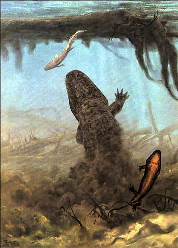
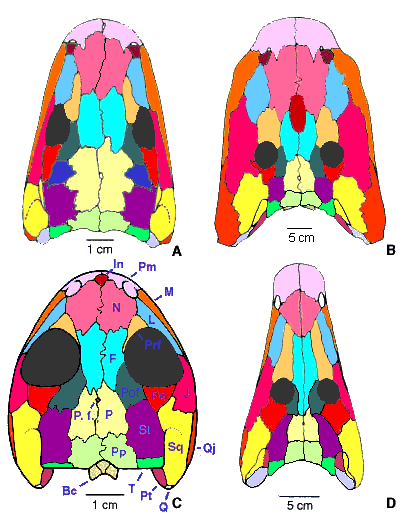
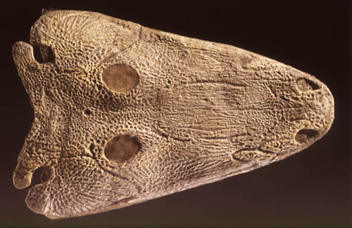
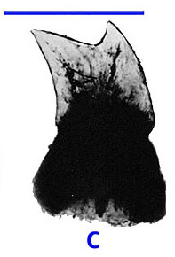

---
title: Temnospondyli
---

# [[Temnospondyli]] 

 

## #has_/text_of_/abstract 

> **Temnospondyli** (from Greek τέμνειν, temnein 'to cut' and σπόνδυλος, spondylos 'vertebra') or temnospondyls is a diverse ancient order of small to giant tetrapods—often considered primitive amphibians—that flourished worldwide during the Carboniferous, Permian and Triassic periods, with fossils being found on every continent. A few species continued into the Jurassic and Early Cretaceous periods, but all had gone extinct by the Late Cretaceous. During about 210 million years of evolutionary history, they adapted to a wide range of habitats, including freshwater, terrestrial, and even coastal marine environments. Their life history is well understood, with fossils known from the larval stage, metamorphosis and maturity. Most temnospondyls were semiaquatic, although some were almost fully terrestrial, returning to the water only to breed. These temnospondyls were some of the first vertebrates fully adapted to life on land. Although temnospondyls are amphibians, many had characteristics such as scales and large armour-like bony plates (osteoderms) that generally distinguish them from the modern soft-bodied lissamphibians (frogs and toads, newts, salamanders and caecilians).
>
> Temnospondyls have been known since the early 19th century, and were initially thought to be reptiles. They were described at various times as batrachians, stegocephalians and labyrinthodonts, although these names are now rarely used. Animals now grouped in Temnospondyli were spread out among several amphibian groups until the early 20th century, when they were found to belong to a distinct taxon based on the structure of their vertebrae. Temnospondyli means "cut vertebrae", as each vertebra is divided into several parts (intercentrum, paired pleurocentra, neural arch), although this occurs widely among other early tetrapods.
>
> Experts disagree over whether temnospondyls were ancestral to modern amphibians (frogs, salamanders and caecilians), or whether the whole group died out without leaving any descendants. Different hypotheses have placed modern amphibians as the descendants of temnospondyls, as descendants of another group of early tetrapods called lepospondyls, or even as descendants of both groups (with caecilians evolving from lepospondyls and frogs and salamanders evolving from temnospondyls). There is further disagreement about a temnospondyl origin of lissamphibians related to whether the modern groups arose from only one group (dissorophoids) or from two different groups (dissorophoids and stereospondyls). The majority of studies place a group of temnospondyls called amphibamiforms as the closest relatives of modern amphibians. Similarities in teeth, skulls and hearing structures link the two groups. Whether temnospondyls are considered part of the tetrapod crown or stem thus depends on their inferred relationship to lissamphibians.
>
> [Wikipedia](https://en.wikipedia.org/wiki/Temnospondyli) 

## Introduction

[Jean-Sébastien Steyer and Michel Laurin](http://www.tolweb.org/)

Temnospondyls are a very large and widespread extinct clade of
stegocephalians. They are known from the Visean (Lower Carboniferous,
about -340 m.y.) to the Lower Cretaceous (-120 m.y.) and have been found
on all continents, from Greenland to Antarctica. More than twelve
families are known, gathering about 90 genera (Milner, 1993).

Temnospondyls show a great diversity of forms, resembling large
salamanders, crocodiles or gavials, with brevirostral (short-snouted;
Fig. 1C) to longirostral (long-snouted) skulls (Fig. 1D). Their size
ranges from about 20 cm to 3 m in length. Aquatic, semi-aquatic,
amphibious or terrestrial, this opportunist group occupied a great range
of ecological niches, especially during the Upper Carboniferous and the
Lower Permian. From the Upper Permian to their demise in the Lower
Cretaceous, temnospondyls are largely (if not entirely) restricted to
aquatic habitats; i.e. they were found in fresh waters on continents and
in the seas (Lindeman, 1991).

### Characteristics

The skull of temnospondyls is triangular to parabolic, and it is often
heavily ornamented (in large, mature individuals) with a polygonal
pattern of ridges (Fig. 2) also found in many other early
stegocephalians (baphetids, seymouriamorphs, captorhinid amniotes,
etc.). This ornamentation indicates that the skin was tightly attached
to the skull. Sensory-line grooves are visible on the skull of the
adults (as well as juveniles) of several species (Fig. 2). This
indicates a fully aquatic lifestyle of these taxa (at least some larvae
had external gills, so they were also aquatic). Temnospondyls retained
all the dermal bones found in most other groups of stegocephalians, with
possible extra bones (such as an internasal, an interfrontal, an
interparietal, etc.). These extra bones have been observed in numerous
taxa, such as Eryops (Fig. 1B), some dissorophoids (Fig. 1C), and some
triassic stereospondyls (Gubin, Novikov and Morales, 1997). The palate
is pierced by a wide interpterygoidal fenestra (the most obvious
autapomorphy of this group; Fig. 3B), and it retains large palatal
tusks. The sharp, conical, numerous teeth, and the large palatal fangs
of temnospondyls suggest that they were predators (carnivorous,
insectivorous, piscivorous, or any combination thereof). Aquatic
temnospondyls have been considered either as passive, benthic ambush
predators, active nectonic predators, or surface hunters (Sennikov,
1996).

Figure 1. Temnospondyl skulls in dorsal view. A, Dendrerpeton acadianum.
B, the eryopid Eryops megacephalus. C, the dissorophoid Tersomius
texensis. D, the archegosaurid Melosaurus vetustus. Redrawn from A,
Holmes, Carroll and Reisz (1998); B, from Sawin (1941); C, from Carroll
(1964); and D, from Konzhukova (1955). Abbreviations: Bc, braincase; F,
frontal; In, internasal; J, jugal; L, lacrimal; M, maxilla; N, nasal; P,
parietal; P. f., pineal foramen; Pm, premaxilla; Po, postorbital; Pof,
postfrontal; Pp, postparietal; Prf, prefrontal; Pt, pterygoid; Q,
quadrate; Qj, quadratojugal; Sq, squamosal; St, supratemporal; T,
tabular. Pictures copyright © 2000 Jean-Sébastien Steyer and Michel
Laurin.

Figure 2. Skull of the stereospondyl Parotosaurus. The sculpturing
pattern of ridges and the grooves for the lateral-line organ are
obvious. The otic notch, at the back of the skull, is almost closed
posteriorly, in this genus. Picture copyright © 2000 D. Serrette, MNHN.

The skull of temnospondyls is emarginated posteriorly by an otic notch
(also called a temporal emargination, or a squamosal notch). This
structure (Fig. 2) has long been thought to have supported a tympanum
(or ear drum) because a similar emargination in several extant taxa
(urodeles, crocodilians, squamates, turtles) is associated with a
tympanum (Bolt and Lombard, 1985). However, we now know that several
early stegocephalians, including some early temnospondyls, retained a
massive stapes that is incompatible with the presence of a functional
tympanum (Clack, 1983, 1992; Godfrey, Fiorillo and Carroll, 1987).
Therefore, it is likely that the first temnospondyls did not have a
tympanum; whether or not it developed later in the group is still
uncertain (Laurin, 1998a).

The vertebrae are 'rhachitomous' (with a large, dorsal, crescentic
intercentrum and a small, dorsal, paired pleurocentrum) to
stereospondylous (without an ossified pleurocentrum, although this
element may be retained in a cartilaginous state). These variations in
vertebral pattern formed the basis of about seven different
classifications proposed by various authors from Cope (1882) to Romer
(1947). These classifications, only based on configurations of the
vertebrae, have been abandoned by most systematists because: i)
different types sometimes occur all along a same vertebral column; ii)
some taxa show intermediate morphologies; iii) classifications based on
various states of a single character usually include paraphyletic taxa;
for instance, the rhachitomous configuration is primitive compared to
the stereospondylous one, and it is perhaps primitive for
stegocephalians (Laurin, 1998b).

### Ontogeny and heterochrony in temnospondyls

Temnospondyls are the best documented early stegocephalian taxon in the
fossil record. Extensive growth series have been recognized in numerous
species of various taxa, such as Dendrerpetonidae (Milner, 1980),
Eryopidae (Werneburg and Steyer, 1999), Archegosauridae (Werneburg and
Steyer, 2000), Zatrachydidae (Boy, 1989), Branchiosauridae (Schoch,
1992; Boy, 1974), and Capitosauridae (Damiani and Warren, 1997). Even if
metamorphosis has not been clearly proved in temnospondyls (Boy, 1974;
Steyer, 1996), growth has been studied from larval to adult stages.
Developmental heterochronies have been highlighted in temnospondyls
thanks to comparative ontogeny (Schoch, 1995; Steyer, 2000) and
histology (Ricqlès, 1975). For example, ontogenetic processes leading to
longirostry may be due to hypermorphosis of the skull, whereas those
leading to brevirostry may be due to paedomorphosis (Ricqlès, 1975;
Schoch, 1995; Steyer, 2000).

### Discussion of Phylogenetic Relationships

Temnospondyls have long played a prominent role in scenarios and
theories on the origin of anurans (Carroll, 1988). Several authors have
suggested that modern amphibians originated from within the
Temnospondyli. Skulls of dissorophids (Fig. 3A, B) and branchiosaurs
(Temnospondyli) have been compared with skulls of anurans and
salamanders (Lissamphibia) to support the temnospondyl origin of
lissamphibians (Watson, 1940; Bolt, 1969). The presence of bicuspid,
pedicellate teeth in small, paedomorphic or immature temnospondyls (Fig.
3C) is probably the most convincing argument in favor of a temnospondyl
origin of lissamphibians (Bolt, 1969).

Figure 3. Cranial anatomy of the juvenile or paedomorphic dissorophoid
Doleserpeton, that has been thought to be closely related to
lissamphibians. A. Dorsal view of the skull. B. Palatal view. Scale bar
for A and B equals 1 mm. C. Bicuspid tooth (also found in
lissamphibians). Scale bar equals 0.05 mm.\
Drawings A and B reproduced with permission from Bolt (1969). Copyright
© 1969 [American Association for the Advancement of Science](http://www.sciencemag.org/).\
Photograph C reproduced with permission from from Bolt (1977). Copyright
© 1977 [Society for Sedimentary Geology](http://www.sepm.org/).

The presence of a tympanum has been inferred in at least some
temnospondyls, and this has also been used to support the idea that
temnospondyls included the closest known relatives of lissamphibians
(Bolt and Lombard, 1985). However, among lissamphibians, only anurans
have a tympanum, so this argument is not convincing because the tympanum
has to be assumed to have been lost in urodeles and apodans (Laurin,
1998). Furthermore, recent computer-assisted phylogenetic analyses
incorporating over 40 taxa and 150 characters (Laurin and Reisz, 1997;
Laurin, 1998a) suggest that lissamphibians are more closely related to
\" lepospondyls \" than to temnospondyls, and that temnospondyls
represent a strictly extinct clade.

Because of their long association with the origin of lissamphibians
(Cope, 1888), temnospondyls have long been considered as amphibians
(Gadow, 1897), but they were initially considered as Reptiles (Jaeger,
1828). They have also been placed in the taxa Labyrinthodontia (named
after the folded structure of the dentine; Burmeister, 1850) or
Stegocephali (named after their heavy skull roof; Cope, 1868). A recent
proposal is to gather them under a redefined Stegocephali (Laurin,
1998a).

A phylogeny of Mesozoic temnospondyls (including mostly stereospondyls)
has been recently proposed (Yates and Warren, 2000). This study
recognizes a monophyletic Stereospondyli that includes most (but not
all) Mesozoic temnospondyls, and that became extinct (along with all
other Temnospondyli) in the Lower Cretaceous. Previous studies had
suggested multiple origins of Mesozoic temnospondyls among their
Paleozoic relatives (Milner, 1990). Some recent phylogenetic analyses
(Laurin and Reisz, 1997; Laurin, 1998a) have demonstrated the monophyly
of temnospondyls. The phylogeny within temnospondyls has been studied by
several authors (Milner and Sequeira, 1994, 1998; Yates and Warren,
2000; Steyer, 2000). Even if they did not include exactly the same
terminal taxa and the same morphological characters, all these studies
are congruent in their main conclusions, and have been summarized by the
consensual tree (above).

For a discussion of the apomorphies that support the phylogeny within
Temnospondyli, see the linked page [Phylogeny and Apomorphies of Temnospondyls](http://www.tolweb.org/accessory/Phylogeny_and_Apomorphies_of_Temnospondyls?acc_id=582).

### Nomenclature

Temnospondyli is a stem-based taxon including all choanates more closely
related to Eryops than to amniotes (Laurin, 1998a). The proposition of
de Queiroz and Gauthier (1992) of defining Temnospondyli as a stem-based
taxon including all tetrapods more closely related to modern amphibians
than to Amniota is rejected because the phylogeny of Laurin and Reisz
(1997) suggests that this definition would exclude most genera that have
been assigned to the Temnospondyli (Laurin, 1998a). Such a definition
would also constitute a junior synonym of Amphibia, that had been thus
defined (Gauthier et al., 1989).

## Phylogeny 

-   « Ancestral Groups  
    -   [Terrestrial Vertebrates](../Terrestrial.md)
    -   [Sarcopterygii](../../Sarc.md)
    -   [Gnathostomata](../../../Gnath.md)
    -   [Vertebrata](../../../../Vertebrata.md)
    -   [Craniata](../../../../../Craniata.md)
    -   [Chordata](../../../../../../Chordata.md)
    -   [Deuterostomia](../../../../../../../Deutero.md)
    -  [Bilateria](../../../../../../../../Bilateria.md))
    -  [Animals](../../../../../../../../../Animals.md))
    -  [Eukarya](../../../../../../../../../../Eukarya.md))
    -   [Tree of Life](../../../../../../../../../../Tree_of_Life.md)

-   ◊ Sibling Groups of  Terrestrial Vertebrates
    -   [Amniota](Amniota.md)
    -   [Solenodonsaurus         janenschi](Solenodonsaurus_janenschi)
    -   [Living Amphibians](Living_Amphibians)
    -   [Seymouriamorpha](Seymouriamorpha.md)
    -   Temnospondyli
    -   [Baphetidae](Baphetidae.md)
    -   [Crassigyrinus scoticus](Crassigyrinus_scoticus)
    -   [Ichthyostega](Ichthyostega.md)
    -   [Acanthostega gunnari](Acanthostega_gunnari)

-   » Sub-Groups
    -   [Dissorophoidea](Temnospondyli/Dissorophoidea.md)

## Title Illustrations

  --------------------------------------------------------------------------------)
  Scientific Name ::   Eryops, Orthacanthus, Trimerorhachis
  Comments           The temnospondyl Eryops lunges after the shark Orthacanthus. Another, smaller temnospondyl (Trimerorhachis) swims in the foreground.
  Reference          From Czerkas S. J. & S. A. Czerkas. 1990. Dinosaurs, a complete world history. Surrey: Dragon\'\'s World Ltd.
  Acknowledgements   Reproduced with permission
  Copyright ::          © 1990 [Douglas Henderson](http://gallery.in-tch.com/%7Eearthhistory/) 

## Confidential Links & Embeds: 

### #is_/same_as ::[Temnospondyli](Temnospondyli.md)) 

### #is_/same_as :: [Temnospondyli.public](/_public/bio/bio~Domain/Eukarya/Animals/Bilateria/Deutero/Chordata/Craniata/Vertebrata/Gnath/Sarc/Tetrapods/Temnospondyli.public.md) 

### #is_/same_as :: [Temnospondyli.internal](/_internal/bio/bio~Domain/Eukarya/Animals/Bilateria/Deutero/Chordata/Craniata/Vertebrata/Gnath/Sarc/Tetrapods/Temnospondyli.internal.md) 

### #is_/same_as :: [Temnospondyli.protect](/_protect/bio/bio~Domain/Eukarya/Animals/Bilateria/Deutero/Chordata/Craniata/Vertebrata/Gnath/Sarc/Tetrapods/Temnospondyli.protect.md) 

### #is_/same_as :: [Temnospondyli.private](/_private/bio/bio~Domain/Eukarya/Animals/Bilateria/Deutero/Chordata/Craniata/Vertebrata/Gnath/Sarc/Tetrapods/Temnospondyli.private.md) 

### #is_/same_as :: [Temnospondyli.personal](/_personal/bio/bio~Domain/Eukarya/Animals/Bilateria/Deutero/Chordata/Craniata/Vertebrata/Gnath/Sarc/Tetrapods/Temnospondyli.personal.md) 

### #is_/same_as :: [Temnospondyli.secret](/_secret/bio/bio~Domain/Eukarya/Animals/Bilateria/Deutero/Chordata/Craniata/Vertebrata/Gnath/Sarc/Tetrapods/Temnospondyli.secret.md)

