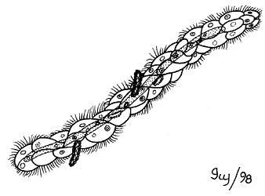

# [[Mesozoa]] 

    

## #has_/text_of_/abstract 

> The **Mesozoa** are minuscule, worm-like parasites of marine invertebrates. Generally, these tiny, elusive creatures consist of a somatoderm (outer layer) of ciliated cells surrounding one or more reproductive cells.
>
> A 2017 study recovered Mesozoa as a monophyletic group that emerged in the Lophotrochozoa as sister of the Rouphozoa.
>
> Some workers previously classified Mesozoa as the sole phylum of the lonely subkingdom Agnotozoa. Cavalier-Smith argued that at least some of the mesozoans are in fact protistans, not animals.
>
> In the 19th century, the Mesozoa were a wastebasket taxon for multicellular organisms which lacked the invaginating gastrula which was thought to define the Metazoa.
>
> [Wikipedia](https://en.wikipedia.org/wiki/Mesozoa) 

## Phylogeny 

-   « Ancestral Groups  
    -  [Bilateria](../Bilateria.md))
    -  [Animals](../../Animals.md))
    -  [Eukarya](../../../Eukarya.md))
    -   [Tree of Life](../../../Tree_of_Life.md)

-   ◊ Sibling Groups of  Bilateria
    -   [Deuterostomia](Deutero.md)
    -  [Arthropoda](Arthropoda.md))
    -  [Onychophora](Onychophora.md))
    -   [Tardigrade](Tardigrade.md)
    -  [Nematoda](Nematoda.md))
    -  [Nematomorpha](Nematomorpha.md))
    -  [Kinorhyncha](Kinorhyncha.md))
    -  [Loricifera](Loricifera.md))
    -  [Priapulida](Priapulida.md))
    -   [Arrow_Worm](Arrow_Worm.md)
    -  [Gastrotricha](Gastrotricha.md))
    -  [Rotifera](Rotifera.md))
    -  [Gnathostomulida](Gnathostomulida.md))
    -   [Limnognathia maerski](Limnognathia_maerski)
    -  [Cycliophora](Cycliophora.md))
    -   Mesozoa
    -  [Platyhelminthes](Platyhelminthes.md))
    -  [Annelida](Annelida.md))
    -  [Bryozoa](Bryozoa.md))
    -  [Sipuncula](Sipuncula.md))
    -  [Mollusca](Mollusca.md))
    -  [Nemertea](Nemertea.md))
    -  [Entoprocta](Entoprocta.md))
    -  [Phoronida](Phoronida.md))
    -  [Brachiopoda](Brachiopoda.md))

-   » Sub-Groups 
	-   *Rhombozoa*
	    -   *Conocyemidae*
	    -   *Dicyemidae*
	    -   *Kantharellidae*
	-   *Orthonectida*
	    -   *Pelmatosphaeridae*
	    -   *Rhopaluridae*

## Title Illustrations

-   Rhopalura (Orthonectida) male and female
-   Dicyema (Rhombozoa) adult, nematogen stage

--------------------------------------------------------------------------
Drawings by by Ivy Livingstone. Copyright © [BIODIDAC](http://biodidac.bio.uottawa.ca/index.htm)

Copyright ::   © 1999 [BIODIDAC](http://biodidac.bio.uottawa.ca/index.htm) 

--------------------------------------------------------------------------

Copyright ::   © 1998 [BIODIDAC](http://biodidac.bio.uottawa.ca/index.htm) 

## Confidential Links & Embeds: 

### #is_/same_as ::[Mesozoa](Mesozoa.md)) 

### #is_/same_as :: [Mesozoa.public](/_public/bio/bio~Domain/Eukarya/Animals/Bilateria/Mesozoa.public.md) 

### #is_/same_as :: [Mesozoa.internal](/_internal/bio/bio~Domain/Eukarya/Animals/Bilateria/Mesozoa.internal.md) 

### #is_/same_as :: [Mesozoa.protect](/_protect/bio/bio~Domain/Eukarya/Animals/Bilateria/Mesozoa.protect.md) 

### #is_/same_as :: [Mesozoa.private](/_private/bio/bio~Domain/Eukarya/Animals/Bilateria/Mesozoa.private.md) 

### #is_/same_as :: [Mesozoa.personal](/_personal/bio/bio~Domain/Eukarya/Animals/Bilateria/Mesozoa.personal.md) 

### #is_/same_as :: [Mesozoa.secret](/_secret/bio/bio~Domain/Eukarya/Animals/Bilateria/Mesozoa.secret.md)

