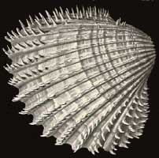
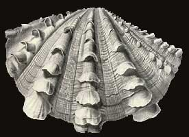
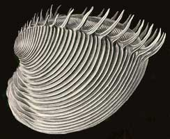

---
title: Bivalvia
---

## Phylogeny 

-   « Ancestral Groups  
    -  [Mollusca](../Mollusca.md))
    -  [Bilateria](../../Bilateria.md))
    -  [Animals](../../../Animals.md))
    -  [Eukarya](../../../../Eukarya.md))
    -   [Tree of Life](../../../../Tree_of_Life.md)

-   ◊ Sibling Groups of  Mollusca
    -   [Chitons](Chitons.md)
    -   Bivalvia
    -  [Gastropoda](Gastropoda.md))
    -  [Cephalopoda](Cephalopoda.md))

-   » Sub-Groups 
	-   *Protobranchia*
	-   *Anomalodesmata*
	-   *Pteriomorphia*
	-   *Palaeoheterodonta*
	-   *Heterodonta*

# [[Bivalvia]]

Mussels, clams, oysters, cockles, etc. 

 )) 

## #has_/text_of_/abstract 

> **Bivalvia** () or bivalves, in previous centuries referred to as the Lamellibranchiata and Pelecypoda, is a class of aquatic molluscs (marine and freshwater) that have laterally compressed soft bodies enclosed by a calcified exoskeleton consisting of a hinged pair of half-shells known as valves. As a group, bivalves have no head and lack some typical molluscan organs such as the radula and the odontophore. Their gills have evolved into ctenidia, specialised organs for feeding and breathing.
>
> Common bivalves include clams, oysters, cockles, mussels, scallops, and numerous other families that live in saltwater, as well as a number of families that live in freshwater. Majority of the class are benthic filter feeders that bury themselves in sediment, where they are relatively safe from predation. Others lie on the sea floor or attach themselves to rocks or other hard surfaces. Some bivalves, such as scallops and file shells, can swim. Shipworms bore into wood, clay, or stone and live inside these substances.
>
> The shell of a bivalve is composed of calcium carbonate, and consists of two, usually similar, parts called valves. These valves are for feeding and for disposal of waste. These are joined together along one edge (the hinge line) by a flexible ligament that, usually in conjunction with interlocking "teeth" on each of the valves, forms the hinge. This arrangement allows the shell to be opened and closed without the two halves detaching. The shell is typically bilaterally symmetrical, with the hinge lying in the sagittal plane. Adult shell sizes of bivalves vary from fractions of a millimetre to over a metre in length, but the majority of species do not exceed 10 cm (4 in).
>
> Bivalves have long been a part of the diet of coastal and riparian human populations. Oysters were cultured in ponds by the Romans, and mariculture has more recently become an important source of bivalves for food. Modern knowledge of molluscan reproductive cycles has led to the development of hatcheries and new culture techniques. A better understanding of the potential hazards of eating raw or undercooked shellfish has led to improved storage and processing. Pearl oysters (the common name of two very different families in salt water and fresh water) are the most common source of natural pearls. The shells of bivalves are used in craftwork, and the manufacture of jewellery and buttons. Bivalves have also been used in the biocontrol of pollution.
>
> Bivalves appear in the fossil record first in the early Cambrian more than 500 million years ago. The total number of known living species is about 9,200. These species are placed within 1,260 genera and 106 families. Marine bivalves (including brackish water and estuarine species) represent about 8,000 species, combined in four subclasses and 99 families with 1,100 genera. The largest recent marine families are the Veneridae, with more than 680 species and the Tellinidae and Lucinidae, each with over 500 species. The freshwater bivalves include seven families, the largest of which are the Unionidae, with about 700 species.
>
> [Wikipedia](https://en.wikipedia.org/wiki/Bivalvia) 

## Title Illustrations

--------------------------------------------)
Scientific Name ::    Cardiidae
Comments            a cockle
Reference           Ernst Haeckel\'\'s Kunstformen der Natur published 1899-1904 by Verlag des Bibliographischen Instituts, Leipzig and Vienna.
Source Collection   [BioLib Online Library of Biological Books](http://www.biolib.de/)

--------------------------------------------)
Scientific Name ::    Tridacnidae
Comments            a giant clam
Reference           Ernst Haeckel\'\'s Kunstformen der Natur published 1899-1904 by Verlag des Bibliographischen Instituts, Leipzig and Vienna.
Source Collection   [BioLib Online Library of Biological Books](http://www.biolib.de/)

--------------------------------------------)
Scientific Name ::    Veneridae
Comments            a venus clam
Reference           Ernst Haeckel\'\'s Kunstformen der Natur published 1899-1904 by Verlag des Bibliographischen Instituts, Leipzig and Vienna.
Source Collection   [BioLib Online Library of Biological Books](http://www.biolib.de/)

## Confidential Links & Embeds: 

### #is_/same_as ::[Bivalvia](Bivalvia.md)) 

### #is_/same_as :: [Bivalvia.public](/_public/bio/bio~Domain/Eukarya/Animals/Bilateria/Mollusca/Bivalvia.public.md) 

### #is_/same_as :: [Bivalvia.internal](/_internal/bio/bio~Domain/Eukarya/Animals/Bilateria/Mollusca/Bivalvia.internal.md) 

### #is_/same_as :: [Bivalvia.protect](/_protect/bio/bio~Domain/Eukarya/Animals/Bilateria/Mollusca/Bivalvia.protect.md) 

### #is_/same_as :: [Bivalvia.private](/_private/bio/bio~Domain/Eukarya/Animals/Bilateria/Mollusca/Bivalvia.private.md) 

### #is_/same_as :: [Bivalvia.personal](/_personal/bio/bio~Domain/Eukarya/Animals/Bilateria/Mollusca/Bivalvia.personal.md) 

### #is_/same_as :: [Bivalvia.secret](/_secret/bio/bio~Domain/Eukarya/Animals/Bilateria/Mollusca/Bivalvia.secret.md)

