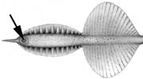

---
title: Asperoteuthis
---

## Phylogeny 

-   « Ancestral Groups  
    -  [Chiroteuthidae](../Chiroteuthidae.md))
    -   [Chiroteuthid families](Chiroteuthid_families)
    -  [Oegopsida](../../../Oegopsida.md))
    -  [Decapodiformes](../../../../Decapodiformes.md))
    -  [Coleoidea](../../../../../Coleoidea.md))
    -  [Cephalopoda](../../../../../../Cephalopoda.md))
    -  [Mollusca](../../../../../../../Mollusca.md))
    -  [Bilateria](../../../../../../../../Bilateria.md))
    -  [Animals](../../../../../../../../../Animals.md))
    -  [Eukarya](../../../../../../../../../../Eukarya.md))
    -   [Tree of Life](../../../../../../../../../../Tree_of_Life.md)

-   ◊ Sibling Groups of  Chiroteuthidae
    -   Asperoteuthis
    -  [Chiroteuthis](Chiroteuthis.md))
    -   [Grimalditeuthis         bonplandi](Grimalditeuthis_bonplandi)
    -  [Planctoteuthis](Planctoteuthis.md))
    -   [New Genus B](New_Genus_B)
    -   [New Genus C](New_Genus_C)

-   » Sub-Groups
    -   [Asperoteuthis         acanthoderma](Asperoteuthis_acanthoderma)
    -   [Asperoteuthis mangoldae](Asperoteuthis_mangoldae)
    -   [Asperoteuthis sp. B](Asperoteuthis_sp._B)

# *Asperoteuthis* [Nesis, 1980] 

[Richard E. Young and Clyde F. E. Roper](http://www.tolweb.org/)
)

This genus contains one named species and, at least, two undescribed
species.

-   *[Asperoteuthis     acanthoderma](Asperoteuthis_acanthoderma)*[
    (Lu, 1977)]
-   *[Asperoteuthis     mangoldae](Asperoteuthis_mangoldae)*[
    Young, Vecchione and Roper, 2007]
-   *[Asperoteuthis sp.     B](Asperoteuthis_sp._B)*

Containing group:[Chiroteuthidae](../Chiroteuthidae.md))

## Introduction

Little is known obout the biology of any species of ***Asperoteuthis***.
The most peculiar feature of this genus is the structure of the
tentacular clubs. The distal half of the club has typical suckers and
suggests that this part of the club functions in the usual capture of
prey. The function of the bare proximal half of the club with its broad
protective membranes is less clear but relates to another problem: How
can the long and extremely slender tentacles, which in ***A.
acanthoderma*** can be 7-12 times the mantle length (Tsuchiya and
Okutani, 1993), be deployed? Perhaps the wide protective membranes of
the proximal region of the club, which are composed virtually entirely
of muscular trabeculae, function as muscular fins that swim the club
into position.

#### Diagnosis

A chiroteuthid \...

-   with suckers only on distal portion of tentacle-club.
-   with atypical tragus and antitragus in funnel locking-apparatus
    which define a slender Y-shape or a slender curved groove.
-   without photophores on arms IV.

### Characteristics

1.  Arms
    1.  Long, subequal in length in large subadults.

2.  Tentacles
    1.  Club divided into two portions by symmetrical protective
        membranes.

    2.  Suckers only on distal portion of club.\

       )

        **Figure**. Oral view of tentacular club of ***Asperoteuthis
        acanthoderma***. Drawing by J. R. Schroeder.

3.  Head
    1.  Olfactory organ located well posterior to each eye.

4.  Funnel
    1.  Funnel valve present.

    2.  Funnel-locking apparatus variable; with inverted Y-shaped groove
        that poorly defines a weak tragus and strong antitragus or a
        curved groove without an antitragus.

       )

        **Figure**. Ventral view of the funnel locking-apparatus, ***A.
        acanthoderm*a**. Drawing by J. R. Schroeder.

5.  Photophores

    1.  No photophores on viscera or arms IV.
    2.  Large oval photophore patch on ventral surface of each eyeball.
    3.  [Luminescent pads on         tentacles](http://www.tolweb.org/notes/?note_id=661) (also in
        ***Chiroteuthis***).
    4.  Aboral surface of club with large photophore on tip (see arrow)
        and two series of small photophores.\
        \

       ){height="100" width="180"}

    **Figures**. **Left** - Ventral view of eye of ***Asperoteuthis
    acanthoderma*** from Tsuchiya and Okutani, 1993, showing photophore,
    with permission. **Middle** - Tentacle stalk photophores, same
    species. Drawing by J. R. Schroeder. **Right** - aboral view of
    club-tip photophore (arrow), ***Asperoteuthis*** sp. A. Drawing
    by A. D. Hart.

#### Comments

These squid generally lose the tentacles during capture and can easily
be confused with ***Grimalditeuthis***. However the lack of a fused
funnel-mantle locking apparatus easily distinguishes them.

### Nomenclature

Lu (1977) described ***Chiroteuthis acanthoderma***. Nesis (1980)
incorrectly synonymized this species with the incompletely described
***Chiroteuthis famelica*** Berry, 1909 (now = ***Mastigoteuthis
famelica***, see Young, 1991) and erected for it the new genus
***Asperoteuthis***. The type species of the genus is ***C.
acanthoderma*** Lu, 1977.

### Discussion of Phylogenetic Relationships

Nothing is known of the phylogenetic relationships among the species.

### Life History

Paralarvae are known for one species of ***Asperoteuthis*** (see
***Asperoteuthis*** sp. A).

### References

Lu, C. C. 1977. A new species of squid *Chiroteuthis acanthoderma*, from
the Southwest Pacific (Cephalopoda, Chiroteuthidae). Steenstrupia, 4:
179-188.

Nesis, K. N. 1980. Taxonomic position of *Chiroteuthis famelica* Berry.
Bull. Moscow Obshch. Ispyt. Prirody, sect. Biology, 85: 59-66. \[In
Russian\].

Tsuchiya, K. and T. Okutani. 1993. Rare and interesting squids in Japan
-X. Recent occurences of big squids from Okinawa. Venus, 52: 299-311.

Young, R. E. 1978. Vertical distribution and photosensitive vesicles of
pelagic cephalopods from Hawaiian waters. Fishery Bulletin, 76: 583-615.

Young, R. E. 1991. Chiroteuthid and related paralarvae from Hawaiian
waters. Bull. Mar. Sci., 49: 162-185.

## Title Illustrations

)

  -------------------------------------------------------------------------
  Scientific Name ::  Asperoteuthis acanthoderma
  Creator           J. R. Schroeder
  Copyright ::         © [Clyde F. E. Roper](mailto:roper.clyde@nmnh.si.edu) 
  -------------------------------------------------------------------------

## Confidential Links & Embeds: 

### #is_/same_as ::[Asperoteuthis](Asperoteuthis.md)) 

### #is_/same_as :: [Asperoteuthis.public](/_public/bio/bio~Domain/Eukarya/Animals/Bilateria/Mollusca/Cephalopoda/Coleoidea/Decapodiformes/Oegopsida/Chiroteuthid/Chiroteuthidae/Asperoteuthis.public.md) 

### #is_/same_as :: [Asperoteuthis.internal](/_internal/bio/bio~Domain/Eukarya/Animals/Bilateria/Mollusca/Cephalopoda/Coleoidea/Decapodiformes/Oegopsida/Chiroteuthid/Chiroteuthidae/Asperoteuthis.internal.md) 

### #is_/same_as :: [Asperoteuthis.protect](/_protect/bio/bio~Domain/Eukarya/Animals/Bilateria/Mollusca/Cephalopoda/Coleoidea/Decapodiformes/Oegopsida/Chiroteuthid/Chiroteuthidae/Asperoteuthis.protect.md) 

### #is_/same_as :: [Asperoteuthis.private](/_private/bio/bio~Domain/Eukarya/Animals/Bilateria/Mollusca/Cephalopoda/Coleoidea/Decapodiformes/Oegopsida/Chiroteuthid/Chiroteuthidae/Asperoteuthis.private.md) 

### #is_/same_as :: [Asperoteuthis.personal](/_personal/bio/bio~Domain/Eukarya/Animals/Bilateria/Mollusca/Cephalopoda/Coleoidea/Decapodiformes/Oegopsida/Chiroteuthid/Chiroteuthidae/Asperoteuthis.personal.md) 

### #is_/same_as :: [Asperoteuthis.secret](/_secret/bio/bio~Domain/Eukarya/Animals/Bilateria/Mollusca/Cephalopoda/Coleoidea/Decapodiformes/Oegopsida/Chiroteuthid/Chiroteuthidae/Asperoteuthis.secret.md)

