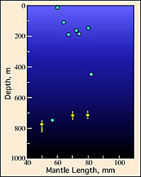

---
title: "Chiroteuthis spoeli"
---

## Phylogeny 

-   « Ancestral Groups  
    -  [Chiroteuthis](../Chiroteuthis.md))
    -  [Chiroteuthidae](../../Chiroteuthidae.md))
    -   [Chiroteuthid families](Chiroteuthid_families)
    -  [Oegopsida](../../../../Oegopsida.md))
    -  [Decapodiformes](../../../../../Decapodiformes.md))
    -  [Coleoidea](../../../../../../Coleoidea.md))
    -  [Cephalopoda](../../../../../../../Cephalopoda.md))
    -  [Mollusca](../../../../../../../../Mollusca.md))
    -  [Bilateria](../../../../../../../../../Bilateria.md))
    -  [Animals](../../../../../../../../../../Animals.md))
    -  [Eukarya](../../../../../../../../../../../Eukarya.md))
    -   [Tree of Life](../../../../../../../../../../../Tree_of_Life.md)

-   ◊ Sibling Groups of  Chiroteuthis
    -   [Chiroteuthis sp. B2](Chiroteuthis_sp._B2)
    -   [Chiroteuthis calyx](Chiroteuthis_calyx)
    -   [Chiroteuthis joubini](Chiroteuthis_joubini)
    -   [Chiroteuthis mega](Chiroteuthis_mega)
    -   [Chiroteuthis picteti](Chiroteuthis_picteti)
    -   Chiroteuthis spoeli
    -   [Chiroteuthis veranyi](Chiroteuthis_veranyi)

-   » Sub-Groups 

# *Chiroteuthis spoeli* [Salcedo-Vargas, 1996] 

[Clyde F. E. Roper and Richard E. Young]()
)

The illustrated squid is deposited in the National Museum of Natural
History, Smithsonian Institution, Washington, D.C., U.S.A..

The holotype is deposited in the Zoological Museum of Amsterdam,
University of Amsterdam, Netherlands.

Containing group: [Chiroteuthis](../Chiroteuthis.md))*

## Introduction

***Chiroteuthis spoeli*** is a broadly distributed species that is
similar to  ***Chiroteuthis joubini*** and ***Chiroteuthis*** sp. B2 in
the three-part division of the club protective membranes. It is closest
to ***C***. sp. B2 but is most easily separated by the arm sucker size
and dentition.

#### Diagnosis

A ***Chiroteuthis*** \...

-   with club protective  membranes divided into three divisions of
    roughly the same size.
-   with large arm suckers globular in form and bearing broad, truncate
    teeth.\

### Characteristics

1.  Arms
    1.  Largest suckers with 12-15 broad, rounded to truncate teeth,
        fused laterally in distal 1/2 - 2/3 of ring; proximal portion
        smooth; more distal suckers with thin blunt teeth; more proximal
        suckers with broader, rounded teeth.
    2.  Largest suckers globular.\
2.  Tentacular clubs
    1.  Suckers with 7-8 long, triangular, sharply-pointed teeth over
        distal half of ring; no enlarged central tooth.
    2.  Sucker stalks in two distinct parts (long, cyclindrical base and
        short, constricted portion that attaches to sucker); stalks of
        lateral and medial suckers about equal in length.
    3.  Protective membranes in three distinctive sets with intermediate
        set broadest and consisting of fused trabeculae.

       )
        **Figure**. Oral view of the tentacular club of ***C. spoeli***.
        Drawing by J. R. Schroeder (© C. Roper).

3.  Photophores
    1.  Eyeball: Two series: lateral series with 7-8 round photophores; 
        medial series with 6-7 round photophores. \
    2.  Viscera: two, large organs.

#### Comments

***Chiroteuthis spoeli*** exhibits considerable variation in the size of
the globular suckers and the degree of restriction of the sucker
aperature. Also considerable variation exists in the number of
trabeculae in the proximal portion of the club. Because of this large
variation, the possibility exists that ***C. spoeli*** is a species
complex. There seems to be intergrades between ***Chiroteuthis spoeli***
and ***Chiroteuthis*** B2 (e.g. see SEMs of arm suckers for
***Chiroteuthis*** B2) and these forms may not represent separate
species. We have not examined many ***Chiroteuthis joubini*** and
intergrades between this and form B2 may exist. Therefore the ***C.
joubini*** complex may consist of a variety of species or one highly
variable species that includes ***C. joubini***, ***Chiroteuthis*** B2
and ***C. spoeli***. We have examined variation in sucker dentition but
not variation in other features and, therefore, cannot resolve the
taxonomy at present.

[More details of the description can be found here](http://www.tolweb.org/accessory/Chiroteuthis_spoeli_Description?acc_id=726).

Because of the uncertainties of the species boundaries of ***C.
spoeli***, [a description of the holotype of this species can be found here](http://www.tolweb.org/accessory/Description_of_the_Holotype_of_Chiroteuthis_spoeli?acc_id=730).

### Life history

[The doratopsis paralarvae of *C. spoeli* are known from Hawaiian waters.](http://www.tolweb.org/accessory/Chiroteuthis_spoeli_Paralarvae?acc_id=732)
In the doratopsis paralarvae of ***C. spoeli***, the esophagus lies in a
dorsal position within the brachial pillar. In other species, the
esophagus is more commonly located in a central location within the
brachial pillar (Young 1991). Maximum size of paralarvae is about 90 mm
ML. The smallest subadult known is 65 mm ML indicating considerable
variation in the size at \"metamorphosis.\"

### Distribution

#### Vertical distribution

The vertical distribution of subadults of ***Chiroteuthis spoeli*** is
known from a few squid captured off Hawaii. The three captures made
during the day suggest a habitat between depths of 700 and 800 m. At
night captures were scattered from the surface to 750 m with most from
the upper 200 m.
)

**Figure**. Depth chart of the vertical distribution of ***C. spoeli***,
Hawaiian waters. Captures were made with both open and opening/closing
trawls. Bars- fishing depth-range of opening/closing trawl. Circle-
Modal fishing depth for either trawl. Blue-filled circles- Night
captures. Yellow-filled circles- Day capture. Chart modified from Young
(1978).\

#### Geographical distribution

The species is known from the tropical and temperate Atlantic and
tropical Pacific Oceans.

### References

Salcedo-Vargas, M. A. 1996. Cephalopods from the Netherlands Indian
Ocean Programme (NIOP) - I. *Chiroteuthis spoeli*, n. spec. and
*Chiroteuthis picteti somaliensis* n. subspec. Beaufortia, 46: 11-26.

Young, R. E. 1978. Vertical distribution and photosensitive vesicles of
pelagic cephalopods from Hawaiian waters. Fish. Bull., 76: 583-615.

Young, R. E. 1991. Chiroteuthid and related paralarvae from Hawaiian
waters. Bull. Mar. Sci., 49: 162-185.

## Title Illustrations

)

  -------------------------------------------------------------------------
  Scientific Name ::  Chiroteuthis spoeli
  Creator           J. R. Schroeder
  View              Ventral
  Copyright ::         © [Clyde F. E. Roper](mailto:roper.clyde@nmnh.si.edu) 
  -------------------------------------------------------------------------
)

  ------------
  Scientific Name ::  Chiroteuthis spoeli
  Location ::        off N.E. coast of U.S.A.
  Creator           M. Vecchione
  ------------

## Confidential Links & Embeds: 

### #is_/same_as ::[spoeli](spoeli.md)) 

### #is_/same_as :: [spoeli.public](/_public/bio/bio~Domain/Eukarya/Animals/Bilateria/Mollusca/Cephalopoda/Coleoidea/Decapodiformes/Oegopsida/Chiroteuthid/Chiroteuthidae/Chiroteuthis/spoeli.public.md) 

### #is_/same_as :: [spoeli.internal](/_internal/bio/bio~Domain/Eukarya/Animals/Bilateria/Mollusca/Cephalopoda/Coleoidea/Decapodiformes/Oegopsida/Chiroteuthid/Chiroteuthidae/Chiroteuthis/spoeli.internal.md) 

### #is_/same_as :: [spoeli.protect](/_protect/bio/bio~Domain/Eukarya/Animals/Bilateria/Mollusca/Cephalopoda/Coleoidea/Decapodiformes/Oegopsida/Chiroteuthid/Chiroteuthidae/Chiroteuthis/spoeli.protect.md) 

### #is_/same_as :: [spoeli.private](/_private/bio/bio~Domain/Eukarya/Animals/Bilateria/Mollusca/Cephalopoda/Coleoidea/Decapodiformes/Oegopsida/Chiroteuthid/Chiroteuthidae/Chiroteuthis/spoeli.private.md) 

### #is_/same_as :: [spoeli.personal](/_personal/bio/bio~Domain/Eukarya/Animals/Bilateria/Mollusca/Cephalopoda/Coleoidea/Decapodiformes/Oegopsida/Chiroteuthid/Chiroteuthidae/Chiroteuthis/spoeli.personal.md) 

### #is_/same_as :: [spoeli.secret](/_secret/bio/bio~Domain/Eukarya/Animals/Bilateria/Mollusca/Cephalopoda/Coleoidea/Decapodiformes/Oegopsida/Chiroteuthid/Chiroteuthidae/Chiroteuthis/spoeli.secret.md)

