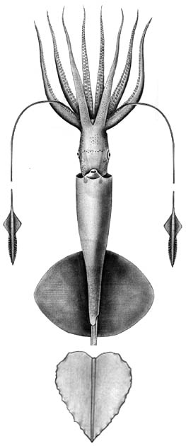
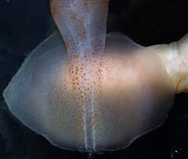
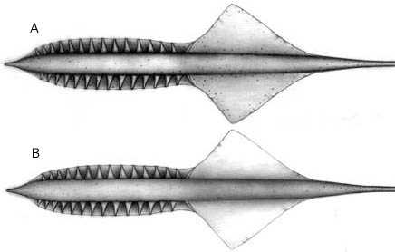
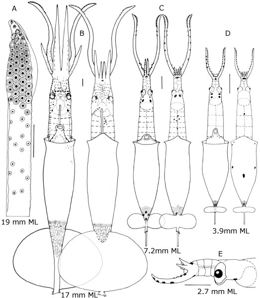
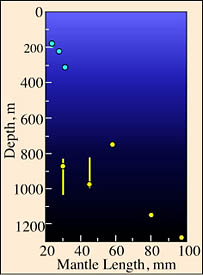

---
title: "Grimalditeuthis bonplandi"
---

## Phylogeny 

-   « Ancestral Groups  
    -  [Chiroteuthidae](../Chiroteuthidae.md))
    -   [Chiroteuthid families](Chiroteuthid_families)
    -  [Oegopsida](../../../Oegopsida.md))
    -  [Decapodiformes](../../../../Decapodiformes.md))
    -  [Coleoidea](../../../../../Coleoidea.md))
    -  [Cephalopoda](../../../../../../Cephalopoda.md))
    -  [Mollusca](../../../../../../../Mollusca.md))
    -  [Bilateria](../../../../../../../../Bilateria.md))
    -  [Animals](../../../../../../../../../Animals.md))
    -  [Eukarya](../../../../../../../../../../Eukarya.md))
    -   [Tree of Life](../../../../../../../../../../Tree_of_Life.md)

-   ◊ Sibling Groups of  Chiroteuthidae
    -  [Asperoteuthis](Asperoteuthis.md))
    -  [Chiroteuthis](Chiroteuthis.md))
    -   Grimalditeuthis bonplandi
    -  [Planctoteuthis](Planctoteuthis.md))
    -   [New Genus B](New_Genus_B)
    -   [New Genus C](New_Genus_C)

-   » Sub-Groups 

## *Grimalditeuthis* [Joubin, 1898] 

# *Grimalditeuthis bonplandi* [(Verany, 1839)] 

[Richard E. Young and Clyde F. E. Roper]()
))

The holotype is thought to be deposited in the Museum of Natural
History, Nice, France, but its existence is uncertain.

Containing group:[Chiroteuthidae](../Chiroteuthidae.md))

## Introduction

***Grimalditeuthis bonplandi*** is very gelatinous and contains
vesiculate tissue in the head, arms and mantle. It is generally
***Chiroteuthis***-like in appearance (long neck, body and fin shape)
but is distinguished by subequal arms and fusion of each funnel-mantle
locking apparatus. Only scattered chromatophores are present, and the
eyes are small. This species is infrequently captured but seems to have
a world-wide distribution in tropical to temperate seas.

#### Diagnosis

A chiroteuthid \...

-   without suckers on clubs.
-   with funnel locking-apparatus fused to mantle.
-   without photophores except on arm tips in mature (?) females.

### Characteristics

1.  Arms
    1.  Arms approximately subequal in length, gelatinous.
    2.  Sucker base with three conical papillae (unique character).
    3.  Protective membranes absent.

       ){width="436"}
        **Figure**. Tentacle-clubs of ***G. bomplandi***. **A** - Aboral
        view. **B** - Oral view. a single intact tentacle was found on a
        specimen taken from the stomach of the fish ***Alepisaurus
        ferox*** (courtesy of Lourdes Burgess). The tentacle club lacked
        suckers and showed no indication that suckers or sucker stalks
        were ever present as the skin was intact. Drawings by A. D.
        Hart.

2.  Head
    1.  Olfactory organ located lateral to base of funnel (i.e.,
        anterior to collar at posterior end of neck).

    2.  Beaks with distinctive appearance.

        [Photographs of the beaks ***G. bonplandi*** can be seen         here.](http://www.tolweb.org/notes/?note_id=3448)
3.  Funnel
    1.  Funnel valve present.
    2.  Funnel fused to mantle at each funnel-mantle locking-apparatus
        (head not fused to mantle in nuchal region).
4.  Photophores
    1.  Absent accept at the arm tips of mature (?) females (See \"More
        details \...\").
5.  Tail
    1.  Two fin-like \"floatation devices\" (= secondary fins) arise
        from tail.

#### Comments

[More details of the description can be found here.](http://www.tolweb.org/accessory/Grimalditeuthis_description_continued?acc_id=2551)

The function of the suckerless club is unknown. Tentacle stalks are very
thin, fragile and almost always broken off in capture.

This species also has a very characteristic pattern of chromatophores on
the head. A line of chromatophores passes across the ventral surface of
the head between the anterior ends of eyes; another line runs along the
neck from each olfactory papilla anteriorly to each eye, then anterior
to each eye along the brachial pillar, terminating at the base of the
arms.

### Nomenclature

Joubin (1898) described a second species, ***G. richardi*** based on the
presence of photophores on the tips of the arms. Pfeffer (1912)
synonomized the two and this was supported by Young (1972) and Nesis
(1982).

### Life History

The doratopsis was first described by Chun (1910) as ***Doratopsis
sagitta***. A growth series of the paralarvae was described by Young
(1991), and can be found below. The early doratopsis stage is similar to
that of other species in the family. The older doratopsis shows many of
the features of the subadult including the distinctive chromatophore
pattern and the small eyes.

1.  At sizes larger than 9 mm ML ***Grimalditeuthis*** doratopsis
    paralarvae are easily identified by:
    1.  Small eye size.
    2.  Position of the olfactory papillae opposite the base of the
        funnel.
    3.  Distinctive chromatophore pattern on the head (same as subadult
        pattern).
    4.  Separation of optic lobes from brain.
    5.  Anterior position of the superior buccal and brachial lobes.

2.  At sizes smaller than 9 mm paralarvae are identified by a
    combination of:

    1.  A long brachial pillar with a centrally located esophagus.
    2.  Number of chromatophores on the funnel shoulders and the ventral
        head posterior to the eyes.
    3.  Just slightly elongate eye-shape.
    4.  Shape of the vesiculate area on the posterior end of the mantle
        (nearly flat anteriorly).

   ){width="523"}

    **Figure**. Paralarvae of ***G. bonpland*i**, Hawaiian waters.
    **A** - Oral view of the tentacular club, 19 mm ML. There is a
    scattered arrangement of suckers proximal to the typical doratopsid
    club which contrasts with the denser and more orderly arrangement of
    presumptive adult clubs in ***Chiroteuthis*** and
    ***Asperoteuthis*** advanced doratopsis stages. **B-D** - Dorsal and
    ventral views of paralarvae at three different sizes. **E** - Side
    view of the head showing the long brachial pillar and the central
    position of the esophagus. Drawings from Young (1991)

### Distribution

#### Vertical distribution

A small number of captures off Hawaii (Young 1978) included three small
squid from the upper 350 m that probably had not descended from the
shallow paralarval habitat and five squid from depths greater than 700
m.
){height="275"
width="203"}

**Figure**. Vertical distribution chart of ***G. bonplandi***, Hawaiian
waters. Captures were made with both open and opening/closing trawls.
Bars - Fishing depth-range of opening/closing trawl. Circle - Modal
fishing depth for either trawl. Blue color - Night captures. Yellow
color - Day captures. Chart modified from Young (1978).

#### Geographical distribution

The type locality is 29° N and 39° W in the North Atlantic. It is known
from the tropical and subtropical North Atlantic and the tropical and
temperate North Pacific (Nesis, 1982). 

### References

Joubin, L. 1898. Observations sur divers Cephaloppodes. Quatrieme note:
*Grimalditeuthis Richardi* Joubin 1898. Bulletin de la Societe
Zoologique de France, 23: 101-113.

Pfeffer, G. 1912. Die Cephalopoden der Plankton-Expedition. Ergebniss
der Plankton-Expedition der Humboldt-Stiftung. 2: 1-815.

Verany, J. B. 1839. Memoire sur six novelles especes de Cephalopodes
trouvees dans la Mediterranee a Nice. Memoire della Resle Accademia
della Science de Torino, series 2, 1: 91-98

Young, R. E. 1972. The systematics and areal distribution of pelagic
cephalopods from the seas off Southern California. Smithson. Contr.
Zool., 97: 1-159.

Young, R. E. 1978. Vertical distribution and photosensitive vesicles of
pelagic cephalopods from Hawaiian waters. Fish. Bull., 76: 583-615.

Young, R. E. 1991. Chiroteuthid and related paralarvae from Hawaiian
waters. Bull. Mar. Sci. 49: 162-185.

## Title Illustrations

)

  ------------------------------------------------------------------------------
  Scientific Name ::  Grimalditeuthis bonplandi
  Location ::        Off Southern California
  Reference         modified from Young, R. E. 1972. The systematics and areal distribution of pelagic cephalopods from the seas off Southern California. Smithson. Contr. Zool. 97:1-159.
  Sex ::             Female
  View              Ventral
  Size              89 mm ML
  Copyright ::         © [Richard E. Young](http://www.soest.hawaii.edu/%7Eryoung/rey.html) 
  ------------------------------------------------------------------------------
)

  ------------------------------------------------------------------------------
  Scientific Name ::  Grimalditeuthis bonplandi
  Location ::        Hawaiian waters
  Comments          The photograph shows the delicate, translucent nature of the fin and its light pigmentation. A human finger can be seen behind the fin.
  Body Part         Fins
  View              Ventral
  Copyright ::         © [Richard E. Young](http://www.soest.hawaii.edu/%7Eryoung/rey.html) 
  ------------------------------------------------------------------------------

## Confidential Links & Embeds: 

### #is_/same_as ::[Grimalditeuthis](Grimalditeuthis.md)) 

### #is_/same_as :: [Grimalditeuthis.public](/_public/bio/bio~Domain/Eukarya/Animals/Bilateria/Mollusca/Cephalopoda/Coleoidea/Decapodiformes/Oegopsida/Chiroteuthid/Chiroteuthidae/Grimalditeuthis.public.md) 

### #is_/same_as :: [Grimalditeuthis.internal](/_internal/bio/bio~Domain/Eukarya/Animals/Bilateria/Mollusca/Cephalopoda/Coleoidea/Decapodiformes/Oegopsida/Chiroteuthid/Chiroteuthidae/Grimalditeuthis.internal.md) 

### #is_/same_as :: [Grimalditeuthis.protect](/_protect/bio/bio~Domain/Eukarya/Animals/Bilateria/Mollusca/Cephalopoda/Coleoidea/Decapodiformes/Oegopsida/Chiroteuthid/Chiroteuthidae/Grimalditeuthis.protect.md) 

### #is_/same_as :: [Grimalditeuthis.private](/_private/bio/bio~Domain/Eukarya/Animals/Bilateria/Mollusca/Cephalopoda/Coleoidea/Decapodiformes/Oegopsida/Chiroteuthid/Chiroteuthidae/Grimalditeuthis.private.md) 

### #is_/same_as :: [Grimalditeuthis.personal](/_personal/bio/bio~Domain/Eukarya/Animals/Bilateria/Mollusca/Cephalopoda/Coleoidea/Decapodiformes/Oegopsida/Chiroteuthid/Chiroteuthidae/Grimalditeuthis.personal.md) 

### #is_/same_as :: [Grimalditeuthis.secret](/_secret/bio/bio~Domain/Eukarya/Animals/Bilateria/Mollusca/Cephalopoda/Coleoidea/Decapodiformes/Oegopsida/Chiroteuthid/Chiroteuthidae/Grimalditeuthis.secret.md)

