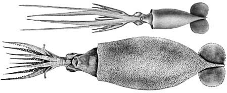
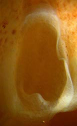

---
title: "Planctoteuthis oligobessa"
---

## Phylogeny 

-   « Ancestral Groups  
    -  [Planctoteuthis](../Planctoteuthis.md))
    -  [Chiroteuthidae](../../Chiroteuthidae.md))
    -   [Chiroteuthid families](Chiroteuthid_families)
    -  [Oegopsida](../../../../Oegopsida.md))
    -  [Decapodiformes](../../../../../Decapodiformes.md))
    -  [Coleoidea](../../../../../../Coleoidea.md))
    -  [Cephalopoda](../../../../../../../Cephalopoda.md))
    -  [Mollusca](../../../../../../../../Mollusca.md))
    -  [Bilateria](../../../../../../../../../Bilateria.md))
    -  [Animals](../../../../../../../../../../Animals.md))
    -  [Eukarya](../../../../../../../../../../../Eukarya.md))
    -   [Tree of Life](../../../../../../../../../../../Tree_of_Life.md)

-   ◊ Sibling Groups of  Planctoteuthis
    -   [Planctoteuthis danae](Planctoteuthis_danae)
    -   [Planctoteuthis         exopthalmica](Planctoteuthis_exopthalmica)
    -   [Planctoteuthis levimana](Planctoteuthis_levimana)
    -   [Planctoteuthis lippula](Planctoteuthis_lippula)
    -   Planctoteuthis oligobessa

-   » Sub-Groups 

# *Planctoteuthis oligobessa* [Young 1972] 

[Richard E. Young and Clyde F. E. Roper]()
)

The holotype is deposited in the Santa Barbara Museum of Natural
History, Santa Barbara, California.

Containing group: [Planctoteuthis](../Planctoteuthis.md))*

## Introduction

***Planctoteuthis oligobessa*** is a small species (maximum size = 76 mm
ML). It can be separated from subadults of other members of the genus by
the small fins and few suckers on arms IV. Little is known of its
biology.

#### Diagnosis

A ***Planctoteuthis*** with \...

-   2-4 suckers on each arm IV.

### Characteristics

1.  Arms
    1.  2-4 suckers on each arm IV.

    2.  Arm lengths: Arms I: 32-39% of ML (subadults); arms I: 24-25% of
        ML (adults); arms III: 47-61% of ML (subadults). arms IV:
        121-135% of ML (subadults); arms II-IV 29-39% of ML (adults).

    3.  Large arm suckers with 25-35 small, narrow, blunt teeth on
        distal 3/4 of ring.

       )

        **Figure**. Funnel locking apparatuses of P. oligobessa.
        **Left** - 27 mm ML. Drawing from Young (1972). **Right** -
        Subadult, off Southern California.
2.  Fins
    1.  Length 23-33% of ML.
3.  Measurements
      ------------ ----
                                           Paratype   Paratype   Holotype
      Sex ::                                \--        \--        Female
      Mantle length                        34         34         76
      Mantle width                         11         11         28
      Fin length                           7          8          14
      Fin width                            12         \--        \--
      Length, arm I                        12         11         19
      Length, arm II                       15         15         27
      Length, arm III                      18         16         29
      Length, arm IV                       46         41         30
      Club length\*                        6          4          \--
      Arm IV sucker count (left / right)   3 / \--    3 / 2      2 / 3
      ------------ ----

    \*Without carpus

#### Comments

Individuals taken in trawls invariably show a broken gladius at the
posterior end of the fin. The existence of a long and decorative tail
was not known until this ROV photograph taken by the Monterey Bay
Aquarium Research Institute was obtained at 32° 52.29 N, 131° 17.49 W.
The ventrally bulging eyes identify it as ***Planctoteuthis*** and the
locality strongly suggests that it is ***P. oligobessa***. The function
of the tail is unknown although Vecchione et al. (1992) noted that the
tail of ***Chiroteuthis*** (see Chiroteuthidae page) causes the young
squid to resemble certain siphonophores suggesting protective mimicry.
)

**Figure**. Lateral view, insitu, apparently of **P. oligobessa**, taken
by a remotely operated vehicle (ROV) off California, © MBARI 2001
[http://www.mbari.org/rd/midwater](http://www.mbari.org/rd/midwater){target="_self"}

### Nomenclature

This species was originally described as ***Valbyteuthis oligobessa***.
***Valbyteuthis****Planctoteuthis*** (Young, 1991).

is now placed in the synonomy of

### Life history

Paralarval stages are unknown.

The holotype is a gravid, mated female with mature ovarian eggs of 1.5
mm in diameter. Spermatangia were found within the ovary. Fertilization,
apparently, is internal.

### Distribution

#### Vertical distribution

The vertical distribution of ***P. oligobessa*** off southern California
extends from 700 - 1200m (the maximum depth of the trawling program).
The highest capture rate occurred in the 1100-1200 m zone and this
species was one of the deepest living cephalopods taken in this program
(Roper and Young, 1975). There is no difference between daytime and
nighttime distributions.

#### Geographical distribution

***P. oligobessa*** has been described only from the waters off southern
California and northern Baja California; Nesis (1982/87) indicates that
the distribution extends to Indonesian waters.

### References

Nesis, K. N. 1982/87. Abridged key to the cephalopod mollusks of the
world\'s ocean. 385+ii pp. Light and Food Industry Publishing House,
Moscow. (In Russian.). Translated into English by B. S. Levitov, ed. by
L. A. Burgess (1987), Cephalopods of the world. T. F. H. Publications,
Neptune City, NJ, 351pp.

Roper, C. F. E. and R. E. Young. 1975. Vertical distribution of pelagic
cephalopods. Smithsonian Contributions to Zoology, 209: 1-51.

Vecchione, M., B. H. Robison, and C. F.E. Roper. 1992. A tale of two
species: tail morphology in paralarval *Chiroteuthis* (Cephalopoda:
Chiroteuthidae). Proceeding of the Biological Society of Washington
105(4): 683-692.

Young, R. E. 1972. The systematics and areal distribution of pelagic
cephalopods from the seas off southern California. Smithson. Contr.
Zool., No. 97: 159pp.

Young, R. E. (1991). Chiroteuthid and related paralarvae from Hawaiian
waters. Bull. Mar. Sci., 49: 162-185.

## Title Illustrations

)

  ------------------------------------------------------------------------------
  Scientific Name ::     Planctoteuthis oligobessa, Planctoteuthis oligobessa (2)
  Location ::           Pacific Ocean off California
  Comments             note the long arms IV and the strong ventral protrusion of the eyes from the head (1)
  Reference            Young, R. E. 1972. The systematics and areal distribution of pelagic cephalopods from the seas off southern California. Smithson. Contr. Zool., No. 97: 159pp
  Creator              C. McSweeny
  Specimen Condition   Dead Specimen
  Sex ::                f (2)
  Life Cycle Stage ::     subadult, mature (2)
  View                 Ventral
  Size                 23 mm ML, 76 mm ML (2)
  Type                 holotype (2)
  Copyright ::            © [Richard E. Young](http://www.soest.hawaii.edu/%7Eryoung/rey.html) 
  ------------------------------------------------------------------------------

## Confidential Links & Embeds: 

### #is_/same_as ::[oligobessa](oligobessa.md)) 

### #is_/same_as :: [oligobessa.public](/_public/bio/bio~Domain/Eukarya/Animals/Bilateria/Mollusca/Cephalopoda/Coleoidea/Decapodiformes/Oegopsida/Chiroteuthid/Chiroteuthidae/Planctoteuthis/oligobessa.public.md) 

### #is_/same_as :: [oligobessa.internal](/_internal/bio/bio~Domain/Eukarya/Animals/Bilateria/Mollusca/Cephalopoda/Coleoidea/Decapodiformes/Oegopsida/Chiroteuthid/Chiroteuthidae/Planctoteuthis/oligobessa.internal.md) 

### #is_/same_as :: [oligobessa.protect](/_protect/bio/bio~Domain/Eukarya/Animals/Bilateria/Mollusca/Cephalopoda/Coleoidea/Decapodiformes/Oegopsida/Chiroteuthid/Chiroteuthidae/Planctoteuthis/oligobessa.protect.md) 

### #is_/same_as :: [oligobessa.private](/_private/bio/bio~Domain/Eukarya/Animals/Bilateria/Mollusca/Cephalopoda/Coleoidea/Decapodiformes/Oegopsida/Chiroteuthid/Chiroteuthidae/Planctoteuthis/oligobessa.private.md) 

### #is_/same_as :: [oligobessa.personal](/_personal/bio/bio~Domain/Eukarya/Animals/Bilateria/Mollusca/Cephalopoda/Coleoidea/Decapodiformes/Oegopsida/Chiroteuthid/Chiroteuthidae/Planctoteuthis/oligobessa.personal.md) 

### #is_/same_as :: [oligobessa.secret](/_secret/bio/bio~Domain/Eukarya/Animals/Bilateria/Mollusca/Cephalopoda/Coleoidea/Decapodiformes/Oegopsida/Chiroteuthid/Chiroteuthidae/Planctoteuthis/oligobessa.secret.md)

