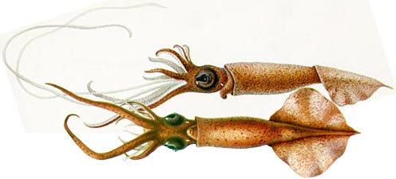
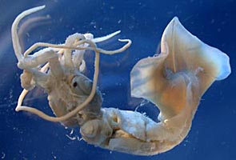

---
title: "Mastigoteuthis glaukopis"
---

## Phylogeny 

-   « Ancestral Groups  
    -   [Mastigoteuthis](Mastigoteuthis)
    -   [Chiroteuthid families](Chiroteuthid_families)
    -  [Oegopsida](../../../Oegopsida.md))
    -  [Decapodiformes](../../../../Decapodiformes.md))
    -  [Coleoidea](../../../../../Coleoidea.md))
    -  [Cephalopoda](../../../../../../Cephalopoda.md))
    -  [Mollusca](../../../../../../../Mollusca.md))
    -  [Bilateria](../../../../../../../../Bilateria.md))
    -  [Animals](../../../../../../../../../Animals.md))
    -  [Eukarya](../../../../../../../../../../Eukarya.md))
    -   [Tree of Life](../../../../../../../../../../Tree_of_Life.md)

-   ◊ Sibling Groups of  Mastigoteuthis
    -   [Mastigoteuthis tyroi](Mastigoteuthis_tyroi)
    -   [Mastigoteuthis schmidti](Mastigoteuthis_schmidti)
    -   [Mastigoteuthis pyrodes](Mastigoteuthis_pyrodes)
    -   [Mastigoteuthis         psychrophila](Mastigoteuthis_psychrophila)
    -   [Mastigoteuthis magna](Mastigoteuthis_magna)
    -   [Mastigoteuthis hjorti](Mastigoteuthis_hjorti)
    -   Mastigoteuthis glaukopis
    -   [Mastigoteuthis         grimaldii](Mastigoteuthis_grimaldii)
    -   [Mastigoteuthis flammea](Mastigoteuthis_flammea)
    -   [Mastigoteuthis famelica](Mastigoteuthis_famelica)
    -   [Mastigoteuthis dentata](Mastigoteuthis_dentata)
    -   [Mastigoteuthis danae](Mastigoteuthis_danae)
    -   [Mastigoteuthis         cordiformis](Mastigoteuthis_cordiformis)
    -   [Mastigoteuthis         atlantica](Mastigoteuthis_atlantica)
    -   [Mastigoteuthis         agassizii](Mastigoteuthis_agassizii)

-   » Sub-Groups 

# *Mastigoteuthis glaukopis* [Chun, 1908] 

[Richard E. Young and Michael Vecchione]()

Containing group:[Mastigoteuthidae](../Mastigoteuthidae.md))

## Introduction

The type description of ***M. glaukopis*** is based on a single, small
squid (37 mm ML) with one intact tentacle taken off the tropical, east
African coast.

#### Diagnosis

A mastigoteuthid \...

-   without integumental photophores but with large eyelid photophore.
-   with small club suckers.
-   with an Indian Ocean distribution.

### Characteristics

1.  Arms
    1.  Arm suckers with blunt, conical teeth around opening, with 5-7
        slightly larger teeth distally.
2.  Tentacles
    1.  Tentacle whiplike; club not wider than stalk.
    2.  Club 70% of tentacle length.
    3.  Club with indistinct undulating protective membrane.
    4.  Proximally club with very small, scatteren suckers; club then
        widens to occupy half the tentacle surface. Distally club
        extends to leave only about one third of circumference bare with
        suckers situated close together, nearly touching one another.
    5.  Club suckers become slightly larger distally except near tip.
    6.  Club suckers 0.1 mm in diameter.
    7.  Club suckers with 10-12 small teeth at approximately regular
        intervals around inner ring. These teeth are difficult to
        distinguish from conical knobs on the outer rings.
3.  Head
    1.  Eyes large (15% of ML); occupy most of head.
    2.  Olfactory organ with short stalk; located on obliquely directed
        gelatinous pad of neck.
    3.  Funnel adductors show whitish through shallow funnel groove.
4.  Funnel locking-apparatus
    1.  Funnel locking apparatus with tragus but no antitragus; however,
        \"cartilaginous groove is slightly inflated at the position of
        the antitragus, so that it gives the indication of an
        antitragus.\"
5.  Pigmentation
    1.  Vivid reddish-brown color.
    2.  Sparse chromatophores on tentacles and oral surfaces of arms.
6.  Measurements

#### Comments

Although we have examined the holotype, most of the above description,
with the exception of the photographs, is from Chun (1910) since many
features are no longer apparent on the holotype. This young
mastigoteuthid is similar to ***M. atlantica*** and ***M. famelica*** in
lacking integumental photophores but having a large photophore on each
eyelid. It differs from both species in the structure of the club
suckers (ie, small size; absence of large lateral pegs on outer ring).
Since these latter features change with size, we can find no differences
that separate ***M. glaukopis*** Chun, 1908 and it is probably synonymus
with ***M. atlantica*** Joubin, 1933 or ***M. famelica*** Berry, 1909,
but has priority over both. Until larger specimens of ***M. glaukopis***
are available from the Indian Ocean, we maintain all three species. We
suspect, however, on the basis of the distinct protective membrane on
the tentacular club in the illustrations of Chun (1910) (see above) that
***M. glaukopis*** and ***M. atlantica*** may be synonymous.

### Distribution

Type locality: Indian Ocean off east African coast at 4°63\'N, 48°37\'E.

### References

Chun, C. 1910. Die Cephalopoden. Oegopsida. Wissenschaftliche Ergebnisse
der Deutschen Tiefsee Expedition auf dem Dampfer \"Valdivia\" 1898-1899,
18(1):1-401.

## Title Illustrations

)

  ------------------------------------------------------
  Scientific Name ::  Mastigoteuthis glaukopis
  Comments          Side (top) and ventral views.
  Reference         Chun, C. 1910. Die Cephalopoden. Oegopsida. Wissenschaftliche Ergebnisse der Deutschen Tiefsee Expedition auf dem Dampfer \"Valdivia\" 1898-1899, 18(1):1-401.
  View              Dorsal and ventral
  Size              37 mm ML
  Type              Holotype
  ------------------------------------------------------
)

  ------------------------------------------------------------------------------
  Scientific Name ::     Mastigoteuthis glaukopis
  Specimen Condition   Dead Specimen
  View                 Ventral
  Size                 37 mm ML
  Type                 Holotype
  Copyright ::            © [Richard E. Young](http://www.soest.hawaii.edu/%7Eryoung/rey.html) 
  ------------------------------------------------------------------------------

## Confidential Links & Embeds: 

### #is_/same_as ::[glaukopis](glaukopis.md)) 

### #is_/same_as :: [glaukopis.public](/_public/bio/bio~Domain/Eukarya/Animals/Bilateria/Mollusca/Cephalopoda/Coleoidea/Decapodiformes/Oegopsida/Chiroteuthid/Mastigoteuthidae/glaukopis.public.md) 

### #is_/same_as :: [glaukopis.internal](/_internal/bio/bio~Domain/Eukarya/Animals/Bilateria/Mollusca/Cephalopoda/Coleoidea/Decapodiformes/Oegopsida/Chiroteuthid/Mastigoteuthidae/glaukopis.internal.md) 

### #is_/same_as :: [glaukopis.protect](/_protect/bio/bio~Domain/Eukarya/Animals/Bilateria/Mollusca/Cephalopoda/Coleoidea/Decapodiformes/Oegopsida/Chiroteuthid/Mastigoteuthidae/glaukopis.protect.md) 

### #is_/same_as :: [glaukopis.private](/_private/bio/bio~Domain/Eukarya/Animals/Bilateria/Mollusca/Cephalopoda/Coleoidea/Decapodiformes/Oegopsida/Chiroteuthid/Mastigoteuthidae/glaukopis.private.md) 

### #is_/same_as :: [glaukopis.personal](/_personal/bio/bio~Domain/Eukarya/Animals/Bilateria/Mollusca/Cephalopoda/Coleoidea/Decapodiformes/Oegopsida/Chiroteuthid/Mastigoteuthidae/glaukopis.personal.md) 

### #is_/same_as :: [glaukopis.secret](/_secret/bio/bio~Domain/Eukarya/Animals/Bilateria/Mollusca/Cephalopoda/Coleoidea/Decapodiformes/Oegopsida/Chiroteuthid/Mastigoteuthidae/glaukopis.secret.md)

