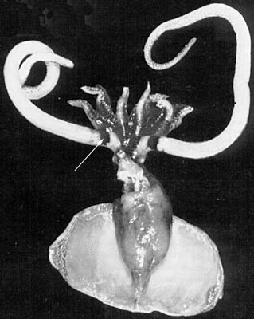
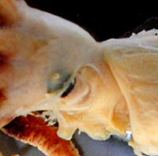

---
title: Promachoteuthis
---

## Phylogeny 

-   « Ancestral Groups  
    -   [Chiroteuthid families](Chiroteuthid_families)
    -  [Oegopsida](../../Oegopsida.md))
    -  [Decapodiformes](../../../Decapodiformes.md))
    -  [Coleoidea](../../../../Coleoidea.md))
    -  [Cephalopoda](../../../../../Cephalopoda.md))
    -  [Mollusca](../../../../../../Mollusca.md))
    -  [Bilateria](../../../../../../../Bilateria.md))
    -  [Animals](../../../../../../../../Animals.md))
    -  [Eukarya](../../../../../../../../../Eukarya.md))
    -   [Tree of Life](../../../../../../../../../Tree_of_Life.md)

-   ◊ Sibling Groups of  Chiroteuthid families
    -   [Batoteuthis skolops](Batoteuthis_skolops)
    -  [Chiroteuthidae](Chiroteuthidae.md))
    -   [Joubiniteuthis portieri](Joubiniteuthis_portieri)
    -   [Magnapinna](Magnapinna)
    -   [Mastigoteuthis](Mastigoteuthis)
    -   Promachoteuthis

-   » Sub-Groups
    -   [Promachoteuthis         megaptera](Promachoteuthis_megaptera)
    -   [Promachoteuthis sloani](Promachoteuthis_sloani)
    -   [Promachoteuthis sp. B](Promachoteuthis_sp._B)
    -   [Promachoteuthis sulcus](Promachoteuthis_sulcus)
    -   [Promachoteuthis sp. D](Promachoteuthis_sp._D)

## Promachoteuthidae [Naef, 1912] 

# *Promachoteuthis* [Hoyle, 1885] 

[Richard E. Young and Michael Vecchione](http://www.tolweb.org/)
)

The following five species are known in the family but only one has been
named.

-   *[Promachoteuthis     megaptera](Promachoteuthis_megaptera)*
    [Hoyle, 1885]
-   *[Promachoteuthis     sloani](Promachoteuthis_sloani)*[
    Young, Vecchione & Piatkowski 2006]
-   *[Promachoteuthis sp.     B](Promachoteuthis_sp._B)*
-   *[Promachoteuthis     sulcus](Promachoteuthis_sulcus)*[
    Young, Vecchione and Roper, 2007]
-   *[Promachoteuthis sp.     D](Promachoteuthis_sp._D)*

Containing group:[Chiroteuthid families](../Chiroteuthid.md))

## Introduction

The members of the Promachoteuthidae are mostly small, weakly muscled
squids that seem to occur exclusively in the great depths of the
bathypelagic zone of the world\'s oceans. Species of
***Promachoteuthis*** are known from only 12 specimens (two have not
been described in the literature - Voss, 1992) among five, mostly
geographically restricted, species. Although the data are few, the
apparent high diversity and restricted distributions are unexpected for
cephalopods inhabiting the bathypelagic region of the world\'s oceans.
Maximum size recorded is a 184 mm ML mature male (Voss, 1992) but this
specimen has not been described. A distinctive feature is the reduction
in the size of the eyes which is exteme in ***Promachoteuthis*** sp. B.
This species has the smallest eyes (relative to the squid size) of all
squids and their eyes are burried in gelatinous tissues of the head but
retain contact with sea water via slender canals. Little is known of the
biology of these rare squids.

#### Diagnosis

A member off the chiroteuthid families \...

-   with pseudocorneas covering small eyes.
-   without ink sac and anal flaps.

### Characteristics

1.  Arms
    1.  Arms with suckers in two to three series; may have more near arm
        tips; varies among species.\
        \
2.  Tentacles
    1.  Stalks thick; usually much wider than arm III width (tentacle
        width less than arm width in **P**. sp. D).
    2.  Club with suckers in numerous irregular series.\
        \
3.  Head
    1.  Head often fused to mantle in nuchal region.

    2.  Eyes small to very small.

    3.  Eyes with reduced eye openings; each eye with a translucent
        \"pseudocornea\" over the eye lens.

       ){height="198" width="200"}

        **Figure**. Side view of head and anterior mantle of ***P***.
        sp. C, holotype, preserved. Note the head-mantle fusion, small
        eye, pseudocornea and small eye opening (looks like a small
        nipple in the photograph). Skin is torn just posterior to the
        pseudocornea. Photograph by R. Young.
4.  Funnel
    1.  Funnel locking apparatus with oval depression.\
        \
5.  Fins
    1.  Fins large, usually with posterior lobes (posterior lobes may be
        absent in ***P. megaptera***).\
        \
6.  Viscera
    1.  Anal flaps absent.
    2.  Ink sac absent.\
        \
7.  Photophores
    1.  Absent.\
        \
8.  Gladius
    1.  Reduced and variable among species.

#### Comments

The variable appearance of the gladius among species is presumably due
to the reduction in size (usually it is well less than the mantle
length) and function. Most species can quickly be recognized as a member
of this family by the very thick tentacles and small eyes.

### Nomenclature

[A list of all nominal genera and species in the Promachoteuthidae can be found here](http://www.tolweb.org/accessory/Promachoteuthidae_Taxa?acc_id=2332).
The list includes the current status and type species of all genera, and
the current status, type repository and type locality of all species and
all pertinent references.

### References

Okutani, T. 1983. Rare and interesting squid from Japan. VIII.
Rediscovery of *Promachoteuthis megaptera* Hoyle, 1885 (Oegopsida:
Promachoteuthidae). Venus 42: 241-247.

Roper, C. F. E. and R. E. Young. 1968. The family Promachoteuthidae
(Cephalopoda: Oegopsida). I. A re-evaluation of its systematic position
based on new material from Antarctic and adjacent waters. Ant. Res. Ser.
11: 203-214.

Salcedo-Vargas, M. A. and J. Guerrero-Kommritz. 2000. Three new
cephalopods from the Atlantic Ocean. Mitt. Hamb. Zool. Mus. Inst., 97:
31-44.

Toll, R. B. 1998. The gladius in teuthoid systematics. Smithson. Contr.
Zool., No. 586: 55-68.

Voss N. A. 1992. Family Promachoteuthidae. Smithson. Contr. Zool., 513:
183-185.

## Title Illustrations

)

  --------------------------------------------------------------
  Scientific Name ::   Promachoteuthis megaptera
  Comments           Arrow points to the unusual pigment band at the base of the tentacle.
  Reference          Okutani, T. 1983. Rare and interesting squid from Japan. VIII. Rediscovery of Promachoteuthis megaptera Hoyle, 1885 (Oegopsida: Promachoteuthidae). Venus 42:241-247. with permission.
  Sex ::              Female
  Life Cycle Stage ::   Immature
  Size               52 mm ML
  --------------------------------------------------------------

## Confidential Links & Embeds: 

### #is_/same_as ::[Promachoteuthidae](Promachoteuthidae.md)) 

### #is_/same_as :: [Promachoteuthidae.public](/_public/bio/bio~Domain/Eukarya/Animals/Bilateria/Mollusca/Cephalopoda/Coleoidea/Decapodiformes/Oegopsida/Chiroteuthid/Promachoteuthidae.public.md) 

### #is_/same_as :: [Promachoteuthidae.internal](/_internal/bio/bio~Domain/Eukarya/Animals/Bilateria/Mollusca/Cephalopoda/Coleoidea/Decapodiformes/Oegopsida/Chiroteuthid/Promachoteuthidae.internal.md) 

### #is_/same_as :: [Promachoteuthidae.protect](/_protect/bio/bio~Domain/Eukarya/Animals/Bilateria/Mollusca/Cephalopoda/Coleoidea/Decapodiformes/Oegopsida/Chiroteuthid/Promachoteuthidae.protect.md) 

### #is_/same_as :: [Promachoteuthidae.private](/_private/bio/bio~Domain/Eukarya/Animals/Bilateria/Mollusca/Cephalopoda/Coleoidea/Decapodiformes/Oegopsida/Chiroteuthid/Promachoteuthidae.private.md) 

### #is_/same_as :: [Promachoteuthidae.personal](/_personal/bio/bio~Domain/Eukarya/Animals/Bilateria/Mollusca/Cephalopoda/Coleoidea/Decapodiformes/Oegopsida/Chiroteuthid/Promachoteuthidae.personal.md) 

### #is_/same_as :: [Promachoteuthidae.secret](/_secret/bio/bio~Domain/Eukarya/Animals/Bilateria/Mollusca/Cephalopoda/Coleoidea/Decapodiformes/Oegopsida/Chiroteuthid/Promachoteuthidae.secret.md)

