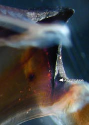
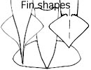
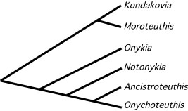

---
title: Onychoteuthidae
---

## Phylogeny 

-   « Ancestral Groups  
    -  [Oegopsida](../Oegopsida.md))
    -  [Decapodiformes](../../Decapodiformes.md))
    -  [Coleoidea](../../../Coleoidea.md))
    -  [Cephalopoda](../../../../Cephalopoda.md))
    -  [Mollusca](../../../../../Mollusca.md))
    -  [Bilateria](../../../../../../Bilateria.md))
    -  [Animals](../../../../../../../Animals.md))
    -  [Eukarya](../../../../../../../../Eukarya.md))
    -   [Tree of Life](../../../../../../../../Tree_of_Life.md)

-   ◊ Sibling Groups of  Oegopsida
    -   [Architeuthis](Architeuthis)
    -  [Brachioteuthidae](Brachioteuthidae.md))
    -   [Chiroteuthid families](Chiroteuthid_families)
    -  [Cranchiidae](Cranchiidae.md))
    -  [Cycloteuthidae](Cycloteuthidae.md))
    -   [Enoploteuthid families](Enoploteuthid_families)
    -   [Histioteuthid families](Histioteuthid_families)
    -  [Gonatidae](Gonatidae.md))
    -   [Lepidoteuthid families](Lepidoteuthid_families)
    -  [Neoteuthidae](Neoteuthidae.md))
    -  [Ommastrephidae](Ommastrephidae.md))
    -   Onychoteuthidae
    -   [Thysanoteuthis rhombus](Thysanoteuthis_rhombus)

-   » Sub-Groups
    -   [Ancistroteuthis         lichtensteini](Ancistroteuthis_lichtensteini)
    -   [Kondakovia longimana](Kondakovia_longimana)
    -   [Notonykia africanae](Notonykia_africanae)
    -   [Onychoteuthis](Onychoteuthis)
    -   [Onykia](Onykia)
    -   [Walvisteuthis rancureli](Walvisteuthis_rancureli)

# Onychoteuthidae [Gray, 1849]

## Hooksquids 

[Michael Vecchione, Richard E. Young, and Kotaro Tsuchiya]()
))

The following six genera with about 14 species are presently recognized
in the family but the systematics within the family is unstable.

Containing group:[Oegopsida](../Oegopsida.md))

## Introduction

Onychoteuthids are small (ca. 7 cm ML) to large (ca. 150 cm ML),
muscular squids that have two series of smooth-ringed suckers on the
arms and two series of hooks on the tentacular clubs (rarely marginal
suckers as well). Some species are common open ocean squids (e.g.,
***Onychoteuthis*** spp.); others live near the ocean floor along
continental or island slopes (bathyal region) (e.g., ***Onykia*** spp.).

#### Diagnosis

An oegopsid \...

-   with buccal connectives attaching to ventral borders of arms IV.
-   with hooks on tentacular clubs.
-   with rostrum on conus of gladius.

### Characteristics

1.  Arms
    1.  Arm suckers biserial with smooth rings except in mature males of
        ***Walvisteuthis***.
    2.  Hectocotylization absent in ***Onykia*** and
        ***Onychoteuthis***; unusual sexual dimorphism exists in
        ***Walvisteuthis***; mature males of other genera not known.\
2.  Tentacles
    1.  Tentacular club with two medial series of hooks; ventromedial
        series with larger hooks.
    2.  Marginal club suckers absent in subadults of most genera.
    3.  Club suckers generally limited to carpal locking-apparatus and
        terminal pad in subadults.
    4.  Carpal locking apparatus with circular to oval shape that is
        usually defined by a ridge or elevation.

   )
    **Figure**. Anterior-oblique views of the lower beak. Arrows point
    to the step of both beaks. **Left** - ***Notonykia africanae***, 100
    mm ML, paratype. Modified from Nesis, et al., 1998. **Right** -
    ***Walvisteuthis virilis***, mature male, NMNH specimen. The step
    (\"angle ridge\") lies just beyond the jaw angle where the rostral
    edge continues medially onto the lateral wall. That is, where the
    rostral edge merges into the lateral wall, the two are not flush
    along the medial beak surface. A well defined step is a
    characteristic feature of the lower beak of all members of the
    Onychoteuthidae. Such a step is seen outside the family only in
    ***Pholidoteuthis boschmai*** and to a lesser extent in some
    ***Enoploteuthis*** (Clarke, personal communication). Photograph
    by R. Young.

Funnel

1.  Funnel locking-apparatus with straight groove.

Photophores

1.  Photophores present only in ***Onychoteuthis*** and
    ***Ancistroteuthis***.

Gladius

1.  Gladius with primary conus.
2.  Gladius with rostrum, usually prominent.

#### comments

The following table compares the major features that separate the
genera.

  ------------------- ------------------
  Genus                   Many occipital folds   Visceral photophores   Gladius rostrum    Warts or wrinkles in skin   Club: marginal suckers   Fin shape
  ***Ancistroteuthis***   **Yes**                No                     Thin, pointed      No                          No                       Sagittate
  ***Kondakovia***        No                     No                     Thick, pointed     No                          **Yes**                  Rhomboidal
  ***Notonykia***         **Yes**                No                     Thin, pointed      No                          No                       Rhomboidal
  ***Onychoteuthis***     **Yes**                **Yes**                Thin, pointed^1^   No                          No/few                   Rhomboidal/sagittate
  ***Onykia***            No                     No                     Thick, pointed     **Yes**^2^                  No                       Rhomboidal/sagittate
  ***Walvisteuthis***     No                     No                     Thin, rounded      No                          Few                      Oval
  ------------------- ------------------

^1^ - Somewhat rounded in ***O. meridiopacifica***.\
^2^ - Except in ***O. knipovitchi***.

The following drawings illustrate the characters used in the table
above.
)

**Top row**:

-   **Occipital folds** - Side view of the head of ***Onychoteuthis***
    sp. Drawing modified from Pfeffer, 1912.
-   **Visceral photophores** - Ventral view, ***Onychoteuthis*** sp.,
    off Florida. Drawing from Young, 1972.
-   **Rostrum of gladius** - Ventral and side views, ***Onykia
    ingens***. Drawing modified from Pfeffer, 1912.

**Bottom row**:

-   **Warts** - Skin of ***Onykia ingens***. Drawing modified from
    Pfeffer, 1912.
-   **Marginal suckers** - Oral view of tentacle club of ***Kondakovia
    longimana***. drawing from Filippova, 1972
-   **Fin shapes**: Left - ***Onykia robsoni***, sagittate fins. Drawing
    modified from Kubodera et al. (1998). Middle - ***Walvisteuthis
    rancureli***, Oval fins. Drawing modified from Kubodera et
    al., 1998. Right - ***Kondakovia longimana***, rhomboidal fins.
    Drawing modified from Filappova, 1972.
### Nomenclature

[A list of all nominal genera and species in the Onychoteuthdae can be found here.](http://www.tolweb.org/accessory/Taxa_Associated_with_the_Family_Onychoteuthidae?acc_id=1358)
The list includes the current status and type species of all genera, and
the the current status, type repository and type locality of all species
and all pertinent references.

### Discussion of Phylogenetic Relationships

Bonnaud *et al*. (1998) conducted the only phylogenetic study of the
family to date that included cladistic methodology. Their study, based
on morphometrics and on molecular analyses of the 16S mitchondrial gene,
must be considered preliminary because of the sparse material obtained
for the study. Their morphometric analysis did not include many
non-meristic characters, such as presence or absence of photophores,
traditionally used in onychoteuthid systematics. Their molecular results
support monophyly of the family but indicate that the genus ***Onykia***
(their ***Moroteuthis***) may not be monophyletic (the outlier was ***O.
knipovitchi***) which was more distantly related to a monophyletic group
of ***O. robusta***, ***O. robsoni*** and ***O. ingens*** than was
***Walvisteuthis rancureli*** (their ***Onykia*** sp.). However, their
bootstrap values were low. As can be seen in the following pages,
several morphological features (e.g., smooth skin, long, asymmetrical
ventral club hooks) indicate that ***O. knipovitchi*** is an atypical
member of the genus.
)

**Figure**. Phylogenetic tree of the Onychoteuthidae from Nesis (2000).

Nesis (2000) using a more traditional approach based on morphology and
ecology suggested relationships among genera (figure above).
***Walvisteuthis*** was not recognized as a member of the family at the
time and Nesis did not accept the synonomy of ***Onykia*** and
***Moroteuthis***. Nesis used the presence or absence of ammonium
chloride (a bouyancy device) to separate the two major lineages (present
in ***Kondakovia*** and \"***Moroteuthis***\").

### Distribution

The family is absent from the Arctic Ocean but, otherwise, is found
throughout the world\'s oceans (Nesis 1982/87).

### References

Arkhipkin, A. I. and Ch. M. Nigmatullin. 1997. Ecology of the oceanic
squid *Onychoteuthis banksi* and the relationship between the genera
*Onychoteuthis* and *Chaunoteuthis* (Cephalopoda: Onychoteuthidae. J.
Mar. Biol. Ass. U. K. 77:839-869.

Bonnaud, L., P. G. Rodhouse and R. Boucher-Rodoni. 1998. A phylogenetic
study of the squid family Onychoteuthidae (Cephalopoda: Oegopsida).
Proc. R. Soc. Lond. B 265:1761-1770.

Kubodera, T., U. Piakowski, T. Okutani and M. R. Clarke. 1998. Taxonomy
and zoogeography of the family Onychoteuthidae. Smithson. Contr. to
Zool., No. 586 (vol. II):277-291.

Nesis, K. N. 1982/87. Abridged key to the cephalopod mollusks of the
world\'s ocean. 385+ii pp. Light and Food Industry Publishing House,
Moscow. (In Russian.). Translated into English by B. S. Levitov, ed. by
L. A. Burgess (1987), Cephalopods of the world. T. F. H. Publications,
Neptune City, NJ, 351pp.

Nesis, K.N. 2000. Squids of the family Onychoteuthidae: Phylogeny,
biogeography, and way of life.

Nesis, K. N. and I. V. Nikitina. 1986. A new family of deepsea squids
(Cephalopoda, Oegopsida) from the Southeastern Atlantic. Zool. Zhurn.
65: 47-54.

Nesis, K. N. and I. V. Nikitina 1992. New records of oceanic squids
Walvisteuthis virilis Nesis et Nikitina, 1986 and Nototeuthis
dimegacotyle Nesis et Nikitina, 1986 (Cephalopoda, Oegopsida) from the
South Atlantic and the South Pacific. Ruthenica 2: 55-58.

Nesis, K. N., M. A. C. Roeleveld and I. V. Nikitina. 1998. A new genus
and species of onychoteuthid squid from the Southern Ocean. Ruthenica
8:153-168.

Tsuchiya, K. and T. Okutani. 1991. Growth stages of *Moroteuthis
robusta* (Verrill, 1881). Bull. Mar. Sci. 49:137-147.

## Title Illustrations

)

  -------------------------------------------------------------------------------
  Scientific Name ::  Onychoteuthis
  Location ::        off Hawaii
  View              side view
  Copyright ::         © 1996 [Richard E. Young](http://www.soest.hawaii.edu/%7Eryoung/rey.html) 
  -------------------------------------------------------------------------------
)

  ------------
  Scientific Name ::  Onychoteuthis
  Reference         Drawing from Pfeffer, 1912.
  View              dorsal view
  ------------

## Confidential Links & Embeds: 

### #is_/same_as ::[Onychoteuthidae](Onychoteuthidae.md)) 

### #is_/same_as :: [Onychoteuthidae.public](/_public/bio/bio~Domain/Eukarya/Animals/Bilateria/Mollusca/Cephalopoda/Coleoidea/Decapodiformes/Oegopsida/Onychoteuthidae.public.md) 

### #is_/same_as :: [Onychoteuthidae.internal](/_internal/bio/bio~Domain/Eukarya/Animals/Bilateria/Mollusca/Cephalopoda/Coleoidea/Decapodiformes/Oegopsida/Onychoteuthidae.internal.md) 

### #is_/same_as :: [Onychoteuthidae.protect](/_protect/bio/bio~Domain/Eukarya/Animals/Bilateria/Mollusca/Cephalopoda/Coleoidea/Decapodiformes/Oegopsida/Onychoteuthidae.protect.md) 

### #is_/same_as :: [Onychoteuthidae.private](/_private/bio/bio~Domain/Eukarya/Animals/Bilateria/Mollusca/Cephalopoda/Coleoidea/Decapodiformes/Oegopsida/Onychoteuthidae.private.md) 

### #is_/same_as :: [Onychoteuthidae.personal](/_personal/bio/bio~Domain/Eukarya/Animals/Bilateria/Mollusca/Cephalopoda/Coleoidea/Decapodiformes/Oegopsida/Onychoteuthidae.personal.md) 

### #is_/same_as :: [Onychoteuthidae.secret](/_secret/bio/bio~Domain/Eukarya/Animals/Bilateria/Mollusca/Cephalopoda/Coleoidea/Decapodiformes/Oegopsida/Onychoteuthidae.secret.md)

