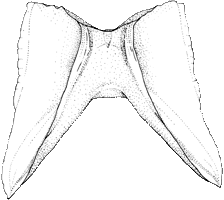

---
title: Cirroteuthidae
---

## Phylogeny 

-   « Ancestral Groups  
    -   [Cirrata](../Cirrata.md)
    -   [Octopod](../../Octopod.md)
    -  [Octopodiformes](../../../Octopodiformes.md))
    -  [Coleoidea](../../../../Coleoidea.md))
    -  [Cephalopoda](../../../../../Cephalopoda.md))
    -  [Mollusca](../../../../../../Mollusca.md))
    -  [Bilateria](../../../../../../../Bilateria.md))
    -  [Animals](../../../../../../../../Animals.md))
    -  [Eukarya](../../../../../../../../../Eukarya.md))
    -   [Tree of Life](../../../../../../../../../Tree_of_Life.md)

-   ◊ Sibling Groups of  Cirrata
    -   [Opisthoteuthidae](Opisthoteuthidae.md)
    -   Cirroteuthidae
    -   [Stauroteuthis](Stauroteuthis)

-   » Sub-Groups
    -   [Cirroteuthis muelleri](Cirroteuthis_muelleri)
    -   [Cirrothauma](Cirroteuthidae/Cirrothauma.md)

# Cirroteuthidae [Keferstein 1866] 

[Michael Vecchione, Richard E. Young, and Katharina M. Mangold (1922-2003)](http://www.tolweb.org/)

This family contains the following two genera:

Containing group: [Cirrata](../Cirrata.md)

## Introduction

Species in the family are entirely pelagic and have a very fragile,
gelatinous structure and eyes that vary from large to small to
degenerate. They are usually found in association with the ocean floor
(benthopelagic) at great depths. Some have, however, been caught far
above the bottom and one specimen was dip-netted through an ice hole in
the Arctic.

#### Diagnosis

A cirrate \...

-   with long cirri and secondary webs.
-   with saddle-shaped shell.
-   with anterior mantle attached dorsally to head. 

### Characteristics

1.  Shape and consistency
    1.  Anterior-posteriorly elongation pronounced.
2.  Web
    1.  Primary and secondary webs present.

    2.  Web nodules present or absent.

        {width="785"}

        **Figure**. Ventral and aboral views of ***Cirroteuthis
        muelleri*** taken by an ROV in the Canadian Basin of the Arctic
        Ocean. The short, slender arm tips extend beyond the web. The
        web nodules are seen where the web intersects the arm from the
        ventral side. Frame grabs from a video taken during a NOAA/OE
        Census of Marine Life cruise; provided by Kevin Raskoff.
3.  Cirri
    1.  Very long: Longest more than 8 times largest sucker diameter.
4.  Suckers
    1.  Central portion of each arm with small, flattened suckers,
        nearly lacking acetabulum (i.e., aperatures may be virtually
        absent), on stalks that are either slender or swollen and
        fluid-filled.
5.  Gills
    1.  Sepioid
6.  Digestive system
    1.  Digestive tract arranged in simple U-shape; intestine short,
        without lateral bends
    2.  Posterior salivary glands present on buccal mass.
    3.  Radula present or absent.
    4.  Digestive gland unilobular.
7.  Reproductive system.
    1.  Male accessory gland complex compacted into a single mass.
8.  Optic lobe
    1.  Spherical.
    2.  Single optic nerve bundle penetrates white body.
9.  Shell
    1.  Saddle-shaped: Broad saddle with two lobe-like, deeply escavated
        flared wings, pronounced shoulders.

        
        **Left, middle** - Ventral and dorsal views of the shell of
        ***Cirroteuthis muelleri.*** Drawings from Voss and Pearcy
        (1990). **Right** - Dorsal view of the shell of ***Cirrothauma
        murrayi***. Drawing from Aldred et al. (1983).

### References

Aldred, R. G., M. Nixon and J. Z. Young. 1983. *Cirrothauma murrayi*
Chun, a finned octopod. Phil. Trans. Roy. Soc. Lond. 301: 1-54.

Voss, G. L. and W. G. Pearcy. 1990. Deep-water octopods (Mollusca:
Cephalopoda) of the Northeastern Pacific. Proc. Calif. Acad. Sci., 47:
47-94.

## Title Illustrations

)

  -----------------------
  Scientific Name ::     Cirroteuthis magna
  Location ::           off Hawaii
  Specimen Condition   Live Specimen
  Copyright ::            © 1996 Alex Malahoff, Hawaii Undersea Research Laboratory
  -----------------------

## Confidential Links & Embeds: 

### #is_/same_as ::[Cirroteuthidae](Cirroteuthidae.md)) 

### #is_/same_as :: [Cirroteuthidae.public](/_public/bio/bio~Domain/Eukarya/Animals/Bilateria/Mollusca/Cephalopoda/Coleoidea/Octopodiformes/Octopod/Cirrata/Cirroteuthidae.public.md) 

### #is_/same_as :: [Cirroteuthidae.internal](/_internal/bio/bio~Domain/Eukarya/Animals/Bilateria/Mollusca/Cephalopoda/Coleoidea/Octopodiformes/Octopod/Cirrata/Cirroteuthidae.internal.md) 

### #is_/same_as :: [Cirroteuthidae.protect](/_protect/bio/bio~Domain/Eukarya/Animals/Bilateria/Mollusca/Cephalopoda/Coleoidea/Octopodiformes/Octopod/Cirrata/Cirroteuthidae.protect.md) 

### #is_/same_as :: [Cirroteuthidae.private](/_private/bio/bio~Domain/Eukarya/Animals/Bilateria/Mollusca/Cephalopoda/Coleoidea/Octopodiformes/Octopod/Cirrata/Cirroteuthidae.private.md) 

### #is_/same_as :: [Cirroteuthidae.personal](/_personal/bio/bio~Domain/Eukarya/Animals/Bilateria/Mollusca/Cephalopoda/Coleoidea/Octopodiformes/Octopod/Cirrata/Cirroteuthidae.personal.md) 

### #is_/same_as :: [Cirroteuthidae.secret](/_secret/bio/bio~Domain/Eukarya/Animals/Bilateria/Mollusca/Cephalopoda/Coleoidea/Octopodiformes/Octopod/Cirrata/Cirroteuthidae.secret.md)

