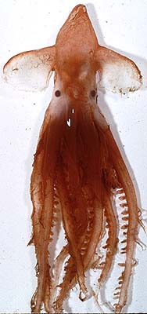

---
title: Cirrothauma
---

## Phylogeny 

-   « Ancestral Groups  
    -   [Cirroteuthidae](../Cirroteuthidae.md)
    -   [Cirrata](../../Cirrata.md)
    -   [Octopod](../../../Octopod.md)
    -  [Octopodiformes](../../../../Octopodiformes.md))
    -  [Coleoidea](../../../../../Coleoidea.md))
    -  [Cephalopoda](../../../../../../Cephalopoda.md))
    -  [Mollusca](../../../../../../../Mollusca.md))
    -  [Bilateria](../../../../../../../../Bilateria.md))
    -  [Animals](../../../../../../../../../Animals.md))
    -  [Eukarya](../../../../../../../../../../Eukarya.md))
    -   [Tree of Life](../../../../../../../../../../Tree_of_Life.md)

-   ◊ Sibling Groups of  Cirroteuthidae
    -   [Cirroteuthis muelleri](Cirroteuthis_muelleri)
    -   Cirrothauma

-   » Sub-Groups
    -   [Cirrothauma magna](Cirrothauma_magna)
    -   [Cirrothauma murrayi](Cirrothauma_murrayi)

# *Cirrothauma* [Chun 1911] 

[Richard E. Young and Michael Vecchione](http://www.tolweb.org/)

The genus presently contains two species.

Containing group: [Cirroteuthidae](../Cirroteuthidae.md)

## Introduction

Traditionally only a single species, ***C. murrayi***, was placed in
this genus. O\'shea (1999) placed ***Cirroteuthis magna*** in this genus
on the basis of the similarity of the shells in the two species. These
are fragile, gelatinous deep-sea cirrates.

#### Diagnosis 

A cirroteuthid \...

-   with shell having moderate saddle and triangular wings.
-   with normal eyes or reduced eyes lacking lenses.\

### Characteristics

1.  Eyes
    1.  Eyes well developed, lenses present (***C. magna***) or poorly
        developed, without lenses (***C. murrayi***).
2.  Arms
    1.  Web nodules absent.
    2.  Suckers extend to arm tips.
    3.  Cirri may extend to arm tip (***C. murrayi***) or terminate at
        web margin (***C. magna***).
3.  Shell
    1.  Shell saddle-shaped but with a saddle of moderate length.

    2.  Anterior-posterior length of wings more than 2.5 times length of
        saddle in this direction.

    3.  Wings triangular in lateral view (below).\

        

        **Figure**. **Left** - ***C. murrayi*** shell, dorsal view,
        male, 155 mm ML, North Atlantic at 44°N 13°W. Drawing modified
        from Aldred *et al.*, 1983. **Middle** - ***C. murrayi*** shell,
        dorsal view, USNMNH, locality, size. Photograph by R.E. Young.
        **Right** - ***C. magna*** shell, lateral view, female, 140
        mm ML. Drawing from Guerra et al., 1998, printed with the
        Permission of the Bulletin of Marine Science.

### References

Aldred, R. G., M. Nixon and J. Z. Young. 1983. *Cirrothauma murrayi*
Chun, a finned octopod. Phil. Trans. Roy. Soc. Lond. 301: 1-54.

Guerra, R., R. Villanueva, K. N. Nesis and J. Bedoya. 1998.
Redescription of the deep-sea cirrate octopod Cirroteuthis magna Hoyle,
1885, and considerations on the genus Cirroteuthis (Mollusca:
Cephalopoda). Bull. Mar. Sci., 63: 51-81.

Voss, G. L. and W. G. Pearcy. 1990. Deep-water octopods (Mollusca:
Cephalopoda) of the Northeastern Pacific. Proc. Calif. Acad. Sci. 47:
47-94.

## Title Illustrations



  ---------
  Scientific Name ::  Cirrothauma murrayi
  Location ::        Antarctic waters
  Creator           E. McSweeny
  Copyright ::         © 1996 E. McSweeny
  ---------
)

  -------------------------------------------------------------------------------
  Scientific Name ::   Cirrothauma magna
  Reference          Guerra, R., R. Villanueva, K. N. Nesis and J. Bedoya. 1998. Redescription of the deep-sea cirrate octopod Cirroteuthis magna Hoyle, 1885, and considerations on the genus Cirroteuthis (Mollusca: Cephalopoda). Bull. Mar. Sci., 63: 51-81.
  Acknowledgements   Printed with permission from the Bulletin of Marine Science.
  Sex ::              Male
  Size               220 mm ML
  Copyright ::          © 1998 Bulletin of Marine Science
  -------------------------------------------------------------------------------

## Confidential Links & Embeds: 

### #is_/same_as ::[Cirrothauma](Cirrothauma.md)) 

### #is_/same_as :: [Cirrothauma.public](/_public/bio/bio~Domain/Eukarya/Animals/Bilateria/Mollusca/Cephalopoda/Coleoidea/Octopodiformes/Octopod/Cirrata/Cirroteuthidae/Cirrothauma.public.md) 

### #is_/same_as :: [Cirrothauma.internal](/_internal/bio/bio~Domain/Eukarya/Animals/Bilateria/Mollusca/Cephalopoda/Coleoidea/Octopodiformes/Octopod/Cirrata/Cirroteuthidae/Cirrothauma.internal.md) 

### #is_/same_as :: [Cirrothauma.protect](/_protect/bio/bio~Domain/Eukarya/Animals/Bilateria/Mollusca/Cephalopoda/Coleoidea/Octopodiformes/Octopod/Cirrata/Cirroteuthidae/Cirrothauma.protect.md) 

### #is_/same_as :: [Cirrothauma.private](/_private/bio/bio~Domain/Eukarya/Animals/Bilateria/Mollusca/Cephalopoda/Coleoidea/Octopodiformes/Octopod/Cirrata/Cirroteuthidae/Cirrothauma.private.md) 

### #is_/same_as :: [Cirrothauma.personal](/_personal/bio/bio~Domain/Eukarya/Animals/Bilateria/Mollusca/Cephalopoda/Coleoidea/Octopodiformes/Octopod/Cirrata/Cirroteuthidae/Cirrothauma.personal.md) 

### #is_/same_as :: [Cirrothauma.secret](/_secret/bio/bio~Domain/Eukarya/Animals/Bilateria/Mollusca/Cephalopoda/Coleoidea/Octopodiformes/Octopod/Cirrata/Cirroteuthidae/Cirrothauma.secret.md)

