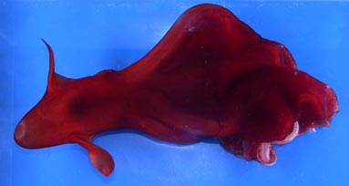
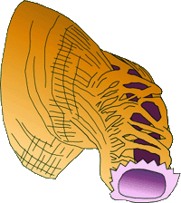
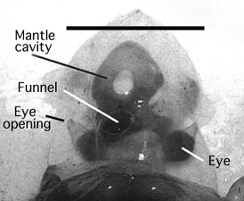
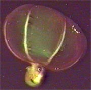
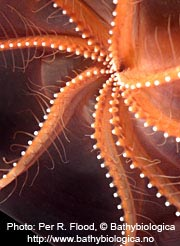

---
title: Stauroteuthis
---

## Phylogeny 

-   « Ancestral Groups  
    -   [Cirrata](../Cirrata.md)
    -   [Octopod](../../Octopod.md)
    -  [Octopodiformes](../../../Octopodiformes.md))
    -  [Coleoidea](../../../../Coleoidea.md))
    -  [Cephalopoda](../../../../../Cephalopoda.md))
    -  [Mollusca](../../../../../../Mollusca.md))
    -  [Bilateria](../../../../../../../Bilateria.md))
    -  [Animals](../../../../../../../../Animals.md))
    -  [Eukarya](../../../../../../../../../Eukarya.md))
    -   [Tree of Life](../../../../../../../../../Tree_of_Life.md)

-   ◊ Sibling Groups of  Cirrata
    -   [Opisthoteuthidae](Opisthoteuthidae.md)
    -   [Cirroteuthidae](Cirroteuthidae.md)
    -   Stauroteuthis

-   » Sub-Groups
    -   [Stauroteuthis         gilchristi](Stauroteuthis_gilchristi)
    -   [Stauroteuthis syrtensis](Stauroteuthis_syrtensis)

# Stauroteuthidae 

*Stauroteuthis* [Verrill, 1879] 

A single genus and two species are currently recognized in the family.
However similar octopods from outside the Atlantic Ocean have not been critically examined.

## #has_/text_of_/abstract 

> Stauroteuthis is a genus of deepwater cirrate octopus, a cephalopod mollusk. 
> This is the only genus in the family **Stauroteuthidae**, and only three species have been described in this genus.
>
> The organisms live below 700 m (2,300 ft) water depth; 
> although sometimes found as deep as 4 km (2.5 mi) underwater, 
> they generally live at a water depth of around 2 km (1.2 mi).  They do not possess a radula.
>
> The stauroteuthids have the distinction of being one of the few bioluminescent octopuses; 
> some of the muscle cells that control the suckers in most species 
> have been replaced with photophores which are believed to fool prey by directing them towards the mouth.
>
> [Wikipedia](https://en.wikipedia.org/wiki/Stauroteuthis)

## Introduction

[Martin Collins, Richard E. Young, and Michael Vecchione]() 

Stauroteuthids are peculiar, gelatinous cirrates with a mantle opening
that forms a complete tube around the funnel. They also have peculiar
gills and internal shells and a large web that is nearly equally
developed between all arms. When observed from submersibles, this
octopod commonly has its arms and web formed into a bell-shape
(bell-shape posture). Sometimes when the octopod is disturbed, it will
inflate the web and draw the arms together at their tips to form a
\"balloon\" with the arms and web (balloon posture). These postures are
thought to be involved in feeding and/or defense (Vecchione and Young,
1997).

#### Diagnosis

A cirrate with \...

-   long cirri and secondary webs.
-   U-shaped shell.
-   tubular anterior mantle.

### Characteristics

External morphology

1.  Shape
    1.  Anterior-posterior elongation of body pronounced.
2.  Mantle
    1.  Anterior mantle opening modified into a complete cyclinder
        formed by muscular mantle.(See \"Comments\" below.)
3.  Web
    1.  [Primary and secondary webs         present.](http://www.tolweb.org/notes/?note_id=1696)
    2.  Nodules absent.
4.  Cirri
    1.  Begin between suckers 2-6.
    2.  Length: Longest more than twice arm diameter.
    3.  Absent from arm tips. Cirri end before sucker 18-24.
5.  Suckers
    1.  Small, cylindrical.
    2.  Suckers enlarged in male ***S. syrtensis***.

Mantle cavity

Mantle septum

1.  Thick, open posteriorly.

Olfactory organ

1.  Lies well inside of mantle cavity from free mantle margin. (See
    \"Comments\" below.)

Gills

Gills have a diagnostic form. The secondary and tertiary lamellae are
highly branching; the primary lamellae are difficult to recognize and
don\'t form a symmetrical series along the gill; a large afferent vessel
does not dominate the \"top\" of the gill.

**Figure**. Views of ***S. syrtensis***. **Left** - ventral view.
**Right** - dorsal view. These two photographs show the color variation
observed in two different fresh/living octopods of approximately the
same size. The significance of this variation is unknown. Photographs by
R. Young.

#### Comments

One of the most unusual features of the family is the cyclindrical,
muscular mantle opening. ***Stauroteuthis*** spp. are the only cirrates
in which the free edges of the mantle fuse dorsally to form a tube. The
two photos taken at the right in a aquarium show the tubular opening in
one stage of contraction. The opening appears like an elevated ring
around the base of the slender, protruding funnel. Judging from
preserved octopods (see drawing below), this ring can be greatly
extended. In other octopods, the mantle attaches anteriorly, on either
side, to the cephalic cartilage; as a result the dorsal wall of the
mantle cavity, in this region, consists of the head.

**Figure**. Twisting dorsolateral view of the anterior mantle of ***S.
syrtensis*** showing the intertwining muscles that form the dorsal wall
of the mantle at its anterior end. In this preserved octopod, the
anterior mantle was contracted into a tube that, at first, appeared to
be the funnel. The true funnel was withdrawn inside of the mantle
cavity. The mantle opening, in this drawing, is colored purple and is at
the lower right of the drawing. The skin has been removed showing the
mantle muscles. Beneath the dorsal mantle muscles, the dark violet
lining of the mantle cavity is seen.

In a fresh, translucent ***Stauroteuthis*** (below), the pigmented
mantle cavity has the shape of a bow tie due to the large, central
unpigmented region occupied by the thick mantle septum and the pigmented
extensions of the mantle cavity anterolaterally leading to the dorsal
mantle cavity.

**Figure**. Mantle cavity of ***S. gilchristi***, photograph modified
from Collins and Henriques, 2000. Scale bar = 100 mm.

### Comparisons Between Species

The two species are separated geographically (see below) but are very
similar morphologically. Separation relies primarily on the differences
in size and position of the suckers as seen in the following table:

  ------- ------- ------
                 ***S.           ***S.           ***S.            ***S.
                 syrtensis***\   syrtensis***\   gilchristi***\   gilchristi***\
                 Males           Females         Males            Females

  Max. sucker    2.2-6           1.2-2.2         5.7-9.0          3.9-4.8
  diam., mm                                                       

  Position of    12-16           1-3             9-14             9-14
  largest                                                         
  suckers                                                         

  Sucker index   0.06-0.10       0.02-0.05       0.09-0.13        0.09-0.12
  (rel. to head                                                   
  W.)                                                             
  ------- ------- ------

### Nomenclature

***Chunioteuthis*** Grimpe, 1916 is placed as a junior synonym of
***Stauroteuthis*** by Collins and Henriques (2000).

### Behavior

Submersible observations have been made on ***S. syrtensis*** and we
assume that they apply to both species. ***S. syrtensis*** is commonly
seen, when first approached, with the web inflated into a bell-shape
(below left) with the arms separated from the primary web by the
secondary web. A ballooning posture is occasionally seen (below right),
usually following disturbance, in which the web is extremely inflated
and closed at the arm tips.

**Figure**. Lateral views of ***S. syrtensis***. Left - Bell posture.
Right - balloon posture. Submersible photographs.

Locomotion is via movement of the fins or the expulsion of water from
the web. The latter method, however, is weak perhaps because of the loss
of the strong connection of the web to the arms due to the presence of
the secondary web. Small copepods have been found in the stomachs. This
and the presence of large secretory lip glands suggest that mucous may
be involved in the capture of prey. The above is summarized from
Vecchione and Young, 1997.

Johnsen, *et al.* (1999) found that mechanical stimulation induced
luminescence associated with the basal suckers of **S. syrtensis** (sex
unknown). This is the only known case of bioluminescence in cirrate
octopods and suggests that careful observations of living material may
be useful. The function of the luminescence is unknown.

**Figure**. **Left** - Oral view of bioluminescence of ***S.
syrtensis***. **Right** - Oblique-oral view to show arrangement of
suckers for comparison with Left photograph. Photographs by P. Flood who
writes, \"The bioluminescence was stimulated by brief electrical AC
pulses from a 12V power supply unit. The bioluminescent suckers lit up
one after the other in perfect succession from mouth to periphery when
stimulated near the mouth area. They were never seen to flicker
independent of their neighbours in the same row.

### Distribution

Presently stauroteuthids are known only from the Atlantic Ocean. They
are thought to be benthopelagic in distribution (Collins and Henriques,
2000). That is, they are pelagic but reside in close proximity to the
ocean floor.

**Figure**. Distribution map, modified from Collins and Henriques, 2000.
The red dots indicate capture locations of ***S. syrtensis*** and the
yellow squares represent the capture locations of ***S. gilchristi**.*

## Title Illustrations

------------------------------------)
Scientific Name ::     Stauroteuthis syrtensis
Location ::           2560ft depth in Oceanographer canyon, off Gulf of Maine USA
Comments             Collected by the manned submersible \"Johnson-Sea-Link-II and photographed in a shipboard aquarium.
Specimen Condition   Live Specimen
View                 Side
Copyright ::            © 2005 [Per R. Flood](mailto:per.r.flood@bathybiologica.no)

## Confidential Links & Embeds: 

### #is_/same_as ::[Stauroteuthidae](Stauroteuthidae.md)) 

### #is_/same_as :: [Stauroteuthidae.public](/_public/bio/bio~Domain/Eukarya/Animals/Bilateria/Mollusca/Cephalopoda/Coleoidea/Octopodiformes/Octopod/Cirrata/Stauroteuthidae.public.md) 

### #is_/same_as :: [Stauroteuthidae.internal](/_internal/bio/bio~Domain/Eukarya/Animals/Bilateria/Mollusca/Cephalopoda/Coleoidea/Octopodiformes/Octopod/Cirrata/Stauroteuthidae.internal.md) 

### #is_/same_as :: [Stauroteuthidae.protect](/_protect/bio/bio~Domain/Eukarya/Animals/Bilateria/Mollusca/Cephalopoda/Coleoidea/Octopodiformes/Octopod/Cirrata/Stauroteuthidae.protect.md) 

### #is_/same_as :: [Stauroteuthidae.private](/_private/bio/bio~Domain/Eukarya/Animals/Bilateria/Mollusca/Cephalopoda/Coleoidea/Octopodiformes/Octopod/Cirrata/Stauroteuthidae.private.md) 

### #is_/same_as :: [Stauroteuthidae.personal](/_personal/bio/bio~Domain/Eukarya/Animals/Bilateria/Mollusca/Cephalopoda/Coleoidea/Octopodiformes/Octopod/Cirrata/Stauroteuthidae.personal.md) 

### #is_/same_as :: [Stauroteuthidae.secret](/_secret/bio/bio~Domain/Eukarya/Animals/Bilateria/Mollusca/Cephalopoda/Coleoidea/Octopodiformes/Octopod/Cirrata/Stauroteuthidae.secret.md)

