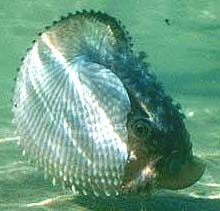
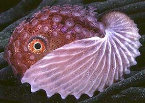
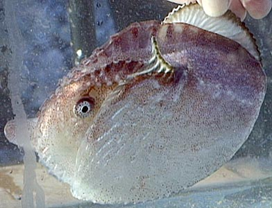
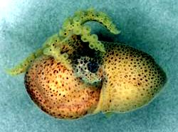
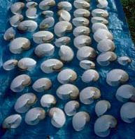
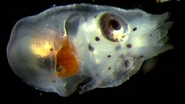
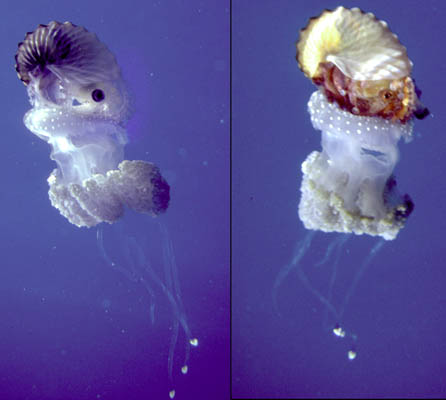

---
title: Argonauta
---

## Phylogeny 

-   « Ancestral Groups  
    -   [Argonautoida](../Argonautoida.md)
    -   [Incirrata](../../Incirrata.md)
    -   [Octopod](../../../Octopod.md)
    -  [Octopodiformes](../../../../Octopodiformes.md))
    -  [Coleoidea](../../../../../Coleoidea.md))
    -  [Cephalopoda](../../../../../../Cephalopoda.md))
    -  [Mollusca](../../../../../../../Mollusca.md))
    -  [Bilateria](../../../../../../../../Bilateria.md))
    -  [Animals](../../../../../../../../../Animals.md))
    -  [Eukarya](../../../../../../../../../../Eukarya.md))
    -   [Tree of Life](../../../../../../../../../../Tree_of_Life.md)

-   ◊ Sibling Groups of  Argonautoida
    -   [Haliphron atlanticus](Haliphron_atlanticus)
    -   [Tremoctopus](Tremoctopus)
    -   Argonauta
    -   [Ocythoe tuberculata](Ocythoe_tuberculata)

-   » Sub-Groups 

## Argonautidae [Tryon, 1879] 

# *Argonauta* [Linnaeus 1758]

## paper nautilus 

[Katharina M. Mangold (1922-2003), Michael Vecchione, and Richard E. Young](http://www.tolweb.org/)

The family contains at least four species (Nesis, 1982/7).

-   *Argonauta argo*
-   *Argonauta hians*
-   *Argonauta boettgeri*
-   *Argonauta nodosa*

Containing group: [Argonautoida](../Argonautoida.md)

## Introduction

Argonauts are muscular, pelagic octopods. Females secrete a thin
calcareous \"shell\" in which they reside. Shells may reach a length of
30 cm (Nesis, 1982). The dorsal arms of females are modified with large,
flag-like membranes that expand over the shell and are responsible for
the secretion of the shell. Eyes are very large and webs very small. The
mantle-funnel locking apparatus consists of knob-like cartilages
(mantle) and matching depressions (funnel). Males are dwarfs.

#### Diagnosis 

An argonautoid \...

-   with distal webs on arms I in females that secrete a calcareous
    shell.
-   with a circular pit in the funnel locking-apparatus.

### Characteristics

1.  Arms
    1.  Females with distal flag-like expansion of the web of the dorsal
        arms that contain shell-secreting glands.

        

        **Figure**. Side view of ***Argonauta*** sp., showing the
        expansion of the web (web presence indicated by their
        chromatophores) of the first arm, past the horn of the shell and
        over most of the shell surface, Gulf of Aqaba, Red Sea.
        Photograph of living argonaut by Shai Enbinder; provided by
        Nadav Shashar.
2.  Head.
    1.  Water pores absent.
    2.  Funnel
        1.  Funnel-mantle locking apparatus consists of a knob and pit.

### Nomenclature

[A list of all nominal genera and species in the Argonautidae can be found here.](http://www.tolweb.org/accessory/Argonautidae_Taxa?acc_id=2464)
The list includes the current status and type species of all genera, and
the current status, type repository and type locality of all species and
all pertinent references.

### Discussion of Phylogenetic Relationships

An unusual feature of argonauts is the secreted shell that functions as
a brood chamber. The \"shell\" is not homologous with the true molluscan
shell as evidenced by its unique site of formation: the dorsal arms of
the female rather than the internal shell sac as in other coleoids. Naef
(1921/3) noted the remarkable resemblence of the argonaut shell to the
shells of some of the abundant Cretaceous ammonoids and suggested that
the argonaut shell evolved in the following way: Ancestral argonauts
occupied empty ammonoid shells during the late Cretaceous. \[Occupancy
of molluscan shells by octopodids is common in the present day.\] The
octopod evolved glandular structures on the arms to repair the shell of
the ammonoids after the latter had become extinct at the end of the
Cretaceous. Eventually, the ammonoid shell was completely replaced by a
secreted structure whose shape had been evolutionarily molded by the
ammonoid shell. However, as pointed out by Young *et al.* (19998), a gap
of about 40 million years exists between extinction of ammonoids and the
earliest fossil record of an argonaut and they suggest that the mold for
the shell was from some other type of mollusc and that the resemblance
to ammonoids is coincidental. The origin of the argonaut shell is a
challenging problem and has important implications for understanding the
relationships amoung groups of the Argonautoidea (Young, *et al.*,
1998).

### Life history

The male argonaut is a dwarf, about 10% of the length of the female. The
entire third right arm is hectocotylized and carried in a special sac.
At mating, the hectocotylus, which carries one large spermatophore,
breaks out of its sac and then from the male body. The free hectocotylus
invades, or is deposited in, the female\'s mantle cavity, where it
remains viable and active for some time. The hectocotylus was first
described as a worm parasitic on the female (Delle Chiaje, 1825).

{height="185" width="232"}

**Figures**. Lateral and oral views of male argonauts. Left, center - A
5 mm ML, apparently immature, male ***Argonauta hians*** from the
equatorial South Atlantic. Drawings from Chun, 1910. In oral view the
male looks like a 7-arm octopus. **Right** - A male ***Argonauta
nodosa***, off Australia, with the hectocotylus in a much larger sac is
apparently mature. Photograph by Mandy Reid; provided by Mark Norman.

The female lives in a thin, calcareous, laterally compressed shell
secreted by its dorsal arms. The shell is paper-thin and the animal is
commonly called the \"paper nautilus.\" The latter part of the name
comes from similarly-shaped shell of ***Nautilus**.* The shell of the
pearly nautilus, however, is the true cephalopod shell (i.e., the
homologue of the molluscan shell) and not a unique evolutionary
innovation like the \"shell\" of ***Argonauta*** (Naef, 1921-23).

{height="198" width="193"}

**Figure**. Left - Lateral view of an ***Argonauta argo*** shell,
Hawaii. Photograph by R. Young). Right - A collection of ***Argonauta
nodosa*** shells from a swarm that washed ashore, Australia. Photograph
by Mark Norman.

Embryonic development begins in the oviducts. Older embryos are attached
to the inner region of the shell where they are brooded. The elongate
egg stalks (extensions of the egg chorion) are woven together and
attached to the shell apex on its inner surface. A female ***A. argo***
with a shell length of 88 mm was estimated to be carrying 48,800 embryos
(Okutani and Kawaguchi, 1983). The eggs are very small (0.6 - 1.0 mm).
Spawning is intermittent, and the brooding embryos can be seen to be in
different stages of development.

The argonaut paralarva has a distinctive appearance as seen in the
photo. The arms are very short and equal in length and are surrounded in
their proximal half by a membranous collar or cuff (barely recognizable
in the photograph) formed by the interbrachial membrane. The latter
feature is found also in ***Tremoctopus*** hatchlings. The life-span is
unknown.

**Figure**. Ventrolateral view of ***Argonauta argo*** hatchling from
aplankton tow, Hawaii. Photograph by R. Young.

### Habitat

Argonauts are pelagic in tropical and subtropical surface waters of all
oceans and seas. Sometimes they are found in large swarms, but only
rarely are they encountered nearshore. In the open ocean they are
commonly found attached to jellyfish (David, 1965). While this unusual
association between ***Argonauta*** spp. and jellyfish has long been
known (Kramp, 1956; David, 1965) it was uninvestigated prior to the work
of Heeger et al. (1992). The latter authors describe ***Argonauta***
astride the aboral (=exumbrellar) surface of a swimming jellyfish that
it held with its lateral and ventral arms. Upon examination of the
jellyfish they found about half of its aboral surface was damaged and
large pieces of mesoglea were missing. Two holes, apparently bite marks
were found in the center of this area and channels led from these holes
into the gastral cavity of the jellyfish. They presumed the octopod used
these channels to suck particles (food) from the gastral cavity. They
also suggest that the association provided shelter or camouflage for the
argonaut.

**Figure**. Two views of ***Argonauta argo*** atop the jellyfish,
***Phyllorhiza punctata***. Photographs Copyright ©, Thomas Heeger,
University of San Carlos, Philippines.

Males have been reported living within salps (Banas et al., 1982).

### References

Banas, P. T., D. E. Smith and D. C. Biggs. 1982. An association between
a pelagic octopod, *Argonauta* sp. Linnaeus 1758, and aggregate salps.
Fish. Bull. U.S. 80: 648-650.

David, P. M. 1965. The surface fauna of the ocean. Endeavour (Oxf.)24:
95-100).

Delle Chiaje, S. 1825. Memorie sulla storia e notomia degli animali.
Senza Verlebre del Regno di Napoli. I.

Heeger, T., U. Piatkowski and H. Möller. 1992. Predation on jellyfish by
the cephalopod *Argonauta argo*. Marine Ecology Progress Series 88:
293-296.

Kramp, P. L. 1956. Pelagic Fauna. P. 65-86. In: (A. Bruun, SV. Greve, H.
Mielche and R. Spärck, eds.) The Galathea Deep Sea Expedition 1950-1952.

Naef, A. 1921/23. Cephalopoda. Fauna und Flora des Golfes von Neapel.
Monograph, no. 35.

Nesis, K. N. 1982/7. Abridged key to the cephalopod mollusks of the
world\'s ocean. 385+ii pp. Light and Food Industry Publishing House,
Moscow. (In Russian.). Translated into English by B. S. Levitov, ed. by
L. A. Burgess (1987), Cephalopods of the world. T. F. H. Publications,
Neptune City, NJ, 351pp.

Okutani, T. and T. Kawaguchi. 1983. A mass occurrence of *Argonauta
argo* (Cephalopoda: Octopoda) along the coast of Shimane Prefecture,
Western Japan Sea. Venus 41: 281-290.

Young, R. E., M. Vecchione and D. Donovan. 19998 The evolution of
coleoid cephalopods and their present biodiversity and ecology. South
African Jour. Mar. Sci.., 20: 393-420.

## Title Illustrations

)

  --------------------------------------------------------------------------
  Scientific Name ::  Argonauta nodosa
  Location ::        off Australia
  Sex ::             Female
  Copyright ::         © 1996 [Mark D. Norman](mailto:mnorman@unimelb.edu.au) 
  --------------------------------------------------------------------------
)

  ------------
  Scientific Name ::   Argonauta nodosa
  Location ::         off Melbourne
  Acknowledgements   courtesy of Mark Norman
  Size               58 mm shell length
  Copyright ::          © 1996 David Paul
  ------------

## Confidential Links & Embeds: 

### #is_/same_as ::[Argonautidae](Argonautidae.md)) 

### #is_/same_as :: [Argonautidae.public](/_public/bio/bio~Domain/Eukarya/Animals/Bilateria/Mollusca/Cephalopoda/Coleoidea/Octopodiformes/Octopod/Incirrata/Argonautoida/Argonautidae.public.md) 

### #is_/same_as :: [Argonautidae.internal](/_internal/bio/bio~Domain/Eukarya/Animals/Bilateria/Mollusca/Cephalopoda/Coleoidea/Octopodiformes/Octopod/Incirrata/Argonautoida/Argonautidae.internal.md) 

### #is_/same_as :: [Argonautidae.protect](/_protect/bio/bio~Domain/Eukarya/Animals/Bilateria/Mollusca/Cephalopoda/Coleoidea/Octopodiformes/Octopod/Incirrata/Argonautoida/Argonautidae.protect.md) 

### #is_/same_as :: [Argonautidae.private](/_private/bio/bio~Domain/Eukarya/Animals/Bilateria/Mollusca/Cephalopoda/Coleoidea/Octopodiformes/Octopod/Incirrata/Argonautoida/Argonautidae.private.md) 

### #is_/same_as :: [Argonautidae.personal](/_personal/bio/bio~Domain/Eukarya/Animals/Bilateria/Mollusca/Cephalopoda/Coleoidea/Octopodiformes/Octopod/Incirrata/Argonautoida/Argonautidae.personal.md) 

### #is_/same_as :: [Argonautidae.secret](/_secret/bio/bio~Domain/Eukarya/Animals/Bilateria/Mollusca/Cephalopoda/Coleoidea/Octopodiformes/Octopod/Incirrata/Argonautoida/Argonautidae.secret.md)

