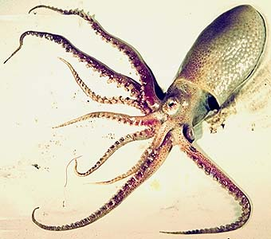
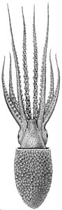
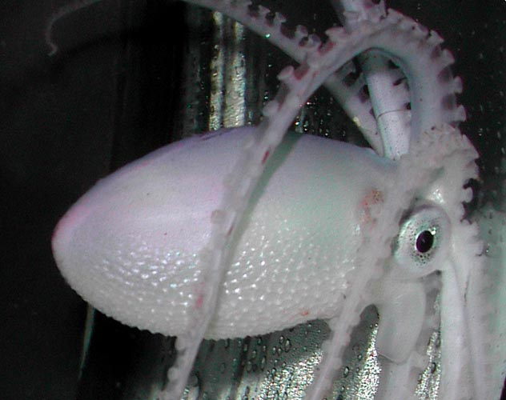
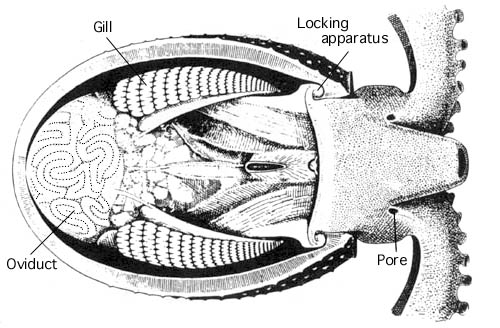
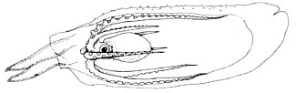
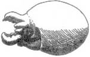

---
title: "Ocythoe tuberculata"
---

## Phylogeny 

-   « Ancestral Groups  
    -   [Argonautoida](../Argonautoida.md)
    -   [Incirrata](../../Incirrata.md)
    -   [Octopod](../../../Octopod.md)
    -  [Octopodiformes](../../../../Octopodiformes.md))
    -  [Coleoidea](../../../../../Coleoidea.md))
    -  [Cephalopoda](../../../../../../Cephalopoda.md))
    -  [Mollusca](../../../../../../../Mollusca.md))
    -  [Bilateria](../../../../../../../../Bilateria.md))
    -  [Animals](../../../../../../../../../Animals.md))
    -  [Eukarya](../../../../../../../../../../Eukarya.md))
    -   [Tree of Life](../../../../../../../../../../Tree_of_Life.md)

-   ◊ Sibling Groups of  Argonautoida
    -   [Haliphron atlanticus](Haliphron_atlanticus)
    -   [Tremoctopus](Tremoctopus)
    -   [Argonauta](Argonauta)
    -   Ocythoe tuberculata

-   » Sub-Groups 

## Ocythoidae [Gray 1849] 

# *Ocythoe tuberculata* [Rafinesque, 1814] 

[Katharina M. Mangold (1922-2003), Michael Vecchione, and Richard E. Young](http://www.tolweb.org/)

The Ocythoidae contains a single species

Containing group: [Argonautoida](../Argonautoida.md)

## Introduction

This pelagic species occupies near-surface waters (at least at night) in
the temperate regions of the world\'s oceans. The females are large with
a mantle length up to 310 mm (Roper and Sweeny, 1976). The mantle is
very muscular and the octopod, presumably, is an excellent swimmer. The
ventral and dorsal arms are much longer than the lateral arms. Females
of ***Ocythoe*** are one of the few known cephalopods with a true
swimbladder (Packard and Wurtz, 1994) and the only known cephalopods
that are ovoviviparous (i.e., give birth to live young that hatch
internally) (Naef, 1923). A pair of water pores at the base of the
ventral arms lead to extensive water-filled spaces between the eyes and
arm bases. In subadult and adult females the ventral surface of the
mantle has permanent ridges formimg a reticulate pattern. Males are
dwarfs with a mantle length of about 30 mm.

{width="413"}

**Figure**. Lateral view of a young female ***O. tuberculata***, 71 mm
ML, in a shipboard aquarium showing ridges and tubercules on the ventral
half of the mantle. Photograph by U. Piatkowski, taken aboard the R/V
G.O. SARS during the MAR-ECO expedition 2004.\

#### Diagnosis

An argonautoid \...

-   with relatively short arms II and III.
-   with reticulate ridge pattern on ventral surface of mantle in
    females.

### Characteristics

1.  Arms
    1.  Lateral arms much shorter than dorsal and ventral arms.
    2.  Hectocotylus (see accessory page)
        1.  Hectocotylus contained in sac extending from base of right
            arm III in males.
        2.  Hectocotylus lacks papillate lateral fringes.\
            \
2.  Head
    1.  Water pores present at base of arms IV in both sexes (see
        drawing below).\
        \
3.  Mantle
    1.  Reticulate pattern of ridges on ventral surface of mantle in
        females (see photograph above).\
        \
4.  Funnel
    1.  Locking-apparatus formed by permanent, turgid and strongly
        recurved corners of funnel (see drawing below).\
        \
5.  Viscera
    1.  Swimbladder present in females (see attached page).\
        \
6.  Reproduction
    1.  Ovoviviparous.

#### Comments

[More details about the hectocotylus, water pores and swimbladder can be found here.](http://www.tolweb.org/accessory/Ocythoe_additional_features?acc_id=2459)

### Nomenclature

[A list of all nominal genera and species in the Ocythoidae can be found here.](http://www.tolweb.org/accessory/Ocythoe_taxa?acc_id=2458) The
list includes the current status and type species of all genera, and the
current status, type repository and type locality of all species and all
pertinent references.

### Life history

The eggs develop in the long, winding oviducts until hatching. The egg
size is 0.9 X 2 mm and the chorion is drawn out into a hollow stalk even
though a stalk no longer has a function (Naef, 1923). Eggs in the
oviducts number at least 100,000 in a large female (Naef, 1923).
Spawning is intermittent as eggs of various stages of development are
present in the oviducts at any one time.

{width="500"}

**Figure**. This cut-away drawing of the viscera of ***O. tuberculata***
shows the thick mantle muscle, the long, convoluted oviducts covering
the ovary, the strong funnel-mantle locking apparatus and the pores to
the water channels. Drawing modified from Naef, 1923.

Males are dwarfs and are sometimes found inhabitating the tests of salps
as are young females (Naef, 1923; Okutani and Osuga, 1986). Little is
known about this relationship.

{width="325"}

**Figure**. Lateral views of a young ***O. tuberculata***, apparently a
female, residing within the test of the salp, Tethys vagina. **Left** -
Photograph from off Japan a few hundred meters from shore by K. Osuga
(published by Okutani and Osuga, 1986, courtesy of T. Okutani). Note
that the salp does not seem to be intact. **Right** - A drawing, made
from the photograph, clarifies the position of the octopod within the
salp. Drawing from Okutani and Osuga, 1986.

The hatchling is easily recognized by the retarded development of the
lateral arms which is characteristic of all stages

{width="151"}

**Figure**. Lateral view of a hatchling ***O. tuberculata***. Drawing
from Naef (1921-23).
### Distribution

This species is found throughout the temperate latitudes of the world\'s
oceans (Roper and Sweeny, 1976). This suggest that separate populations
exist but the population structure has not been investigated. In the
North Pacific large female ***O. tuberculata*** have been commonly
caught in drift nets set in the upper 10 m of the water at night (M.
Seki, pers. comm.); the daytime habitat is unknown.

### References

Naef, A. (1921/23). Cephalopoda. Fauna und Flora des Golfes von Neapel.
Monograph, no. 35. English translation: A. Mercado (1972). Israel
Program for Scientific Translations Ltd., Jerusalem, Israel. 863pp.,
IPST Cat. No. 5110/1,2.

Okutani, T. and K. Osuga. 1986. A peculiar nesting behavior of *Ocythoe
tuberculata* in the test of a gigantic salp, *Tethys vagina*. Venus 45:
67-69.

Packard, A. and M. Wurtz. 1994. An octopus, *Ocythoe*, with a
swimbladder and triple jets. Phil. Trans. R. Soc. Lond. B 344: 261-275.

Roper, C. F. E. and M. Sweeny. 1976. The pelagic octopod *Ocythoe
tuberculata* Rafinesque, 1814. Bull. Amer. Malac. Union 1975: 21-28.

Young, R. E. 1972. The systematics and areal distribution of pelagic
cephalopods from the seas off Southern California. Smithson. Contr.
Zool., 97: 1-159.

## Title Illustrations

)

  ----------------
  Scientific Name ::  Ocythoe tuberculata
  Location ::        Catalina Island off California, U.S.A.
  Comments          Washed ashore.
  Sex ::             Female
  View              Lateral.
  Copyright ::         © 1996 Dorothy Petersen
  ----------------
)

  ------------------------------------------------------------------------------
  Scientific Name ::   Ocythoe tuberculata
  Reference          From Young, 1972
  Sex ::              Female
  Life Cycle Stage ::   immature
  View               Ventral
  Size               80 mm ML
  Copyright ::          © [Richard E. Young](http://www.soest.hawaii.edu/%7Eryoung/rey.html) 
  ------------------------------------------------------------------------------

## Confidential Links & Embeds: 

### #is_/same_as ::[Ocythoidae](Ocythoidae.md)) 

### #is_/same_as :: [Ocythoidae.public](/_public/bio/bio~Domain/Eukarya/Animals/Bilateria/Mollusca/Cephalopoda/Coleoidea/Octopodiformes/Octopod/Incirrata/Argonautoida/Ocythoidae.public.md) 

### #is_/same_as :: [Ocythoidae.internal](/_internal/bio/bio~Domain/Eukarya/Animals/Bilateria/Mollusca/Cephalopoda/Coleoidea/Octopodiformes/Octopod/Incirrata/Argonautoida/Ocythoidae.internal.md) 

### #is_/same_as :: [Ocythoidae.protect](/_protect/bio/bio~Domain/Eukarya/Animals/Bilateria/Mollusca/Cephalopoda/Coleoidea/Octopodiformes/Octopod/Incirrata/Argonautoida/Ocythoidae.protect.md) 

### #is_/same_as :: [Ocythoidae.private](/_private/bio/bio~Domain/Eukarya/Animals/Bilateria/Mollusca/Cephalopoda/Coleoidea/Octopodiformes/Octopod/Incirrata/Argonautoida/Ocythoidae.private.md) 

### #is_/same_as :: [Ocythoidae.personal](/_personal/bio/bio~Domain/Eukarya/Animals/Bilateria/Mollusca/Cephalopoda/Coleoidea/Octopodiformes/Octopod/Incirrata/Argonautoida/Ocythoidae.personal.md) 

### #is_/same_as :: [Ocythoidae.secret](/_secret/bio/bio~Domain/Eukarya/Animals/Bilateria/Mollusca/Cephalopoda/Coleoidea/Octopodiformes/Octopod/Incirrata/Argonautoida/Ocythoidae.secret.md)

