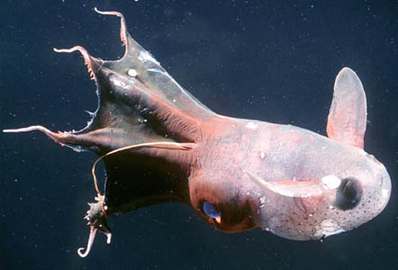
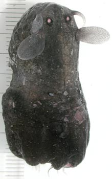
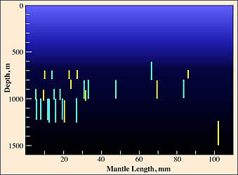

---
title: "Vampyroteuthis infernalis"
---

# [[Vampyromorpha]] 

The Vampire Squid 

)

Only a single species is known in the Vampyromorpha.

## #has_/text_of_/abstract 

> Vampyromorphida is an order of cephalopods comprising one known extant species (Vampyroteuthis infernalis) and many extinct taxa. Physically, they somewhat resemble octopuses (their closest relatives), but are often called vampire squids. Unlike octopuses, their eight arms are united by a web of skin, and two smaller cilia are also present. Properly speaking, the vampire squid does not possess cilia, but cirri (cilia-like projections). Unlike most cephalopods, which are high-energy hunters, the vampire squid has an extremely low metabolic rate. This adaptation means it requires less oxygen and its food lasts longer, helping it conserve energy and thrive in these harsh deep-sea conditions. Studies show its oxygen consumption is among the lowest of any cephalopod, allowing it to occupy a competition-free niche in the deep sea where few predators or competitors can follow, since not many can survive.
>
> [Wikipedia](https://en.wikipedia.org/wiki/Vampyromorphida) 

### Information on the Internet

#### *Vampyroteuthis Videos*

-   [Vampyroteuthis infernalis](http://youtube.com/watch?v=l3PvvT_Ktx8) 
-   [Vampire Squid](http://www.youtube.com/watch?v=bmi9CU52KsI) 
-   [Deep Dark Ocean](http://youtube.com/watch?v=Q2o6t-0fU10) 

## Introduction

[Richard E. Young](http://www.tolweb.org/) 

The vampire squid is rather small, reaching a maximum of 13 cm ML
(Nesis, 1982/7), and is very gelatinous; its consistency is that of a
jellyfish. It occupies meso- to bathypelagic depths throughout the
tropical and temperate regions of the world\'s oceans. The second pair
of arms is modified into retractile filaments that can extend to lengths
well in excess of the total length of the animal, and they can be
retracted into pockets within the web. The filaments, presumably, have a
sensory function. The vampire has black chromatophores with
reddish-brown ones interspersed. These chromatophores, however, have
lost the muscles that enable rapid color change in other coleoids and
are probably incapable of changing shape. A few normal chromatophores
associated with photophores are still present.

The vampire is a phylogenetic relict and possesses features of both
octopods and decapods. In addition, it has many features that are
probably adaptations to the deep-sea environment. Among these are the
loss of the ink sac and most active chromatophores, development of
photophores and the gelatinous consistency of the tissues.

### Characteristics

1.  Arms
    1.  [\"Arms II\" are retractile         filaments.](http://www.tolweb.org/accessory/Vampyroteuthis_Retractile_Filaments?acc_id=1763)
    2.  Cirri present over arm length; suckers present only on distal
        half of arms.
    3.  Suckers without cuticular lining.
2.  Fins
    1.  Two pairs of fins present during ontogeny.
3.  Spermatangia
    1.  Receptacle (deep sac) for spermatangia located anterior to each
        eye in females.
4.  Gladius
    1.  Gladius with broad median field and broad conus.
5.  Siphuncle (?)
    1.  Visceropericardial coelom extends posteriorly as a slender duct,
        possibly a remnant siphuncle.
6.  Photophores
    1.  Large circular, lidded organs present posterior to each adult
        fin (\"fin-base\" organs).
    2.  Numerous small organs distributed over ventral surfaces of
        mantle, funnel, head and aboral surface of arms and web
        (\"skin-nodule\" organs). Two patches on dorsal surface of head
        look like aggregrated small photophores but are photoreceptors
        (Herring, *et al*., 1994).
    3.  Arm-tip organ(s) produce luminescent clouds consisting of
        microscopic glowing particles (Robison, et al., 2003).
    4.  Arm-tip organs that flash or glow (Hunt, 1996).

#### Comments

[A drawing and photographs of the mantle cavity can be seen here](http://www.tolweb.org/accessory/Vampyroteuthis_Mantle_Cavity?acc_id=1765).

### Nomenclature

[A list of all nominal genera and species in the Vampyroteuthidae can be found here.](http://www.tolweb.org/accessory/Vampyroteuthidae_Taxa?acc_id=2420)
The list includes the current status and type species of all genera, and
the current status, type repository and type locality of all species and
all pertinent references.

### Life History

1.  Fins
    -   Development of the fins in the vampire is unique among
        cephalopods. One pair is present at hatching and is eventually
        resorbed and replaced by a more anterior pair as development
        proceeds. At one stage in development, therefore, the vampire
        has two pairs of fins. The first pair to develop is the
        homologue of the fins of other cephalopods (Young and Vecchione,
        1996). The unusual fin ontogeny is partially responsible for the
        early description of 3 families and many species where only one
        species actually exists. Except for the fins, the young vampire
        squid (ca 10 mm ML) have an appearance very similar to that of
        the adult.
2.  Eggs and hatchlings
    -   Vampires lack nidamental glands and have rather small oviducal
        glands. As a result there is little likelihood that they produce
        large egg masses. Off California small vampire squid occupy
        greater depths than do the larger individuals (Roper and
        Young, 1975) suggesting that spawning occurs in very deep water.
        [A hatchling is known from deep water off         Hawaii.](http://www.tolweb.org/accessory/Vampyroteuthis_Hatchling?acc_id=1767)
){height="350" width="219"}

**Figure**. The photograph shows a four-fin stage in which the adult
fins are bigger than the paralarval fins. Note the mm scale. Photograph
by John Bower.
### Behavior

*Vampyroteuthis* can swim surprisingly fast for a gelatinous animal.
Hunt (1996) estimates from videotapes that it can reach two body
lengths/sec, and it can accellerate to this speed in 5 sec. An escape
reaction involves the quick movement of the fins toward the funnel
followed by a jet from the mantle. This sequence is repeated as the
vampire takes a series of quick turns in an erratic escape route (Hunt,
1996). The arms are sometimes spread forward to form, along with the
web, an umbrella-like or bell-shaped posture while the vampire slowly
swims forward (Hunt, 1996). The vampire appears to orient most commonly
in a horizontal attitude with generally one filament extended (Hunt,
1996). The filaments appear to be tactile sense organs (Hunt, 1996). It
has a posture (\"pineapple posture\") in which the arms and web are
spread aborally over the head and mantle (Robison, 1995). In this
posture the squid would be somewhat more difficult to injure and would
be covered by a densely pigmented cloak. The oral surface of the arms
and webs are the most heavily pigmented (black) regions on the animal.
The posture, therefore, is probably a defensive one.
)

Arm tip from a preserved vampire squid showing the light emitting
surface (unpigmented), as well as suckers and cirri (photograph
copyright © 1999, R. E. Young).

Hunt (1966) first observed bioluminescence displays in the living
animal. Fin-base photophores have been observed to glow brightly for
less than a second (a flash) or longer than two minutes. In addition the
light intensity can vary giving a pulsating appearance, and as light is
extinguished, the glowing disc can be seen to decrease in diameter as
well as intensity.

Arm-tip organs are unpigmented on their oral surface where light is
emitted but otherwise do not look like luminescent structures (see
photograph on the right). The photophores all glow simultaneously, or
they all can flash at a rate of one to three per second or pulsate. With
the arm-tip organs apparently glowing continuously, the vampire moves
the arms (\"arm writhing\") around rapidly exposing and hiding the
photophores which is \"\...very disorienting \[to an observer\] when
trying to visually fix the animal\'s position\" (Hunt, 1996 p. 104).
Often a flash of the arm tips is followed by a rapid escape response.
Another unusual and visually confusing effect is seen when viewing the
vampire posteriorly from the mantle apex. The apparently disturbed
vampire can curl the arms and web posteriorly over the head (\"pineapple
posture\") then illuminate the arm-tip organs and the fin-base organs.
\"\...the arm tips appear to come toward you, whereas the
fin\[base\]lights appear to be moving away (due to their apparent
shrinkage)\" (Hunt, 1996, p. 104).

The third source of bioluminescence is luminescent clouds. These appear
as a mucous matrix with a few hundred to over 1000 discrete, glowing
particles embedded in it. The particles can glow for up to 9.5 min. The
source of the particles has been shown to be the arm tip organs
(Robison, et al., 2003). The latter authors suggest that flashing of the
arm-tip organs is controlled by covering or exposing the photogenic
region by the pigmented sides of the arm tips, that the microscopic
glowing particles are not luminescent bacteria, and that the function of
the bioluminescence is to startle or distract a predator.

Some spectacular videos of *Vampyroteuthis* bioluminescence can be seen
here:

-   [Vampyroteuthis     infernalis](http://youtube.com/watch?v=l3PvvT_Ktx8){target="_blank"}
-   [Vampire     Squid](http://www.youtube.com/watch?v=bmi9CU52KsI){target="_blank"}
-   [Deep Dark     Ocean](http://youtube.com/watch?v=Q2o6t-0fU10){target="_blank"}

### Distribution

#### Vertical Distribution

Off California trawling data show most vampires between depths of
600-1100 m with peaks at 700-800 m and 900-1000 m, and with small
individuals of less than 20 mm being most abundant at the deeper peak
(Roper and Young, 1975). ROV observations in Monterey Bay, California
suggest that the vampire is restricted to the oxygen minimum layer in
this bay at an average depth of 690 m and oxygen levels of 0.22 ml/l
Hunt, 1996.
)

Vertical distribution chart modified from Clarke and Lu, 1975.

Off Hawaii, 10 of 11 captures came from depths of 800-1200 m but little
towing was done in deeper water. Two captures were from opening-closing
nets at depths of about 800-950 m.

In the Atlantic at 18° N, 25° W, the vampire shows a peak distribution
between 700 and 1200 m but without a clear size/depth pattern (Clarke
and Lu, 1975).

All captures were made with opening/closing trawls. Bars represent a
capture and the bar length indicates the depth range of the trawl while
open. Yellow bars indicate a daytime capture and blue bars a nighttime
capture. Fishing effort between 1000-1250 m was about twice that between
1250 and 1500 m, and effort between 1000-1500 m was about 5 times that
between 1500 and 2000 m and about the same as that between 500 and 1000
m.

Numerous records exists for captures in excess of 1200 m (e. g., see
Roper and Young, 1975) from open nets. Unfortunately, due to the rather
high probability of contamination from shallower depths, these records
are of questionable value.

#### Horizontal Distribution

The vampire squid is broadly distributed throughout the depths of the
world\'s tropical and temperate oceans. Some geographical variation has
been noted. Young (1972) found that the beaks of vampire squid from the
Pacific Ocean off California were distinctly smaller than those from
vampires of the Gulf of Guinea in the Atlantic Ocean. He also noted
differences in sucker size and gill size in vampires from these areas.
Vampires from off Monterey, California have a predominance of reddish
rather than black chromatophores.

## Phylogeny 

-   « Ancestral Groups  
    -  [Octopodiformes](../Octopodiformes.md))
    -  [Coleoidea](../../Coleoidea.md))
    -  [Cephalopoda](../../../Cephalopoda.md))
    -  [Mollusca](../../../../Mollusca.md))
    -  [Bilateria](../../../../../Bilateria.md))
    -  [Animals](../../../../../../Animals.md))
    -  [Eukarya](../../../../../../../Eukarya.md))
    -   [Tree of Life](../../../../../../../Tree_of_Life.md)

-   ◊ Sibling Groups of  Octopodiformes
    -   [Octopod](Octopod.md)
    -   Vampyroteuthis infernalis

-   » Sub-Groups 

## Title Illustrations

-------------------------------

Scientific Name ::  Vampyroteuthis infernalis
Location ::        San Clemente Basin off Southern California
Comments          Photographed in plankton kreisel aboard the R/V NEW HORIZON. Captured at 700 m depth.
Size              25 cm total length
Copyright ::         © 1999 Brad Seibel

------------------------------------------------------------------------------)
Scientific Name ::  Vampyroteuthis infernalis
Reference         from Young, R. E. 1972. The systematics and areal distribution of pelagic cephalopods from the seas off Southern California. Smithson. Contr. Zool., 97: 1-159.
Copyright ::         © [Richard E. Young](http://www.soest.hawaii.edu/%7Eryoung/rey.html) 

## Confidential Links & Embeds: 

### #is_/same_as ::[Vampyromorpha](Vampyromorpha.md)) 

### #is_/same_as :: [Vampyromorpha.public](/_public/bio/bio~Domain/Eukarya/Animals/Bilateria/Mollusca/Cephalopoda/Coleoidea/Octopodiformes/Vampyromorpha.public.md) 

### #is_/same_as :: [Vampyromorpha.internal](/_internal/bio/bio~Domain/Eukarya/Animals/Bilateria/Mollusca/Cephalopoda/Coleoidea/Octopodiformes/Vampyromorpha.internal.md) 

### #is_/same_as :: [Vampyromorpha.protect](/_protect/bio/bio~Domain/Eukarya/Animals/Bilateria/Mollusca/Cephalopoda/Coleoidea/Octopodiformes/Vampyromorpha.protect.md) 

### #is_/same_as :: [Vampyromorpha.private](/_private/bio/bio~Domain/Eukarya/Animals/Bilateria/Mollusca/Cephalopoda/Coleoidea/Octopodiformes/Vampyromorpha.private.md) 

### #is_/same_as :: [Vampyromorpha.personal](/_personal/bio/bio~Domain/Eukarya/Animals/Bilateria/Mollusca/Cephalopoda/Coleoidea/Octopodiformes/Vampyromorpha.personal.md) 

### #is_/same_as :: [Vampyromorpha.secret](/_secret/bio/bio~Domain/Eukarya/Animals/Bilateria/Mollusca/Cephalopoda/Coleoidea/Octopodiformes/Vampyromorpha.secret.md)

