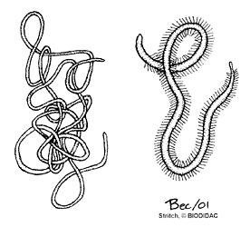

---
title: Nematomorpha
---

# [[Nematomorpha]] 

## Horsehair worms 

 

## #has_/text_of_/abstract 

> **Nematomorpha** (sometimes called Gordiacea, and commonly known as horsehair worms, hairsnakes, or Gordian worms) are a phylum of parasitoid animals superficially similar to nematode worms in morphology, hence the name. Most species range in size from 50 to 100 millimetres (2.0 to 3.9 in), reaching 2 metres (79 in) in extreme cases, and 1 to 3 millimetres (0.039 to 0.118 in) in diameter. Horsehair worms can be discovered in damp areas, such as watering troughs, swimming pools, streams, puddles, and cisterns. The adult worms are free-living, but the larvae are parasitic on arthropods, such as beetles, cockroaches, mantises, orthopterans, and crustaceans. About 351 freshwater species are known and a conservative estimate suggests that there may be about 2000 freshwater species worldwide. The name "Gordian" stems from the legendary Gordian knot. This relates to the fact that nematomorphs often coil themselves in tight balls that resemble knots.
>
> [Wikipedia](https://en.wikipedia.org/wiki/Nematomorpha) 

## Phylogeny 

-   « Ancestral Groups  
    -  [Bilateria](../Bilateria.md))
    -  [Animals](../../Animals.md))
    -  [Eukarya](../../../Eukarya.md))
    -   [Tree of Life](../../../Tree_of_Life.md)

-   ◊ Sibling Groups of  Bilateria
    -   [Deuterostomia](Deutero.md)
    -  [Arthropoda](Arthropoda.md))
    -  [Onychophora](Onychophora.md))
    -   [Tardigrade](Tardigrade.md)
    -  [Nematoda](Nematoda.md))
    -   Nematomorpha
    -  [Kinorhyncha](Kinorhyncha.md))
    -  [Loricifera](Loricifera.md))
    -  [Priapulida](Priapulida.md))
    -   [Arrow_Worm](Arrow_Worm.md)
    -  [Gastrotricha](Gastrotricha.md))
    -  [Rotifera](Rotifera.md))
    -  [Gnathostomulida](Gnathostomulida.md))
    -   [Limnognathia maerski](Limnognathia_maerski)
    -  [Cycliophora](Cycliophora.md))
    -  [Mesozoa](Mesozoa.md))
    -  [Platyhelminthes](Platyhelminthes.md))
    -  [Annelida](Annelida.md))
    -  [Bryozoa](Bryozoa.md))
    -  [Sipuncula](Sipuncula.md))
    -  [Mollusca](Mollusca.md))
    -  [Nemertea](Nemertea.md))
    -  [Entoprocta](Entoprocta.md))
    -  [Phoronida](Phoronida.md))
    -  [Brachiopoda](Brachiopoda.md))

-   » Sub-Groups 

## Title Illustrations

Nematomorph worms, horsehair worms, gordian worms. 
Gordius on the left and Nectonema with natatory bristles on the right.\
Drawings by Stritch. Copyright © 2001
[BIODIDAC](http://biodidac.bio.uottawa.ca/index.htm)

--------------------------------------------------------------------------

Copyright ::   © 2001 [BIODIDAC](http://biodidac.bio.uottawa.ca/index.htm) 

## Confidential Links & Embeds: 

### #is_/same_as ::[Nematomorpha](Nematomorpha.md)) 

### #is_/same_as :: [Nematomorpha.public](/_public/bio/bio~Domain/Eukarya/Animals/Bilateria/Nematomorpha.public.md) 

### #is_/same_as :: [Nematomorpha.internal](/_internal/bio/bio~Domain/Eukarya/Animals/Bilateria/Nematomorpha.internal.md) 

### #is_/same_as :: [Nematomorpha.protect](/_protect/bio/bio~Domain/Eukarya/Animals/Bilateria/Nematomorpha.protect.md) 

### #is_/same_as :: [Nematomorpha.private](/_private/bio/bio~Domain/Eukarya/Animals/Bilateria/Nematomorpha.private.md) 

### #is_/same_as :: [Nematomorpha.personal](/_personal/bio/bio~Domain/Eukarya/Animals/Bilateria/Nematomorpha.personal.md) 

### #is_/same_as :: [Nematomorpha.secret](/_secret/bio/bio~Domain/Eukarya/Animals/Bilateria/Nematomorpha.secret.md)

