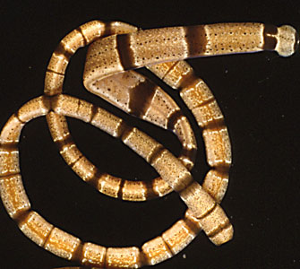

---
title: Nemertea
---

# [[Nemertea]]

## Ribbon Worms 

 

## #has_/text_of_/abstract 

> **Nemertea** is a phylum of animals also known as ribbon worms or proboscis worms, consisting of about 1300 known species.  Most ribbon worms are very slim, usually only a few millimeters wide, although a few have relatively short but wide bodies. Many have patterns of yellow, orange, red and green coloration.
>
> The foregut, stomach and intestine run a little below the midline of the body, the anus is at the tip of the tail, and the mouth is under the front. A little above the gut is the rhynchocoel, a cavity which mostly runs above the midline and ends a little short of the rear of the body. All species have a proboscis which lies in the rhynchocoel when inactive but everts to emerge just above the mouth to capture the animal's prey with venom. A highly extensible muscle in the back of the rhynchocoel pulls the proboscis in when an attack ends. A few species with stubby bodies filter feed and have suckers at the front and back ends, with which they attach to a host.
>
> The brain is a ring of four ganglia, positioned around the rhynchocoel near the animal's front end. At least a pair of ventral nerve cords connect to the brain and run along the length of the body. Most nemerteans have various chemoreceptors, and on their heads some species have a number of pigment-cup ocelli, which can detect light but can not form an image. Nemerteans respire through the skin. They have at least two lateral vessels which are joined at the ends to form a loop, and these and the rhynchocoel are filled with fluid. There is no heart, and the flow of fluid depends on contraction of muscles in the vessels and the body wall. To filter out soluble waste products, flame cells are embedded in the front part of the two lateral fluid vessels, and remove the wastes through a network of pipes to the outside.
>
> All nemerteans move slowly, using their external cilia to glide on surfaces on a trail of slime, while larger species use muscular waves to crawl, and some swim by dorso-ventral undulations. A few live in the open ocean while the rest find or make hiding places on the bottom. About a dozen species inhabit freshwater, mainly in the tropics and subtropics, and another dozen species live on land in cool, damp places. Most nemerteans are carnivores, feeding on annelids, clams and crustaceans. Some species of nemerteans are scavengers, and a few live commensally inside the mantle cavity of molluscs. 
>
> In most species the sexes are separate, but all the freshwater species are hermaphroditic. Nemerteans often have numerous temporary gonads (ovaries or testes), and build temporary gonoducts (ducts from which the ova or sperm are emitted) opening to a gonopore, one per gonad, when the ova and sperm are ready. The eggs are generally fertilised externally. Some species shed them into the water, and others protect their eggs in various ways. The fertilized egg divides by spiral cleavage and grows by determinate development, in which the fate of a cell can usually be predicted from its predecessors in the process of division. The embryos of most taxa develop either directly to form juveniles (like the adult but smaller) or larvae that resemble the planulas of cnidarians. However, some form a pilidium larva, in which the developing juvenile has a gut which lies across the larva's body, and usually eats the remains of the larva when it emerges. The bodies of some species fragment readily, and even parts cut off near the tail can grow full bodies.
>
> Traditional taxonomy divides the phylum in two classes, Anopla ("unarmed" – their proboscises do not have a little dagger) with two orders, and Enopla ("armed" with a dagger) also with two orders. However, it is now accepted that Anopla are paraphyletic, as one order of Anopla is more closely related to Enopla than to the other order of Anopla. The phylum Nemertea itself is monophyletic, its main synapomorphies being the rhynchocoel and eversible proboscis. Traditional taxonomy says that nemerteans are closely related to flatworms, but both phyla are regarded as members of the Lophotrochozoa, a very large clade, sometimes viewed as a superphylum that also includes molluscs, annelids, brachiopods, bryozoa and many other protostomes.
>
> [Wikipedia](https://en.wikipedia.org/wiki/Nemertea) 

## Phylogeny 

-   « Ancestral Groups  
    -  [Bilateria](../Bilateria.md))
    -  [Animals](../../Animals.md))
    -  [Eukarya](../../../Eukarya.md))
    -   [Tree of Life](../../../Tree_of_Life.md)

-   ◊ Sibling Groups of  Bilateria
    -   [Deuterostomia](Deutero.md)
    -  [Arthropoda](Arthropoda.md))
    -  [Onychophora](Onychophora.md))
    -   [Tardigrade](Tardigrade.md)
    -  [Nematoda](Nematoda.md))
    -  [Nematomorpha](Nematomorpha.md))
    -  [Kinorhyncha](Kinorhyncha.md))
    -  [Loricifera](Loricifera.md))
    -  [Priapulida](Priapulida.md))
    -   [Arrow_Worm](Arrow_Worm.md)
    -  [Gastrotricha](Gastrotricha.md))
    -  [Rotifera](Rotifera.md))
    -  [Gnathostomulida](Gnathostomulida.md))
    -   [Limnognathia maerski](Limnognathia_maerski)
    -  [Cycliophora](Cycliophora.md))
    -  [Mesozoa](Mesozoa.md))
    -  [Platyhelminthes](Platyhelminthes.md))
    -  [Annelida](Annelida.md))
    -  [Bryozoa](Bryozoa.md))
    -  [Sipuncula](Sipuncula.md))
    -  [Mollusca](Mollusca.md))
    -   Nemertea
    -  [Entoprocta](Entoprocta.md))
    -  [Phoronida](Phoronida.md))
    -  [Brachiopoda](Brachiopoda.md))

-   » Sub-Groups 

## Title Illustrations

-------------------------------------------------------------------------

Scientific Name ::     Tubulanus rhabdotus
Location ::           Fort Pierce, Florida
Comments             Live, \"narcotized\"
Creator              Jon L. Norenburg
Specimen Condition   Live Specimen
Identified By        Jon L Norenburg
Life Cycle Stage ::     Adult
Body Part            Whole, missing posterior
View                 Head ventral, at right
Size                 Approx. 150 mm long
Collector            Jon L Norenburg
Copyright ::            © 2004 [Jon L. Norenburg](http://nemertes.si.edu/) 

## Confidential Links & Embeds: 

### #is_/same_as ::[Nemertea](Nemertea.md)) 

### #is_/same_as :: [Nemertea.public](/_public/bio/bio~Domain/Eukarya/Animals/Bilateria/Nemertea.public.md) 

### #is_/same_as :: [Nemertea.internal](/_internal/bio/bio~Domain/Eukarya/Animals/Bilateria/Nemertea.internal.md) 

### #is_/same_as :: [Nemertea.protect](/_protect/bio/bio~Domain/Eukarya/Animals/Bilateria/Nemertea.protect.md) 

### #is_/same_as :: [Nemertea.private](/_private/bio/bio~Domain/Eukarya/Animals/Bilateria/Nemertea.private.md) 

### #is_/same_as :: [Nemertea.personal](/_personal/bio/bio~Domain/Eukarya/Animals/Bilateria/Nemertea.personal.md) 

### #is_/same_as :: [Nemertea.secret](/_secret/bio/bio~Domain/Eukarya/Animals/Bilateria/Nemertea.secret.md)

