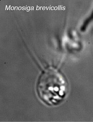
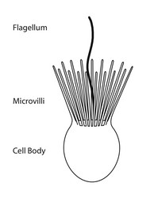

---
aliases:
- Bičkarji ovratničarji
- Choanoflagellat
- Choanoflagellata
- Choanoflagellate
- Choanoflagellatea
- Choanoflagellater
- Choanoflagellates
- Choanomonada
- Chragegaiseldierli
- Coanoflagel·lat
- Coanoflaxelados
- Funelflageluloj
- galléros ostorosok
- Hoanoflagelate
- Kaelusviburlased
- kaulussiimaeliöt
- Koanoflagelat
- Krageflagellat
- Kragengeisseltierchen
- Kragengeißeltierchen
- Trubénky
- wiciowce kołnierzykowe
- Жағалы талшықтылар
- околувратни камшичари
- хоанофлагелате
- хоанофлагелати
- хоанофлагеллаты
- Хоанофлагеляти
- כואנופלגלטה
- سوطيات طوقية
- سوطيات طوقيه
- قیفیتاژکداران
- कीपकशाभिक
- চোঙফ্লাজেলীয়
- 襟鞭毛虫綱
- 領鞭毛蟲
- 领鞭毛虫
- 领鞭毛虫纲
- 깃편모충
title: Choanoflagellates
has_id_wikidata: Q129012
dv_has_:
  name_:
    af: Choanoflagellatea
    an: Choanoflagellatea
    ar: سوطيات طوقية
    arz: سوطيات طوقيه
    ast: Choanomonada
    be: Choanoflagellate
    bg: хоанофлагелати
    bn: চোঙফ্লাজেলীয়
    bs: Choanoflagellatea
    ca: Coanoflagel·lat
    ceb: Choanoflagellate
    cs: Trubénky
    da: Choanoflagellat
    de: Kragengeißeltierchen
    de-ch: Kragengeisseltierchen
    en: Choanoflagellatea
    en-us: Choanoflagellatea
    eo: Funelflageluloj
    es: Choanomonada
    et: Kaelusviburlased
    eu: Choanoflagellata
    ext: Choanoflagellatea
    fa: قیفیتاژکداران
    fi: kaulussiimaeliöt
    fr: Choanoflagellata
    frr: Choanoflagellata
    ga: Choanomonada
    gl: Coanoflaxelados
    gsw: Chragegaiseldierli
    ha: Choanoflagellatea
    he: כואנופלגלטה
    hi: कीपकशाभिक
    hr: Choanoflagellatea
    hu: galléros ostorosok
    ia: Choanoflagellatea
    id: Choanoflagellatea
    ie: Choanoflagellatea
    io: Choanoflagellatea
    it: Choanomonada
    ja: 襟鞭毛虫綱
    kk: Жағалы талшықтылар
    ko: 깃편모충
    la: Choanomonada
    mk: околувратни камшичари
    ms: Koanoflagelat
    mul: Choanoflagellatea
    nl: Choanoflagellata
    nn: Krageflagellat
    oc: Choanoflagellatea
    pcm: Choanoflagellatea
    pl: wiciowce kołnierzykowe
    pt: Choanoflagellata
    pt-br: Choanoflagellatea
    ro: Choanoflagellate
    ru: хоанофлагеллаты
    sh: Hoanoflagelate
    sl: Bičkarji ovratničarji
    sq: Choanoflagellate
    sr: хоанофлагелате
    sr-ec: Хоанофлагелате
    sr-el: Hoanoflagelate
    sv: Choanoflagellater
    tr: Choanoflagellate
    uk: Хоанофлагеляти
    vi: Choanoflagellatea
    vo: Choanoflagellatea
    war: Choanoflagellate
    zh: 领鞭毛虫纲
    zh-cn: 领鞭毛虫纲
    zh-hans: 领鞭毛虫纲
    zh-hant: 領鞭毛蟲
    zh-hk: 領鞭毛蟲
    zh-sg: 领鞭毛虫
    zh-tw: 領鞭毛蟲
---
# [[Choanoflagellates]] 

#is_a/bio-Kingdom 
#is_a :: [[../../Taxon_Rank/bio~Kingdom|bio~Kingdom]]  

Choanoflagellida, collared-flagellates 

  

## #has_/text_of_/abstract 

> **Choanoflagellates** are a group of free-living unicellular and colonial flagellate eukaryotes considered to be the closest living relatives of animals. The name refers to the characteristic funnel-shaped "collar" of interconnected microvilli and the presence of a flagellum. Choanoflagellates are found globally in aquatic environments, and they are of particular interest to evolutionary biologists studying the origins of multicellularity in animals.
>
> The flagellum of choanoflagellates is surrounded by microvilli at its base. Movement of the flagellum creates water currents that can propel free-swimming choanoflagellates through the water column and trap bacteria and detritus against the microvilli, where these foodstuffs are engulfed. This feeding plays an ecological role in the carbon cycle by linking different trophic levels.
>
> Choanoflagellates bear morphological similarities to the choanocyte, a type of cell in sponges. As the proposed sister group to Animalia, choanoflagellates serve as a useful model for reconstructions of the last unicellular ancestor of animals. According to a 2021 study, crown group craspedids (and perhaps crown group choanoflagellates if Acanthoecida arose within Craspedida) appeared 422.78 million years ago, although a previous study from 2017 recovered the divergence of the crown group choanoflagellates (craspedids) at 786.62 million years.
>
> [Wikipedia](https://en.wikipedia.org/wiki/Choanoflagellate) 

## Introduction
[Stephen Fairclough and Nicole King](Choanoflagellates.md)))\

Choanoflagellate cell morphology. 

Choanoflagellates are free-living, single-cell and colony forming
eukaryotes ubiquitous in aquatic environments. As their name implies,
choanoflagellates (collared flagellates) have a distinctive cell
morphology characterized by an ovoid or spherical cell body 3-10 µm in
diameter with a single apical flagellum surrounded by a collar of 30-40
microvilli (see figure). Movement of the flagellum creates water
currents that can propel free-swimming choanoflagellates through the
water column and trap bacteria and detritus against the collar of
microvilli where these foodstuffs are engulfed (see this animation from
the University of Alberta).

Choanoflagellates are found globally in marine, brackish and freshwater
environments from the Arctic to the tropics, occupying both pelagic and
benthic zones. Although most sampling of choanoflagellates has occurred
between 0 m and 25 m, they have been recovered from as deep as 300 m in
open water (Thomsen, 1982) and 100 m under Antarctic ice sheets (Buck
and Garrison, 1988). Many species are hypothesized to be cosmopolitan on
a global scale \[e.g., *Diaphanoeca grandis* has been reported from
North America, Europe and Australia (OBIS)\], while other species are
reported to have restricted regional distributions (Thomsen, et al.,
1991). Co-distributed choanoflagellate species can occupy quite
different microenvironments, but in general, the factors that influence
the distribution and dispersion of choanoflagellates remain to be
elucidated. Irrespective of their distribution, choanoflagellates are in
high abundance relative to other nanoplankton members in their
communities, and there is a positive correlation between primary
producers and choanoflagellate densities, supporting a model in which
choanoflagellates play a pivotal role in the microbial food web and
carbon cycling (Buck and Garrison, 1988).

In addition to their critical ecological roles, choanoflagellates are of
particular interest to evolutionary biologists studying the origins of
multicellularity in animals. As one of the closest living relatives of
animals, choanoflagellates serve as a useful model for reconstructions
of the last unicellular ancestor of animals.

### Characteristics

In addition to the single apical flagellum surrounded by actin-filled
microvilli that characterizes choanoflagellates, the internal
organization of organelles in the cytoplasm is constant (Leadbeater and
Thomsen, 2000). A flagellar basal body sits at the base of the apical
flagellum, and a second, non-flagellar basal body rests at a right angle
to the flagellar base. The nucleus occupies an apical-to-central
position in the cell, and food vacuoles are positioned in the basal
region of the cytoplasm (Leadbeater and Thomsen, 2000; Karpov and
Leadbeater, 1998). Additionally, the cell body of many choanoflagellates
is surrounded by a distinguishing extracelluar matrix or periplast.
These cell coverings vary greatly in structure and composition and are
used by taxonomists for classification purposes. The functional
significance of the periplast is unknown, but in sessile organisms, it
is thought to aid in attachment to the substrate. In planktonic
organisms, there is speculation that the periplast increases drag,
thereby counteracting the force generated by the flagellum and
increasing feeding efficiency (Leadbeater and Kelly, 2001).

Choanoflagellates are either free-swimming in the water column or
sessile, adhering to the substrate directly or through either the
periplast or a thin pedicel (Leadbeater, 1983). Although
choanoflagellates are thought to be strictly free-living and
heterotrophic, a number of choanoflagellate relatives such as members of
Ichthyosporea or Mesomycetozoa follow a parasitic or pathogenic
lifestyle (Mendoza, 2002). The life histories of choanoflagellates are
poorly understood. Many species are thought to be solitary; however
coloniality seems to have arisen independently several times within the
group and colonial species retain a solitary stage (Leadbeater, 1983).

Choanoflagellates grow vegetatively, with many species undergoing
longitudinal fission (Karpov and Leadbeater, 1998); however, the
reproductive life cycle of choanoflagellates remains to be elucidated.
Currently, it is unclear whether there is a sexual phase to the
choanoflagellate life cycle. Interestingly, some choanoflagellates can
undergo encystment, which involves the retraction of the flagellum and
collar and encasement in an electron dense fibrillar wall. Upon transfer
to fresh media excystment occurs, though it remains to be directly
observed (Leadbeater and Karpov, 2000). Further examination of the
choanoflagellate life cycle will be informative about mechanisms of
colony formation and attributes present before the transition to
multicellularity.

### Classification

Members of the order Choanoflagellida are divided into three families
based upon the composition and structure of their periplast:
Codosigidae, Salpingoecidae and Acanthoecidae. Members of the family
Codosigidae appear to lack a periplast when examined by light
microscopy, but may have a fine outer coat visible only by electron
microscopy. The family Salpingoecidae consists of species whose cells
are encased in a firm theca that is visible by both light and electron
microscopy. The theca is a secreted covering predominately comprised of
cellulose or other polysaccharides (Adl, et al., 2005). The third family
of choanoflagellates, the Acanthoecidae, contains species whose cells
rest in a basket-like lorica composed of siliceous ribs or "costae"
(Leadbeater and Kelly, 2001; Leadbeater and Thomsen, 2000).

### Discussion of Phylogenetic Relationships

The choanoflagellate families and their relationships to each other have
not been tested within a phylogenetic framework. The reconstruction of
the internal relationships of choanoflagellates is central to the goal
of polarizing character evolution within the clade. Resolution of the
internal relationships and character polarity within choanoflagellates
will be informative about the character states that are ancestral within
choanoflagellates and suggestive of the characteristics of the last
unicellular ancestor of animals.

### Relationship of Choanoflagellates to Metazoans

Dujardin, a French biologist interested in protozoan evolution, recorded
the morphological similarities of choanoflagellates and sponge
choanocytes and proposed the possibility of a close relationship as
early as 1841 (Leadbeater and Kelly, 2001). Over the past decade, this
hypothesized relationship between choanoflagellates and animals has been
upheld by independent analyses of multiple unlinked sequences: 18S rDNA,
nuclear protein-coding genes, and mitochondrial genomes (Steenkamp, et
al., 2006; Burger, et al., 2003; Mendoza, et al., 2002; Wainright, et
al., 1993). Importantly, comparisons of mitochondrial genome sequences
from a choanoflagellate and three sponges confirm the placement of
choanoflagellates as an outgroup to Metazoa and negate the possibility
that choanoflagellates evolved from metazoans (Lavrov, et al., 2005).
Finally, recent studies of genes expressed in choanoflagellates have
revealed that choanoflagellates synthesize homologues of metazoan cell
signaling and adhesion genes (King, 2003). Because choanoflagellates and
metazoans are closely related, comparisons between the two groups
promise to provide insights into the biology of their last common
ancestor and the earliest events in metazoan evolution.

## Phylogeny 

-   « Ancestral Groups  
    -  [Eukarya](../Eukarya.md) 
    -   [Tree of Life](../Tree_of_Life.md)

-   ◊ Sibling Groups of  Eukaryotes
    -   Choanoflagellates
    -  [Animals](Animals.md) 
    -  [Fungi](Fungi.md) 
    -  [Stramenopiles](Stramenopiles.md) 
    -  [Alveolate](Alveolate.md) 
    -  [Rhodophyta](Rhodophyta.md) 
    -  [Green plants](Plant.md) 
    -   [The other protists](The_other_protists)

-   » Sub-Groups 
	-   *Codosigidae*
	-   *Salpingoecidae*
	-   *Acanthoecidae*

## Title Illustrations

---------------------
  
  scientific_name ::     Monosiga brevicollis
  specimen_condition ::  Live Specimen
  copyright ::            © 2006 [King Lab](mailto:srfairclough@berkeley.edu)

---------------------
 
  scientific_name ::     Proterospongia sp.
  specimen_condition ::  Live Specimen
  Life Cycle Stage ::     Colony
  copyright ::            © 2006 [King Lab](mailto:srfairclough@berkeley.edu)

  

## Confidential Links & Embeds: 

### #is_/same_as :: [[/_Standards/bio/bio~Domain/Eukarya/Choanoflagellates|Choanoflagellates]] 

### #is_/same_as :: [[/_public/bio/bio~Domain/Eukarya/Choanoflagellates.public|Choanoflagellates.public]] 

### #is_/same_as :: [[/_internal/bio/bio~Domain/Eukarya/Choanoflagellates.internal|Choanoflagellates.internal]] 

### #is_/same_as :: [[/_protect/bio/bio~Domain/Eukarya/Choanoflagellates.protect|Choanoflagellates.protect]] 

### #is_/same_as :: [[/_private/bio/bio~Domain/Eukarya/Choanoflagellates.private|Choanoflagellates.private]] 

### #is_/same_as :: [[/_personal/bio/bio~Domain/Eukarya/Choanoflagellates.personal|Choanoflagellates.personal]] 

### #is_/same_as :: [[/_secret/bio/bio~Domain/Eukarya/Choanoflagellates.secret|Choanoflagellates.secret]] 

