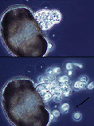
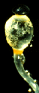
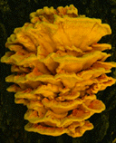
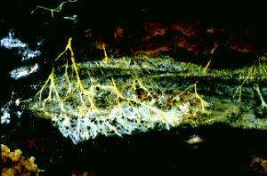
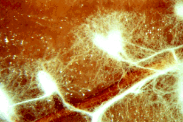
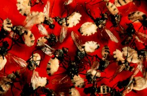
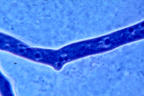
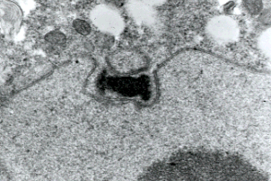
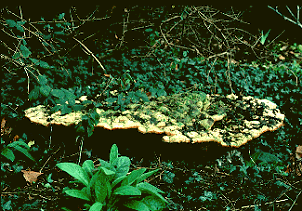
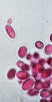

# [[Fungi]] 

#is_a/bio-Kingdom 
#is_a :: [[../../Taxon_Rank/bio~Kingdom|bio~Kingdom]]  

#is_/subject_of ::  [[Fungi/Mycology|Mycology]] 

Eumycota: mushrooms, sac fungi, yeast, molds, rusts, smuts, etc. 

    

#is_/same_as :: [[../../../WikiData/WD~Fungus,764]] 

## #has_/text_of_/abstract 

> A fungus (pl.: **Fungi** or funguses) is any member of the group of eukaryotic organisms 
> that includes microorganisms such as yeasts and molds, as well as the more familiar mushrooms. 
> 
> These organisms are classified as one of the traditional eukaryotic kingdoms, 
> along with Animalia, Plantae, and either Protista or Protozoa and Chromista.
>
> A characteristic that places fungi in a different kingdom from plants, bacteria, 
> and some protists is __chitin in their cell walls__. 
> 
> Fungi, like animals, are heterotrophs; they acquire their food by absorbing dissolved molecules, typically by secreting digestive enzymes into their environment. Fungi do not photosynthesize. Growth is their means of mobility, except for spores (a few of which are flagellated), which may travel through the air or water. Fungi are the principal decomposers in ecological systems. These and other differences place fungi in a single group of related organisms, named the Eumycota (true fungi or Eumycetes), that share a common ancestor (i.e. they form a monophyletic group), an interpretation that is also strongly supported by molecular phylogenetics. This fungal group is distinct from the structurally similar myxomycetes (slime molds) and oomycetes (water molds). The discipline of biology devoted to the study of fungi is known as mycology (from the Greek μύκης mykes, mushroom). In the past, mycology was regarded as a branch of botany, although it is now known that fungi are genetically more closely related to animals than to plants.
>
> Abundant worldwide, most fungi are inconspicuous because of the small size of their structures, and their cryptic lifestyles in soil or on dead matter. Fungi include symbionts of plants, animals, or other fungi and also parasites. They may become noticeable when fruiting, either as mushrooms or as molds. Fungi perform an essential role in the decomposition of organic matter and have fundamental roles in nutrient cycling and exchange in the environment. They have long been used as a direct source of human food, in the form of mushrooms and truffles; as a leavening agent for bread; and in the fermentation of various food products, such as wine, beer, and soy sauce. Since the 1940s, fungi have been used for the production of antibiotics, and, more recently, various enzymes produced by fungi are used industrially and in detergents. Fungi are also used as biological pesticides to control weeds, plant diseases, and insect pests. Many species produce bioactive compounds called mycotoxins, such as alkaloids and polyketides, that are toxic to animals, including humans. The fruiting structures of a few species contain psychotropic compounds and are consumed recreationally or in traditional spiritual ceremonies. Fungi can break down manufactured materials and buildings, and become significant pathogens of humans and other animals. Losses of crops due to fungal diseases (e.g., rice blast disease) or food spoilage can have a large impact on human food supplies and local economies.
>
> The fungus kingdom encompasses an enormous diversity of taxa with varied ecologies, life cycle strategies, and morphologies ranging from unicellular aquatic chytrids to large mushrooms. However, little is known of the true biodiversity of the fungus kingdom, which has been estimated at 2.2 million to 3.8 million species. Of these, only about 148,000 have been described, with over 8,000 species known to be detrimental to plants and at least 300 that can be pathogenic to humans. Ever since the pioneering 18th and 19th century taxonomical works of Carl Linnaeus, Christiaan Hendrik Persoon, and Elias Magnus Fries, fungi have been classified according to their morphology (e.g., characteristics such as spore color or microscopic features) or physiology. Advances in molecular genetics have opened the way for DNA analysis to be incorporated into taxonomy, which has sometimes challenged the historical groupings based on morphology and other traits. Phylogenetic studies published in the first decade of the 21st century have helped reshape the classification within the fungi kingdom, which is divided into one subkingdom, seven phyla, and ten subphyla.
>
> [Wikipedia](https://en.wikipedia.org/wiki/Fungus)

## Phylogeny 

-   « Ancestral Groups  
    -  [Eukarya](../Eukarya.md))
    -   [Tree of Life](../Tree_of_Life.md)

-   ◊ Sibling Groups of  Eukaryotes
    -  [Choanoflagellates](Choanoflagellates.md))
    -  [Animals](Animals.md))
    -   Fungi
    -  [Stramenopiles](Stramenopiles.md))
    -  [Alveolates](Alveolates.md))
    -  [Rhodophyta](Rhodophyta.md))
    -   [Green plants](Plant.md)
    -   [The other protists](The_other_protists)

-   » Sub-Groups
    -  [Basidiomycota](Fungi/Basidiomycota.md))
    -  [Ascomycota](Fungi/Ascomycota.md))
    -  [Glomeromycota](Fungi/Glomeromycota.md))
    -   [Chytridiomycota](Chytridiomycota)
    -  [Zygomycota](Fungi/Zygomycota.md))

## Introduction
[Meredith Blackwell, Rytas Vilgalys, Timothy Y. James, and John W. Taylor](Fungi.md)) 

The organisms of the fungal lineage include mushrooms, rusts, smuts,
puffballs, truffles, morels, molds, and yeasts, as well as many less
well-known organisms (Alexopoulos et al., 1996). About 70,000 species of
fungi have been described; however, some estimates of total numbers
suggest that 1.5 million species may exist (Hawksworth, 1991; Hawksworth
et al., 1995).

As the sister group of animals and part of the eukaryotic crown group
that radiated about a billion years ago, the fungi constitute an
independent group equal in rank to that of plants and animals. They
share with animals the ability to export hydrolytic enzymes that break
down biopolymers, which can be absorbed for nutrition. Rather than
requiring a stomach to accomplish digestion, fungi live in their own
food supply and simply grow into new food as the local environment
becomes nutrient depleted.

Most biologists have seen dense filamentous fungal colonies growing on
rich nutrient agar plates, but in nature the filaments can be much
longer and the colonies less dense. When one of the filaments contacts a
food supply, the entire colony mobilizes and reallocates resources to
exploit the new food. Should all food become depleted, sporulation is
triggered. Although the fungal filaments and spores are microscopic, the
colony can be very large with individuals of some species rivaling the
mass of the largest animals or plants.
)

Figure 1: Hyphae of a wood-decaying fungus found growing on the
underside of a fallen log. The metabolically active hyphae have secreted
droplets on their surfaces. Copyright © M. Blackwell 1996.

Prior to mating in sexual reproduction, individual fungi communicate
with other individuals chemically via pheromones. In every phylum at
least one pheromone has been characterized, and they range from
sesquiterpines and derivatives of the carotenoid pathway in
chytridiomycetes and zygomycetes to oligopeptides in ascomycetes and
basidiomycetes.

Within their varied natural habitats fungi usually are the primary
decomposer organisms present. Many species are free-living saprobes
(users of carbon fixed by other organisms) in woody substrates, soils,
leaf litter, dead animals, and animal exudates. The large cavities eaten
out of living trees by wood-decaying fungi provide nest holes for a
variety of animals, and extinction of the ivory billed woodpecker was
due in large part to loss, through human activity, of nesting trees in
bottom land hardwoods. In some low nitrogen environments several
independent groups of fungi have adaptations such as nooses and sticky
knobs with which to trap and degrade nematodes and other small animals.
A number of references on fungal ecology are available (Carroll and
Wicklow, 1992; Cooke and Whipps, 1993; Dix and Webster, 1995).

However, many other fungi are biotrophs, and in this role a number of
successful groups form symbiotic associations with plants (including
algae), animals (especially arthropods), and prokaryotes. Examples are
lichens, mycorrhizae, and leaf and stem endophytes. Although lichens may
seem infrequent in polluted cities, they can form the dominant
vegetation in nordic environments, and there is a better than 80% chance
that any plant you find is mycorrhizal. Leaf and stem endophytes are a
more recent discovery, and some of these fungi can protect the plants
they inhabit from herbivory and even influence flowering and other
aspects of plant reproductive biology. Fungi are our most important
plant pathogens, and include rusts, smuts, and many ascomycetes such as
the agents of Dutch elm disease and chestnut blight. Among the other
well known associations are fungal parasites of animals. Humans, for
example, may succumb to diseases caused by Pneumocystis (a type of
pneumonia that affects individuals with supressed immune systems),
Coccidioides (valley fever), Ajellomyces (blastomycosis and
histoplasmosis), and Cryptococcus (cryptococcosis) (Kwon-Chung and
Bennett, 1992).
)

Figure 2: The fluffy white hyphae of the mycorrhizal fungus Rhizopogon
rubescens has enveloped the smaller roots of a Virginia pine seedling.
Note that some of the mycelium extends out into the surrounding
environment. Copyright © J. B. Anderson 1996.
)

Figure 3: Entomophthora, \"destroyer of insects\", is the agent of a
fungual infection that kills flies. After their death the fungal growth
erupts through the fly cuticle, and dispersal by forcible spore
discharge is a source of inoculum for infection of new flies. Copyright
© G. L. Barron 1996.

Fungal spores may be actively or passively released for dispersal by
several effective methods. The air we breathe is filled with spores of
species that are air dispersed. These usually are species that produce
large numbers of spores, and examples include many species pathogenic on
agricultural crops and trees. Other species are adapted for dispersal
within or on the surfaces of animals (particularly arthropods). Some
fungi are rain splash or flowing water dispersed. In a few cases the
forcible release of spores is sufficient to serve as the dispersal
method as well. The function of some spores is not primarily for
dispersal, but to allow the organisms to survive as resistant cells
during periods when the conditions of the environment are not conducive
to growth.

Fungi are vital for their ecosystem functions, some of which we have
reviewed in the previous paragraphs. In addition a number of fungi are
used in the processing and flavoring of foods (baker\'s and brewer\'s
yeasts, Penicillia in cheese-making) and in production of antibiotics
and organic acids. Other fungi produce secondary metabolites such as
aflatoxins that may be potent toxins and carcinogens in food of birds,
fish, humans, and other mammals.

A few species are studied as model organisms that can be used to gain
knowledge of basic processes such as genetics, physiology, biochemistry,
and molecular biology with results that are applicable to many organisms
(Taylor et al., 1993). Some of the fungi that have been intensively
studied in this way include Saccharomyces cereviseae, Neurospora crassa,
and Ustilago maydis.

Most phyla appear to be terrestrial in origin, although all major groups
have invaded marine and freshwater habitats. An exception to this
generality is the flagellum-bearing phylum Chytridiomycota, which
probably had an aquatic origin; however, some chytrid species do occur
in terrestrial environments, primarily as plant pathogenic fungi.

### Characteristics

Fungi are characterized by non-motile bodies (thalli) constructed of
apically elongating walled filaments (hyphae), a life cycle with sexual
and asexual reproduction, usually from a common thallus, haploid thalli
resulting from zygotic meiosis, and heterotrophic nutrition. Spindle
pole bodies, not centrioles, usually are associated with the nuclear
envelope during cell division. The characteristic wall components are
chitin (beta-1,4-linked homopolymers of N-acetylglucosamine in
microcrystalline state) and glucans primarily alpha-glucans (alpha-1,3-
and alpha-1,6- linkages) (Griffin, 1994).
)

Figure 4: Portion of a hypha of a zygomycete stained with a blue dye to
show the many nuclei present. Many other fungi have septations that
devide the hyphae into compartments that usually contain one to several
nuclei per compartment. Copyright © M. Blackwell 1996.
)

Figure 5: Transmission electron micrograph showing duplicated spindle
pole body of a prophase I meiotic nucleus of a basidiomycete
Exobasidium. Only chytrids among fungi have centrioles and lack spindle
pole bodies. Copyright © Beth Richardson 1996.

Exceptions to this characterization of fungi are well known, and include
the following: Most species of Chytridiomycota have cells with a single,
smooth, posteriorly inserted flagellum at some stage in the life cycle,
and centrioles are associated with nuclear division. The life cycles of
most Chytridiomycota are poorly studied, but some (Blastocladiales) are
known to have zygotic meiosis (therefore, alternation between haploid
and diploid generations). Certain members of Zygomycota, Ascomycota, and
Basidiomycota may lack hyphal growth during part or all of their life
cycles, and, instead, produce budding yeast cells. Most fungal species
with yeast growth forms contain only minute amounts of chitin in the
walls of the yeast cells. A few species of Ascomycota (Ophiostomataceae)
have cellulose in their walls, and certain members of Chytridiomycota
(Coelomomycetales) lack walls (Alexopoulos et al., 1996).

### Fossil Record

Based on the available fossil record, fungi are presumed to have been
present in Late Proterozoic (900-570 mya). Terrestrial forms of
purported ascomycetes are reported in associations with microarthropods
in the Silurian Period (438-408 mya) (Sherwood-Pike and Gray, 1985).
Fossil hyphae in association with wood decay and fossil chytrids and
Glomales-Endogenales representatives associated with plants of the
Rhynie Chert are reported from the Devonian Period (408-360 mya) (Hass
et al., 1994; Remy et al., 1994a, 1994b; Taylor et al., 1994a, 1995b).
Fungal fossil diversity increased throughout the Paleozoic Era (Taylor
et al., 1994b) with all modern classes reported in the Pennsylvanian
Epoch (320-286 mya).

A first attempt to match molecular data on fungal phylogeny to the
geological record shows general agreement, but does point out some
conflicts between the two types of data (Berbee and Taylor 1993).

### Biogeography

Wherever adequate moisture, temperature, and organic substrates are
available, fungi are present. Although we normally think of fungi as
growing in warm, moist forests, many species occur in habitats that are
cold, periodically arid, or otherwise seemingly inhospitable. It is
important to recognize that optimum conditions for growth and
reproduction vary widely with fungal species. Diversity of most groups
of fungi tends to increase in tropical regions, but detailed studies are
only in their infancy (Isaac et al., 1993).

Although many saprobic and plant pathogenic species with low substrate
specificity and effective dispersal systems have broad distributions,
gene flow appears to be restricted in many fungi. For these species
large bodies of water such as the Atlantic and Pacific Oceans create
barriers to gene exchange. Some distributions are limited by substrate
availability, and dramatic examples come from parasites of Gondowanan
plants; one of these is the Southern Hemisphere distribution of the
ascomycete Cyttaria, corresponding with part of the distribution of its
host plant Nothofagus. The fossil record shows that fungi were present
in Antarctica, as is the case for other organisms with Gondwanan
distributions. Arthropod associates also may show distributions
throughout part or all of a host range, and some fungal species (ex.
wood wasp associates) occur outside the range of the associated
arthropod.

### Notable Fungi

-   The largest basidiocarp known is that of a Rigidioporus ulmarius in
    a shady, hidden-away corner of the Royal Botanic Gardens, Kew,
    Surrey, England. This basidiocarp is mentioned in the Guinness Book
    of Records (Matthews, 1994). At the beginning of each new year the
    Annual Mensuration Ceremony of the basidiocarp takes place. On 19
    January 1996 the basidiocarp had increased to 170 cm maximum length
    (up from 159 in 1995) and 146 cm maximum width (up from 140 in
    1995). It also grew 4 cm taller from the soil level, now measuring
    54 cm. The weight of the basidiocarp has been estimated to be 284 kg
    (625 pounds)! Other large basidiocarps are those of a puffball
    almost 9 feet in circumference in Canada (over 48 pounds) and a
    basidiocarp of the sulfur mushroom in England (100 pounds).

   )

    Figure 6: Largest basidiocarp world record holder Rigidioporus
    ulmarius at Kew. The basidiocarp is shown in its largest dimension
    (170 cm or over 5 1/2 feet). Copyright © D. Pegler 1996.

-   Reproductive structures clearly can be very large, but what about
    the body of the fungus, which often is hidden from view within the
    substrate? One fungus body constructed of tubular filaments (hyphae)
    was brought to our attention when molecular techniques were used to
    show that it was extensive (37 acres and an estimated blue whale
    equivalent size of 110 tons). The Michigan fungus clone (Armillaria
    bulbosa) grew in tree roots and soil. This report drew attention to
    an even larger fungal clone of Armillaria ostoyae, reported earlier
    in the state of Washington, which covered over 1,500 acres. Each
    clone began from the germination of a single spore over a thousand
    years ago. Although they probably have fragmented and are no longer
    continuous bodies, such organisms give us cause to think about what
    constitutes an individual.

-   Penicillium chrysogenum is known for its production of the
    antibiotic penicillin. Although other antibiotics are produced by a
    variety of organisms, penicillin was the first to be developed. In
    the spring of 1996 a long dried out culture of the original isolate
    prepared by its discoverer, Sir Alexander Fleming in the late 1920s,
    was auctioned by Sotheby\'s of London and sold to a pharmaceutical
    company for 23 000 pounds. This price is insignificant when one
    considers the worth of this fungus, not only in sales of penicillin,
    but in terms of illnesses cured and lives saved. In the past a
    simple scratch sometimes could produce a fatal infection such as the
    one that resulted in the death of Tad Lincoln, the son of a U. S.
    president. However, misuse of penicillin and other antibiotics has
    resulted in selection of resistant microorganisms, and the threat of
    untreatable bacterial infections and diseases (for example,
    tuberculosis and syphilis) has returned.

-   Fungal spores fill the air we breathe. On many days in some
    localities the number of fungal spores in the air far exceeds the
    pollen grains. Fungal spores also cause allergies; however, unlike
    seasonal pollen production, some fungi can produce spores all year
    long. The largest number of fungal spores ever sampled was over 5.5
    million per cubic foot in Wales (Matthews, 1994).

-   Basidiomycetes have always attracted a lot of attention because some
    of them have large basidiocarps, but the realization that all fungi
    are important in ecosystem function has drawn more attention to
    microscopic forms as well. For example a report on the secret sex
    life of a yeast-like ascomycete human pathogen, Coccidioides
    immitis, made a headline of the New York Times (6 February 1996, p.
    B7). This fungus causes Valley Fever and is endemic in parts of the
    southwestern United States. Although no one has been able to observe
    sexual reproduction in this species, molecular studies show genetic
    diversity that is best explained by occurrence of sexual
    reproduction in the life cycle.

-   Another yeast-like ascomycete reported in the Dallas Morning News
    (28 August 1995, p. 8D) lives in the gut of cigar beetles and is
    essential to the beetle\'s health. Without the gut fungi to detoxify
    the plant material of toxins, the beetles would be poisoned. Keep on
    the lookout for other reports of fascinating fungal feats.

### Discussion of Phylogenetic Relationships

As presently delimited, the kingdom Fungi is believed to constitute a
monophyletic group that shares some characters with animals such as
chitinous structures, storage of glycogen, and mitochondrial UGA coding
for tryptophan. Only species of the basal Chytridiomycota possess the
primitive character of a single smooth, posteriorly inserted flagellum
(Barr, 1992; Cavalier-Smith, 1987, 1995).

The branch uniting the fungi and animals is well-supported from nuclear
small subunit ribosomal RNA gene (SSU rDNA, or 18S rDNA) sequence
analysis, and also has been supported with studies of elongation factor
and three other proteins: alpha- and beta-tubulin and actin (Baldauf and
Palmer, 1993; Bruns et al., 1991; Wainright et al., 1993). However, the
hypothesis has been challenged by comparison of RNA polymerase gene
sequences and reanalysis of SSU rDNA data (Rodrigo et al., 1994; Sidow
and Thomas, 1994).

In the absence of many derived morphological (other than hyphal growth
in some species) and biochemical characters, Chytridiomycota (previously
characterized by the presence of a flagellate cell in the life cycle)
now has been redefined by SSU rDNA sequence analysis. The study also has
shown that some non-flagellate species traditionally placed in
Zygomycota actually are chytrids (ex. Basidiobolus ranarum) (Nagahama et
al., 1995).

Zygomycota as traditionally delimited on the basis of often non-septate
hyphae and production of zygospores is not monophyletic. The position of
some lineages such as that of Glomales and of Engodonales-Mortierellales
is unclear, but they too may lie outside Zygomycota as independent
lineages basal to the Ascomycota-Basidiomycota lineage (Bruns et al.,
1993; K. O\'Donnell, personal communication, 1996).

Evidence from shared morphological characters such as regularly septate
hyphae and a dikaryotic stage (two separate and different nuclei in a
single hyphal segment) in the life cycle, usually has been interpreted
as support for a close relationship between Basidiomycota and
Ascomycota. SSU rDNA adds support for this hypothesis (Berbee and
Taylor, 1992).

Molecular characters have been essential for phylogenetic analysis in
cases when morphological characters are convergent, reduced, or missing
among the taxa considered. This is especially true of species that never
reproduce sexually, because characters of sexual reproduction
traditionally have been the basis for classification of Fungi. Use of
molecular characters allows asexual fungi to be placed among their
closest relatives. Excluded groups previously considered to be Fungi are
stramenopiles (Oomycota, Hyphochytriomycota, and Labyrinthulomycota) and
slime molds (Myxomycota, Plasmodiomycota, Dictyosteliomycota,
Acrasiomycota) (Bhattacharya et al., 1992; Leipe et al., 1994; Van der
Auwera et al., 1995).

## Title Illustrations

--------------------------------------------------)
  Scientific Name ::  Chytridium (Chytridiomycota)
  Comments          Individual growing on a single pine pollen grain. Successive photos show zoospore release from the sporangium, and the arrow points to a flagellum.
  Copyright ::         © 1996 H. Whisler, M. Fuller

--------------------------------------------------)
  Scientific Name ::     Pilobolus crystallinus (Mucoromycotina)
  Comments             Black sporangium atop swollen sporangiophore. Shortly, the swollen subsporangial vesicle will burst to send the sporangium flying. Herbivores eat the sporangium, and the enclosed mitospores germinate in the dung. The bright yellow carotenoid pigment enables the sporangium to orient to light (phototropism). If you look closely, you can see masses of nematodes on the vesicle; probably herbivore pathogens hoping to hitch a ride.
  Specimen Condition   Live Specimen
  Copyright ::            © 1996 [Meredith Blackwell](http://www.biology.lsu.edu/faculty_listings/fac_pages/mblackwell.html) 
  
---------------------------------------------------------------------------------------------------------------------------------------------)
  Scientific Name ::     Laetiporus sulphureus (Basidiomycota, Agaricomycetes, Polyporales)
  Comments             Massed fruiting bodies of the chicken-of-the-woods. The tiny tubular filaments (hyphae) that make the body of this fungus (mycelium) are growing in the old, dead wood of a large cherry tree. Laetiporus is not a parasite, but the decay may weaken the tree so much that wind or ice storms can topple it.
  Specimen Condition   Live Specimen
  Copyright ::            © 1996 [Meredith Blackwell](http://www.biology.lsu.edu/faculty_listings/fac_pages/mblackwell.html) 

-----------------------------------------------------------------------------------
 
  Scientific Name ::     Sarcoscypha coccinea (Ascomycota, Pezizomycotina, Pezizales)
  Comments             Fruiting body of the scarlet cup fungus. Hundreds of millions of meiospores (ascospores) are discharged from this cup, usually in puffs that produce visible clouds of spores.
  Specimen Condition   Live Specimen
  Copyright ::            © 1996 [Joey Spatafora](http://www.bcc.orst.edu/bpp/faculty/spatafora/index.html) 

## Confidential Links & Embeds: 

### #is_/same_as :: [Fungi](/_Standards/bio/bio~Domain/Eukarya/Fungi.md) 

### #is_/same_as :: [Fungi.public](/_public/bio/bio~Domain/Eukarya/Fungi.public.md) 

### #is_/same_as :: [Fungi.internal](/_internal/bio/bio~Domain/Eukarya/Fungi.internal.md) 

### #is_/same_as :: [Fungi.protect](/_protect/bio/bio~Domain/Eukarya/Fungi.protect.md) 

### #is_/same_as :: [Fungi.private](/_private/bio/bio~Domain/Eukarya/Fungi.private.md) 

### #is_/same_as :: [Fungi.personal](/_personal/bio/bio~Domain/Eukarya/Fungi.personal.md) 

### #is_/same_as :: [Fungi.secret](/_secret/bio/bio~Domain/Eukarya/Fungi.secret.md)

