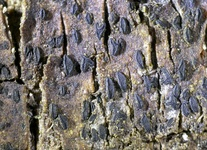
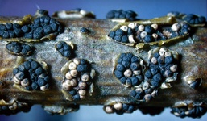
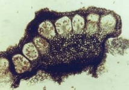
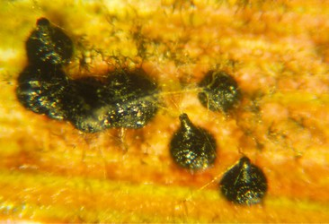
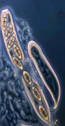
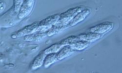
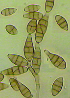
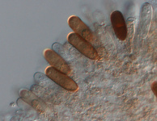
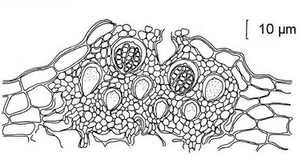

## Phylogeny 

-   « Ancestral Groups  
    -  [Pezizomycotina](../Pezizomycotina.md))
    -  [Ascomycota](../../Ascomycota.md))
    -  [Fungi](../../../Fungi.md))
    -  [Eukarya](../../../../Eukarya.md))
    -   [Tree of Life](../../../../Tree_of_Life.md)

-   ◊ Sibling Groups of  Pezizomycotina
    -  [Lecanoromycetes](Lecanoromycetes.md))
    -  [Eurotiomycetes](Eurotiomycetes.md))
    -  [Leotiomycetes](Leotiomycetes.md))
    -  [Geoglossaceae](Geoglossaceae.md))
    -   Dothideomycetes

-   » Sub-Groups
    -  [Dothideomycetidae](Dothideomycetes/Dothideomycetidae.md))
    -  [Pleosporomycetidae](Dothideomycetes/Pleosporomycetidae.md))
    -   [Uncertainly placed orders and families of         Dothideomycetes](Uncertainly_placed_orders_and_families_of_Dothideomycetes)

# Dothideomycetes 

[Conrad Schoch]()

)

Dothideomycete tree is based on DNA sequences from the large and small
subunits of the  nuclear ribosome, RNA polymerase II second largest
subunit (RPB2) and transcription elongation factor 1 alpha (EF1a)\

Containing group:[Pezizomycotina](../Pezizomycotina.md))

### Information on the Internet

-   [MycoBank](http://www.mycobank.org/).
-   [Assembling the Fungal Tree of Life](http://www.aftol.org/).
-   [Myconet: Outline of     Ascomycota](http://www.fieldmuseum.org/myconet/outline.asp).

## Introduction

The class Dothideomycetes contains the majority of the fungal species
with ascostromatic development and bitunicate asci that were previously
placed in the \"Loculoascomycetes\". The remaining \"Loculoascomycetes\"
are placed in subclass Chaetothyriomycetidae in the diverse order
Eurotiomycetes. Historically the majority of these fungi were placed in
several different groups under various classifications e. g.
"Ascoloculares" (Nannfeldt 1932) "Bitunicatae" (Luttrell 1951)
"Loculoascomycetes" (Luttrell 1955) and "Loculoascomycetidae" (Luttrell
1981). A mixture of these names still remain in use in recent
literature. Dothideomycetes are often found as pathogens, endophytes or
epiphytes of living plants and also as saprobes degrading cellulose and
other complex carbohydrates in dead or partially digested plant matter
in leaf litter or dung. However their nutritional modes are not limited
to associations with plants; several species are lichens, while others
occur as parasites on other fungi or members of the kingdom animalia.
){height="218" width="320"}

Plant pathogenetic Dothideomycetes: Pseudothecia of *Cochliobolus
heterostrophus* on corn leaf seen through a stereo microscope, © Gillian
Turgeon
### Characteristics
)

*Pyrenophora brizae*: Bitunicate asci, one with broken ectotunica. ©
Robert Shoemaker.

To a casual observer there is little to distinguish the flask, spherical
or disk-shaped fruiting bodies of Dothideomycetes from several other
groups in the Ascomycota, but they share a distinctive pattern of
development.  The sexual spore bearing asci develop in pockets (locules)
already formed in an unfertilized mass of hyphae (stroma). This is
defined as ascolocular development and is in contrast to ascohymenial
development found in the majority of other fungal classes.
){height="150" width="249"}

*Guignardia magniferae*: Asci with thick layered ectotunica. © Gary
Samuels

The double layered, or bitunicate, ascus remains an important character
in dothideomycete taxonomy. Bitunicate asci consists of a thick
extensible inner layer (endotunica) and a thin inextensible outer layer
(ectotunica).  Most bitunicate fungi release their ascospores by the
extension of the inner ascus wall and the rupture of the outer wall,
similar to a \"jack-in-the-box\" (fissitunicate), but variations are
numerous. The broken ectotunica is  seen in the picture on the right,
and another set of asci with the thick layered ectotunica is shown in
the picture on the left.

Another important character, the centrum, is defined as the tissues and
cells occupying the cavity of the sexual structure.  The hamathecium
(Eriksson 1981), i. e. the sterile centrum tissues existing between the
asci, is one of the most reliable characters used to delineate ordinal
classifications within the Dothideomycetes (see drawings below).
)

*Alternaria alternata*: Conidia produced in acropetal chains.\
© Keith Seifert

The best studied species in this class tend to be plant pathogens on
important agricultural crops. Therefore a large body of work in
dothideomycete taxonomy and systematics concerns descriptions of asexual
states or anamorphs, the predominant morphological state encountered on
agricultural crops. In fact, several families in this class (e. g.,
Pleosporaceae, Mycosphaerellaceae, Tubeufiaceae) include a high
proportion of purely anamorphic species. Many of the anamorphs produce
their asexual spores or conidia in chains bourne on specialized hypha,
known as conidiophores such as the *Alternaria* species pictured on the
left.
)

*Dothiorella* sp.:  Conidia borne in pycnidium. © Pedro Crous

In other cases the conidia are within enclosed flask shaped structres
(pycnidia) also occuring in several families (e. g., Leptosphaeriaceae,
Lophiostomataceae). Pictured to the right is a microscope squash slide
sample of conidia from a pycnidium.  Other important species include the
remainder of the group now informally referred to as the \"black
yeasts\" (the majority of which now belong to the Eurotiomycetes)
characterized by the production of dark, slimy colonies and sporulation
patterns that resemble the budding of true yeasts, but are actually
reduced versions of cells bearing the conidia directly.

Several classification systems for Dothideomycetes exist but the most
important concepts revolves around three different developmental types
originally exemplified by the genera *Dothidea*, *Pleospora* and
*Elsinoё* (Luttrell 1951, 1955) and later extended (e. g. Barr, 1987).
These species form part of the orders, Dothideales, Pleosporales and
Myriangiales.  The presence of pseudoparaphyses (sterile cells extending
down from the upper portion of the sexual structures, initially attached
at both ends, although the upper part may become free) is a notable
character for the Pleosporales, together with mainly ostiolate flask
shaped sexual structures. Conversely, the absence of pseudoparaphyses
and the presence of groups of asci are important in the Dothideales. 
The Myriangiales also do not have pseudoparaphyses, but produce single
asci in multiple locules.  Several additional orders, defined by
combining centrum and ascomal characters, form part of the most recent
classification proposed by Eriksson (2006).
)

1\. *Dothidea sambuci*, multiascus locules typical of the *Dothidea*
type centrum. 2. *Elsinoё canavaliae*: Single ascus locules typical of
the *Elsinoё* type centrum. 3. *Pleospora herbarum*, several asci in a
flask a shaped sexual structure (pseudothecium) with pseudoparaphyses
exemplifying the *Pleospora* type centrum. Drawings from Von Arx and
Müller (1974), © [The Centraalbureau voor Schimmelcultures](http://www.cbs.knaw.nl/).
### Discussion of Phylogenetic Relationships

The use of molecular data, mainly as DNA sequences obtained from the
ribosomal RNA genes, has added additional challenges for mycologists
trying to describe a defining morphology for the Dothideomycetes. A
group of fungi with bitunicate asci and ascolocular development, broadly
known as \"black yeasts\" were moved from this class to the
Eurotiomycetes and the subclass Chaetothyriomycetidae, mainly based on
DNA sequence data. Some species in this informal group are still
retained in the Dothideomycetes however. This emphasizes the fact that a
number of morphological characters in these groups are either due to the
retention of ancestral characters, or convergent evolution. The large
number of genera that remain uncertainly classified in either
Dothideomycetes or Chaetothyriomycetidae is a testament to this.

The latest phylogenetic evidence (Schoch et al. 2006) finds support for
at least two large groups (newly designated as subclasses) correlating
with the three orders mentioned above. The two orders without
pseudoparaphyses (Dothideales and Myriangiales) were shown to be related
in Dothideomycetidae, while the large order with pseudoparaphyses
(Pleosporales) formed most of Pleosporomycetidae. This builds on
pioneering molecular studies done by several authors before (e. g.
Berbee, 1996; Liew et al 2000; Lindemuth et al 2001). Several orders and
groups remain unplaced, and several more do not have representative DNA
sequences. For example, a number of lichen lineages in the
Trypetheliaceae previously thought to be related to groups in the
Eurotiomycetes are now placed in Dothideomycetes based on molecular data
(Del Prado et al. 2006). It therefore seems clear that this part of the
tree of life will remain quite dynamic for the foreseeable future.

### References

Arx von J, Müller E. 1975. A re-evaluation of the bitunicate ascomycetes
with keys to families and genera. Studies in Mycology 9:1-159.

Barr ME. 1987. Prodromus to class Loculoascomycetes. Amherst, Mass.:
M.E. Barr Bigelow. 168 p.

Berbee ML. 1996. Loculoascomycete origins and evolution of filamentous
ascomycete morphology based on 18S rRNA gene sequence data. Molecular
Biology and Evolution 13:462-470.

Del Prado RI, Schmitt I, Kautz S, Palice R, Lücking R, Lumbsch HT. 2006.
Morphological and molecular evidence place the Tryphetheliaceae in the
Dothideomycetes. Mycological Research 110: 511-520.

Eriksson OE. 1981. The families of bitunicate ascomycetes. Opera
Botanica 60:1-220.

Liew, E. C., Aptroot, A. and Hyde, K. D. 2000. Phylogenetic significance
of the pseudoparaphyses in Loculoascomycete taxonomy. Molecular
Phylogenetics and Evolution 16: 392-402.

Lindemuth R, Wirtz N, Lumbsch HT. 2001. Phylogenetic analysis of nuclear
and mitochondrial rDNA sequences supports the view that
loculoascomycetes (Ascomycota) are not monophyletic. Mycological
Research 105:1176-1181.

Nannfeldt JA. 1932. Studien über die Morphologie und Systematik der
nicht-lichenisierten inoperculaten Discomyceten. Nova Acta Regiae
Societatia Scientiarum upsalensis. (Inaugural dissertation) Uppsala:
Almqvist & Wiksells. 368p.

Luttrell ES. 1951. Taxonomy of Pyrenomycetes. University of Missouri
Studies in Sciences. 24.

Luttrell ES. 1955. The ascostromatic Ascomycetes. Mycologia 47:511-532.

Luttrell ES. 1981. The Pyrenomycete centrum---Loculoascomycetes. In:
Reynolds DR, editor. Ascomycete Systematics: The Luttrellian Concept.
New York: Springer-Verlag. p 124--137.

Schoch CL, Shoemaker RA, Seifert KA, Hambleton S, Spatafora JW, Crous
PW. 2006.A multigene phylogeny of the Dothideomycetes using four nuclear
loci. 2006. Mycologia 98:1043-1054

## Title Illustrations

)

  ----------------------------
  Scientific Name ::     Hysteropatella prostii
  Location ::           Germany, Baden-Württemberg, Tübingen, Pfrondorf
  Comments             Hysterothecia of Hysteropatella prostii on living trunk of Malus domestica
  Specimen Condition   Live Specimen
  Identified By        H.-O. Baral
  Life Cycle Stage ::     Teleomorph
  Body Part            Ascoma
  Copyright ::            © [H.-O. Baral](mailto:zotto@t-online.de)
  ----------------------------
)

  ---------------------------
  Scientific Name ::     Cucurbitaria laburni
  Location ::           Austria, Wien 12, Schömbrunn, \"Gloriette, Weg zur Hohenbergstraße\"
  Comments             Pseudothecia of Cucurbitaria laburni on branch of Laburnum anagyroides
  Specimen Condition   Live Specimen
  Identified By        Walter Jaklitsch
  Life Cycle Stage ::     Teleomorph
  Body Part            Ascoma
  Copyright ::            © [H.-O. Baral](mailto:zotto@t-online.de)
  ---------------------------
)

  ---------------------
  Scientific Name ::     Stylodothis puccinioides
  Comments             Multiascus locules
  Specimen Condition   Live Specimen
  Identified By        Robert Shoemaker
  Sex ::                Teleomorph
  Copyright ::            © [Robert Shoemaker](mailto:SHOEMAKERB@AGR.GC.CA)
  ---------------------

## Confidential Links & Embeds: 

### #is_/same_as :: [Dothideomycetes](/_Standards/bio/bio~Domain/Eukarya/Fungi/Ascomycota/Pezizomycotina/Dothideomycetes.md) 

### #is_/same_as :: [Dothideomycetes.public](/_public/bio/bio~Domain/Eukarya/Fungi/Ascomycota/Pezizomycotina/Dothideomycetes.public.md) 

### #is_/same_as :: [Dothideomycetes.internal](/_internal/bio/bio~Domain/Eukarya/Fungi/Ascomycota/Pezizomycotina/Dothideomycetes.internal.md) 

### #is_/same_as :: [Dothideomycetes.protect](/_protect/bio/bio~Domain/Eukarya/Fungi/Ascomycota/Pezizomycotina/Dothideomycetes.protect.md) 

### #is_/same_as :: [Dothideomycetes.private](/_private/bio/bio~Domain/Eukarya/Fungi/Ascomycota/Pezizomycotina/Dothideomycetes.private.md) 

### #is_/same_as :: [Dothideomycetes.personal](/_personal/bio/bio~Domain/Eukarya/Fungi/Ascomycota/Pezizomycotina/Dothideomycetes.personal.md) 

### #is_/same_as :: [Dothideomycetes.secret](/_secret/bio/bio~Domain/Eukarya/Fungi/Ascomycota/Pezizomycotina/Dothideomycetes.secret.md)

