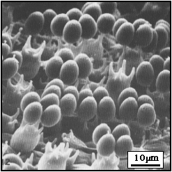
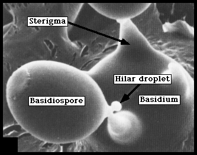
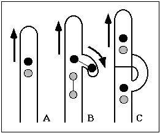

# [[Basidiomycota]]

))

#is_/same_as :: [[../../../../WikiData/WD~Basidiomycota,174698|WD~Basidiomycota,174698]] 

## The Club Fungi 

[Eric Swann and David S. Hibbett]()

## Introduction

The Basidiomycota contains about 30,000 described species, which is 37%
of the described species of true Fungi (Kirk et al. 2001). The most
conspicuous and familiar Basidiomycota are those that produce mushrooms,
which are sexual reproductive structures. The Basidiomycota also
includes yeasts (single-celled forms; Fell et al. 2001) and asexual
species. Basidiomycota are found in virtually all terrestrial
ecosystems, as well as freshwater and marine habitats (Kohlmeyer and
Kohlmeyer, 1979; Hibbett and Binder, 2001).

Basidiomycota have a huge impact on human affairs and ecosystem
functioning. Many Basidiomycota obtain nutrition by decaying dead
organic matter, including wood and leaf litter. Thus, Basidiomycota play
a significant role in the carbon cycle. Unfortunately, Basidiomycota
frequently attack the wood in buildings and other structures, which has
negative economic consequences for humans.

Symbiotic lifestyles (intimate associations with other living organisms)
are well developed in the Basidiomycota. Symbiotic Basidiomycota include
important plant pathogens, such as \"rusts\" (Uredinales) and \"smuts\"
(Ustilaginales), which attack wheat and other crops. Other symbiotic
Basidiomycota cause diseases in animals, including humans. Not all
symbiotic Basidiomycota cause obvious harm to their partners, however.
For example, some Basidiomycota, as well as a handful of Ascomycota,
form ectomycorrhizae, which are associations with the roots of vascular
plants (principally forest trees such as oaks, pines, dipterocarps, and
eucalypts; Smith and Read, 1997). Ectomycorrhizal Basidiomycota help
their plant partners obtain mineral nutrients from the soil, and in
return they receive sugars that the plants produce through
photosynthesis. Other symbiotic Basidiomycota form associations with
insects, including leaf-cutter ants, termites, scale insects, woodwasps,
and bark beetles (Wheeler and Blackwell, 1984; Mueller et al., 1998).

Humans have found diverse uses for Basidiomycota. Mushrooms, both
cultivated and wild, are eaten in many countries. For the untrained,
mushroom-hunting is a risky endeavor, because some Basidiomycota produce
deadly toxins (Benjamin 1995). The basidiomycete toxin phalloidin (from
the mushroom *Amanita phalloides*) binds actin, which is a component of
microfilaments. Fluorescent stains that incorporate phalloidin are used
by cell biologists to visualize the cytoskeleton. Other \"toxins\"
produced by Basidiomycota include hallucinogens, which are produced by
members of the genus *Psilocybe* (and other groups). Species of
*Psilocybe* have traditionally been used in Central American indigenous
cultures as a spiritual tool, and are now cultivated for the illicit
drug trade. Other biochemical compounds of Basidiomycota that have
practical uses include astaxanthin, a red pigment produced by the
basidiomycetous yeast *Phaffia* (used to add color to farmed salmon),
and certain enzymes from wood-decaying Basidiomycota that have potential
applications in paper production and bioremediation (decontamination of
polluted environments using biological agents).

### Characteristics

Basidiomycota are unicellular or multicellular, sexual or asexual, and
terrestrial or aquatic. Indeed, Basidiomycota are so variable that it is
impossible to identify any morphological characteristics that are both
unique to the group and constant in the group. The most diagnostic
feature is the production of **basidia** (sing. basidium), which are the
cells on which sexual spores are produced, and from which the group
takes its name. A long-lived **dikaryon**, in which each cell in the
thallus contains two haploid nuclei resulting from a mating event, is
another characteristic feature. Finally, **clamp connections** are a
kind of hyphal outgrowth that is unique to Basidiomycota, although they
are not present in all Basidiomycota. The following description of the
characteristics of Basidiomycota traces the life cycle of a \"typical\"
species, beginning at the site of meiosis.

The **basidium** is the cell in which karyogamy (nuclear fusion) and
meiosis occur, and on which haploid basidiospores are formed (basidia
are not produced by asexual Basidiomycota). Many Basidiomycota produce
basidia on multicellular fruiting bodies (e.g., mushrooms), but basidia
can also be formed directly from yeasts or other single cells. There is
a great range of variation in morphology of the basidium, the number of
spores formed, and how the spores are borne on the surface of the
basidium (Ingold 1991). Typically, four spores are produced on each
basidium, at the tips of minute stalks called sterigmata (Fig. 1). Each
spore usually contains one or two of the haploid meiotic products.
)

Figure 1. SEM of the surface of a mushroom gill (*Coprinus cinereus*:
Agaricomycotina) showing several basidia, some with four basidiospores
attached.\
(From McLaughlin, et al. 1985; used with permission © McLaughlin,
Beckett and Yoon 1985.)

One of the most fascinating characteristics of Basidiomycota is the
production of forcibly discharged **ballistospores** (Fig. 2), which are
propelled into the air from the sterigma. Ballistospores may be sexual
or asexual, and may be produced by basidia, hyphae, yeast cells, or even
other ballistospores. This type of spore discharge must have evolved
very early in the evolutionary history of the Basidiomycota as it is
found in members of the earliest diverging lineages within the group.
Ballistospory is associated with forms that disperse their spores
directly into the air. Most aquatic Basidiomycota and forms that produce
spores inside the fruiting body, such as puffballs, have lost
ballistospory.

Ballistospory is associated with the production of a liquid filled
\"hilar droplet\" that forms at the base of the spore, just above its
attachment to the sterigma (Fig. 2). Resolving the mechanism of
ballistospory has been a longstanding problem in mycology (Buller 1909,
1922; Ingold 1939; McLaughlin et al. 1985; Webster et al. 1984a, b; Yoon
and McLaughlin 1986). In a series of studies, reviewed by Money (1998),
it has been shown that spore discharge occurs when the hilar droplet
fuses with a film of liquid on the surface of the spore. The rapid
coalescence of the liquids causes a sudden shift in the center of mass
of the spore and contributes to its release from the sterigma. This
mechanism has been termed a \"surface tension catapult\" and it results
in spores being discharged with a force of about 25,000 *g* (Money 1998,
Pringle et al. 2005).
)

Figure 2. Scanning electron micrograph showing the hilar droplet at the
base of a basidiospore (*Coprinus cinereus*: Agaricomycotina).\
(From McLaughlin et al. 1985)

Basidiospores germinate to form hyphae (filaments) or yeast cells that
are typically haploid and uninucleate. The hyphae of Basidiomycota are
septate. Ultrastructural features of the septa, visible with
transmission electron microscopy, have been important in developing
phylogenetic hypotheses in Basidiomycota (see the[Agaricomycotina](Basidiomycota/Agaricomycotina.md)) page).

Mating in Basidiomycota involves fusion of haploid cells, but fusion of
the nuclei is usually delayed until the basidia are formed. Thus, the
dominant phase of the life cycle in most Basidiomycota is a
**dikaryon**, in which the two nuclei brought together in mating exist
side-by-side in each cell (Fig. 3A). Sometimes a dikaryon can donate a
nucleus to a uninucleate \"monokaryon\", resulting in a \"di-mon\"
mating.

**Clamp connections** are hyphal outgrowths that form when cells in
dikaryotic hyphae divide. One of the nuclei divides in the main axis of
the hypha, while the other divides into the clamp (Fig. 3B). Septa are
formed across each of the mitotic spindles. The apex of the
backward-growing monokaryotic clamp cell fuses with the subapical cell,
reestablishing the dikaryotic condition (Fig. 3C). All fungi that
produce clamp connections are members of the Basidiomycota, but not all
Basidiomycota produce clamp connections. The regular formation of clamp
connections must have developed early in basidiomycete evolution,
because they are found in all the major clades of Basidiomycota.

Sexually reproducing Ascomycota also form dikaryons, although they are
not as long-lived as those of Basidiomycota. The clade that includes
Ascomycota and Basidiomycota has been called the Dikaryomycotina,
reflecting this presumably homologous similarity. Ascomycota produce
clamp-like \"croziers\" at the bases of asci (cells in which meiosis
occurs, homologous to basidia). Croziers may be homologous to clamp
connections.
)

Figure 3. Diagram of clamp cell formation: A. Dikaryotic hypha, arrow
shows direction of hyphal tip growth.\
B. Clamp cell growing backward, nuclei undergoing synchronous division.\
C. Mature clamp.\
Illustrations © E. Swann 1997.

### Discussion of Phylogenetic Relationships

There is strong evidence that the Basidiomycota is monophyletic.
Ballistospores, basidia, and clamp connections are present in the
Agaricomycotina, Ustilaginomycotina, and Pucciniomycotina (although not
in all species), suggesting that they have a common origin.
Non-molecular characters that have been used to recognize major groups
within the Basidiomycota include the form of the basidia (shape and
septation), ultrastructure of hyphal septa and spindle pole bodies,
presence or absence of yeast phases and \"spore repetition\" (production
of spores directly from spores), and cellular carbohydrate composition
(McLaughlin et al. 1995; Oberwinkler, 1987; Prillinger et al. 1990,
1991). Sequences of ribosomal RNA (rRNA) genes, recently supplemented by
protein-coding genes, have played a major role in increasing our
understanding of the relationships within Basidiomycota, and have
demonstrated that some morphological attributes that have been
emphasized in higher-level classification, such as the form of basidia,
are subject to homoplasy (Swann and Taylor 1993, 1995, Swann et al.
1999).

Three major clades are strongly supported within the Basidiomycota: 1)
Pucciniomycotina includes rusts (Pucciniales) and other taxa (Swann et
al. 2001, Aime et al. 2006); 2) Ustilaginomycotina includes smuts
(Ustilaginales) and others (Bauer et al. 2001, Begerow et al. 2006); and
3) Agaricomycotina includes mushrooms (Agaricomycetes), jelly fungi
(Auriculariales, Dacrymycetales, Tremellales) and others (Hibbett and
Thorn 2001, Swann and Taylor 1995, Wells and Bandoni 2001, Hibbett
2006). Monophyly of each of these groups has been supported in
phylogenetic analyses of rRNA gene sequences and protein-coding genes
(Hibbett et al. 2007). Similarities in the ultrastructure of septal
pores and spindle pole bodies (McLaughlin et al. 1995) suggest that
Ustilaginomycotina and Agaricomycotina could be sister groups, and some
molecular phylogenies also support this topology. The placements of the
Wallemiomycetes (a group of osmophilic molds) and Entorrhizomycetes (a
group of root-inhabiting Fungi, previously classified in the
Ustilaginomycotina \[Bauer et al. 2001\]) are particularly problematical
(Matheny et al. 2006). At present, these are classified as \"incertae
sedis\" within the Basidiomycota (Hibbett et al. 2007), but with the
application of genome-scale datasets their placements may be resolved.\

## Phylogeny 

-   « Ancestral Groups  
    -  [Fungi](../Fungi.md))
    -  [Eukarya](../../Eukarya.md))
    -   [Tree of Life](../../Tree_of_Life.md)

-   ◊ Sibling Groups of  Fungi
    -   Basidiomycota
    -  [Ascomycota](Ascomycota.md))
    -  [Glomeromycota](Glomeromycota.md))
    -   [Chytridiomycota](Chytridiomycota)
    -  [Zygomycota](Zygomycota.md))

-   » Sub-Groups
    -  [Agaricomycotina](Basidiomycota/Agaricomycotina.md))
    -   [Ustilaginomycetes](Ustilaginomycetes)
    -   [Urediniomycotina](Urediniomycotina)

- Containing group: [Fungi](../Fungi.md) 

### Information on the Internet

-   [Culture Collection of     Basidiomycetes](http://www.biomed.cas.cz/ccbas/fungi.htm). Institute
    of Microbiology, Academy of Sciences of the Czech Republic.
-   [The Microbial World:     Basidiomycota](http://helios.bto.ed.ac.uk/bto/microbes/basidio.htm).
-   [Mycological Society of America](http://www.msafungi.org/).
    Extensive links to sites concerned with Basidiomycota and other
    fungi.
-   [Tom Volk's Fungi](http://botit.botany.wisc.edu/toms_fungi/). An
    amazing collection of information, images, and lore about fungi.
-   [Bioimages: The Virtual Field Guide (UK)     Basidiomycota](http://www.bioimages.org.uk/HTML/T404.HTM).
    Collection of Basidiomycota images.
-   [The WWW Virtual Library: mycology](http://mycology.cornell.edu/).
-   [Deep Hypha Research Coordination     Network](http://ocid.nacse.org/research/deephyphae/). Deep Hypha is
    a project to coordinate and provide resources for research in fungal
    systematics.
-   [AFTOL: Assembling the Fungal Tree of     Life](http://ocid.nacse.org/research/aftol/). Collaborative research
    in fungal phylogenetics.

### References

Aime, M. C., P. B. Matheny, D. A. Henk, E. M. Frieders, R. H. Nilsson,
D. J. McLaughlin, L. J. Szabo, and D. S. Hibbett. 2006. An overview of
the higher-level classification of Pucciniomycotina based on combined
analyses of nuclear large and small subunit rDNA sequences. Mycologia
98: 869-905.

Alexopoulos, C.J., Mims, C.W. and Blackwell, M. 1996. Introductory
Mycology. John Wiley and Sons, New York.

Arora, D. 1986. Mushrooms Demystified. Ten Speed Press, Berkeley,
California.

Bauer, R., Begerow, D., Oberwinkler, F., Piepenbring, M. and Berbee, M.
L 2001. Ustilaginomycetes. Pp. 57-84. In: The Mycota VII. Systematics
and Evolution. Part B. (Mclaughlin, D. J., McLaughlin, E. G. and Lemke,
P. A., eds.). Springer-Verlag, Berlin.

Begerow D, Stoll M, and R. Bauer. 2006. A phylogenetic hypothesis of
Ustilaginomycotina based on multiple gene analyses and morphological
data. Mycologia 98: 906--916.

Benjamin, D.R. 1995. Mushrooms: poisons and panaceas. W.H. Freeman and
Company, New York.

Buller, A.H.R. 1909-1934. Researches on Fungi (6 vols.) Longmans, Green
and Co., London.

Fell, J. W., Boekhout, T., Fonseca, A. and Sampaio J.P. 2001.
Basidiomycetous yeasts. Pp. 1-36. In: The Mycota VII. Systematics and
Evolution. Part B. (Mclaughlin, D. J., McLaughlin, E. G. and Lemke, P.
A., eds.). Springer-Verlag, Berlin.

Hibbett, D. S. 2006. A Phylogenetic overview of the Agaricomycotina.
Mycologia 98: 917-925.

Hibbett, D. S., and Binder, M. 2001. Evolution of marine mushrooms.
Biol. Bull. 201:319-322.

Hibbett, D. S., M. Binder, J. F. Bischoff, M. Blackwell, P. F. Cannon,
O. E. Eriksson, S. Huhndorf, T. James, P. M. Kirk, R. Lücking, T.
Lumbsch, F. Lutzoni, P. B. Matheny, D. J. Mclaughlin, M. J. Powell, S.
Redhead, C. L. Schoch, J. W. Spatafora, J. A. Stalpers, R. Vilgalys, M.
C. Aime, A. Aptroot, R. Bauer, D. Begerow, G. L. Benny, L. A.
Castlebury, P. W. Crous, Y.-C. Dai, W. Gams, D. M. Geiser, G. W.
Griffith, C. Gueidan, D. L. Hawksworth, G. Hestmark, K. Hosaka, R. A.
Humber, K. Hyde, J. E. Ironside, U. Kõljalg, C. P. Kurtzman, K.-H.
Larsson, R. Lichtwardt, J. Longcore, J. Miądlikowska, A. Miller, J.-M.
Moncalvo, S. Mozley-Standridge, F. Oberwinkler, E. Parmasto, V. Reeb, J.
D. Rogers, C. Roux, L. Ryvarden, J. P. Sampaio, A. Schüßler, J.
Sugiyama, R. G. Thorn, L. Tibell, W. A. Untereiner, C. Walker, Z. Wang,
A. Weir, M. Weiß, M. M. White, K. Winka, Y.-J. Yao, N. Zhang. 2007. A
higher-level phylogenetic classification of the Fungi. Mycological
Research 111: in press.

Hibbett, D. S. and Thorn, R. G. 2001. Homobasidiomycetes. Pp. 121-170.
In: The Mycota VII. Systematics and Evolution. Part B. (Mclaughlin, D.
J., McLaughlin, E. G. and Lemke, P. A., eds.). Springer-Verlag, Berlin.

Ingold, C.T. 1939. Spore discharge in land plants. Oxford University
Press, London, UK.

Ingold, C.T. 1991. A view of the active basidium in
heterobasidiomycetes. Mycol. Res. 95: 618-621.

Kirk, P.M., Cannon, P.F., David, J.C., and Stalpers, J. 2001. Ainsworth
and Bisby's Dictionary of the Fungi. 9th ed. CAB International,
Wallingford, UK.

Kohlmeyer, J., and Kohlmeyer, E. 1979. Marine Mycology---The Higher
Fungi. Academic Press, New York.

McLaughlin, D.J. 1982. Ultrastructure and cytochemistry of basidial and
basidiospore development. In: Basidium and Basidiocarp. Wells, K. and
Wells, E.K. (eds.) Springer-Verlag, New York.

McLaughlin, D.M., Beckett, A. and Yoon, K.S. 1985. Ultrastructure and
evolution of ballistosporic basidiospores. Bot. J. Linnean Soc. 91:
253-271.

McLaughlin, D.J., Frieders, E.M. and Lü, Haisheng. 1995. A
microscopist\'s view of heterobasidiomycete phylogeny. Stud. Mycol. 38:
91-109.

Money, N. P. 1998. More g\'s than the space shuttle: ballistospore
discharge. Mycologia 90:547-558.

Mueller, U. G., S. A. Rehner, and T. R. Schultz. 1998. The evolution of
agriculture in ants. Science 281: 2034-2038.

Oberwinkler, F. 1977. Das neue System der Basidiomyceten. In: Beiträge
zur Biologie der niederen Pflanzen. Frey, H., Hurka, H., Oberwinkler, F.
(eds.) G. Fischer, Stuttgart.

Oberwinkler, F. 1987. Heterobasidiomycetes with ontogenetic
yeast-stages - systematic and phylogenetic aspects. Stud. Mycol. 30:
61-74.

Prillinger, H. Dörfler, C. Laaser, G. and Hauska, G. 1990. A
contribution to the systematics and evolution of higher fungi:
yeast-types in the basidiomycetes. Part III: Ustilago-type. Z. Mycol.
56: 251-278.

Prillinger, H., Laaser, G., Dörfler, C. and Ziegler, K. 1991. A
contribution to the systematics and evolution of higher fungi:
yeast-types in the basidiomycetes. Part IV: Dacrymyces-type,
Tremella-type. Sydowia 43: 170-218.

Pringle, A., S. N. Patek, M. Fischer, J. Stolze, and N. P. Money. 2005.
The captured launch of a ballistospore. Mycologia 97: 866-871.

Smith, S. E. and Read, D. J. 1997. Mycorrhizal symbiosis. Academic
Press, San Diego.

Sugiyama, J., Fukagawa, M, Chiu, S.-W. and Komagata, K. 1985. Cellular
carbohydrate composition, DNA base composition, ubiquinone systems, and
diazonium blue B color test in the genera Rhodosporidium,
Leucosporidium, Rhodotorula and related basidiomycetous yeasts. J. Gen.
Appl. Microbiol. 31: 519-550.

Summerbell, R.C. 1985. The staining of filamentous fungi with diazonium
blue B. Mycologia 77: 587-593.

Swann, E.C., Frieders, E.M. and McLaughlin, D.J. 1999. Microbotryum,
Kriegeria and the changing paradigm in basidiomycete classification.
Mycologia 91:51-66.

Swann, E.C., Frieders, E.M. and McLaughlin, D.J. 2001. Urediniomycetes.
Pp. 37-56. In: The Mycota VII. Systematics and Evolution. Part B.
(Mclaughlin, D. J., McLaughlin, E. G. and Lemke, P. A., eds.).
Springer-Verlag, Berlin.

Swann, E.C. and Taylor, J.W. 1993. Higher taxa of basidiomycetes: an 18S
rRNA gene perspective. Mycologia 85: 923-936.

Swann, E.C. and Taylor, J.W. 1995. Phylogenetic perspectives on
basidiomycete systematics: evidence from the 18S rRNA gene. Canad. J.
Bot. 73: S862-S868.

Webster, J., Davey, R.A. and Ingold, C.T. 1984a. Origin of the liquid in
Buller\'s drop. Trans. Br. Mycol. Soc. 83: 524-527.

Webster, J., Davey, R.A., Duller, G.A. and Ingold, C.T. 1984b.
Ballistospore discharge in Itersonilia perplexans. Trans. Br. Mycol.
Soc. 82: 13-29.

Wells, K., and Bandoni, R. J. 2001. Heterobasidiomycetes. Pp. 85-120.
In: The Mycota VII. Systematics and Evolution. Part B. (Mclaughlin, D.
J., McLaughlin, E. G. and Lemke, P. A., eds.). Springer-Verlag, Berlin.

Wheeler, Q. and Blackwell, M. 1984. Fungus-insect relationships.
Columbia University Press, New York.

Yoon, K.S. and McLaughlin, D.J. 1986. Basidiosporogenesis in Boletus
rubinellus II. Late spore development. Mycologia 78: 185-197.

## Title Illustrations

)

  -----------------------------
  Scientific Name ::                    Gymnosporangium juniperi-virginianae

  Comments                            Spore producing structures of the cedar-apple rust fungus
                                      (Pucciniomycotina) on an apple leaf.\
                                      This was the \"fungus of the month\" in May, 1999, at [Tom                                       Volk's Fungi web                                       site](http://botit.botany.wisc.edu/toms_fungi/may99.html)

  Acknowledgements                    Photo courtesy D. H. Scott, from [APSnet Image of the                                       Week](http://www.apsnet.org/online/archive/1998/rust044.htm).

  Body Part                           Spore producing structures (Spermogonia-left, and aecia-right)

  Copyright ::                           © APS Press
  -----------------------------
)

  -----------------------------------------
  Scientific Name ::   Tilletia controversa
  Comments           Teliospores of the dwarf bunt fungus (Ustilaginomycotina)
  Acknowledgements   Photo courtesy B. Goates, from [APSnet Image of the Week](http://www.apsnet.org/online/archive/1998/barley81.htm)
  Life Cycle Stage ::   teliospores
  Copyright ::          © APS Press
  -----------------------------------------
)

  -----------------------------------------------------------------------------
  Scientific Name ::  Amanita rubrovaginata
  Comments          Fruiting structures of the mushroom Amanita rubrovaginata (Agaricomycotina)
  Body Part         Fruiting structures
  Copyright ::         © 2003 [David S. Hibbett](http://www.clarku.edu/faculty/dhibbett/) 
  -----------------------------------------------------------------------------

## Confidential Links & Embeds: 

### #is_/same_as :: [Basidiomycota](/_Standards/bio/bio~Domain/Eukarya/Fungi/Basidiomycota.md) 

### #is_/same_as :: [Basidiomycota.public](/_public/bio/bio~Domain/Eukarya/Fungi/Basidiomycota.public.md) 

### #is_/same_as :: [Basidiomycota.internal](/_internal/bio/bio~Domain/Eukarya/Fungi/Basidiomycota.internal.md) 

### #is_/same_as :: [Basidiomycota.protect](/_protect/bio/bio~Domain/Eukarya/Fungi/Basidiomycota.protect.md) 

### #is_/same_as :: [Basidiomycota.private](/_private/bio/bio~Domain/Eukarya/Fungi/Basidiomycota.private.md) 

### #is_/same_as :: [Basidiomycota.personal](/_personal/bio/bio~Domain/Eukarya/Fungi/Basidiomycota.personal.md) 

### #is_/same_as :: [Basidiomycota.secret](/_secret/bio/bio~Domain/Eukarya/Fungi/Basidiomycota.secret.md)

