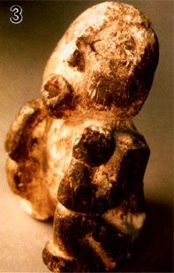

---
aliases:
  - Agaricomycetes
title: Agaricomycetes
---

## Phylogeny 

-   « Ancestral Groups  
    -  [Agaricomycotina](../Agaricomycotina.md) 
    -  [Basidiomycota](../../Basidiomycota.md) 
    -  [Fungi](../../../Fungi.md) 
    -  [Eukarya](../../../../Eukarya.md) 
    -   [Tree of Life](../../../../Tree_of_Life.md)

-   ◊ Sibling Groups of  Agaricomycotina
    -   Agaricomycetes

-   » Sub-Groups
    -  [Agaricales](Agaricomycetes/Agaricales.md) 
    -  [Atheliales](Agaricomycetes/Atheliales.md) 
    -  [Russulales](Agaricomycetes/Russulales.md) 
    -  [Polyporales](Agaricomycetes/Polyporales.md) 
    -   [Thelephorales](Thelephorales)
    -   [Corticiales](Corticiales)
    -   [Hymenochaetoid clade](Hymenochaetoid_clade)
    -   [Trechisporales](Trechisporales)

# Agaricomycetes

## Mushroom-Forming Fungi 

[David S. Hibbett]()
) 

This tree is based on multiple analyses of ribosomal RNA (rRNA) gene
sequences alone (Hibbett and Thorn 2001; Hibbett and Binder 2002) and
analyses that combine protein-coding genes and rRNA genes (Matheny et
al. 2007).

Containing group:[Agaricomycotina](../Agaricomycotina.md) 

### Information on the Internet

-   [Mycological Society of America](http://www.msafungi.org/).
    Extensive links to sites concerned with Basidiomycota and other
    fungi.
-   [The WWW Virtual Library: mycology](http://mycology.cornell.edu/).
-   [Deep Hypha Research Coordination     Network](http://ocid.nacse.org/research/deephyphae/). Deep Hypha is
    a project to coordinate and provide resources for research in fungal
    systematics.
-   [AFTOL: Assembling the Fungal Tree of     Life](http://ocid.nacse.org/research/aftol/). Collaborative research
    in fungal phylogenetics.
-   [mor](http://mor.clarku.edu/). On-line automated molecular
    phylogenetic taxonomy of Agaricomycetes.
-   *Bridgeoporus nobilissimus* and *Armillaria gallica* have both been
    featured as the ["Fungus of the Month" at Tom Volk\'s     Fungi](http://botit.botany.wisc.edu/toms_fungi/fotm.html).
-   [Australian National Botanic Gardens - Fungi Web Site.     Gasteromycetes     page](http://www.anbg.gov.au/fungi/two-gasteromycetes.html).
    Excellent overview of the morphology and antomy of these strange
    fungi.
-   [MykoWeb - California     Mushrooms](http://www.mykoweb.com/CAF/skey.html). The first level in
    the \"simple key\" is organized according to gross morphology of
    fruiting bodies, with illustrations. This is a good place to get an
    overview of fruiting body diversity in Agaricomycetes and other
    fleshy Fungi.

## Introduction

The Agaricomycetes contains approximately 16,000 described species,
which is 98% of the described species in the Agaricomycotina (Kirk et
al. 2001). Agaricomycetes produce mushrooms, and are therefore the most
familiar and conspicuous of all Fungi. Other Fungi produce macroscopic
fruiting bodies as well, but the diversity of forms in the
Agaricomycetes is unmatched.

Fruiting bodies of Agaricomycetes range from millimeter-scale cyphelloid
forms, which look like tiny cups, to the giant polypores *Rigidoporus
ulmarius* (up to 316 kg; see the
[Fungi](tree?group=Fungi&contgroup=Eukaryotes)
page) and *Bridgeoporus nobilissimus* (up to 130 kg; Burdsall et al.
1996). Agaricomycetes include not only the largest fruiting bodies in
Fungi, but perhaps the largest and oldest individuals in any group of
organisms. Clones of the honey mushroom, *Armillaria gallica*, produce
average-sized mushrooms, but their mycelial networks have been estimated
to cover areas up to 15 hectares, with a mass of 10,000 kg (comparable
to a blue whale), and an age of 1500 years (Smith et al. 1992).

Agaricomycetes function as decayers, pathogens, parasites, and
mutualistic symbionts of both plants and animals. They make their
broadest ecological impacts through their activities as wood-decayers
and ectomycorrhizal symbionts of forest trees (such as pines, oaks,
dipterocarps, and eucalypts; Rayner and Boddy 1988; Smith and Read
1997). Agaricomycetes are widespread in virtually all terrestrial
ecosystems, and a few have secondarily returned to aquatic habitats.

The majority of edible mushrooms are Agaricomycetes (truffles and morels
are in the Ascomycota, however). Cultivated edible Agaricomycetes are
decayers that have been domesticated, such as button mushrooms
(*Agaricus bisporus*), shiitake (*Lentinula edodes*), oyster mushrooms
(*Pleurotus ostreatus*), and others. Most of the wild-collected edible
species are mycorrhizal (making them difficult or impossible to
cultivate), such as porcini (*Boletus edulis*), chanterelles
(*Cantharellus cibarius*), and matsutake (*Tricholoma matsutake*).
Would-be mushroom hunters should be aware that some species of
Agaricomycetes produce secondary metabolites that render them toxic or
hallucinogenic (or bioluminescent; Fig. 1).

Mushrooms have been used for medicinal and spiritual purposes in diverse
human societies. For example, the 5300-year-old Ice Man who was
discovered in a Tyrolean glacier was found carrying pieces of the birch
polypore, *Piptoporus betulinus*, which he may have been using to treat
intestinal parasites (Capasso 1998). Another fascinating item of
ethnomycology comes from the Pacific Northwest of the United States,
where Indigenous People have carved figurines out of the fruiting bodies
of the polypore *Fomitopsis officinalis* to serve as guardians at the
graves of shamans (Fig. 1; Blanchette et al. 1992).
 

Figure 1. Magic mushrooms. Left: The bioluminescent Agaricomycete,
*Panellus stypticus* (Agaricales), photographed by its own light. © D.
Hibbett. Right: Grave guardian carved from a fruiting body of
*Fomitopsis officinalis* (Polyporales). © Mycological Society of
America. From Blanchette et al. (1992); used with permission.

### Characteristics

The generalized life cycle described and illustrated on the[Basidiomycota](../../Basidiomycota.md)) page applies to
Agaricomycetes. These fungi are almost always filamentous, without yeast
phases. However, yeasts are produced by some Agaricomycetes that are
cultivated in underground fungus gardens by attine \"leaf-cutter\" ants
in the neotropics (Mueller et al. 1998). In filamentous forms the hyphae
are divided by septa, which are penetrated by a barrel-shaped dolipore
that is flanked by membrane-bound parenthesomes (see the Agaricomycotina
page for an illustration of septal structure). The dominant stage in the
life cycle is typically a dikaryotic mycelium (binucleate, with two
haploid nuclei derived from mating), but stable diploids have been
reported in *Armillaria* (Anderson 1983). Dikaryotic and monokaryotic
mycelia have been shown to produce asexual spores in some species
(Miller 1971; Nakasone 1990), but asexual forms are apparently not as
widespread as in the Ascomycota.

Mushrooms are multicellular fruiting bodies produced under favorable
conditions by dikaryotic mycelia. Sometimes, mushrooms are produced at
the periphery of a circular mycelium, resulting in a fairy ring (Fig.
2). Fairy rings indicate the spatial extent of the mycelium, which is
otherwise difficult to establish.
 

Figure 2. Fairy ring. © Darrell D. Hensley. From the [University of Tennessee Turfgrass Diseases page](http://web.utk.edu/%7Eextepp/profiles/OT/turfgrass/diseases/turf-dis.htm);
used with permission.

Nuclear fusion (karyogamy) and meiosis occur in basidia, which are
formed in a layer of cells called the hymenium. In addition to basidia,
the hymenium often includes specialized non-reproductive cells called
cystidia. Cystidia and other anatomical features of mushrooms provide
many characters used in Agaricomycete taxonomy (Clémençon 1997; Donk
1964; Singer 1986).

Most groups of Agaricomycetes produce undivided basidia, called
homobasidia (Fig. 3), but other members of the Agaricomycetes produce
basidia that are divided by septa, including the Auriculariales,
Sebacinales, and certain members of the Cantharellales (*Tulasnella*).
Most of the fungi now classified in the Agaricomycetes used to be placed
in the \"Homobasidiomycetes\" (Hibbett and Thorn 2001), but that name
has been abandoned in recognition of the fact that not all members of
the group have homobasidia.

Two to eight basidiospores (meiospores) are formed on each
basidium---the most common number of spores is four. Most textbook
illustrations of spore production in Agaricomycetes show four meiotic
products migrating into four spores, leaving behind an empty basidium.
The actual events of basidiosporogenesis are more complicated, however
(Fig. 3). Basidiosporogenesis usually involves a post-meiotic mitosis,
yielding eight haploid nuclei (as in Ascomycota). The post-meiotic
mitosis may occur in the basidia, spores, or sterigmata (the stalks on
which the spores are produced). If it occurs in the spores, then there
may or may not be a back-migration of the \"extra\" nuclei into the
basidia. Thus, there are diverse patterns of nuclear behavior leading to
the production of spores. Variations in these patterns might provide
clues to phylogenetic relationships in Agaricomycetes, but they have
been studied in too few species to make broad generalizations (Hibbett
et al 1994a, Mueller and Ammirati 1993).
 

Figure 3. Basidiosporogenesis. A: Pre-fusion dikaryotic stage. B-D:
Post-fusion diploid nucleus and meiosis. E-G: Spore development and
nuclear migration into spores. H: Post-meiotic mitosis. I:
Back-migration of nuclei into the basidium. © Mycological Society of
America. From Hasebe et al. (1991); used with permission.

Although much attention in Agaricomycetes has been focused on fruiting
bodies, the mycelium also forms other specialized multicellular
structures. Examples include rootlike rhizomorphs, which enable
Agaricomycetes to forage along the forest floor (Fig. 4), and sclerotia,
which are resting structures from which fruiting bodies may be formed.
 

Figure 4. Rhizomorphs of *Armillaria* in culture (left; © James B.
Anderson; from the [Mycological Society of America Slide Collection](http://www.bsu.edu/classes/ruch/msa/description.html)) and
in nature (right; © American Phytopathological Society; from the [APS Education Center Illustrated Glossary](http://www.apsnet.org/education/)). Images used with
permission.

### Fruiting Body Forms

Mushrooms come in many shapes, including coralloid forms, bracket fungi,
puffballs, and crustlike resupinate forms (Figs. 5-6). Gross morphology
of fruiting bodies was the basis for the nineteenth-century
classification of Agaricomycetes and other Fungi by Elias Fries (1874).
The Friesian taxa are no longer regarded as natural entities
(monophyletic groups, also called clades), but these groupings remain
useful for categorizing fruiting body forms and they are emphasized in
many useful field guides (e.g., Barron 1999; Bessette et al. 1997;
Phillips 1991). Fries made a basic distinction between those fungi that
produce their spores internally, which he called Gasteromycetes, and
those that produce their spores externally, which he called
Hymenomycetes. Gasteroid forms are now understood to have evolved
repeatedly from hymenomycetes (note the lower-case \"h\", indicating
that this is an informal, descriptive term referring to mushrooms with
external spore-bearing structures, rather than a formal name for a
taxon). The most common gasteroid forms are puffballs (Fig. 5) and
false-truffles (tuberlike fruiting bodies that are formed underground).
Puffballs and false truffles have evolved independently in multiple
clades of Agaricomycetes. Uniquely-evolved gasteroid forms include
bird\'s nest fungi, stinkhorns, earthstars (see the title illustration),
and the \"cannon-ball fungus\", *Sphaerobolus stellatus* (Brodie 1975,
Coker and Couch 1928, Miller and Miller 1988).

In some hymenomycetes, the hymenium is initially formed inside the
fruiting body, but later becomes exposed as the cap expands (Fig. 5). It
has been suggested that a developmental arrest in such forms could lead
to the evolution of gasteroid forms (Bruns et al 1989; Hibbett et al.
1994b, Thiers 1984).
 

Figure 5. The hymenium in the hymenomycete *Agaricus* (left, © D.
Hibbett) is initially concealed by veils. Several groups of puffballs,
including the giant puffball *Calvatia* (right, © M. Binder), are
closely related to *Agaricus* and may have been derived by
paedomorphosis.

The Friesian classification divided the \"Hymenomycetes\" according to
the configuration of the spore-bearing surfaces (the hymenophore). Thus,
all gilled forms were placed in the Agaricaceae (Fig. 5, left), all
poroid forms were placed in the Polyporaceae, all toothed forms were
placed in the Hydnaceae, and so on. The taxa just named are still
recognized in modern taxonomy, but in much more limited scope than the
original Friesian concepts. It is now well understood that the
hymenophore types that Fries used to define his taxa have evolved over
and over (Hibbett 2007). Thus, there are non-gilled forms in the
Agaricaceae (Fig. 5), as well as many gilled forms [outside]
of the Agaricaeae. Commonly used terms like agaricoid, polyporoid,
hydnoid, and gasteroid, are derived from the names of the Friesian taxa,
but they are purely descriptive and refer to polyphyletic groups (Fig.
6).

  ---------------------
 )
  ---------------------

Figure 6. Fruiting body diversity in Agaricomycetes. From top left:
*Auriscalpium vulgare* (Russulales), with a toothed or hydnoid
hymenophore © Taylor F. Lockwood; *Fomitopsis pinicola* (Polyporales), a
poroid bracket fungus © Mike Wood; *Phlebia chrysocrea* (Polyporales), a
resupinate form © D. Hibbett, *Ramaria botrytis* (Phallomycetidae), a
coralloid form © Taylor F. Lockwood. The *Auriscalpium*, *Fomitopsis*
and *Ramaria* images are from [MykoWeb](http://www.mykoweb.com/) and
[FUNGIPHOTO.COM](http://www.fungiphoto.com/); used with permission.

### Discussion of Phylogenetic Relationships

Understanding of the phylogenetic relationships of the Agaricomycetes
has improved dramatically since the mid-1990s. As in all Fungi, the
first wave of phylogenetic studies in Agaricomycetes was based on rRNA
genes, following the description of conserved primer sequences for PCR
amplification (White et al. 1990). This early work was summarized by
Hibbett and Thorn (2001), who recognized eight major clades, labelled
with informal names, such as "euagarics clade", "russuloid clade",
"polyporoid clade", etc.

One of the most commonly-sampled regions in Agaricomycete phylogenetics
has been the nuclear-encoded large subunit (nuc-lsu) rRNA gene. At
present, the most inclusive published trees are based on the nuc-lsu
rRNA, including studies by Moncalvo et al. (2002), with 877 taxa, and
Binder et al. (2005), with 656 taxa. An on-line project in automated
phylogenetics of Agaricomycetes has generated trees with almost 3000
sequences, and this dataset is being automatically updated with new
records from Genbank (Hibbett et al. 2005; <http://mor.clarku.edu/>).

While the nuc-lsu rRNA studies have been instrumental in fleshing out
the sampling of Agaricomycetes, it has long been clear that these genes
do not provide robust resolution of many of the deeper nodes. In an
attempt to improve resolution of the major groups, Binder and Hibbett
(2002) combined data from small and large subunits of nuclear and
mitochondrial rDNA (3.8 kilobases per species) in 93 species that span
much of the diversity of Agaricomycetes. This analysis provided strong
support for seven of the eight major groups that Hibbett and Thorn
(2001) proposed, and also suggested some novel relationships, such as a
sister-group relationship between Agaricales and Boletales.
Nevertheless, the deeper relationships among the major clades were
poorly resolved, and the "polyporoid clade" remained weakly supported
and controversial (Larsson et al. 2004).

Recently, analyses combining rRNA genes with protein-coding genes have
begun to appear, and these have provided great improvements in
resolution and support (Matheny et al. 2006, 2007). For example, the
"polyporoid clade" has been strongly supported as monophyletic (Matheny
et al. 2007).

The current classification of the Agaricomycetes is based on a
combination of rRNA and combined protein/rRNA studies, which are too
numerous to review here. For a compilation of the phylogenetic studies
that inform the current classification, see Hibbett et al. (2007). The
informal names of Hibbett and Thorn (2001) have now been replaced by
formal taxonomic names, most of which were preexisting in the taxonomic
literature. Thus, the current concept of Agaricales is equivalent to the
"euagarics clade", the Polyporales is equivalent to the "polyporoid
clade", the Phallomycetidae is equivalent to the "gomphoid-phalloid
clade", and so on.

There have been several independent clades discovered in recent years
that were not included in Hibbett and Thorn's (2001) overview. These
include clades composed mostly of resupinate forms (Corticiales,
Trechisporales, and Atheliales), as well as the "heterobasidiomycetous"
Sebacinales, which includes coralloid, resupinate, and encrusting forms
(Hibbett and Binder 2001; Larsson 2002; Lim 2001; Langer 2002; Weiss et
al. 2004). With further study of the cryptic resupinate forms, it is
entirely possible that additional major groups of Agaricomycetes will be
discovered.

In the tree at the top of this page, the deepest "backbone" nodes in the
Agaricomycetes are drawn as a large polytomy, reflecting lingering
uncertainty about their resolution (this is a somewhat conservative
view, because the multi-locus studies suggest some resolution; see
Matheny et al. \[2007\]). Resolving the earliest divergences in the
Agaricomycetes is of interest, because this could provide insight into
the form and ecology of the common ancestor of Agaricomycetes. Molecular
data do not yet provide robust resolution of this problem, but
ultrastructure of parenthesomes may provide some clues. Most
Agaricomycetes have perforate parenthesomes, but the Cantharellales,
Phallomycetidae, Hymenochaetales, and Trechisporales include species
with imperforate parenthesomes. The Auriculariales and Dacrymycetes (see
the[Agaricomycotina](../Agaricomycotina.md)) page) also have
imperforate parenthesomes, which may therefore be the plesiomorphic
condition in the Agaricomycetes. Consistent with this view, the
Cantharellales and Phallomycetidae clade have frequently been resolved
as basal clades in the Agaricomycetes, albeit with weak bootstrap
support (Hibbett and Binder 2002; Binder and Hibbett 2002; Matheny et
al. 2007). Several authors have suggested that there is homoplasy in the
evolution of parenthesomes in Agaricomycetes (Larsson 2002; Hibbett and
Thorn 2001).

In sum, there are nineteen major clades of Agaricomycetes that are
formally named in the current classification. The tree shown here also
includes a few nodes that are resolved but are not named. Support for
these groupings is moderate to strong in some analyses, and in the
future these clades may also be recognized as formal taxa (if they are
not refuted!).

### References

Alexopoulos, C.J., Mims, C.W. and Blackwell, M. 1996. Introductory
Mycology. John Wiley and Sons, New York.

Anderson, J. B. 1983. Induced somatic segregation in Armillaria mellea
diploids. Exp. Mycol. 7:141-147.

Barron, G. 1999. Mushrooms of Northeast North America. Lone Pine
Publishing, Edmonton.

Bessette, A. E., Bessette, A. R., and Fischer, D. W. 1997. Mushrooms of
Northeastern north America. Syracuse University Press, Syracuse.

Binder, M., and D. S. Hibbett. 2002. Higher-level phylogenetic
relationships of homobasidiomycetes (mushroom-forming fungi) inferred
from four rDNA regions. Molecular Phylogenetics and Evolution 22: 76-90.

Blanchette, R. A., Compton, B. D., Turner, N. J., and Gilbertson, R. L.
1992. Nineteenth century shaman grave guardians are carved Fomitopsis
officinalis sporophores. Mycologia 84:119-124.

Brodie, H.J. 1975. The Bird\'s Nest Fungi. University of Toronto Press,
Toronto.

Bruns TD, Fogel R, White TJ, Palmer JD. 1989. Accelerated evolution of a
false truffle from a mushroom ancestor. Nature 339:140-142

Burdsall, H. H., Jr., Volk, T. J., and Ammirati, J. F., Jr. 1996.
Bridgeoporus, a new genus to accommodate Oxyporus nobilissimus
(Basidiomycotina, Polyporaceae). Mycotaxon 60:387-395.

Capasso, L. 1998. 5300 years ago, the Ice Man used natural laxatives and
antibiotics. The Lancet 352:1864.

Clémençon, H. 1997. Anatomie der Hymenomyceten. F. Flück-Wirth, Teufen.

Coker, W. C. and Couch, J. N. 1928. The Gasteromycetes of the eastern
United States and Canada. University of North Carolina Press, Chapel
Hill.

Donk, M. A. 1964. A conspectus of the families of the Aphyllophorales.
Persoonia 3:199-324.

Hasebe, K., Murakami, S., and Tsuneda, A. 1991. Cytology and genetics of
a sporeless mutant of Lentinus edodes. Mycologia 83:354-359.

Fries, E. M. 1874. Hymenomycetes Europaei. Upsaliae.

Hibbett, D. S. 2006. A Phylogenetic overview of the Agaricomycotina.
Mycologia 98: 917-925.

Hibbett, D. S. 2007. After the gold rush, or before the flood?
Evolutionary morphology of mushroom-forming fungi (Agaricomycetes) in
the early 21st century. Mycological Research in press.

Hibbett DS, Binder M. 2002. Evolution of complex fruiting body
morphologies in homobasidiomycetes. Proc Roy Soc London Ser B
269:1963---1969.

Hibbett, D. S., M. Binder, J. F. Bischoff, M. Blackwell, P. F. Cannon,
O. E. Eriksson, S. Huhndorf, T. James, P. M. Kirk, R. Lücking, T.
Lumbsch, F. Lutzoni, P. B. Matheny, D. J. Mclaughlin, M. J. Powell, S.
Redhead, C. L. Schoch, J. W. Spatafora, J. A. Stalpers, R. Vilgalys, M.
C. Aime, A. Aptroot, R. Bauer, D. Begerow, G. L. Benny, L. A.
Castlebury, P. W. Crous, Y.-C. Dai, W. Gams, D. M. Geiser, G. W.
Griffith, C. Gueidan, D. L. Hawksworth, G. Hestmark, K. Hosaka, R. A.
Humber, K. Hyde, J. E. Ironside, U. Kõljalg, C. P. Kurtzman, K.-H.
Larsson, R. Lichtwardt, J. Longcore, J. Miądlikowska, A. Miller, J.-M.
Moncalvo, S. Mozley-Standridge, F. Oberwinkler, E. Parmasto, V. Reeb, J.
D. Rogers, C. Roux, L. Ryvarden, J. P. Sampaio, A. Schüßler, J.
Sugiyama, R. G. Thorn, L. Tibell, W. A. Untereiner, C. Walker, Z. Wang,
A. Weir, M. Weiß, M. M. White, K. Winka, Y.-J. Yao, N. Zhang. 2007. A
higher-level phylogenetic lassification of the Fungi. Mycological
Research in press.

Hibbett, D. S., Murakami, S. and Tsuneda, A. 1994a. Postmeiotic nuclear
behavior in Lentinus, Panus, and Neolentinus. Mycologia 86:725-732.

Hibbett, D. S., R. H. Nilsson, M. Snyder, M. Fonseca, J. Costanzo, and
M. Shonfeld. 2005. Automated Phylogenetic Taxonomy: An Example in the
Homobasidiomycetes (Mushroom-Forming Fungi). Systematic Biology 54:
660-668.

Hibbett, D. S., Pine, E. M., Langer, E., Langer, G. and Donoghue, M. J.
1997. Evolution of gilled mushrooms and puffballs inferred from
ribosomal DNA sequences. Proc Nat Acad Sci USA 94:12002-12006.

Hibbett, D. S., and R. G. Thorn. 2001. Basidiomycota:
Homobasidiomycetes. Pp. 121-168 in: The Mycota, vol. VII part B,
Systematics and Evolution (D. J. McLaughlin, E. G. McLaughlin, and P. A.
Lemke, eds.). Springer Verlag.

Hibbett DS, Tsuneda A, Murakami S (1994b) The secotioid form of Lentinus
tigrinus: genetics and development of a fungal morphological innovation.
Am J Bot 81:466-478.

Langer E. 2002. Phylogeny of non-gilled and gilled basidiomycetes: DNA
sequence inference, ultrastructure and comparative morphology.
Habilitationschrift, Tübingen University, Tübingen, Germany.

Larsson, E. 2002. Phylogenetic corticioid fungi with russuloid
characteristics. PhD Thesis, Göteborg University, Göteborg, Sweden. 134
p.

Lim YW. 2001. Systematic study of corticioid fungi based on molecular
sequence analyses. PhD Thesis, School of Biological Sciences, Seoul
National University, Korea. 228p.

Matheny, P. B., Z. Wang, M. Binder, J. M. Curtis, Y. W. Lim. R. H.
Nilsson, K. W. Hughes, R. H. Petersen, V. Hofstetter, J. F. Ammirati, C.
Schoch, G. E. Langer, D. J. McLaughlin, A. W. Wilson, P. E. Crane, T.
Frøslev, Z. W. Ge, R. W. Kerrigan, J. C. Slot, E. C. Vellinga, Z. L.
Liang, M. C. Aime, T. J. Baroni, M. Fischer, K. Hosaka, K. Matsuura, M.
T. Seidl, J. Vaura, and D. S. Hibbett. 2007. Contributions of rpb2 and
tef1 to the phylogeny of mushrooms and allies (Basidiomycota, Fungi).
Molecular Phylogenetics and Evolution in press.

Miller, O. K., Jr. 1971. The relationship of cultural characters to the
taxonomy of the agarics In: Petersen RH (ed) Evolution in the higher
basidiomycetes. University of Tennessee Press, Knoxville, pp 197-216.

Miller, O. K., Jr. and Miller, H. 1988. Gasteromycetes: morphological
and developmental features. Mad River Press, Eureka.

Moncalvo JM, Vilgalys R, Redhead SA, Johnson JE, James TY, Aime MC,
Hofstetter V, Verduin SJW, Larsson E, Baroni TJ, Thorn RG, Jacobsson S,
Clémençon H, Miller OK Jr. 2002. One Hundred and Seventeen Clades of
Euagarics. Mol Phyl Evol 23:357---400.

Mueller, G. M. and Ammirati, J. F. 1993. Cytological studies in Laccaria
(Agaricales). II. Assessing phylogenetic relationships among Laccaria,
Hydnangium, and other Agaricales. Am J Bot 80:322-329.

Mueller, U. G., S. A. Rehner, and T. R. Schultz. 1998. The evolution of
agriculture in ants. Science 281:2034-2038.

Nakasone, K. K. 1990. Cultural studies and identification of
wood-inhabiting Corticiaceae and selected Hymenomycetes from North
America. Mycol. Memoir 15:1-412

Patouillard, N. T. 1900. Essai taxonomique sur les familles et les
genres des Hyménomycètes. Declume, Lons-le-Saunier. 184p.

Pegler, D. N., Læssøe, T, Spooner, B. M. 1995. British puffballs,
earthstars and stinkhorns. Royal Botanic Gardens, Kew.

Phillips, R. 1991. Mushrooms of North America. Little, Brown and
Company, Boston.

Raper, J. R. and Flexer, A. S. 1971. Mating systems and evolution of the
basidiomycetes. In: Petersen RH (ed) Evolution in the Higher
Basidiomycetes. University of Tennessee Press, Knoxville, pp 149-168.

Rayner, A. D. M. and Boddy, L. 1988. Fungal decomposition of wood: its
biology and ecology. John Wiley and Sons, Chichester.

Singer, R. 1986. The Agaricales in modern taxonomy. 4th ed. Koeltz
Scientific Books, Koenigstein.

Smith , M., Bruhn, J., and Anderson, J. 1992. The fungus Armillaria
bulbosa is among the largest and oldest living organisms. Nature
356:428-431.

Thiers, H. D. 1984. The secotioid syndrome. Mycologia 76:1-8.

Smith, S. E. and Read, D. J. 1997. Mycorrhizal symbiosis. Academic
Press, San Diego.

Weiß M, Bauer R, Begerow D, 2004. Spotlights on heterobasidiomycetes.
In: Agerer R, Piepenbring M, Blanz P, (eds),. Frontiers in basidiomycote
Basidiomycote mycology. IHW Verlag, Eching, pp. 7-48.

Weiß, M. and Oberwinkler, F. O. 2001. Phylogenetic relationships in
Auriculariales and related groups-hypotheses derived from nuclear
ribosomal DNA sequences. Mycol. Res. 105:403-415.

Weiß M, Selosse M-A, Rexer K-H, Urban A, Oberwinkler O, 2004.
Sebacinales: a hitherto overlooked cosm of heterobasidiomycetes with a
broad mycorrhizal potential. Mycological Research 108: 1003-1010.

White TJ, Bruns TD, Lee S, Taylor JW, 1990. Amplification and direct
sequencing of fungal ribosomal RNA genes for phylogenetics. In: Innis
MA, Gelfand DH, Sninsky J, White TJ (, eds),. PCR Pprotocols:, a guide
to methods and applications,. Academic Press, San Diego, pp. 315-322.

## Title Illustrations

 

  -----------------------------------------------------------------------------
  scientific_name ::  Lepista cf. nuda
  Comments          Agaricales
  copyright ::         © 2003 [David S. Hibbett](http://www.clarku.edu/faculty/dhibbett/) 
 
  -----------------------------------------------------------------------------
 

  -----------------------------------------------------------------------------
  scientific_name ::  Geastrum saccatum
  Comments          Earthstar (Gomphoid-Phalloid clade)
  copyright ::         © 2003 [David S. Hibbett](http://www.clarku.edu/faculty/dhibbett/) 
 
  -----------------------------------------------------------------------------

## Confidential Links & Embeds: 

### #is_/same_as :: [[/_Standards/bio/bio~Domain/Eukarya/Fungi/Basidiomycota/Agaricomycotina/Agaricomycetes|Agaricomycetes]] 

### #is_/same_as :: [[/_public/bio/bio~Domain/Eukarya/Fungi/Basidiomycota/Agaricomycotina/Agaricomycetes.public|Agaricomycetes.public]] 

### #is_/same_as :: [[/_internal/bio/bio~Domain/Eukarya/Fungi/Basidiomycota/Agaricomycotina/Agaricomycetes.internal|Agaricomycetes.internal]] 

### #is_/same_as :: [[/_protect/bio/bio~Domain/Eukarya/Fungi/Basidiomycota/Agaricomycotina/Agaricomycetes.protect|Agaricomycetes.protect]] 

### #is_/same_as :: [[/_private/bio/bio~Domain/Eukarya/Fungi/Basidiomycota/Agaricomycotina/Agaricomycetes.private|Agaricomycetes.private]] 

### #is_/same_as :: [[/_personal/bio/bio~Domain/Eukarya/Fungi/Basidiomycota/Agaricomycotina/Agaricomycetes.personal|Agaricomycetes.personal]] 

### #is_/same_as :: [[/_secret/bio/bio~Domain/Eukarya/Fungi/Basidiomycota/Agaricomycotina/Agaricomycetes.secret|Agaricomycetes.secret]] 

