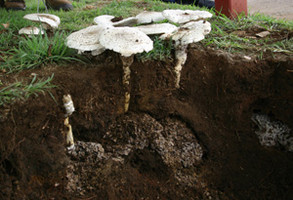

## Phylogeny 

-   « Ancestral Groups  
    -  [Agaricomycetes](../Agaricomycetes.md))
    -  [Agaricomycotina](../../Agaricomycotina.md))
    -  [Basidiomycota](../../../Basidiomycota.md))
    -  [Fungi](../../../../Fungi.md))
    -  [Eukarya](../../../../../Eukarya.md))
    -   [Tree of Life](../../../../../Tree_of_Life.md)

-   ◊ Sibling Groups of  Agaricomycetes
    -   Agaricales
    -  [Atheliales](Atheliales.md))
    -  [Russulales](Russulales.md))
    -  [Polyporales](Polyporales.md))
    -   [Thelephorales](Thelephorales)
    -   [Corticiales](Corticiales)
    -   [Hymenochaetoid clade](Hymenochaetoid_clade)
    -   [Trechisporales](Trechisporales)

-   » Sub-Groups 

# Agaricales 

[Brandon Matheny, Jean-Marc Moncalvo, and Scott A. Redhead]()
))

Relationships after Binder, Matheny & Hibbett (unpublished data),
Matheny et al. (2006), Binder et al. (2005), Bodensteiner et al. (2004),
Larsson et al. (2004), Moncalvo et al. (2000, 2002), Singer (1986), and
Kühner (1980).

Inclusive major clade names (e.g., *plicaturopsidoid*, *hygrophoroid*)
are from Matheny et al. (2006) and are informal. The monophyly of these
major clades receive significant support with Bayesian analyses with
exception of the *pluteoid* clade.\

Containing group:[Agaricomycetes](../Agaricomycetes.md))

### Information on the Internet

-   [Assembling the Fungal Tree of     Life](http://aftol.biology.duke.edu/pub/alignments/download_alignments).
    Source of multigene alignments and PCR primer information.
-   [Agaricales of the Hawaiian     Islands](http://www.mycena.sfsu.edu/pages/hawaiian/Agaricales.html).
    Treats diversity of Agaricales in Hawaii.
-   [Agaricales of Java and     Bali](http://www.mycena.sfsu.edu/pages/Indonesian_Page/Title_page.html).
    Treats diversity of Agaricales from southeast Asia.
-   [Fungimap](http://www.rbg.vic.gov.au/fungimap_/welcome). This
    website highlights some of the most conspicuous species of the
    mushroom flora in Australia.
-   [Macrofungi of Costa     Rica](http://www.nybg.org/bsci/res/hall/costaric.html). Diversity of
    mushroom-forming fungi from the neotropics.
-   [Molecular Systematics and Evolution of Agaricoid Mushrooms and     Allies](http://www.biology.duke.edu/fungi/mycolab/agaricphylogeny_start.html).
    Resource for ribosomal RNA gene sequence alignments and PCR primer
    information.
-   [Mykoweb: mushrooms, fungi, mycology](http://www.mykoweb.com/).
    Devoted to the science of mycology and the hobby of mushrooming.

## Introduction

The Agaricales, or euagarics clade, is a monophyletic group of
approximately 8500 mushroom species. As such it forms the largest clade
of Agaricomycetes (=Homobasidiomycetes sensu Hibbett and Thorn 2001;
Binder et al. 2005) and together with the Boletales and Atheliales it
forms the Agaricomycetidae. Species of Agaricales are widespread and
diverse on land ranging from desert, grassland, forests, tundra, and
shorelines in tropical, temperate, and arctic-alpine habitats. While
many Agaricales acquire sustenance by decomposing dead organic matter
(as saprotrophs), others parasitize plants or other fungi, and a few
capture or parasitize vertebrates or invertebrates. Many groups of
Agaricales engage in mutualistic symbioses with the roots of vascular
plants where they form ectomycorrhizas (EM), or more rarely associate
with unicellular green algae or cyanobacteria as lichens. A few colonize
bryophytes. Orchids and mycotrophic plants depend on some Agaricales
(*Armillaria*, *Tricholoma*), in addition to other groups of
Agaricomycetes, for their nutrition.  Several clades of Agaricales
include ant or termite symbionts or even nematode predators. Species of
*Armillaria*, *Athelia* pro parte, *Moniliophthora*, and *Mycena* are
economically devastating plant pathogens, whereas others in the genera
*Agaricus*, *Lentinula*, *Termitomyces*, *Tricholoma*, and *Volvariella*
are highly valuable commercial or collected foods. Psychotropic or
hallucinogenic mushrooms of *Psilocybe* and other genera also occur in
the Agaricales, and others, as in some species of *Amanita*, produce
toxins lethal to humans.
)

 A sample of different nutritional modes among Agaricales. Left:
Ectomycorrizal (EM) habitat in Karri (*Eucalyptus diversicolor*) forest
in the south-west botanical district of Western Australia. © [Brandon Matheny](http://www.clarku.edu/faculty/dhibbett/people_matheny.html).
Center: Attack and consumption of a nematode by *Pleurotus* (Oyster
Mushroom, Pleurotaceae). © [Greg Thorn](http://publish.uwo.ca/%7Ergthorn). Right. *Termitomyces*
*reticulatus* (Lyophyllaceae) fruiting from underground fungus gardens
of the termite *Odontotermes badius*. © [Duur Aanen](http://www.bi.ku.dk/staff/staff-vip-details.asp?ID=2).

Molecular systematic studies of the Agaricales have radically
transformed our interpretations of the evolution and classification of
gilled mushrooms and their relatives (Hibbett et al. 1997; Moncalvo et
al. 2000, 2002; Matheny et al. 2006). The overwhelming majority of
species produces fruit bodies with gills (lamellae), but the evolution
of gills has arisen numerous times in the Agaricomycetes (Hibbet et al.
1997). Likewise, multiple lineages of "gasteromycetes" (puffballs,
bird's nest fungi, false truffles), species that produce spores in an
enclosed fruiting structure, have evolved independently among the
Agaricales (Peintner et al. 2001). Studies by Bodensteiner et al.
(2004), Larsson et al. (2004), and Binder et al. (2005) have shown that
some non-gilled fungi, including reduced or cup-like (cyphelloid) forms
and crustose or resupinate forms, share their evolutionary histories
with numerous lineages of Agaricales, including some lineages that
evolved in aquatic or marine environments (Binder et al. 2001; Hibbett
and Binder 2001; Binder et al. 2006). In short, the gross morphology of
mushroom fruit bodies is highly plastic and often a poor phylogenetic
indicator. These and other studies demonstrated that a broad concept of
Agaricales (Singer 1986), including boletes, some polypores, and the
genera *Russula*, *Lactarius* and their allies, does not form a
monophyletic group. Thus, the clade containing predominantly genera and
families from the suborder Agaricineae (Singer 1986) was labeled the
euagarics clade and represents what we currently regard as the
Agaricales (Moncalvo et al. 2002). Most family-level relationships based
on morphological characters are artificial, but progress is being made
to delimit higher-level monophyletic groups with multiple gene data sets
(Matheny 2005; Aime et al. 2005; Hofstetter et al. 2002; Binder et al.
2006). Remarkably, new species and genera continue to be described or
placed in the order by molecular phylogenetic analyses.

### Characteristics
)

Scanning electron microscopic (SEM) images of basidiospores of
Agaricales. Left: Spinose basidiospore of *Inocybe calospora*
(Inocybaceae). © [Brandon Matheny](http://www.clarku.edu/faculty/dhibbett/people_matheny.html).
Right: Grooved basidiospores of *Clitopilus prunulus* (Entolomataceae).
© [Sigisfredo Garnica](mailto:sigisfredo.garnica@uni-tuebingen.de) .

No morphological, ecological, or biochemical traits are known that unite
the Agaricales despite robust measures of support for its monophyly
(Binder and Hibbett 2002; Moncalvo et al. 2002; Matheny et al. 2007).
Singer (1986), one of the most influential taxonomic treatments of the
order, was unable to provide a set of non-molecular characters unique to
all members. Rather, inclusion in the group, in the absence of molecular
confirmation, was historically made by the absence of certain characters
possessed by other clades of Agaricomycetes. For example, members of the
Agaricales sensu Singer were attributed to have non-septate basidia
(unlike Auriculariales), lack stichobasidia (unlike some families of
Cantharellales), lack trimitic hyphal systems (unlike Polyporales and
Hymenochaetales), not possess a spinose hymenophore (unlike
Thelephorales), lack variegatic acid type pigments and its derivatives
(unlike Boletales), and not have heteromerous trama or a combination of
a laticiferous hyphal system with amyloid, ornamented spores (unlike
Russulales). No members of the Agaricales produce a yeast-like stage,
but many non-mycorrhizal groups may produce conidia or other unique
asexual reproductive structures (Walther et al. 2005). The spore bearing
surface (hymenophore) is typically lamellate and infrequently tubular
(unlike Boletales). However, it is becoming clear that cyphelloid and
false truffles have likely evolved from lamellate ancestors, as have
some species producing club-shaped (clavarioid) basidiomes. It remains
unclear whether the most recent common ancestor of the Agaricales was
gilled (Matheny et al. 2006).
)

Examples of non-gilled fruit body forms in the Agaricales. Left:
Clavarioid fruit bodies of *Clavulinopsis fusiformis* (Clavariaceae s.
str.). © [Brandon Matheny](http://www.clarku.edu/faculty/dhibbett/people_matheny.html).
Gasteroid fruit bodies of *Crucibulum laeve* (Nidulariaceae). © Mark
Steinmetz. Resupinate fruit bodies of *Cylindrobasidium evolvens*
(Physalacriaceae). © [Brandon Matheny](http://www.clarku.edu/faculty/dhibbett/people_matheny.html).

Despite the absence of morphologically shared derived traits
(synapomorphies) for the Agaricales as a whole, some combinations of
traits do appear diagnostic for nested lineages within the order.
Species with pigmented spore walls, multinucleate spores, and spores
with an open-pore type of hilum (an ultrastructural character) (Pegler
and Young 1969) appear derived and belong to the *agaricoid* clade. All
these characters, with exception of the hilum-type, may have evolved
repeatedly on independent occasions. Nevertheless, it appears reasonable
that the most recent common ancestor of the Agaricales was probably a
saprotroph or parasite with uninucleate, hyaline spores with a nodulose
spore hilum, perhaps similar to early-diverging lineages of the
Atheliales and Boletales, two groups most closely related to the
Agaricales. The ectomycorrhizal condition, a symbiosis between fungal
hyphae and typically roots of vascular plants, appears to have evolved
independently at least on eleven occasions in the Agaricales alone
without any unamibiguous reversals to a free-living state (Matheny et
al. 2006).

### Discussion of Phylogenetic Relationships

Members of the earliest lineage of Agaricales, the *plicaturopsidoid*
clade, are not very well known. At present the clade includes a diverse
assemblage of taxa composed of resupinate, merulioid, club-like,
coralloid, and gilled forms that are saprotrophic or pathogenic. No
known EM lineages have yet been confirmed. Larsson et al. (2004) and
Binder et al. (2005) identified additional resupinate, club-like,
coralloid, and false truffle species at the base of the Agaricales, but
these have yet to be integrated in a single cohesive analysis.
Unpublished findings, together with results from Matheny et al. (2006),
suggest many of these poorly known genera occupy early diverging
lineages of Agaricales using a Bayesian method of inference. The
diversity of fruitbody morphologies in the group, including species of
*Podoserpula*, *Plicaturopsis*, *Camarophyllopsis*, *Athelia* pro parte,
and the Clavariaceae, suggest these traits are highly plastic and
unreliable gross phylogenetic markers. Separate 5.8S/25S and 25S only
rRNA studies (Larsson et al. 2004; Dentinger & McLaughlin 2006),
however, embed the Clavariaceae within derived groups of Agaricales with
poor support using the maximum parsimony method. Parsimony analyses of
combined protein-coding and ribosomal RNA data sets place the
Clavariaceae at the base of the hygrophoroid clade but with weak
support, or in a poorly supported grade with *Plicaturopsis* and allies
before the split of the remaining Agaricales. Thus, the phylogenetic
position of the Clavariaceae merits more attention.

The *plicaturopsidoid* clade appears to be the sister group to a crown
group of Agaricales, which is dominated by gilled forms. Some of these
genera and families of the crown group remain poorly supported by the
parsimony bootstrap method despite a recent supermatrix phylogenetic
analysis that included up to six nuclear gene regions for 250 taxa
(Matheny et al. 2006). Nonetheless, at least five additional inclusive
clades of mushrooms were recovered by Bayesian analyses.

Based on these latter results, the preponderance of EM formers appears
to have evolved within the *agaricoid* and *tricholomatoid* clades,
which are sister groups. Only two additional EM lineages are presently
identified in the remaining Agaricales, the Amanitaceae and
*Hygrophorus* s. str., but the nutritional mode of many other groups is
poorly known (e.g., *Cantharocybe*, Clavariaceae s. str.). The
*agaricoid* clade contains the dark-spored Agaricales, and all taxa
appear to be characterized by multinucleate spores with an open-pore
hilum. This group contains many truffle-like species that are EM formers
and tend to sporulate below the surface of the ground (hypogeous), as
well as the bird's nest fungi (Nidulariaceae), which are saprotrophs.
The *tricholomatoid* clade includes lineages with white or pink spores
and species with diverse ecologies including mycoparasites.

Of ecological interest, no EM taxa are known in the taxonomically
diverse *marasmioid* clade, which is dominated by saprophtrophic
white-spored taxa. Reduction of fruit bodies from gilled forms to
cupulate forms (cyphelloid) appears to be a morphological tendency in
this large inclusive lineage, in which some genera (e.g., *Marasmius*)
are abundant in the tropics (Singer 1986). The *hyrophoroid* clade
(e.g., Pterulaceae and Hygrophoraceae s. lat.) comprises predominantly
white-spored taxa (rarely pink) that are also mainly saprotrophic.
However, a few pathogens (*Typhula* spp.) and lichenized lineages
(*Dictyonema*, *Lichenomphalia*) are placed in this clade, along with
the aforementioned EM lineage *Hygrophorus*. The *pluteoid* clade is
composed of pinkish brown and white-spored taxa of the families
Pluteaceae, Macrocystidiaceae, and Limnoperdonaceae. Kühner (1980)
presents morphological evidence that suggests a relationship between the
Pluteaceae and Macrocystidiaceae, which we accept here and which is also
supported by combined rRNA analyses (Matheny et al. 2006). Phylogenetic
relationships between the *pluteoid* clade and families Amanitaceae and
Pleurotaceae were not strongly supported by Bayesian or parsimony
multigene analyses and require further investigation, hence, these
families are shown in unresolved positions.
)

Gilled fruitbodies. Left: *Gliophorus laetus* (Hygrophoraceae s. lat.).
© [Brandon Matheny](http://www.clarku.edu/faculty/dhibbett/people_matheny.html).
Right: Fresh fruitbodies of *Coprinus comatus* (Agaricaceae). The gills
of the specimens on the left are undergoing auto-digestion
(deliquescence). © [David LaPuma.](http://flickr.com/people/woodcreeper/)

#### Agaricales incertae sedis

At present we have little or no phylogenetic information that sheds
light on the relationship of at least 58 genera and clades of gilled,
cyphelloid, and resupinate fungi (including four fossil genera) with
affinities to the Agaricales. While single gene analyses have confirmed
a relationship of many of these groups to the order (Moncalvo et al.
2002, Bodensteiner et al. 2004), their positions within the Agaricales
are not clear based on single gene phylogenetic analyses. Future
phylogenetic research of the Agaricales should focus taxon sampling
among these genera.

### Fossil Genera and Age of the Agaricales

The phylogeny and age of the Agaricales, and other fungi, is difficult
to reconstruct from the fossil record (Taylor & Osborn 1996). Only four
fossil genera of gilled mushrooms are currently accepted (Hibbett et al.
2003), with the oldest of these dating back to the mid-Cretaceous, about
90 million years ago. All are suspected to share affinities with the
Agaricales. Fossil ectomycorrhizas, probably of Boletales, have been
dated back to the mid-Eocene, about 50 million years ago (LePage et al.
1997). Using a molecular clock, Berbee and Taylor (1993) hypothesized
that ectomycorrhizal fungi may have evolved 130 million years ago during
the early Cretaceous. However, the age of the origin and diversification
of the Agaricales has not been ascertained by molecular clock dating
methods. The Agaricales is one of three clades, together with the
Atheliales and Boletales, that appear to form one of the more derived
groups of Agaricomycetes (Binder et al. 2005; Matheny et al. 2007). If
cladogenesis of the sister group to the Agaricales (the Boletales) is
used as an indicator (Bruns et al. 1998), then perhaps the Agaricales
may have radiated simultaneously, which is estimated between 75 and 135
million years ago. Two recent studies, however, have hypothesized mid-
to late-Cretaceous divergences for two genera of dark-spored Agaricales
(Geml et al. 2004; Matheny and Bougher 2006), which might suggest an
older radiation for the order at large.
)\

*Protomycena electra*, a mushroom fossil from Miocene amber in the
Dominican Republic.\
© [David Grimaldi](http://amnh.org/science/divisions/invertzoo/bio.php?scientist=grimaldi).
Image courtesy of David Hibbett.
### References

Aime, M. C., and Phillips-Mora, W. 2005. The causal agents of witches'
broom and frosty pod rot of cacao (chocolate, Theobroma cacao) form a
new lineage of Marasmiaceae. Mycologia 97: 1012-1022.

Berbee, M. L., and Taylor, J. W. 1993. Dating the evolutionary
radiations of the true fungi. Can. J. Bot. 71: 1114-1127.

Binder, M., and Hibbett, D. S. 2002. Higher-level phylogenetic
relationships of Homobasidiomycetes (mushroom-forming fungi) inferred
from four rDNA regions. Mol. Phylogenet. Evol. 22: 76-90.

Binder, M., Hibbett, D. S., Larsson, K. H., Larsson, E., Langer, E. and
Langer. G. 2005. The phylogenetic distribution of resupinate forms
across the major clades of mushroom-forming fungi (Homobasidiomycetes).
Syst. Biodiversity 3: 113-157.

Binder, M., Hibbett, D. S., and Molitoris, H. P. 2001. Phylogenetic
relationships of the marine gasteromycete Nia vibrissa. Mycologia 93:
679-688.

Binder, M., Hibbett, D. S., Wang, Z., and Farnham, W. F. 2006.
Evolutionary relationships of Mycaureola dilseae (Agaricales), a
basidiomycete pathogen of a subtidal rhodophyte. Am. J. Bot. 93:
547-556.

Bodensteiner, P., Binder, M., Moncalvo, J. M., Agerer, R., and Hibbett,
D. S. 2004. Phylogenetic relationships of cyphelloid homobasidiomycetes.
Mol. Phylogenetic. Evol. 33: 501-515.

Bruns, T. D., Szaro, T. M., Gardes, M., Cullings, K. W., Pan, J. J.,
Taylor, D. L., Horton, T. R., Kretzer, A., Garbelotto, M., and Li, Y.
1998. A sequence database for the identification of ectomycorrhizal
basidiomycetes by phylogenetic analysis. Mol. Ecol. 7: 257-272.

Dentinger, B. T. M., and McLaughlin, D. J. 2006. Reconstructing the
Clavariaceae using nuclear large subunit rDNA sequences and a new genus
segregated from Clavaria. Mycologia 98: 746-762.

Geml J., Geiser, D. M. and Royse, D. J. 2004. Molecular evolution of
Agaricus species based on ITS and LSU rDNA sequences. Mycol. Progress 3:
157-176.

Hibbett, D. S., Pine, E. M., Langer, E., Langer, G. and Donoghue, M. J.
1997. Evolution of gilled mushrooms and puffballs inferred from
ribosomal DNA sequences. Proc. Nat. Acad. Sci. USA 94:12002-12006.

Hibbett, D. S. and Binder, M. 2001. Evolution of marine mushrooms. Biol.
Bull. 201: 319-322.

Hibbett, D. S. and Thorn, R. G. 2001. Homobasidiomycetes. Pp. 121-170.
In: The Mycota VII. Systematics and Evolution. Part B. (Mclaughlin, D.
J., McLaughlin, E. G. and Lemke, P. A., eds.). Springer-Verlag, Berlin.

Hibbett, D. S., Binder, M., Wang, Z. and Goldman, Y. 2003. Another
fossil agaric from Dominican amber. Mycologia 95: 685-687.

Hofstetter, V., Clémençon, H. Vilgalys, R., and Moncalvo, J. M. 2002.
Phylogenetic analyses of the Lyophylleae (Agaricales, Basidiomycetes)
based on nuclear and mitochondrial rDNA sequences. Mycol. Res. 106:
1043-1059.

Kühner, R. 1980. Les Hyménomycètes agaricoïdes. Bull Soc Linn Lyon 49:
Numéro spécial. 1027 p.

Larsson, K. H., Larsson, E., and Kõljalg, U. 2004. High phylogenetic
diversity among corticioid homobasidiomycetes. Mycol. Res. 108:
983-1002.

LePage, B. A., Currah, R. S., Stockey, R. A. and Rothwell, G. W. 1997.
Fossil ectomycorrhizae from the middle Eocene. Am. J. Bot. 84: 410-412.

Matheny, P. B. 2005. Improving phylogenetic inference of mushrooms with
RPB1 and RPB2 nucleotide sequences (Inocybe, Agaricales). Mol.
Phylogenet. Evol. 35: 1-20.

Matheny, P. B. and Bougher, N. L. 2006. The new genus Auritella from
Africa and Australia (Inocybaceae, Agaricales): molecular systematics,
taxonomy and historical biogeography. Mycol. Progress 5: 2-17.

Matheny, P. B., Curtis, J. M., Hofstetter, V., Aime, M. C., Moncalvo, J.
M., Ge, Z. W., Yang, Z. L., Slot, J. C., Ammirati, J. F., Baroni, T. J.,
Bougher, N. L., Hughes, K. W., Lodge, D. J., Kerrigan, R. W., Seidl, M.
T., Aanen, D. K., DeNitis, M., Daniele, G. M., Desjardin, D. E., Kropp,
B. R., Norvel, L. L., Parker, A., Vellinga, E. C., Vilgalys, R. and
Hibbett, D. S. 2006. Major clades of Agaricales: a multilocus
phylogenetic overview. Mycologia 98: 982-995.

Matheny, P. B., Wang, Z., Binder, M., Curtis, J. M., Lim, Y. W.,
Nilsson, H. R., Hughes, K. W., Hofstetter, V., Ammirati, J. F., Schoch,
C. L., Langer, E., Langer, G., McLaughlin, D. J., Wilson, A. W.,
Frøslev, T. G., Ge, Z. W., Yang, Z. L., Baroni, T. J., Fischer, M.,
Hosaka, K., Matsuura, K., Seidl, M. T., Vauras, J., Hibbett, D. S. 2007.
Contributions of rpb2 and tef1 to the phylogeny of mushrooms and allies
(Basidiomycota, Fungi). Mol. Phylogenet. Evol. 43: in press.

Moncalvo, J. M., Lutzoni, F. M., Rehner, S. A., Johnson, J. and
Vilgalys, R. 2000. Phylogenetic relationships of agaric fungi based n
nuclear large subunit ribosomal DNA sequences. Syst. Biol. 49: 278-305.

Moncalvo, J. M., Vilgalys, R., Redhead, S. A., Johnson, J. E., James, T.
Y., Aime, M. C., Hofstetter, V., Verduin, W., Larsson, E., Baroni, T.
J., Thorn, R. G., Jacobsson, S., Clemençon, H. and Miller, O. K. 2002.
One hundred and seventeen clades of euagarics. Molecular Phylogenet.
Evol. 23: 357-400.

Pegler, D. N. and Young, T. W. K. 1969. Ultrastructure of basidiospores
in Agaricales in relation to taxonomy and spore discharge. Trans. Br.
Mycol. Soc. 52: 491-513.

Peintner, U., Bougher, N. L., Castellano, M. A., Moncalvo, J. M., Moser,
M. M., Trappe, J. M. and Vilgalys, R. 2001. Multiple origins of
sequestrate fungi related to Cortinarius (Cortinariaceae). Am. J. Bot.
88: 2168-2179.

Singer, R. 1986. The Agaricales in modern taxonomy. 4th edition. Koeltz
Scientific Books, Koenigstein, Germany.

Taylor, T. N. and Osborn, J. M. 1996. The importance of fungi in shaping
the paleoecosystem. Rev. Palaeobot. Palynology 90: 249-262.

Walther, G., Garnica, S., and Weiss, M. 2005. The systematic relevance
of conidiogenesis modes in the gilled Agaricales. Mycol. Res. 109:
525-544.

## Title Illustrations

)

  -----------------
  Scientific Name ::     Gymnopilus spectabilis
  Comments             agaricoid clade, Gymnopileae
  Acknowledgements     Image used with permission
  Specimen Condition   Live Specimen
  Source Collection    [MykoWeb](http://www.mykoweb.com/)
  Copyright ::            © [Mike Wood](http://www.mykoweb.com/)
  -----------------
)

  -------------------------------------------------------------------------
  Scientific Name ::     Lycoperdon perlatum
  Comments             puffball; agaricoid clade, Agaricaceae
  Acknowledgements     Image used with permission
  Specimen Condition   Live Specimen
  Source Collection    [MykoWeb](http://www.mykoweb.com/)
  Copyright ::            © [Taylor F. Lockwood](http://www.fungiphoto.com/) 
  -------------------------------------------------------------------------
)

  -----------------------------------------------
  Scientific Name ::     Squamanita paradoxa
  Comments             Squamanita paradoxa, a mycoparasite of Cystoderma amianthinum.
  Acknowledgements     Image courtesy of Juan Santos
  Specimen Condition   Live Specimen
  Copyright ::            © [Juan Santos](http://www.nrm.se/researchandcollections/botany/cryptogamicbotany/staff/juansantos.4.5fdc727f10d795b1c6e80005951.html)
  -----------------------------------------------

## Confidential Links & Embeds: 

### #is_/same_as :: [Agaricales](/_Standards/bio/bio~Domain/Eukarya/Fungi/Basidiomycota/Agaricomycotina/Agaricomycetes/Agaricales.md) 

### #is_/same_as :: [Agaricales.public](/_public/bio/bio~Domain/Eukarya/Fungi/Basidiomycota/Agaricomycotina/Agaricomycetes/Agaricales.public.md) 

### #is_/same_as :: [Agaricales.internal](/_internal/bio/bio~Domain/Eukarya/Fungi/Basidiomycota/Agaricomycotina/Agaricomycetes/Agaricales.internal.md) 

### #is_/same_as :: [Agaricales.protect](/_protect/bio/bio~Domain/Eukarya/Fungi/Basidiomycota/Agaricomycotina/Agaricomycetes/Agaricales.protect.md) 

### #is_/same_as :: [Agaricales.private](/_private/bio/bio~Domain/Eukarya/Fungi/Basidiomycota/Agaricomycotina/Agaricomycetes/Agaricales.private.md) 

### #is_/same_as :: [Agaricales.personal](/_personal/bio/bio~Domain/Eukarya/Fungi/Basidiomycota/Agaricomycotina/Agaricomycetes/Agaricales.personal.md) 

### #is_/same_as :: [Agaricales.secret](/_secret/bio/bio~Domain/Eukarya/Fungi/Basidiomycota/Agaricomycotina/Agaricomycetes/Agaricales.secret.md)

