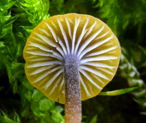

## Phylogeny 

-   « Ancestral Groups  
    -  [Agaricomycetes](../Agaricomycetes.md))
    -  [Agaricomycotina](../../Agaricomycotina.md))
    -  [Basidiomycota](../../../Basidiomycota.md))
    -  [Fungi](../../../../Fungi.md))
    -  [Eukarya](../../../../../Eukarya.md))
    -   [Tree of Life](../../../../../Tree_of_Life.md)

-   ◊ Sibling Groups of  Agaricomycetes
    -  [Agaricales](Agaricales.md))
    -  [Atheliales](Atheliales.md))
    -  [Russulales](Russulales.md))
    -  [Polyporales](Polyporales.md))
    -   [Thelephorales](Thelephorales)
    -   [Corticiales](Corticiales)
    -   Hymenochaetoid clade
    -   [Trechisporales](Trechisporales)

-   » Sub-Groups 

## Hymenochaetales 

# Hymenochaetoid clade

## Hymenochaetaceae 

[Aristóteles Góes-Neto and Cláudia Groposo]()
)

This tree represents the current knowledge on phylogenetic relationships
of distinct members of the hymenochaetoid clade, and it is strongly
based on some analyses of ribosomal DNA sequences (Wagner and Fischer,
2001; Hibbett and Binder 2002; Wagner and Fischer, 2002a; Wagner and
Fischer, 2002b; Wagner and Ryvarden, 2002; Moncalvo et al., 2002 ).

Containing group:[Agaricomycetes](../Agaricomycetes.md))

### Information on the Internet

-   [The WWW Virtual Library: mycology](http://mycology.cornell.edu/).
    An index to Mycological Resources in the internet.
-   [Deep Hypha Research Coordination     Network](http://ocid.nacse.org/research/deephyphae/). Deep Hypha is
    a project to coordinate and provide resources for research in fungal
    systematics.
-   [AFTOL: Assembling the Fungal Tree of     Life](http://ocid.nacse.org/research/aftol/). Collaborative research
    in fungal phylogenetics.

## Introduction

The hymenochaetoid clade is one of the eight major clades of
Homobasidiomycetes suggested by Hibbett and Thorn (2001), and
corroborated by Binder and Hibbett (2002) and Moncalvo et al. (2002).
The hymenochaetoid clade probably comprises all known Hymenochaetaceae,
as well as some members of at least nine different families of
Homobasidiomycetes, as revealed by the aforementioned recent molecular
phylogenetic studies.

Although the Hymenochaetaceae are typically represented by the yellowish
to reddish brown lignicolous bracket fungi, the non-hymenochaetacean
species of the hymenochaetoid clade exhibit a striking diversity of
forms, colours and habits, which includes mushrooms (Fig. 1), lilac to
violet bracket fungi (Fig. 2), some members of Corticiaceae s.l. that
resemble a splash of paint on trunks and twigs of trees (Fig. 3), and
even one species that was for a long time in the \"Guinness Book of
World Records\" as possessing the largest known fruiting body of a
fungus, *Bridgeoporus nobilissimus* (Fig. 4), a rare and endangered
species, restricted to very large specimens of noble firs in Pacific
Northwest old-growth forests in North America (Burdsall et al., 1996).
)
)

Clockwise from top left: Figure 1: Salmon basidiomata of *Loreleia
marchantiae* (Singer & Clémençon) Redhead, Moncalvo, Vilgalys & Lutzoni
on the liverwort Marchantia. © [Cathy L. Cripps](http://plantsciences.montana.edu/alpinemushrooms).
Figure 2: Lilac basidiome of *Trichaptum byssogenum* (Jungh.) Ryv. on
dead tree trunk. © Aristóteles Góes-Neto. Figure 3: Basidiome of
*Hyphodontia sambuci* (Pers.) J. Erikss. on tree trunk. © [Paul Busselen](http://www.kulak.be/nl/KULAKAlgemeen/Natuur/). Figure 4:
Basidiomata of *Bridgeoporus nobilissimus* (W.B. Cooke) Volk, Burdsall,
& Ammirati. © [Tom Volk](http://tomvolkfungi.net/).

Many species of the hymenochaetoid clade, especially *Phellinus* s.l.
are important phytopathogens, causing white rot in living trees in
natural and cultivated forests of both conifers and flowering plants
(Larsen and Cobb-Poule, 1990; Ryvarden, 1991, 1993): *Phellinus pini* is
the etiological agent of red ring rot, the most economically important
of the stem rotters of pines (Harrington and Wingfield, 1998);
*Phellinus weirii* causes the laminated root rot in Douglas-fir and
other commercially important species of conifers in northwestern North
America (Thies and Rona, 1995); and *Fomitiporia punctata* and
*Fomitiporia mediterranea* are associated with \"esca\" disease of
grapevines (Fischer, 2002). On the other hand, some representatives of
the hymenochaetoid clade have been used for medicinal purposes by
traditional human societies in Asia (Lim et al., 2003.), and many
metabolic compounds isolated from them have antineoplasic and
antioxidant activities (Ajith and Janardhanan, 2003; Shon et al., 2003).
Furthermore, because of their ability of degrading natural recalcitrant
molecules (e. g. liginin, the main component of wood) they have been
studied to be used for the biodegradation of xenobiotics (non-natural,
man-made compounds, e. g. plastics, biocides etc.) (Wesenberg et al.,
2003).

### Characteristics

Except for only one common cytological character, this clade apparently
has no morphological, physiological or ecological synapomorphy, and it
is almost exclusively defined on molecular grounds. Although not
confirmed for all the studied species regarded as members of the
hymenochaetoid clade, they all appear to share at least one nonmolecular
character in common, the dolipore septa with imperforate parenthesomes
(Moore, 1985; Oberwinkler, 1985; Langer and Oberwinkler, 1993; Keller,
1997; Muller et al., 2000, see [Characteristics of Hymenomycetes](tree?group=Hymenomycetes#Characteristics)).

The Hymenochaetaceae are rather well-defined. They always possess
clampless generative hyphae (Fig. 6) and brownish basidiomata (Fig. 5)
that darken when moistened in alkali solutions (permanent positive
xanthochroic reaction). Setoid structures, especially unbranched setae
(Figs. 7-8), but also branched asterosetae occur frequently in several
taxa (Oberwinkler, 1977). However, the hymenochaetoid species assigned
to the other families not only lack this combination of characters but
also have other markedly different nonmolecular characters.
)
)

Top: Figure 5: Browinsh basidiome of *Phellinus palmicola* (Berk. &
Curt.) Ryv. Bottom left to right: Figure 6: Clampless generative and
browinsh skeletal hyphae of *Phellinus gilvus* (Schw.) Pat. X40. KOH
5% + Phloxin stained slide. Figure 7: Photomicrograph of hymenial setae
of *Phellinus palmicola* (Berk. & Curt.) Ryv. X40. KOH 5% + Phloxin
stained slide. Figure 8: Scanning electron photomicrograph of hooked and
straight hymenial setae of *Phellinus wahlbergii* (Fr.) D.A. Reid. X500.
Figures 5, 6, 7 © Aristóteles Góes-Neto. Figure 8 © Cláudia Groposo.
)
)

Clockwise from top left: Figure 9: Ressupinate basidiome of *Phellinus
membranaceus* J.E. Wright & Blumenf.© Aristóteles Góes-Neto.
Figure 10: Effuse-reflexed basidiomata of *Phellinus gilvus* (Schw.)
Pat. © [Fred Stevens](http://www.mykoweb.com/CAF/index.html), courtesy
[MykoWeb](http://www.mykoweb.com/). Figure 11: Pileate basidiome of
*Phellinus tremulae*. © Dave Powell, USDA Forest Service, courtesy
[InsectImages.org](http://www.insectimages.org/) (#0976062). Figure 12:
Stipitate basidiome of *Stipitochaete damicornis* (Link) Ryvarden. ©
Cláudia Groposo.

Hymenochaetoid fungi exhibit almost all possible forms of basidiomata.
Ressupinate (Fig. 9), effuse-reflex (Fig. 10) and pileate (Fig. 11)
forms predominate, but stipitate (Fig. 12) forms also occur. The same is
true for hymenophores, which can be smooth (Fig. 13), toothed (Fig. 14),
poroid (Fig. 15), and even lamelate (Fig. 16) (Parmasto, 2001; Goes-Neto
et al., 2001). They exhibit all the three main patterns of hyphal
systems (mono, di and trimitic), and sterile elements (other than setoid
structures) of the hymenium are often found in non-hymenochaetacean
species (Hibbett and Thorne, 2001).
)
)

Clockwise from top left: Figure 13: Smooth hymenophore of Hymenochaete
sp. © [Heino Lepp](http://www.anbg.gov.au/fungi/index.html), courtesy
[Australian National Botanic Gardens](http://www.anbg.gov.au/anbg/index.html). Figure 14: Toothed
hymenophore of Hydnochaete sp. © Cláudia Groposo. Figure 15: Poroid
hymenophore of Phellinus igniarius (L.) Quél. © [Marek Snowarski](http://www.grzyby.pl/index.html). Figure 16: Lamelate
hymenophore of Rickenella swartzii (Fr.) Kuyper. © [Mirek Junek](http://www.idsystem.cz/mushrooms/index.htm)

Most of the members of the hymenochaetoid clade predominantly consist of
saprotrophic, lignicolous, white-rot species, although mycorrhizal,
forming both ectomycorrhiza (Danielson, 1984), and orchid mycorrhyza
(Umata, 1995), and even agaricoid bryophyte-associated species (Moncalvo
et al., 2002; Redhead et al., 2002) are also found in this clade.

Although they are not restricted to the hymenochaetoid clade,
styrylpyrones are found in all studied hymenochatacean members of the
clade (Fiasson, 1982), which, together with other phenolic compounds,
confer the typical xanthocroic reaction.

### Phylogenetic Position of the Hymenochaetoid Clade

Contrary to most of the Homobasidiomycetes, the hymenochaetoid clade, as
well as the cantharelloid and gomphoid-phalloid clades, include species
with imperforate parenthesomes (Hibbett and Thorn 2001, Binder and
Hibbett 2002). As this character is also encountered in
non-homobasidiomycetous Hymenomycetes (e. g. Auriculariales and
Dacrymycetales), one can argue that the presence of imperforate
parenthesomes is the plesiomorphic condition in the Homobasidiomycetes,
and this point of view would be in accordance with the basal position of
the hymenochaetoid clade in homobasidiomycete phylogeny. Hibbett and
Thorn (2001), however, suggested that this character could be
potentially homoplasic, because of the apparent co-occurrence of
imperforate and perforate parenthosomes in the polyporoid clade (Keller,
1997), which would be in conformity with a non-basal position of this
clade. Therefore, the position of the hymenochaetoid clade in
homomobasidiomycete phylogeny still is controversial (Binder and
Hibbett, 2002).

### Discussion of Phylogenetic Relationships

Relationships among putative hymenochaetoid clades are not well
resolved. According to Wagner and Fisher (2002a), there is at least some
support for one less inclusive clade comprising most of the \"typical
hymenochaetaceae\" (*Inonotus* s.s., *Phylloporia*, *Fulvifomes*,
*Inocutis*, *Fomitiporella*, *Aurificaria*, *Phellinus* s.s.,
*Pseudoinonotus*, *Fomitiporia*, *Porodaedalea*, *Onnia*, *Mensularia*,
and *Pseudochaete*). This group is in accordance with the classic
concept of the Hymenochaetales sensu Oberwinkler (1977), and the taxa
exhibit a holocoenocytic behavior of the somatic mycelium (Wagner and
Fischer, 2001, 2002a), but its monophyly is still uncertain.

The remaining hymenochaetacean taxa (*Coltricia*, *Coltriciella*,
*Pyrrhoderma*, *Fuscoporia*, *Phellinidium*, *Asterodon*, *Phellopilus*,
*Hymenochaete*) appear intermingled with corticiaceous and polyporoid
species of the genera *Hyphodontia*, *Schizopora*, *Basidioradulum*,
*Oxyporus*, *Bridgeoporus* and *Trichaptum*, and, most surprisingly,
also with gilled omphalinoid fungi, such as *Cotylidia*, *Rickenella*,
*Loreleia*, *Contumyces* and *Sphagnomphalia*, as was revealed by
previous studies (Hibbett and Donoghue, 1995, Hibbett et al. 1997, Ko et
al., 1997, Hibbett et al., 2000; Hibbett and Donoghue, 2001; Moncalvo et
al., 2002; Redberg et al., 2003; Redhead et al., 2002).

In summary, the position of the hymenochaetoid clade and the
relationships among the putative more inclusive clades are definetely
not well resolved. Thus, the great challenging tasks concerning this
clade are (i) to discover which non-hymenochaetacean taxa are in this
group and (ii) to characterize this clade more properly.

### References

Ajith, T. A., Janardhanan, K. K. 2003. Cytotoxic and antitumor
activities of a polypore macrofungus, Phellinus rimosus (Berk) Pilat.
Journal of Ethnopharmacology 84: 157-162.

Binder, M.,Hibbett, D.S. 2002. Higher level phylogenetic relationships
of homobasidiomycetes (mushroom-forming fungi) inferred from four rDNA
regions. Mol. Phylogenet. Evol. 22: 76-90.

Burdsall, H. H.; Volk, T. J.; Ammirati, J. F. 1996. Bridgeoporus, a new
genus to accommodate Oxyporus nobilissimus (Basidiomycota,
Polyporaceae). Mycotaxon 60:387-395.

Danielson, R. M. 1984. Ectomycorrhizal associations in jack pine stands
in northeastern Alberta. Can. J. Bot. 62:932-939.

Fiasson, J. L. 1982. Distribution of styrylpyrones in the basidiocarps
of various Hymenochaetaceae. Biochemical Systematics and Ecology 10(4):
289-296.

Fischer, 2002

Góes-Neto, A.; Loguercio-Leite, C.; Guerrero, R. T., 2001d.
Morphological Cladistic Analysis of Tropical Hymenochaetales
(Basidiomycota). Mycotaxon 79: 467-479.

Harrington, T. C. and Wingfield, M. J. 1998. Diseases and the ecology of
indigenous and exotic pines. Pp. 3-33 (chapter 19) in: Ecology and
Biogeography of Pinus (D. M. Richardson, ed.). Cambridge University
Press.

Hibbett, D. S., and Donoghue, M. J. 1995. Progress toward a phylogenetic
classification of the Polyporaceae through parsimony analysis of
mitochondrial ribosomal DNA sequences Can. J. Bot. 73(Suppl.
1):S583-S861.

Hibbett, D. S., Pine, E. M., Langer, E., Langer, G. and Donoghue, M. J.
1997. Evolution of gilled mushrooms and puffballs inferred from
ribosomal DNA sequences. Proc Nat Acad Sci USA 94:12002-12006.

Hibbett, D. S.; Gilbert, L-B.; Donoghue, M. J., 2000. Evolutionary
instability of ectomycorrhizal symbioses in basidiomycetes. Nature
407(6803): 506-508.

Hibbett, D. S.; Donoghue, M. J., 2001. Analysis of character
correlations among wood decay mechanisms, mating systems, and substrate
ranges in Homobasidiomycetes, Systematic Biology 50(2): 215-242.

Hibbett, D. S., and R. G. Thorn. 2001. Basidiomycota:
Homobasidiomycetes. Pp. 121-168 in: The Mycota, vol. VII part B,
Systematics and Evolution (D. J. McLaughlin, E. G. McLaughlin, and P. A.
Lemke, eds.). Springer Verlag.

Keller J. 1997. Atlas des Basidiomycetes vus aux Microscopes
Electroniques. Neuchâtel, Suisse: Union des Societes Suisses de
Mycologie. 173 p 324 pl.

Ko, K. S., Hong, S. G., Jung, H. S. 1997. Phylogenetic analysis of
Trichaptum based on nuclear 18S, 5.8S and ITS ribosomal DNA sequences.
Mycologia 89: 727-734.

Larsen, M. J.; Cobb-Poule, L. A., 1990. The Genus Phellinus
(Hymenochaetaceae): a survey of the world taxa. Synopsis. Fungorum 3: 1-
206.

Langer, E.; Oberwinkler, F., 1993. Corticioid basidiomycetes. I.
Morphology and ultrastructure. Windahlia, 20: 1-28.

Lim, Y. W., Lee, J. S., Jung, H. S. 2003. Type studies on Phellinus
baumii and Phellinus linteus. Mycotaxon 85: 201-210.

Moncalvo JM, Vilgalys R, Redhead SA, Johnson JE, James TY, Aime MC,
Hofstetter V, Verduin SJW, Larsson E, Baroni TJ, Thorn RG, Jacobsson S,
Clémençon H, Miller OK Jr. 2002. One Hundred and Seventeen Clades of
Euagarics. Mol Phyl Evol 23: 357-400.

Moore, R. T. 1985. The challenge of the dolipore/parenthesome septum.
Pp. 175-212, in: D. Moore, L. A. Casselton, D. A. Wood, and J. Frankland
(eds.) Developmental biology of higher fungi. Cambridge University
Press, Cambridge.

Muller, W. H.; Stalpers, J. A.; van Aelst, A. C.; de Jong, M. D. M.; van
der Krift, T. P.; Boekhout, T., 2000. The taxonomic position of
Asterodon, Asterostroma and Coltricia inferred from the septal pore cap
ultrastructure. Mycological Research 104(12): 1485-1491.

Oberwinkler, F. 1985. Anmerkungen zur Evolution und Systematik der
Basidiomyceten. Studien an Heterobasidiomyceten, Teil 49. Bot Jahrb Syst
107(1-4):541-580.

Oberwinkler, F. 1977. Das neue System der Basidiomyceten. In Beiträge
zur Biologie der Niederen Pflanzen (H. Frey, H. Hurka, and F.
Oberwinkler, Eds.), pp 59-105, G. Fischer, Stuttgart, Germany.

Parmasto, Erast. 2001. Hymenochaetoid fungi (Basidiomycota) of North
America. Mycotaxon 79: 107-176.

Redberg, G. L., R. Rodriguez, J. Ammirati, and D. S. Hibbett. 2003.
Phylogenetic relationships of Bridgeoporus nobilissimus inferred from
rDNA sequences. Mycologia 95: 685-687.

Redhead, Scott A., Jean-Marc Moncalvo, Rytas Vilgalys & François
Lutzoni. Phylogeny of agarics: partial systematics solutions for
bryophilous omphalinoid agarics outside of the Agaricales (euagarics),
Mycotaxon 82: 151-168, 2002.

Ryvarden, L. 1991. Genera of Polypores: Nomenclature and Taxonomy.
Synopsis. Fungorum. 5: 1-363.

Ryvarden, L. 1993. Tropical Polypores. In: Aspects of Tropical Mycology
(S. Isaac, J. C. Frankland, R. Watling, A. J. S. Whalley, Eds.), pp.
149-170, Cambridge University Press, Cambridge.

Shon, M. Y., Kim, T. H., Sung, N. J. 2003. Antioxidants and free radical
scavenging activity of Phellinus baumii (Phellinus of Hymenochaetaceae)
extracts. Food Chemistry 82: 593-597.

Thies, W. G. and Sturrock, R. N. 1995. Laminated root rot in western
North America. USDA For. Serv., CFS Res. Bull. PNW GTR 349.

Umata, H. 1995. Seed germination of Galeola altissima, an
achlorophyllous orchid, with aphyllophorales fungi. Mycoscience 36:
368-372.

Wagner T. and Fischer M. 2001. Natural goups and a revised systemfor the
European poroid Hymenochaetales (Basidiomycota) supported by nLSU rDNA
sequence data. Mycological Research 105(7): 773-782.

Wagner T. and Fischer M. 2002a. Proceedings towards a natural
classification of the worldwide taxa Phellinus s.l. and Inonotus s.l.,
and phylogenetic relationships of allied genera. Mycologia 94: 998-1016.

Wagner, T. and Fischer, M. 2002b. Classification and phylogenetic
relationships of Hymenochaete and allied genera of the Hymenochaetales,
inferred from rDNA sequence data and nuclear behaviour of vegetative
mycelium. Mycological Progress 1(1): 93-104.

Wagner, T. and Ryvarden, L. 2002. Phylogeny and taxonomy of the genus
Phylloporia (Hymenochaetales). Mycological Progress 1(1): 105-116.

Wesenberg, D., Kyriakides, I. and Agathos, S.N. 2003. White-rot fungi
and their enzymes for the treatment of industrial dye effluents.
Biotechnology Adv. 22(1-2):161-187.

## Title Illustrations

)

  -------------------------------------------------------------------------
  Scientific Name ::     Aurificaria luteoumbrina (Romell) D.A. Reid
  Location ::           Brazil, Bahia, Cachoeira
  Specimen Condition   Live Specimen
  Identified By        Aristóteles Góes-Neto
  Body Part            basidiomata
  Copyright ::            © [Aristóteles Góes-Neto](http://www.uefs.br/lapem) 
  -------------------------------------------------------------------------

## Confidential Links & Embeds: 

### #is_/same_as :: [Hymenochaetales](/_Standards/bio/bio~Domain/Eukarya/Fungi/Basidiomycota/Agaricomycotina/Agaricomycetes/Hymenochaetales.md) 

### #is_/same_as :: [Hymenochaetales.public](/_public/bio/bio~Domain/Eukarya/Fungi/Basidiomycota/Agaricomycotina/Agaricomycetes/Hymenochaetales.public.md) 

### #is_/same_as :: [Hymenochaetales.internal](/_internal/bio/bio~Domain/Eukarya/Fungi/Basidiomycota/Agaricomycotina/Agaricomycetes/Hymenochaetales.internal.md) 

### #is_/same_as :: [Hymenochaetales.protect](/_protect/bio/bio~Domain/Eukarya/Fungi/Basidiomycota/Agaricomycotina/Agaricomycetes/Hymenochaetales.protect.md) 

### #is_/same_as :: [Hymenochaetales.private](/_private/bio/bio~Domain/Eukarya/Fungi/Basidiomycota/Agaricomycotina/Agaricomycetes/Hymenochaetales.private.md) 

### #is_/same_as :: [Hymenochaetales.personal](/_personal/bio/bio~Domain/Eukarya/Fungi/Basidiomycota/Agaricomycotina/Agaricomycetes/Hymenochaetales.personal.md) 

### #is_/same_as :: [Hymenochaetales.secret](/_secret/bio/bio~Domain/Eukarya/Fungi/Basidiomycota/Agaricomycotina/Agaricomycetes/Hymenochaetales.secret.md)

