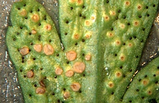
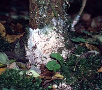

---
aliases:
  - Helicobasidiales
title: Helicobasidiales
---

## Phylogeny 

-   « Ancestral Groups  
    -   [Urediniomycotina](Urediniomycotina)
    -  [Basidiomycota](../../Basidiomycota.md))
    -  [Fungi](../../../Fungi.md))
    -  [Eukarya](../../../../Eukarya.md))
    -   [Tree of Life](../../../../Tree_of_Life.md)

-   ◊ Sibling Groups of  Urediniomycotina
    -   [Mixia osmundae](Mixia_osmundae)
    -   [Septobasidiales](Septobasidiales)
    -   [Uredinales](Uredinales)
    -   Helicobasidiales

-   » Sub-Groups
    -  [Tuberculina sbrozzii](Helicobasidiales/Tuberculina_sbrozzii.md))
    -  )
    -  [Tuberculina maxima](Helicobasidiales/Tuberculina_maxima.md))
    -  )
    -  [Helicobasidium mompa](Helicobasidiales/Helicobasidium_mompa.md))

# Helicobasidiales

## Helicobasidium, Thanatophytum, Tuberculina 

[Matthias Lutz and Robert Bauer](http://www.tolweb.org/)
)))

This tree represents a consensus among several phylogenetic analyses of
ribosomal DNA sequences (Lutz et al. 2004a, b, Uetake et al. 2002).\

Containing group:[Pucciniomycotina](../Pucciniomycotina.md))

### Information on the Internet

-   [The Fungus Tuberculina Leads a Double     Life](http://www.bio-pro.de/en/region/stern/magazin/01084/). The
    interesting life history of Helicobasidium (the phytoparasitic
    stage) and Tuberculina (the mycoparasitics stage).

### References

Lutz, M., R. Bauer, D. Begerow, and F. Oberwinkler. 2004a. Tuberculina -
Thanatophytum/Rhizoctonia crocorum - Helicobasidium: A unique
mycoparasitic-phytoparasitic life strategy. Mycological Research:
227-238.

Lutz, M., R. Bauer, D. Begerow, and F. Oberwinkler. 2004b. Tuberculina -
Helicobasidium: Host specificity of the Tuberculina-stage reveals
unexpected diversity within the group. Mycologia 96: 1316-1329.

Uetake, Y., M. Arakawa, H. Nakamura, T. Akahira, A. Sayama, L.-H. Cheah,
I. Okabe, and N. Matsumoto. 2002. Genetic relationships among violet
root rot fungi as revealed by hyphal anastomosis and sequencing of the
rDNA ITS regions. Mycological Research 106: 156-163.

## Title Illustrations



  -----------------------------------------------------------------------------
  Scientific Name ::     Helicobasidium purpureum on Picea abies (L.) Karst.
  Location ::           Germany, Baden-Württemberg, Tübingen
  Specimen Condition   Live Specimen
  Identified By        M. Lutz
  Life Cycle Stage ::     fruitbody of the phytoparasitic teleomorph
  Collection           TUB 012601
  Collector            M. Lutz
  Copyright ::            © 2005 [Matthias Lutz](mailto:matthias.lutz@uni-tuebingen.de) 
  -----------------------------------------------------------------------------
)

  -----------------------------------------------------------------------------
  Scientific Name ::     Helicobasidium longisporum on roots and basal parts of stems of Aster sp. cult.
  Location ::           Germany, Baden-Württemberg, Stuttgart
  Comments             on roots and basal parts of stems of Aster sp. cult.
  Specimen Condition   Live Specimen
  Identified By        M. Lutz
  Life Cycle Stage ::     Sterile stage (Thanatophytum) of the phytoparasitic teleomorph
  Collection           2000
  Copyright ::            © 2000 [Matthias Lutz](mailto:matthias.lutz@uni-tuebingen.de) 
  -----------------------------------------------------------------------------
)

  ---------------------------------------------------------------------------------
  Scientific Name ::     Tuberculina persicina (Ditmar) Sacc. on Tranzschelia pruni-spinosae (Pers.) Dietel/Anemone ranunculoides L.
  Location ::           Germany, Baden-Württemberg, Nürtingen
  Specimen Condition   Live Specimen
  Identified By        R. Bauer
  Life Cycle Stage ::     Mycoparasitic anamorph of Helicobasidium purpureum Pat.
  Collection           1999
  Copyright ::            © 1999 [Robert Bauer](http://www.uni-tuebingen.de/uni/bbm/Privat/Robert.html) 
  ---------------------------------------------------------------------------------

## Confidential Links & Embeds: 

### #is_/same_as :: [Helicobasidiales](/_Standards/bio/bio~Domain/Eukarya/Fungi/Basidiomycota/Pucciniomycotina/Helicobasidiales.md) 

### #is_/same_as :: [Helicobasidiales.public](/_public/bio/bio~Domain/Eukarya/Fungi/Basidiomycota/Pucciniomycotina/Helicobasidiales.public.md) 

### #is_/same_as :: [Helicobasidiales.internal](/_internal/bio/bio~Domain/Eukarya/Fungi/Basidiomycota/Pucciniomycotina/Helicobasidiales.internal.md) 

### #is_/same_as :: [Helicobasidiales.protect](/_protect/bio/bio~Domain/Eukarya/Fungi/Basidiomycota/Pucciniomycotina/Helicobasidiales.protect.md) 

### #is_/same_as :: [Helicobasidiales.private](/_private/bio/bio~Domain/Eukarya/Fungi/Basidiomycota/Pucciniomycotina/Helicobasidiales.private.md) 

### #is_/same_as :: [Helicobasidiales.personal](/_personal/bio/bio~Domain/Eukarya/Fungi/Basidiomycota/Pucciniomycotina/Helicobasidiales.personal.md) 

### #is_/same_as :: [Helicobasidiales.secret](/_secret/bio/bio~Domain/Eukarya/Fungi/Basidiomycota/Pucciniomycotina/Helicobasidiales.secret.md)

