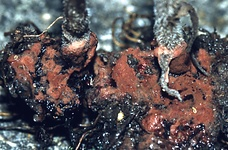
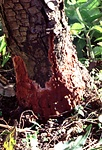

---
aliases:
  - Helicobasidium longisporum
title: Helicobasidium longisporum
---

## Phylogeny 

-   « Ancestral Groups  
    -  [Helicobasidiales](../Helicobasidiales.md) 
    -   [Urediniomycotina](Urediniomycotina)
    -  [Basidiomycota](../../../Basidiomycota.md) 
    -  [Fungi](../../../../Fungi.md) 
    -  [Eukarya](../../../../../Eukarya.md) 
    -   [Tree of Life](../../../../../Tree_of_Life.md)

-   ◊ Sibling Groups of  Helicobasidiales
    -  [Tuberculina sbrozzii](Tuberculina_sbrozzii.md) 
    -  [Helicobasidium         purpureum](Helicobasidium_purpureum.md) 
    -  [Tuberculina maxima](Tuberculina_maxima.md) 
    -   Helicobasidium longisporum
    -  [Helicobasidium mompa](Helicobasidium_mompa.md) 

-   » Sub-Groups 

# *Helicobasidium longisporum* [Wakef.]

## syn.: Helicobasidium compactum [Boedijn] 

 

Containing group:[Helicobasidiales](../Helicobasidiales.md) 

## Title Illustrations



  -----------------------------------------------------------------------------
  scientific_name ::     Helicobasidium longisporum on roots and basal parts of stems of Aster sp. cult.
  location ::           Germany, Baden-Württemberg, Stuttgart
  Comments             on roots and basal parts of stems of Aster sp. cult.
  specimen_condition ::  Live Specimen
  Identified By        M. Lutz
  Life Cycle Stage ::     Sterile stage (Thanatophytum) of the phytoparasitic teleomorph
  Collection           2000
  copyright ::            © 2000 [Matthias Lutz](mailto:matthias.lutz@uni-tuebingen.de) 
 
  -----------------------------------------------------------------------------
 

  -----------------------------------------------------------------------------
  scientific_name ::     Helicobasidium longisporum Wakef. on roots and basal parts of stem of Pyrus communis L.
  location ::           Germany, Baden-Württemberg, Stuttgart
  specimen_condition ::  Live Specimen
  Identified By        M. Lutz
  Life Cycle Stage ::     Fructification of the phytoparasitic teleomorph
  Collection           2000
  Collector            M. Lutz
  copyright ::            © 2000 [Matthias Lutz](mailto:matthias.lutz@uni-tuebingen.de) 
 
  -----------------------------------------------------------------------------
 

  -----------------------------------------------------------------------------
  scientific_name ::     Tuberculina persicina (Ditmar) Sacc. on Gymnosporangium sabinae (Dicks.) G. Winter/Pyrus communis L.
  location ::           Germany, Nordrhein-Westfalen, Aachen
  specimen_condition ::  Dead Specimen
  Identified By        M. Lutz
  Life Cycle Stage ::     Mycoparasitic anamorph of Helicobasidium longisporum Wakef. forming conidia
  Collection           2004
  Collector            M. Mennicken
  copyright ::            © 2004 [Matthias Lutz](mailto:matthias.lutz@uni-tuebingen.de) 
 
  -----------------------------------------------------------------------------

## Confidential Links & Embeds: 

### #is_/same_as :: [[/_Standards/bio/bio~Domain/Eukarya/Fungi/Basidiomycota/Pucciniomycotina/Helicobasidiales/Helicobasidium longisporum|Helicobasidium longisporum]] 

### #is_/same_as :: [[/_public/bio/bio~Domain/Eukarya/Fungi/Basidiomycota/Pucciniomycotina/Helicobasidiales/Helicobasidium longisporum.public|Helicobasidium longisporum.public]] 

### #is_/same_as :: [[/_internal/bio/bio~Domain/Eukarya/Fungi/Basidiomycota/Pucciniomycotina/Helicobasidiales/Helicobasidium longisporum.internal|Helicobasidium longisporum.internal]] 

### #is_/same_as :: [[/_protect/bio/bio~Domain/Eukarya/Fungi/Basidiomycota/Pucciniomycotina/Helicobasidiales/Helicobasidium longisporum.protect|Helicobasidium longisporum.protect]] 

### #is_/same_as :: [[/_private/bio/bio~Domain/Eukarya/Fungi/Basidiomycota/Pucciniomycotina/Helicobasidiales/Helicobasidium longisporum.private|Helicobasidium longisporum.private]] 

### #is_/same_as :: [[/_personal/bio/bio~Domain/Eukarya/Fungi/Basidiomycota/Pucciniomycotina/Helicobasidiales/Helicobasidium longisporum.personal|Helicobasidium longisporum.personal]] 

### #is_/same_as :: [[/_secret/bio/bio~Domain/Eukarya/Fungi/Basidiomycota/Pucciniomycotina/Helicobasidiales/Helicobasidium longisporum.secret|Helicobasidium longisporum.secret]] 

