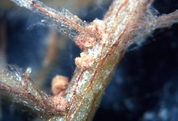

---
aliases:
  - Helicobasidium mompa
title: Helicobasidium mompa
---

## Phylogeny 

-   « Ancestral Groups  
    -  [Helicobasidiales](../Helicobasidiales.md) 
    -   [Urediniomycotina](Urediniomycotina)
    -  [Basidiomycota](../../../Basidiomycota.md) 
    -  [Fungi](../../../../Fungi.md) 
    -  [Eukarya](../../../../../Eukarya.md) 
    -   [Tree of Life](../../../../../Tree_of_Life.md)

-   ◊ Sibling Groups of  Helicobasidiales
    -  [Tuberculina sbrozzii](Tuberculina_sbrozzii.md) 
    -  [Helicobasidium         purpureum](Helicobasidium_purpureum.md) 
    -  [Tuberculina maxima](Tuberculina_maxima.md) 
    -  [Helicobasidium         longisporum](Helicobasidium_longisporum.md) 
    -   Helicobasidium mompa

-   » Sub-Groups 

# *Helicobasidium mompa* [Tanaka] 
 

Containing group:[Helicobasidiales](../Helicobasidiales.md) 

## Title Illustrations

 

  -----------------------------------------------------------------------------
  scientific_name ::     Helicobasidium mompa Tanaka on the roots of Picea abies (L.) Karst.
  location ::           Infection experiment, Botanical Institute, Universität Tübingen, Germany
  specimen_condition ::  Live Specimen
  Identified By        M. Lutz
  Life Cycle Stage ::     Sterile stage (Thanatophytum) of the phytoparasitic teleomorph
  Collection           2002
  copyright ::            © 2002 [Matthias Lutz](mailto:matthias.lutz@uni-tuebingen.de) 
 
  -----------------------------------------------------------------------------

## Confidential Links & Embeds: 

### #is_/same_as :: [[/_Standards/bio/bio~Domain/Eukarya/Fungi/Basidiomycota/Pucciniomycotina/Helicobasidiales/Helicobasidium mompa|Helicobasidium mompa]] 

### #is_/same_as :: [[/_public/bio/bio~Domain/Eukarya/Fungi/Basidiomycota/Pucciniomycotina/Helicobasidiales/Helicobasidium mompa.public|Helicobasidium mompa.public]] 

### #is_/same_as :: [[/_internal/bio/bio~Domain/Eukarya/Fungi/Basidiomycota/Pucciniomycotina/Helicobasidiales/Helicobasidium mompa.internal|Helicobasidium mompa.internal]] 

### #is_/same_as :: [[/_protect/bio/bio~Domain/Eukarya/Fungi/Basidiomycota/Pucciniomycotina/Helicobasidiales/Helicobasidium mompa.protect|Helicobasidium mompa.protect]] 

### #is_/same_as :: [[/_private/bio/bio~Domain/Eukarya/Fungi/Basidiomycota/Pucciniomycotina/Helicobasidiales/Helicobasidium mompa.private|Helicobasidium mompa.private]] 

### #is_/same_as :: [[/_personal/bio/bio~Domain/Eukarya/Fungi/Basidiomycota/Pucciniomycotina/Helicobasidiales/Helicobasidium mompa.personal|Helicobasidium mompa.personal]] 

### #is_/same_as :: [[/_secret/bio/bio~Domain/Eukarya/Fungi/Basidiomycota/Pucciniomycotina/Helicobasidiales/Helicobasidium mompa.secret|Helicobasidium mompa.secret]] 

