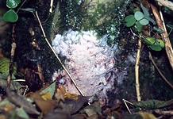
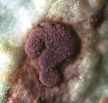
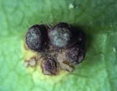

---
aliases:
  - Helicobasidium_purpureum
  - Helicobasidium purpureum
title: Helicobasidium purpureum
---

## Phylogeny 

-   « Ancestral Groups  
    -  [Helicobasidiales](../Helicobasidiales.md) 
    -   [Urediniomycotina](Urediniomycotina)
    -  [Basidiomycota](../../../Basidiomycota.md) 
    -  [Fungi](../../../../Fungi.md) 
    -  [Eukarya](../../../../../Eukarya.md) 
    -   [Tree of Life](../../../../../Tree_of_Life.md)

-   ◊ Sibling Groups of  Helicobasidiales
    -  [Tuberculina sbrozzii](Tuberculina_sbrozzii.md) 
    -   Helicobasidium purpureum
    -  [Tuberculina maxima](Tuberculina_maxima.md) 
    -  [Helicobasidium         longisporum](Helicobasidium_longisporum.md) 
    -  [Helicobasidium mompa](Helicobasidium_mompa.md) 

-   » Sub-Groups 

# *Helicobasidium purpureum* [Pat.]

## syn.: Helicobasidium brebissonii [(Desm.) Donk] 

) 

Containing group:[Helicobasidiales](../Helicobasidiales.md) 

## Title Illustrations

 

  -----------------------------------------------------------------------------
  scientific_name ::     Helicobasidium purpureum Pat. on Carpinus betulus L.
  location ::           Germany, Baden-Württemberg, Tübingen
  specimen_condition ::  Live Specimen
  Identified By        M. Lutz
  Life Cycle Stage ::     Fruitbody of the phytoparasitic teleomorph
  Collection           2001
  copyright ::            © 2001 [Matthias Lutz](mailto:matthias.lutz@uni-tuebingen.de) 
 
  -----------------------------------------------------------------------------
 

  -----------------------------------------------------------------------------
  scientific_name ::     Tuberculina persicina (Ditmar) Sacc. on Puccinia sessilis W. G. Schneider in J. Schröt./Arum maculatum L.
  location ::           Germany, Baden-Württemberg, Münsingen
  specimen_condition ::  Live Specimen
  Identified By        M. Lutz
  Life Cycle Stage ::     Mycoparasitic anamorph of Helicobasidium purpureum Pat.
  Collection           2001
  copyright ::            © 2001 [Matthias Lutz](mailto:matthias.lutz@uni-tuebingen.de) 
 
  -----------------------------------------------------------------------------
 

  -----------------------------------------------------------------------------
  scientific_name ::     Tuberculina persicina (Ditmar) Sacc. on Puccinia coronata Corda/Rhamnus cathartica L.
  location ::           Germany, Baden-Württemberg, Tübingen
  specimen_condition ::  Live Specimen
  Identified By        M. Lutz
  Life Cycle Stage ::     Mycoparasitic anamorph of Helicobasidium purpureum Pat. forming conidia and sclerotia
  Collection           2001
  copyright ::            © 2001 [Matthias Lutz](mailto:matthias.lutz@uni-tuebingen.de) 
 
  -----------------------------------------------------------------------------

## Confidential Links & Embeds: 

### #is_/same_as :: [[/_Standards/bio/bio~Domain/Eukarya/Fungi/Basidiomycota/Pucciniomycotina/Helicobasidiales/Helicobasidium_purpureum|Helicobasidium_purpureum]] 

### #is_/same_as :: [[/_public/bio/bio~Domain/Eukarya/Fungi/Basidiomycota/Pucciniomycotina/Helicobasidiales/Helicobasidium_purpureum.public|Helicobasidium_purpureum.public]] 

### #is_/same_as :: [[/_internal/bio/bio~Domain/Eukarya/Fungi/Basidiomycota/Pucciniomycotina/Helicobasidiales/Helicobasidium_purpureum.internal|Helicobasidium_purpureum.internal]] 

### #is_/same_as :: [[/_protect/bio/bio~Domain/Eukarya/Fungi/Basidiomycota/Pucciniomycotina/Helicobasidiales/Helicobasidium_purpureum.protect|Helicobasidium_purpureum.protect]] 

### #is_/same_as :: [[/_private/bio/bio~Domain/Eukarya/Fungi/Basidiomycota/Pucciniomycotina/Helicobasidiales/Helicobasidium_purpureum.private|Helicobasidium_purpureum.private]] 

### #is_/same_as :: [[/_personal/bio/bio~Domain/Eukarya/Fungi/Basidiomycota/Pucciniomycotina/Helicobasidiales/Helicobasidium_purpureum.personal|Helicobasidium_purpureum.personal]] 

### #is_/same_as :: [[/_secret/bio/bio~Domain/Eukarya/Fungi/Basidiomycota/Pucciniomycotina/Helicobasidiales/Helicobasidium_purpureum.secret|Helicobasidium_purpureum.secret]] 

