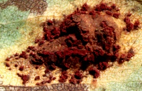

---
aliases:
  - Tuberculina maxima
title: Tuberculina maxima
---

## Phylogeny 

-   « Ancestral Groups  
    -  [Helicobasidiales](../Helicobasidiales.md) 
    -   [Urediniomycotina](Urediniomycotina)
    -  [Basidiomycota](../../../Basidiomycota.md) 
    -  [Fungi](../../../../Fungi.md) 
    -  [Eukarya](../../../../../Eukarya.md) 
    -   [Tree of Life](../../../../../Tree_of_Life.md)

-   ◊ Sibling Groups of  Helicobasidiales
    -  [Tuberculina sbrozzii](Tuberculina_sbrozzii.md) 
    -  [Helicobasidium         purpureum](Helicobasidium_purpureum.md) 
    -   Tuberculina maxima
    -  [Helicobasidium         longisporum](Helicobasidium_longisporum.md) 
    -  [Helicobasidium mompa](Helicobasidium_mompa.md) 

-   » Sub-Groups 

# *Tuberculina maxima* [Rostr.] 
)) 

Containing group:[Helicobasidiales](../Helicobasidiales.md) 

## Title Illustrations

 

  -----------------------------------------------------------------------------
  scientific_name ::     Tuberculina maxima Rostr. on Gymnosporangium sabinae (Dicks.) G. Winter/Pyrus communis L.
  location ::           Germany, Baden-Württemberg, Stuttgart
  specimen_condition ::  Live Specimen
  Identified By        M. Lutz
  Life Cycle Stage ::     Mycoparasitic anamorph
  Collection           2001
  Collector            M. Lutz
  copyright ::            © 2001 [Matthias Lutz](mailto:matthias.lutz@uni-tuebingen.de) 
 
  -----------------------------------------------------------------------------
 

  -----------------------------------------------------------------------------
  scientific_name ::     Tuberculina maxima Rostr. on Gymnosporangium sabinae (Dicks.) G. Winter/Pyrus communis L.
  location ::           Germany, Baden-Württemberg, Stuttgart
  specimen_condition ::  Live Specimen
  Identified By        M. Lutz
  Life Cycle Stage ::     Mycoparasitic anamorph
  Collection           2000
  Collector            M. Lutz
  copyright ::            © 2000 [Matthias Lutz](mailto:matthias.lutz@uni-tuebingen.de) 
 
  -----------------------------------------------------------------------------
 

  -----------------------------------------------------------------------------
  scientific_name ::     Tuberculina maxima Rostr. on Cronartium ribicola J. C. Fisch./Pinus albicaulis Engelm.
  location ::           Canada, British Columbia, Skookumchuck
  specimen_condition ::  Dead Specimen
  Identified By        J. C. Hopkins
  Life Cycle Stage ::     Mycoparasitic anamorph
  Collection           1983
  Collector            H. P. Koot
  copyright ::            © 2001 [Matthias Lutz](mailto:matthias.lutz@uni-tuebingen.de) 
 
  -----------------------------------------------------------------------------

## Confidential Links & Embeds: 

### #is_/same_as :: [[/_Standards/bio/bio~Domain/Eukarya/Fungi/Basidiomycota/Pucciniomycotina/Helicobasidiales/Tuberculina maxima|Tuberculina maxima]] 

### #is_/same_as :: [[/_public/bio/bio~Domain/Eukarya/Fungi/Basidiomycota/Pucciniomycotina/Helicobasidiales/Tuberculina maxima.public|Tuberculina maxima.public]] 

### #is_/same_as :: [[/_internal/bio/bio~Domain/Eukarya/Fungi/Basidiomycota/Pucciniomycotina/Helicobasidiales/Tuberculina maxima.internal|Tuberculina maxima.internal]] 

### #is_/same_as :: [[/_protect/bio/bio~Domain/Eukarya/Fungi/Basidiomycota/Pucciniomycotina/Helicobasidiales/Tuberculina maxima.protect|Tuberculina maxima.protect]] 

### #is_/same_as :: [[/_private/bio/bio~Domain/Eukarya/Fungi/Basidiomycota/Pucciniomycotina/Helicobasidiales/Tuberculina maxima.private|Tuberculina maxima.private]] 

### #is_/same_as :: [[/_personal/bio/bio~Domain/Eukarya/Fungi/Basidiomycota/Pucciniomycotina/Helicobasidiales/Tuberculina maxima.personal|Tuberculina maxima.personal]] 

### #is_/same_as :: [[/_secret/bio/bio~Domain/Eukarya/Fungi/Basidiomycota/Pucciniomycotina/Helicobasidiales/Tuberculina maxima.secret|Tuberculina maxima.secret]] 

