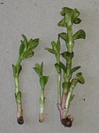
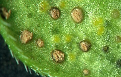
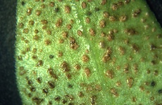

---
aliases:
  - Tuberculina_sbrozzii
  - Tuberculina sbrozzii
title: Tuberculina sbrozzii
---

## Phylogeny 

-   « Ancestral Groups  
    -  [Helicobasidiales](../Helicobasidiales.md) 
    -   [Urediniomycotina](Urediniomycotina)
    -  [Basidiomycota](../../../Basidiomycota.md) 
    -  [Fungi](../../../../Fungi.md) 
    -  [Eukarya](../../../../../Eukarya.md) 
    -   [Tree of Life](../../../../../Tree_of_Life.md)

-   ◊ Sibling Groups of  Helicobasidiales
    -   Tuberculina sbrozzii
    -  [Helicobasidium         purpureum](Helicobasidium_purpureum.md) 
    -  [Tuberculina maxima](Tuberculina_maxima.md) 
    -  [Helicobasidium         longisporum](Helicobasidium_longisporum.md) 
    -  [Helicobasidium mompa](Helicobasidium_mompa.md) 

-   » Sub-Groups 

# *Tuberculina sbrozzii* [Cavara & Sacc.] 

)

Containing group:[Helicobasidiales](../Helicobasidiales.md) 

## Title Illustrations

)

  -----------------------------------------------------------------------------
  Scientific Name ::     Tuberculina sbrozzii Cavara & Sacc. on Puccinia vincae (DC.) Berk./Vinca major L.
  Location ::           Germany, Baden-Württemberg, Tübingen
  Specimen Condition   Live Specimen
  Identified By        M. Lutz
  Life Cycle Stage ::     Mycoparasitic anamorph
  Collection           2004
  Copyright ::            © 2004 [Matthias Lutz](mailto:matthias.lutz@uni-tuebingen.de) 
 
  -----------------------------------------------------------------------------
)

  -----------------------------------------------------------------------------
  Scientific Name ::     Tuberculina sbrozzii Cavara & Sacc. on Puccinia vincae (DC.) Berk./Vinca major L.
  Location ::           Germany, Baden-Württemberg, Tübingen
  Specimen Condition   Live Specimen
  Identified By        M. Lutz
  Life Cycle Stage ::     Mycoparasitic anamorph
  Collection           2002
  Copyright ::            © 2002 [Matthias Lutz](mailto:matthias.lutz@uni-tuebingen.de) 
 
  -----------------------------------------------------------------------------
)

  -----------------------------------------------------------------------------
  Scientific Name ::     Tuberculina sbrozzii Cavara & Sacc. on Puccinia vincae (DC.) Berk./Vinca major L.
  Location ::           Germany, Baden-Württemberg, Tübingen
  Specimen Condition   Live Specimen
  Identified By        M. Lutz
  Life Cycle Stage ::     Mycoparasitic anamorph
  Collection           2002
  Copyright ::            © 2002 [Matthias Lutz](mailto:matthias.lutz@uni-tuebingen.de) 
 
  -----------------------------------------------------------------------------

## Confidential Links & Embeds: 

### #is_/same_as :: [[/_Standards/bio/bio~Domain/Eukarya/Fungi/Basidiomycota/Pucciniomycotina/Helicobasidiales/Tuberculina_sbrozzii|Tuberculina_sbrozzii]] 

### #is_/same_as :: [[/_public/bio/bio~Domain/Eukarya/Fungi/Basidiomycota/Pucciniomycotina/Helicobasidiales/Tuberculina_sbrozzii.public|Tuberculina_sbrozzii.public]] 

### #is_/same_as :: [[/_internal/bio/bio~Domain/Eukarya/Fungi/Basidiomycota/Pucciniomycotina/Helicobasidiales/Tuberculina_sbrozzii.internal|Tuberculina_sbrozzii.internal]] 

### #is_/same_as :: [[/_protect/bio/bio~Domain/Eukarya/Fungi/Basidiomycota/Pucciniomycotina/Helicobasidiales/Tuberculina_sbrozzii.protect|Tuberculina_sbrozzii.protect]] 

### #is_/same_as :: [[/_private/bio/bio~Domain/Eukarya/Fungi/Basidiomycota/Pucciniomycotina/Helicobasidiales/Tuberculina_sbrozzii.private|Tuberculina_sbrozzii.private]] 

### #is_/same_as :: [[/_personal/bio/bio~Domain/Eukarya/Fungi/Basidiomycota/Pucciniomycotina/Helicobasidiales/Tuberculina_sbrozzii.personal|Tuberculina_sbrozzii.personal]] 

### #is_/same_as :: [[/_secret/bio/bio~Domain/Eukarya/Fungi/Basidiomycota/Pucciniomycotina/Helicobasidiales/Tuberculina_sbrozzii.secret|Tuberculina_sbrozzii.secret]] 

