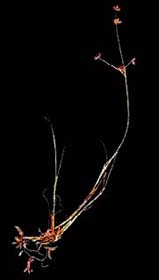
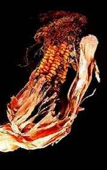
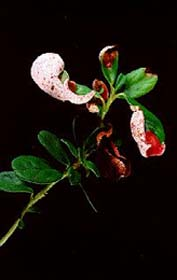
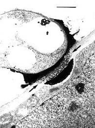
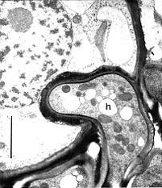
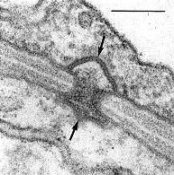
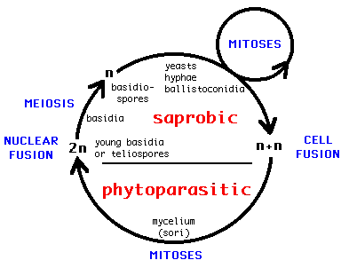

## Phylogeny 

-   « Ancestral Groups  
    -  [Basidiomycota](../Basidiomycota.md))
    -  [Fungi](../../Fungi.md))
    -  [Eukarya](../../../Eukarya.md))
    -   [Tree of Life](../../../Tree_of_Life.md)

-   ◊ Sibling Groups of  Basidiomycota
    -  [Agaricomycotina](Agaricomycotina.md))
    -   Ustilaginomycetes
    -   [Urediniomycotina](Urediniomycotina)

-   » Sub-Groups 

## Ustilaginomycotina 

# Ustilaginomycetes

## The true smut fungi 

[Robert Bauer, Dominik Begerow, and Franz Oberwinkler]()

)

Containing group:[Basidiomycota](../Basidiomycota.md))

### Information on the Internet

-   [Lehrstuhl Spezielle Botanik and Mykologie,     Tübingen](http://www.systbot.uni-tuebingen.de/)

## Introduction

The class Ustilaginomycetes comprises more than 1400 species of
basidiomycetous plant parasites, which are distributed in approximately
70 genera. They occur throughout the world, although many species are
restricted to tropical, temperate or arctic regions. Some species of
Ustilago and Tilletia, e.g. the barley, wheat or maize smut fungi, are
well known because they are of economic importance. For example, from
1983 to 1988 the barley smut fungi reduced annual yields by 0.7% to 1.6%
in the prairie provinces in central Canada, causing average annual
losses of about U.S. \$8,000,000 (Thomas 1989). Tilletia contraversa is
important in the international wheat trade (Trione 1982), and 2-5% of
the plants in a corn field are generally infected by Ustilago maydis,
while up to 80% of a field can be infected if conditions are good for
the smut fungus. On the other hand, the galls of U. maydis are
considered a delicacy in the Mesoamerican tradition. They are known in
Mexico as \"Huitlacoche\" and in the U.S.A. as \"maize mushroom\",
\"Mexican truffles\" or \"caviar azteca\" (Valverde et al. 1995).

### Characteristics

-   [Plant parasitism](#parasitism)
-   [Cellular interaction](#interaction) with primary interactive
    vesicles
-   [Cell wall carbohydrate composition](#carbohydrate) with dominance
    of glucose and absence of xylose
-   [5S rRNA](#5S) secondary structure of type B
-   [Septal pores](#pores) without parenthesomes, but in most cases with
    distinctive tripartite membrane caps or discs
-   [Life cycle](#cycle) with a parasitic dikaryophase and a saprobic
    haplophase

#### Plant parasitism

In contrast with the Urediniomycetes and Hymenomycetes, the
Ustilaginomycetes are ecologically well characterized by their
parasitism of vascular plants. Two of the more than 1400 species live on
lycophytes, one on ferns, two on conifers, whereas all other
Ustilaginomycetes parasitize angiosperms with about 810 species on
Poaceae and 170 on Cyperaceae. Interestingly, no species has been
reported to parasitize Orchidaceae although this family, with about
20,000 species, is one of the largest groups of the angiosperms. With a
few exceptions the teliospore-forming species of the Ustilaginomycetes
parasitize nonwoody herbs, whereas those without teliospores prefer
woody trees or bushes. However, almost all species sporulate on or in
parenchymatic tissues of the hosts. Depending upon the species the sori
appear in different organs of the hosts, e.g. in roots, stems, leaves,
inflorescences, flowers, anthers, ovaries, seeds etc.

#### Cellular interaction

An important apomorphy for the Ustilaginomycetes is the presence of
zones of host-parasite interaction with fungal deposits resulting from
exocytosis of primary interactive vesicles (Bauer et al. 1995a, 1997).
)

Fig.1. Transmission electron micrograph showing primary interactive
vesicles in Exobasidium pachysporum. Scale bar = 0.2 µm. © R. Bauer
1997\
Fig. 2. Transmission electron micrograph showing a transfer stage
between Mycosyrinx cissi (upper cell) and its host (lower cell). Note
the infiltrated host cell wall (between the two arrows) and the deposit
at the host cell. Scale bar = 1 µm. © R. Bauer 1997

The contents of these vesicles (Fig. 1) are transferred to the host
plasma membrane (Fig. 2). Two major types are recognized. (i) Local
interaction zones (Fig. 3): short-term production of primary interactive
vesicles per interaction site results in local interaction zones, and
(ii) enlarged interaction zones (Fig. 4): continuous production and
exocytosis of primary interactive vesicles results in the continuous
deposition of fungal material at the whole contact area with the host
cell.
)

Fig. 3. Transmission electron micrograph showing a local interaction
zone (arrows) between Exobasidium pachysporum (lower cell) and its host
(upper cell). Note the interaction apparatus (arrowheads) and the
deposit at the host cell. Scale bar = 0.5 µm. © R. Bauer 1997\
Fig. 4. Transmission electron micrograph showing an enlarged interaction
zone between Ustacystis waldsteiniae and its host. The haustorium (h) is
encased by electron-opaque material. Scale bar = 2 µm. © R. Bauer 1997

#### Cell wall carbohydrate composition

Prillinger et al. (1993) distinguished between several types of cell
wall carbohydrate composition within the Basidiomycota. The
Ustilaginomycetes have a distinctive type with dominance of glucose and
absence of xylose that separates them from the Urediniomycetes and
Hymenomycetes.

#### 5S rRNA

Gottschalk and Blanz (1985) distinguished between a type A and a type B
secondary structure of the 5S rRNA. The Ustilaginomycetes share the type
B secondary structure with the Hymenomycetes.

#### Septal pores

In contrast with the Hymenomycetes, the septal pores of the
Ustilaginomycetes are without multilayered parenthesomes. In contrast
with the Urediniomycetes, in most Ustilaginomycetes the septal pores are
enclosed by distinctive, tripartite membrane caps or discs (Bauer et al.
1995b, Bauer et al. 1997, Fig. 5).
)

Fig. 5. Transmission electron micrograph showing a typical septal pore
apparatus of the Ustilaginomycetes (Entyloma callitrichis) with two
membrane caps (arrows). Scale bar = 0.1 µm. © R. Bauer 1997

#### Life cycle

The Ustilaginomycetes present a rather uniform life cycle with a
saprobic haploid phase and a parasitic dikaryophase (e.g. Sampson 1939;
Fig. 6). The haploid phase usually commences with the formation of
basidiospores after meiosis of the diploid nucleus in the basidium and
ends with the conjugation of compatible haploid cells to produce
dikaryotic, parasitic mycelia. The dikaryotic phase ends with the
production of basidia. In the majority of the Ustilaginomycetes the
young basidium becomes a thick-walled teliospore and separates at
maturity from the sorus, thus functioning as a dispersal unit. Most of
the Ustilaginomycetes are dimorphic, producing a yeast or yeast-like
phase in the haploid state. Almost all Ustilaginomycetes multiply
mitotically in the saprobic phase, either with yeasts or with
ballistoconidia, or with both.
)

Fig. 6. Generalized life cycle of the Ustilaginomycetes. © R. Bauer and
F. Oberwinkler 1997

The Ustilaginomycetes share most characteristics of the life cycle with
the Microbotryales, which traditionally were considered belonging to the
Ustilago-group. However, several independent characters show that the
microbotryaceous species of the genera Aurantiosporium, Fulvisporium,
Liroa, Microbotryum, Sphacelotheca, Ustilentyloma and Zundeliomyces are
actually Urediniomycetes (Gottschalk and Blanz 1985, Prillinger et al.
1993, Swann and Taylor 1993, Bauer et al. 1997).

### Discussion of Phylogenetic Relationships

Since Tulasne and Tulasne (1847) the smut fungi are traditionally
divided into the phragmobasidiate Ustilaginaceae and the holobasidiate
Tilletiaceae, which are sometimes treated as separate orders (Kreisel
1969, Oberwinkler 1987). Difficulties in their classification have been
discussed, e.g. by Durán (1973) and Vánky (1987), neither of whom listed
higher taxa in this group. Based predominantly on host-parasite
interactions and septal pore apparatus, a radical change in the
systematics of smut fungi has been proposed by Bauer et al. (1997). As a
result, on the one hand the Microbotryales were excluded from the
Ustilaginomycetes and on the other the Exobasidiales s. l., Graphiolales
and Microstromatales were included in this group. Cellular interaction
(Bauer et al. 1997) and cell wall carbohydrate composition (Prillinger
et al. 1993) indicate that the class Ustilaginomycetes in this
composition is monophyletic, and phylogenetic analyses of rDNA sequences
(Swann and Taylor 1993, Berres et al. 1995, Begerow et al. 1997) are
consistent with this hypothesis.

Ultrastructural and rDNA sequence analyses provide evidence for the
existence of three major groups within the Ustilaginomycetes (Bauer et
al. 1997, Begerow et al. 1997). The basal dichotomy is between the
Entorrhizomycetidae and the branch uniting the Ustilaginomycetidae and
Exobasidiomycetidae (Bauer et al. 1997, Begerow et al. 1997). In
contrast with the Ustilaginomycetidae and Exobasidiomycetidae, the
septal pores of the Entorrhizomycetidae are not enclosed by tripartite
membrane caps. The Ustilaginomycetidae form enlarged interaction zones,
whereas the Exobasidiomycetidae form local interaction zones.

The Ustilaginomycetes represents the sister group of the Hymenomycetes.
Type B secondary structure of the 5S rRNA and glucose as major cell wall
carbohydrate component are shared by both classes (Gottschalk and Blanz
1985, Prillinger et al. 1993).

### Subgroups of Ustilaginomycetes

Lack of membrane bands or caps at the pores and the presence of local
interaction zones without interaction apparatus characterize the
Entorrhizomycetidae (Bauer et al. 1997). Entorrhiza is the single genus
currently identified of this group.

Presence of enlarged interaction zones characterizes the
Ustilaginomycetidae (Bauer et al. 1997). This statistically
well-supported subclass (Begerow et al. 1997) comprises 33 teleomorphic
(with a known sexual stage) and one anamorphic (without a known sexual
stage) genera, e.g. Anthracoidea living on Cyperaceae, Cintractia living
on Cyperaceae and Juncaceae, Doassansiopsis living on mono- and dicots,
Farysia living on Cyperaceae, Melanotaenium s. str. living on dicots,
Mycosyrinx living on Vitaceae, Pseudozyma (anamorphic genus),
Sporisorium living on Poaceae, Thecaphora living on dicots, Urocystis
living on mono- and dicots or Ustilago s.str. mainly living on Poaceae.

The Exobasidiomycetidae differ from the Ustilaginomycetidae by forming
local interaction zones and from the Entorrhizomycetidae by having
membrane caps at the pores (Bauer et al. 1997). This subclass contains
35 teleomorphic and two anamorphic genera, e.g. Botryoconis living on
Lauraceae, Brachybasidium living on Arecaceae, Coniodictyum living on
Rhamnaceae, Doassansia living on mono- and dicots, Entyloma living on
dicots, Exobasidium living on dicots, Georgefischeria living on
Convolvulaceae, Graphiola living on Arecaceae, Malassezia (anamorphic
genus), Microstroma living on Juglandaceae and Fagaceae, Tilletia living
on Poaceae, Tilletiaria (only known in laboratory) or Tilletiopsis
(anamorphic genus).

### The term smut fungus

Like the terms agaric, polypore, lichen etc. the term smut fungus
circumscribes the organization and life strategy of a fungus, but it is
not a taxonomic term. Fungi that look superficially similar to the
teliospore-forming members of the Ustilaginomycetes evolved in different
fungal groups, e.g. the Microbotryales in the Uredinomycetes (Bauer et
al. 1997) or Schroeteria in the Ascomycota (Nagler et al. 1989).

### References

Bauer, R., Mendgen, K. and Oberwinkler, F. 1995a. Cellular interaction
of the smut fungus Ustacystis waldsteiniae. Can. J. Bot. 73:867-883.

Bauer, R., Mendgen, K., and Oberwinkler, F. 1995b. Septal pore apparatus
of the smut Ustacystis waldsteiniae. Mycologia 87:18-24.

Bauer, R., Oberwinkler, F. and Vánky, K. 1997. Ultrastructural markers
and systematics in smut fungi and allied taxa. Can. J. Bot. 75:1273-1314

Begerow, D., Bauer, R. and Oberwinkler, F. 1997. Phylogenetic studies on
nuclear large subunit ribosomal DNA sequences of smut fungi and related
taxa. Can. J. Bot. 75:(appears in Dec.)

Berres, M.A., Szabo, L.J. and McLaughlin, D.J. 1995. Phylogenetic
relationships in auriculariaceous basidiomycetes based on 25S ribosomal
DNA sequences. Mycologia 87:821-840.

Durán, R. 1973. Ustilaginales. In: Ainsworth, G.C., Sparrow, F. K. and
Sussman, A.S. (eds.) The fungi, vol 4B. Academic Press, New York,
London, pp 281-300.

Gottschalk, M. and Blanz, P.A. 1985. Untersuchungen an 5S ribosomalen
Ribonucleinsäuren als Beitrag zur Klärung von Systematik und Phylogenie
der Basidiomyceten. Z. Mycol. 51:205-243.

Kreisel, H. 1969. Grundzüge eines natürlichen Systems der Pilze. Cramer
Verlag, Lehre.

Nagler, A., Bauer, R., Berbee, M., Vánky, K. and Oberwinkler, F. 1989.
Light and electron microscopic studies of Schroeteria delastrina and S.
poeltii. Mycologia 81:884-895.

Oberwinkler, F. 1987. Heterobasidiomycetes with ontogenetic yeast
stages-systematic and phylogenetic aspects. Stud. Mycol. 30:61-74.

Prillinger, H., Oberwinkler, F., Umile, C., Tlachac, K., Bauer, R.,
Dörfler, C. and Taufratzhofer, E. 1993. Analysis of cell wall
carbohydrates (neutral sugars) from ascomycetous and basidiomycetous
yeasts with and without derivatization. J. Gen. Appl. Microbiol.
39:1-34.

Sampson, K. 1939. Life cycles of smut fungi. Trans. Br. Mycol. Soc.
23:1-23.

Swann, E.C. and Taylor, J.W. 1993. Higher taxa of basidiomycetes: an 18S
rRNA gene perspective. Mycologia 85:923-936.

Thomas, P.L. 1989. Barley smuts in the prairie provinces of Canada,
1983-1988. Can. J. Phytopath. 11:133-136.

Trione, E.J. 1982. Dwarf bunt of wheat and its importance in
international wheat trade. Plant Disease 66:1083-1088.

Tulasne, L. and Tulasne, C. 1847. Mémoire sur les Ustilaginées comparées
Uredinées. Ann. Sci. Nat. Bot. 3:12-127.

Valverde, M.E., Paredes-Lópes, O., Pataky, J.K. and Guevara-Lara, F.
1995. Huitlacoche (Ustilago maydis) as a food source-biology,
composition, and production. CRC Crit. Rev. Food Sci. Nutr. 35:191-229.

Vánky, K. 1987. Illustrated genera of smut fungi. Cryptogamic Studies
1:1-159.

## Title Illustrations

)

  ---------------------------------------------------------------------------------
  Scientific Name ::  Entorrhiza casparyana, Juncus articulatus
  Comments          Galls on the roots of Juncus articulatus induced by Entorrhiza casparyana
  Copyright ::         © 1997 [Robert Bauer](http://www.uni-tuebingen.de/uni/bbm/Privat/Robert.html) 
  ---------------------------------------------------------------------------------
)

  ---------------------------------------------------------------------------------
  Scientific Name ::  Ustilago maydis, Zea mays
  Comments          Corn galls on Zea mays induced by Ustilago maydis
  Copyright ::         © 1997 [Robert Bauer](http://www.uni-tuebingen.de/uni/bbm/Privat/Robert.html) 
  ---------------------------------------------------------------------------------
)

  ---------------------------------------------------------------------------------
  Scientific Name ::  Exobasidium vaccinii, Vaccinium vitis-idaea
  Comments          Sporulation of Exobasidium vaccinii on Vaccinium vitis-idaea
  Copyright ::         © 1997 [Robert Bauer](http://www.uni-tuebingen.de/uni/bbm/Privat/Robert.html) 
  ---------------------------------------------------------------------------------

## Confidential Links & Embeds: 

### #is_/same_as :: [Ustilaginomycotina](/_Standards/bio/bio~Domain/Eukarya/Fungi/Basidiomycota/Ustilaginomycotina.md) 

### #is_/same_as :: [Ustilaginomycotina.public](/_public/bio/bio~Domain/Eukarya/Fungi/Basidiomycota/Ustilaginomycotina.public.md) 

### #is_/same_as :: [Ustilaginomycotina.internal](/_internal/bio/bio~Domain/Eukarya/Fungi/Basidiomycota/Ustilaginomycotina.internal.md) 

### #is_/same_as :: [Ustilaginomycotina.protect](/_protect/bio/bio~Domain/Eukarya/Fungi/Basidiomycota/Ustilaginomycotina.protect.md) 

### #is_/same_as :: [Ustilaginomycotina.private](/_private/bio/bio~Domain/Eukarya/Fungi/Basidiomycota/Ustilaginomycotina.private.md) 

### #is_/same_as :: [Ustilaginomycotina.personal](/_personal/bio/bio~Domain/Eukarya/Fungi/Basidiomycota/Ustilaginomycotina.personal.md) 

### #is_/same_as :: [Ustilaginomycotina.secret](/_secret/bio/bio~Domain/Eukarya/Fungi/Basidiomycota/Ustilaginomycotina.secret.md)

