---
aliases:
  - Zygomycota
has_id_wikidata: Q215384
title: Zygomycota
taxon_rank: '[[_Standards/WikiData/WD~division,334460]]'
described_by_source: '[[_Standards/WikiData/WD~Great_Soviet_Encyclopedia_(1926_1947),20078554]]'
parent_taxon: '[[_Standards/WikiData/WD~Eomycota,23674661]]'
instance_of: '[[_Standards/WikiData/WD~taxon,16521]]'
ITIS_TSN: 936291
image:
  - http://commons.wikimedia.org/wiki/Special:FilePath/Mucor%20spec.%20-%20Lindsey%201a.jpg
  - http://commons.wikimedia.org/wiki/Special:FilePath/Phycomyces.JPG
EPPO_Code: 1ZYGOP
Commons_category: Zygomycota
taxon_name: Zygomycota
NBN_System_Key: BMSSYS0000052700
---

# [[Zygomycota]]

#is_a/bio-Phylum  
#is_a :: [[../../../Taxon_Rank/bio~Kingdom/bio~Phylum|bio~Phylum]]  
#is_/same_as :: [[../../../../WikiData/WD~Zygomycota,215384|WD~Zygomycota,215384]] 

## Microscopic \'Pin\' or \'Sugar\' Molds 

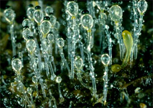
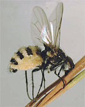
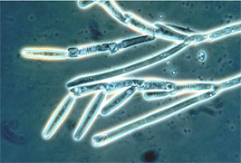

## #has_/text_of_/abstract 

> **Zygomycota**, or zygote fungi, is a former division or phylum of the kingdom Fungi. 
> The members are now part of two phyla: the Mucoromycota and Zoopagomycota. 
> Approximately 1060 species are known. 
> 
> They are mostly terrestrial in habitat, living in soil or on decaying plant or animal material. 
> 
> Some are parasites of plants, insects, and small animals, 
> while others form symbiotic relationships with plants. 
> 
> Zygomycete hyphae may be coenocytic, forming septa only 
> where gametes are formed or to wall off dead hyphae. 
> 
> Zygomycota is no longer recognised as it was not believed to be truly monophyletic.
>
> [Wikipedia](https://en.wikipedia.org/wiki/Zygomycota) 

## Phylogeny 

-   « Ancestral Groups  
    -  [Fungi](../Fungi.md) 
    -  [Eukarya](../../Eukarya.md) 
    -   [Tree of Life](../../Tree_of_Life.md)

-   ◊ Sibling Groups of  Fungi
    -  [Basidiomycota](Basidiomycota.md) 
    -  [Ascomycota](Ascomycota.md) 
    -  [Glomeromycota](Glomeromycota.md) 
    -   [Chytridiomycota](Chytridiomycota)
    -   Zygomycota

-   » Sub-Groups
    -   [Harpellales](Harpellales)

The tree shown above is based on several phylogenetic analyses of
nuclear small subunit (SSU) ribosomal DNA (Lutzoni et al. 2004, Nagahama
et al. 1995, O\'Donnell et al. 1998, Tanabe et al. 2000), elongation
factor 1α, and the largest subunit of RNA polymerase II (RPB1; Tanabe et
al. 2004) genes. Most of the taxonomic orders are strongly supported as
monophyletic, but relationships among them are poorly resolved.
Monophyly of the Zygomycota remains controversial.

Containing group: [Fungi](../Fungi.md) 

### Information on the Internet

-   [Taxonomy and co-evolution of Trichomycetes (gut-inhabiting fungi)     and their Chironomidae (Diptera)     hosts](http://www.nhm.ku.edu/%7Efungi/).
-   [Tom Volk\'s Fungi](http://botit.botany.wisc.edu/toms_fungi/).
-   [Fungal Mitochondrial Genome     Project](http://megasun.bch.umontreal.ca/People/lang/FMGP/FMGP.html).
-   [The Fifth Kingdom online](http://www.mycolog.com/fifthtoc.html).
-   [George Barron\'s Website on     Fungi](http://www.uoguelph.ca/%7Egbarron/).
-   [Deep Hypha Research Corrdination Network. Deep Hypha is a     NSF-funded project to coordinate and provide resources for research     in fungal systematics](http://ocid.nacse.org/research/deephyphae/).
-   [AFTOL: Assembling the Fungal Tree of Life. An NSF-funded project to     facilitate collaborative research in the phylogeny of     Fungi](http://ocid.nacse.org/research/aftol/).
-   [Index Fungorum. World database on fungal     names](http://www.indexfungorum.org/Names/Names.asp).

## Introduction
[Timothy Y. James and Kerry O\'Donnell]()

The *Zygomycota* contains approximately 1% of the described species of
true *Fungi* (\~900 described species; Kirk et al. 2001). The most
familiar representatives include the fast-growing molds that we
encounter on spoiled strawberries (Figure 1) and other fruits high in
sugar content. Although these fungi are common in terrestrial and
aquatic ecosystems, they are rarely noticed by humans because they are
of microscopic size. Colonial growth and the taxonomically informative
asexual reproductive structures *Zygomycota* produce are typically
studied after culturing on various agar media. Direct microscopic
observation of suitable substrates is required for those species that
either have not or cannot be cultured. Fewer than half of the species
have been cultured and the majority of these are members of the
*Mucorales*, a group that includes some of the fastest growing fungi.
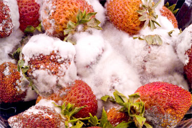 

Figure 1. Moldy strawberries covered with *Rhizopus* mycelium. Photo K.
O\'Donnell.

*Zygomycota* are defined and distinguished from all other fungi by
sexual reproduction via zygospores following gametangial fusion (Figure
2A,B) and asexual reproduction by uni-to-multispored sporangia (Figure
3A,B) within which nonmotile, single-celled sporangiospores are
produced. The phylum comprises at least seven phylogenetically diverse
orders. Monophyly of the phylum and interrelationships among orders are
currently under intensive investigation using multilocus DNA sequence
data. This introduction to the *Zygomycota* does not include the order
comprising the arbuscular mycorrhizal (AM) fungi, the *Glomales*,
because it has been elevated to the rank of phylum, the *Glomeromycota*
(Schüßler et al. 2001). One other group, the Microsporidia, were
previously considered protozoa, however, DNA, biochemistry, and
morphology suggest these highly reduced, obligate, intracellular
parasites may have evolved from a zygomycete-like ancestor (Keeling
2003).
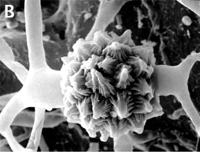 

Figure 2. Sexual reproduction. (A) Scanning electron micrograph of
gametangial fusion in *Mucor mucedo*. (B) Highly ornamented
zygosporangium of *Mycotypha africana*. (From O\'Donnell 1979).
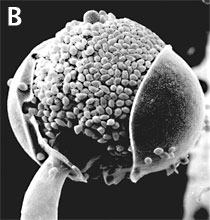 

Figure 3. Asexual reproduction. (A) Scanning electron micrograph of
unispored sporangia of *Benjaminiella poitrasii* and (B) dehisced
multispored sporangium of *Gilbertella persicaria* releasing
sporangiospores. (From O\'Donnell 1979).

*Zygomycota* are arguably the most ecologically diverse group of fungi,
functioning as saprophytes on substrates such as fruit, soil, and dung
(*Mucorales*), as harmless inhabitants of arthropod guts
(*Harpellales*), as plant mutualists forming ectomycorrhizae
(*Endogonales*), and as pathogens of animals, plants, amoebae, and
especially other fungi (all *Dimargaritales* and some *Zoopagales* are
mycoparasites). A number of species are used in Asian food
fermentations, such as *Rhizopus oligosporus* in the Indonesian staple
tempeh, and *Actinomucor elegans* in Chinese cheese or sufu (Hesseltine
1991).

Conversely, some species have a negative economic impact on human
affairs by causing storage rots of fruits (particularly strawberries by
*Rhizopus stolonifer* \[Figure 1\]), as agents of plant disease (e.g.,
*Choanephora cucurbitarum* flower rot of curcurbits), while other
species can cause life-threatening opportunistic infections of diabetic,
immuno-suppressed, and immuno-compromised patients (de Hoog et al.
2000). In addition to some *Mucorales* that attack immuno-suppressed
humans, several species of microsporidia cause serious human infections.
Some zygomycetes are regularly isolated by veterinarians from
domesticated animals in tropical and subtropical regions of the world,
including the US gulf states.

### Characteristics

*Zygomycota*, like all true fungi, produce cell walls containing chitin.
They grow primarily as mycelia, or filaments of long cells called
hyphae. Unlike the so-called \'higher fungi\' comprising the
[*Ascomycota*](tree?group=Ascomycota&contgroup=Fungi)
and
[*Basidiomycota*](tree?group=Basidiomycota&contgroup=Fungi)
which produce regularly septate mycelia, most *Zygomycota* form hyphae
which are generally coenocytic because they lack cross walls or septa.
There are, however, several exceptions and septa may form at irregular
intervals throughout the older parts of the mycelium or are regularly
spaced in two sister orders of *Zygomycota*, the *Kickxellales* and
*Harpellales*.

The unique character (synapomorphy) of the *Zygomycota* is the
zygospore. Zygospores are formed within a zygosporangium after the
fusion of specialized hyphae called gametangia during the sexual cycle
(Figure 2A). A single zygospore is formed per zygosporangium. Because of
this one-to-one relationship, the terms are often used interchangably.
The mature zygospore is often thick-walled (Figure 2B), and undergoes an
obligatory dormant period before germination. Most *Zygomycota* are
thought to have a zygotic or haplontic life cycle (Figure 4). Thus, the
only diploid phase takes place within the zygospore. Nuclei within the
zygospore are believed to undergo meiosis during germination, but this
has only been demonstrated genetically within the model eukaryote
*Phycomyces blakesleeanus* (Eslava et al. 1975).
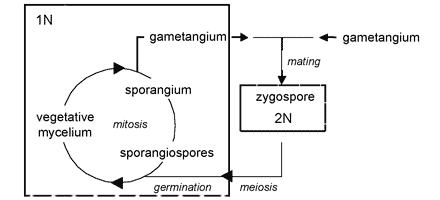 

Figure 4. Generalized life cycle of *Zygomycota*. Asexual reproduction
occurs primarily by sporangiospores produced by mitosis and cell
division. The only diploid (2N) phase in the life cycle is the
zygospore, produced through the conjugation of compatible gametangia
during the sexual cycle (see Figure 2A, B).

*Zygomycota* typically undergo prolific asexual reproduction through the
formation of sporangia and sporangiospores. Sporangiospores are
distinguished from other types of asexual spores, such as conidia of the
*Ascomycota* and *Basidiomycota*, by their development. Walled
sporangiospores are formed by the internal cleavage of the sporangial
cytoplasm. At maturity, the sporangial wall typically disintegrates or
dehisces (Figure 3B), thereby freeing the spores that are usually
dispersed by wind or water.

Sporangia are formed at the ends of specialized hyphae called
sporangiophores. In the model organism, *Phycomyces blakesleeanus*,
sporangial development has been studied extensively to understand the
genetic basis for various trophisms, including the strong phototrophic
responses to blue light. A unique spore dispersal strategy for the
*Mucorales* is exhibited by the dung fungus *Pilobolus*, whose name
literally means \'the hat thrower\' (see far left Title illustration).
The entire black sporangium is explosively shot off of the top of the
sporangiophore up to distances of several meters. Phototrophic growth of
the sporangiophore facilitates dispersal away from the dung onto a fresh
blade of grass where it may be consumed by an herbivore, thereby
completing the asexual cycle after the spores pass through the digestive
system. Some members of the *Entomophthorales* (e.g., *Basidiobolus*,
*Conidiobolus*) also reproduce via forcibly discharged asexual spores.
Interestingly, species of *Basidiobolus*, *Conidiobolus* and several
other genera produce a second kind of spore on a long stalk that appears
to have certain morphological adaptations for efficient insect
dispersal.
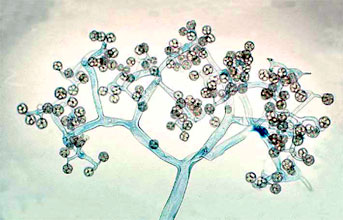 

Figure 5. Dichotomously branching sporangiophore of *Thamnidium elegans*
(*Mucorales*). The few-spored sporangiola are borne at the tips of the
sporangiophore branches (© G. L. Barron 2004).

Two variant types of sporangia include sporangiola and merosporangia.
Sporangiola are simply uni-to-few spored sporangia containing between
1-to-30 spores (Figures 3A and 5). Merosporangia are elongated
sporangiola with uniseriate spores usually produced from a vesicle or
stalk (Figure 6).
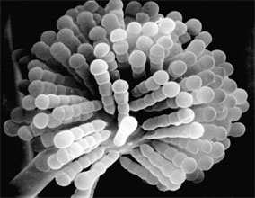 

Figure 6. Scanning electron micrograph of uniseriate merosporangia
produced on a vesicle (hidden beneath merosporangia) of *Syncephalastrum
racemosum* (*Mucorales*). (From O\'Donnell 1979).

Merosporangiferous members of the *Zygomycota*, however, do not form a
clade, indicating that this sporangial type has evolved independently
more than once within the phylum (e.g., *Mucorales* and *Zoopagales*). A
unique sporangiolum type is the trichospore, a one-spored sporangiolum,
produced by members of the *Harpellales* (Figure 7 and far right Title
slide), which are endocommensals living within the gut of arthropods,
including terrestrial beetles and millipedes, fiddler crabs, and the
larvae of many aquatic insects (Lichtwardt 1986). Trichospores possess
one to several basal hair-like filaments that likely aid in the
attachment of the spores to debris and plants in aquatic ecosystems
before they reenter the arthropod gut.
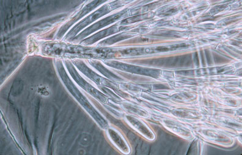 

Figure 7. Photo of thallus of *Genistellospora homothallica*
(*Harpellales*) bearing trichospores attached to the hindgut cuticle of
a Chilean blackfly. (© Misra and Lichtwardt 2000).

Like other *Fungi*, *Zygomycota* are heterotrophic and typically grow
inside their food, dissolving the substrate with extracellular enzymes,
and taking up nutrients by absorption rather than by phagocytosis, as
observed in many protists. The most common members of the *Zygomycota*
are the fast growing members of the *Mucorales*. They function as
decomposers in soil and dung, thereby playing a significant role in the
carbon cycle.

*Zygomycota* also participate in a number of interesting symbioses. As
mentioned above, the *Harpellales* inhabit arthropods (particularly
freshwater aquatic insect larvae; Figure 7) where they are attached to
the chitinous lining of the hindgut. Harpellids presumably feed on
nutrients that are not utilized by the arthropod. Because they are
generally assumed to neither harm nor benefit the host animal, this
association is considered commensalistic. In contrast, the
*Entomophthorales* include many insect pathogens that can cause huge
disease outbreaks (see center Title slide showing infected maggot fly).
Some of this pathogenicity is being tapped for use in the biocontrol of
specific insect pests, including periodical cicadas (Bidochka et al.
1996; Hajek 1999). A number of other *Zygomycota* are mycoparasitic, or
parasites of other fungi. All members of the *Dimargaritales* (only 15
species) and many *Zoopagales* are typically obligate parasites of
mucoralean hosts. Other mycoparasites in the *Mucorales* (e.g.,
*Syzygites*, *Spinellus*) specialize on mushroom fruiting bodies
(*Basidiomycota*; Figure 8).
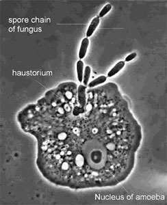 

Figure 9. The parasite *Amoebophilus simplex* (*Zoopagales*) and its
amoeba host. Nutrient transfer occurs through a specialized hypha called
a haustorium that enters the amoeba. Spores are produced in chains, and
they are engulfed by scavenging amoebae to begin the infection process
(© G. L. Barron 2004).

### Discussion of Phylogenetic Relationships

The *Zygomycota* are thought to have diverged from the remaining fungi
before the colonization of land by plants 600-1,400 million years ago
(Berbee and Taylor 2001; Heckman et al. 2001). Molecular phylogenetic
studies place the *Zygomycota* near the base of the kingdom *Fungi*,
diverging after the *Chytridiomycota*, the most basal fungal lineage
(Bruns et al. 1992; Berbee and Taylor 1993). However, as presently
circumscribed, it is uncertain whether the *Zygomycota* represent a
monophyletic group. Studies using SSU rDNA sequence data have generated
molecular phylogenies suggesting the *Zygomycota* may be either para- or
polyphyletic (Bruns et al. 1992; Tanabe et al. 2000, 2004). With the
recent removal of the *Glomales* from the *Zygomycota* (Schüßler et al.
2001), this phylum is restricted to species which form zygospores
through mycelial conjugation, at least in those species where sexual
reproduction is known.

Prior to the use of molecular phylogenetics, the *Zygomycota* were
classified into two classes, the *Zygomycetes* and *Trichomycetes*
(Alexopoulos et al. 1996). Analyses of SSU rDNA sequences, however, have
shown that the *Trichomycetes* are polyphyletic, comprising what we now
know are Ichthyosporean protozoans related to animals (Benny and
O\'Donnell 2000; Ustinova et al. 2000) and also some true *Fungi*, the
*Harpellales*, which are nested within the *Zygomycetes* (O\'Donnell et
al. 1998; Tanabe et al. 2000). Although relationships among the orders
are poorly understood, analyses of RPB1 DNA sequences resolved a clade
comprising the *Kickxellales*-*Harpellales*-*Dimargaritales* (Tanabe et
al. 2004). A morphological synapomorphy for this clade is the possession
of a uniperforate septum with a lenticular cavity (Figure 10; Benny et
al. 2001). A large-scale phylogeny of the *Mucorales*, using three genes
and at least one member of each recognized genus, suggests that several
of the largest families and the two largest genera (*Mucor* and
*Absidia*) are polyphyletic (O\'Donnell et al. 2001).
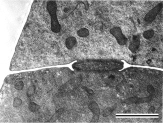 

Figure 10. Transmission electron micrograph of vegetative hypha of
*Kickxella alabastrina* (*Kickxellales*). White line separating the
upper from the lower cell is a section of the cross wall or septum. Note
the lens shaped plug that lies within the septal pore (lenticular
cavity). Scale bar = 0.5 µm. (From Tanabe et al. 2004; © Elsevier 2003).

The *Entomophthorales* appears to be one of the most distinctive and
problematical lineages of *Zygomycota* for two reasons: 1) SSU rDNA
analyses suggest that it may be more closely related to the
*Blastocladiales* (*Chytridiomycota*) (James et al. 2000; Tanabe et al.
2004), rather than other *Zygomycota*, and 2) they are morphologically
distinct from other *Zygomycota* in the way their sporangia are formed
and in the frequent production of secondary sporangiospores (Cole and
Samson 1979; Benny et al. 2001). Phylogenetic placement of one of the
most problematic species, *Basidiobolus ranarum*, is uncertain (Jensen
et al. 1998), but a recent phylogenetic analysis using RPB1 sequence
data suggests that it is nested within the *Zygomycota* (Tanabe et al.
2004). However, this species appears to be distinct from the
*Entomophthorales* with which it has been classified traditionally.
Although *B. ranarum* possesses many of the features of other
entomophthoralean species, such as forcibly discharged spores,
morphologically similar zygospores, and symbiotic associations with
insects (Krejzova 1978; Blackwell and Malloch 1989), this species does
not appear to group with other *Entomophthorales* in molecular
phylogenetic studies using SSU rDNA sequences (Nagahama et al. 1995;
James et al. 2000). *Basidiobolus* spp. possess centriole-like
nuclear-associated organelles (McKerracher and Heath 1985;
Cavalier-Smith 1998), however, only members of the *Chytridiomycota*,
the only flagellated true *Fungi*, possess functional centrioles.

Though controversial, congruent evidence from alpha- and beta-tubulin
gene phylogenies support a zygomycete origin of the *microsporidia*, a
group of highly reduced obligate intracellular parasites of a wide
variety of animals including humans (Keeling et al. 2000; Keeling 2003).
Because several microsporidian species have emerged as major pathogens
of immuno-compromised patients over the past two decades, this enigmatic
group has received considerable attention recently by the scientific
community. Placement of the *microsporidia*, however, remains
controversial.

### The Terms \'Pin\' or \'Sugar\' Molds

The common names \'pin\' or \'sugar\' molds are not formal taxonomic
names for this group of fungi but refer to their morphological
appearance or to one of the most common substrates upon which some
members of the *Mucorales* (*Zygomycota*) grow. Many members of the
*Mucorales* produce unbranched sporangiophores with a sporangium for a
\'head,\' a structure that superficially resembles a pin, hence the
common name \'pin\' molds. Many species commonly cause economically
destructive rots of fruits in storage. These fruits, including
strawberries and nectarines, are high in simple sugars such as glucose,
thereby explaining the origin of this common name. The vast majority of
*Zygomycota*, however, are never encountered by humans and therefore do
not have common names.

### Glossary

arbuscular mycorrhizae (AM):
:   a symbiotic association of members of the Glomales (Glomeromycota)
    with plant roots in which the penetrating hyphae produce finely
    branched haustorial branches (arbuscules), coils, or vesicles.

centriole:
:   cylindrical cellular organelle involved in flagellum formation.
    Centrioles are approximately 0.3 µm long and 0.1 µm in diameter and
    are composed of nine sets of triplet microtubules.

commensalistic:
:   a symbiosis in which neither organism is harmed.

conidium (pl. conidia):
:   an asexual spore produced in the fungal phyla Ascomycota and
    Basidiomycota.

ectomycorrhizae:
:   a mycorrhizal association in which the fungus produces a specialized
    sheath of hyphae on the surface of the root from which hyphae extend
    into the soil and into the outer cortical cells of the root.

endocommensal:
:   an organism living as a commensal inside another organism (e.g.
    Harpellales).

gametangium (pl. gametangia):
:   the specialized cell-type that becomes a fertile gamete producing
    cell (Fig. 2A) during the sexual cycle.

haustorium (pl. haustoria):
:   a morphologically differentiated hypha, especially one within a cell
    of the host, which aids in absorption of food.

heterotrophic:
:   of organisms that utilize organic compounds as the primary source of
    energy.

merosporangium (pl. merosporangia)
:   an elongated sporangiolum producing uniseriate spores (Fig. 6).

monophyletic:
:   a clade or group of organisms that includes a most recent common
    ancestor and all the descendants from that ancestor.

mutualism:
:   long term, intimate symbiotic association between organisms in which
    both partners benefit from each other.

paraphyletic:
:   a group of organisms that includes some, but not all, of the
    descendants from a most recent common ancestor.

polyphyly:
:   a group of organisms that does not include the most recent common
    ancestor of all the member organisms.

saprophytic:
:   of organisms that utilize dead organic material as food.

sporangiolum (pl. sporangiola):
:   a small sporangium containing one-to-few spores (Figs. 3A, 5, 6, 7,
    and 9).

sporangium (pl. sporangia):
:   a sac-like structure (Figs. 3B and 8), the contents of which are
    converted entirely into spores (sporangiospores).

synapomorphy:
:   a shared, derived character; typically a morphological character
    that defines a clade.

zygospore:
:   a resting spore produced by the fusion of two compatible gametangia
    (Fig. 2B).

### References

Alexopoulos, C. J., C. W. Mims and M. Blackwell. 1996. Introductory
mycology. John Wiley and Sons, New York.

Benny, G. L., R. A. Humber and J. B. Morton. 2001. Zygomycota:
Zygomycetes. Pp. 113-146. In: The Mycota VII. Systematics and Evolution.
Part A. (McLaughlin, D. J., McLaughlin, E. G. and Lemke, P. A., eds.).
Springer-Verlag, New York.

Benny G. L. and K. O\'Donnell. 2000. *Amoebidium parasiticum* is a
protozoan, not a Trichomycete. Mycologia 92: 1133-1137.

Berbee, M. L. and J. W. Taylor. 2001. Fungal molecular evolution: gene
trees and geologic time. Pp. 229-245. In: The Mycota VII. Systematics
and Evolution. Part B. (McLaughlin, D. J., McLaughlin, E. G. and Lemke,
P. A., eds.). Springer-Verlag, New York.

Berbee, M. L. and J. W. Taylor. 1993. Dating the evolutionary radiations
of the true fungi. Can. J. Bot. 71: 1114-1127.

Bidochka, M. J., S. R. A. Walsh, M. E. Ramos, R. J. St. Leger, J. C.
Silver and D. W. Roberts. 1996. Fate of biological control
introductions: monitoring an Australian fungal pathogen of grasshoppers
in North America. Proc. Natl. Acad. Sci. USA 93: 918-921.

Blackwell, M., and D. Malloch. 1989. Similarity of *Amphoromorpha* and
secondary capilliconidia of *Basidiobolus*. Mycologia 81: 735-741.

Bruns, T. D., R. Vilgalys, S. M. Barns, D. Gonzalez, D. S. Hibbett, D.
J. Lane, L. Simon, S. Stickel, T. M. Szaro, W. G. Weisburg and M. L.
Sogin. 1992. Evolutionary relationships within the fungi: analyses of
nuclear small subunit RNA sequences. Mol. Phylogenet. Evol. 1: 231-241.

Cavalier-Smith, T. 1998. A revised six-kingdom system of life. Biol.
Rev. 73: 203-266.

Cole, G. T. and R. A. Samson. 1979. Patterns of development in conidial
fungi. Pitman, London.

de Hoog, G. S., J. Guarro, J. Gene and M. J. Figueras. 2000. Atlas of
clinical fungi, second addition. Centraalbureau voor Schimmelcultures,
Baarn and Delft, The Netherlands.

Eslava, A. P., M. I. Alvarez, and M. Delbrück. 1975. Meiosis in
*Phycomyces*. Proc. Natl. Acad. Sci. USA 72: 4076-4080.

Hajek, A. E. 1999. Pathology and epizootiology of *Entomophaga maimaga*
infections in forest Lepidoptera. Microbiol. Mol. Biol. Rev. 63:
814-835.

Heckman, D. S., D. M. Geiser, B. R. Eidell, R. L. Stauffer, N. L. Kardos
and S. B. Hedges. 2001. Molecular evidence for the early colonization of
land by fungi and plants. Science 293: 1129-1133.

Hesseltine, C. W. 1991. Zygomycetes in food fermentations. The
Mycologist 5: 162-169.

James, T. Y., D. Porter, C. A. Leander, R. Vilgalys and J. E. Longcore.
2000. Molecular phylogenetics of the Chytridiomycota supports the
utility of ultrastructural data in chytrid systematics. Can. J. Bot. 78:
336-350.

Jensen, A. B., A. Gargas, J. Eilenberg and S. Rosendahl. 1998.
Relationships of the insect-pathogenic order Entomophthorales
(Zygomycota, Fungi) based on phylogenetic analyses of nuclear small
subunit ribosomal DNA sequences (SSU rDNA). Fungal Genet. Biol. 24:
325-334.

Keeling, P. J. 2003. Congruent evidence from alpha-tubulin and
beta-tubulin gene phylogenies for a zygomycete origin of microsporidia.
Fungal Genet. Biol. 38: 298-309.

Keeling, P. J., M. A. Luker and J. D. Palmer. 2000. Evidence from
beta-tubulin phylogeny that microsporidia evolved from within the Fungi.
Mol. Biol. Evol. 17: 23-31.

Kirk, P. M., P. F. Cannon, J. C. David, and J. Stalpers. 2001. Ainsworth
and Bisby\'s Dictionary of the Fungi. 9th ed. CAB International,
Wallingford, UK.

Krejzova, R. 1978. Taxonomy, morphology and surface structure of
*Basidiobolus* sp. isolate. J. Invertebr. Pathol. 31: 157-163.

Lichtwardt, R. W. 1986. The trichomycetes, fungal associates of
arthropods. Springer-Verlag, New York.

Lutzoni, F., F. Kauff, C. J. Cox, D. McLaughlin, G. Celio, B. Dentinger,
M. Padamsee, D. Hibbett, T. James, E. Baloch, M. Grube, V. Reeb, V.
Hofstetter, C. Schoch, A. E. Arnold, J. Miadlikowska, J. Spatafora, D.
Johnson, S. Hambleton, M. Crockett, R. Shoemaker, G.-H. Sung, R.
Lücking, T. Lumbsch, K. O\'Donnell, M. Binder, P. Diederich, D. Ertz, C.
Gueidan, K. Hansen, R. C. Harris, K. Hosaka, Y.-W. Lim, B. Matheny, H.
Nishida, D. Pfister, J. Rogers, A. Rossman, I. Schmitt, H. Sipman, J.
Stone, J. Sugiyama, R. Yahr and R. Vilgalys. 2004. Assembling the fungal
tree of life: Progress, classification, and evolution of subcellular
traits Am. J. Bot. 91: 1446-1480.

McKerracher, L. J. and I. B. Heath. 1985. The structure and cycle of the
nucleus-associated organelle in two species of *Basidiobolus*. Mycologia
77: 412-417.

Nagahama, T., H. Sato, M. Shimazo and J. Sugiyama. 1995. Phylogenetic
divergence of the entomophthoralean fungi: evidence from nuclear 18S
ribosomal RNA gene sequences. Mycologia 87: 203-209.

O\'Donnell, K. 1979. Zygomycetes in culture. Department of Botany,
University of Georgia, Athens.

O\'Donnell, K., E. Cigelnik and G. L. Benny. 1998. Phylogenetic
relationships among the Harpellales and Kickxellales. Mycologia 90:
624-639.

O\'Donnell, K., F. M. Lutzoni, T. J. Ward and G. L. Benny. 2001.
Evolutionary relationships among mucoralean fungi (Zygomycota): Evidence
for family polyphyly on a large scale. Mycologia 93: 286-296.

Schüßler, A., D. Schwarzott and C. Walker. 2001. A new fungal phylum,
the Glomeromycota: phylogeny and evolution. Mycol. Res. 105: 1413-1421.

Tanabe Y., K. O\'Donnell, M. Saikawa and J. Sugiyama. 2000. Molecular
phylogeny of parasitic Zygomycota (Dimargaritales, Zoopagales) based on
nuclear small subunit ribosomal DNA sequences. Mol. Phylogenet. Evol.
16: 253-262.

Tanabe, Y., M. Saikawa, M. M. Watanabe and J. Sugiyama. 2004. Molecular
phylogeny of Zygomycota based on EF-1 and RPB1 sequences: limitations
and utility of alternative markers to rDNA. Mol. Phylogenet. Evol. 30:
438-449.

Ustinova, I., L. Krienitz and V. A. R. Huss. 2000. *Hyaloraphidium
curvatum* is not a green alga, but a lower fungus; *Amobedium
parasiticum* is not a fungus, but a member of the DRIPs. Protist 151:
253-262.

## Title Illustrations

 

  -------------------------------------------
  scientific_name ::     Pilobolus kleinii
  Comments             Phototropic sporangiophores, each bearing a single black sporangium of the \"hat-thrower\", Pilobolus kleinii (Mucorales).
  Acknowledgements     Photo courtesy [Malcolm Storey](http://www.bioimages.org.uk/)
  specimen_condition ::  Live Specimen
  copyright ::            © [Malcolm Storey](http://www.bioimages.org.uk/)
  -------------------------------------------
 

  --------------------------------------------------------------------------
  scientific_name ::     Entomophthora, Delia
  Comments             Root maggot fly (Delia) killed by the \'insect-destroyer\' Entomophthora (Entomophthorales). The fungus has burst through the segments and the abdominal wall.
  Acknowledgements     Photo courtesy [George Barron\'s Website on Fungi](http://www.uoguelph.ca/%7Egbarron/)
  specimen_condition ::  Dead Specimen
  copyright ::            © [George Barron](http://www.uoguelph.ca/%7Egbarron/) 
 
  --------------------------------------------------------------------------
 

  -----------------------------------------------------------------------
  scientific_name ::     Genistelloides helicoides
  Comments             Colony bearing unispored sporangia (also called trichospores) of the arthropod endocommensal Genistelloides helicoides (Harpellales) isolated from the hindgut of a stonefly nymph
  Acknowledgements     Photo courtesy Robert W. Lichwardt. Image from the Mycological Society of America slide collection.
  specimen_condition ::  Dead Specimen
  copyright ::            © [Robert Lichtwardt](mailto:licht@ku.edu) 
 
  -----------------------------------------------------------------------

## Confidential Links & Embeds: 

### #is_/same_as :: [[/_Standards/bio/bio~Domain/Eukarya/Fungi/Zygomycota|Zygomycota]] 

### #is_/same_as :: [[/_public/bio/bio~Domain/Eukarya/Fungi/Zygomycota.public|Zygomycota.public]] 

### #is_/same_as :: [[/_internal/bio/bio~Domain/Eukarya/Fungi/Zygomycota.internal|Zygomycota.internal]] 

### #is_/same_as :: [[/_protect/bio/bio~Domain/Eukarya/Fungi/Zygomycota.protect|Zygomycota.protect]] 

### #is_/same_as :: [[/_private/bio/bio~Domain/Eukarya/Fungi/Zygomycota.private|Zygomycota.private]] 

### #is_/same_as :: [[/_personal/bio/bio~Domain/Eukarya/Fungi/Zygomycota.personal|Zygomycota.personal]] 

### #is_/same_as :: [[/_secret/bio/bio~Domain/Eukarya/Fungi/Zygomycota.secret|Zygomycota.secret]] 

