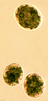
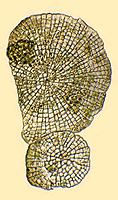
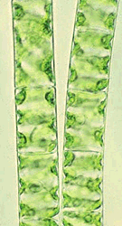

---
aliases:
- ali
- augalai
- augalā
- augi
- auguoji
- a̱tyin a̱ga̱fi̱p
- beer
- bernyèng
- biljka
- biljke
- bimë
- bini billi
- biqilaa
- bitki
- bitkilər
- bíkáy
- chhṳ̍t-vu̍t
- chianta
- chāu-mŭk
- dimela
- doenghgo
- ebimera
- etɔɛlɛ
- Green plant
- Green plants
- gàncax
- halaman
- ikimera
- imɣi
- isityalo
- izitshalo
- jurt
- ka'avo
- kasi
- kasv
- kasvi
- kazmused
- kazvi
- land plants
- landare
- lus
- madzinde
- Mata
- mmea
- mula
- mulangaway
- mvēŋ pɔ́ methʉ̄
- mĩmera
- naasut
- Nauriaq
- nebat
- növény
- o'simlikler
- osisi
- oʻsimliklar
- paudha
- peunula
- Pflanze
- Pflanzen
- Pflanzna
- pianta
- Piante
- pjanta
- plaant
- plaanten
- planda
- planhigyn
- plans
- Plant
- plant'n
- planta
- Plantae
- plante
- Planten
- planter
- planteriket
- plantes
- plantis
- plantn
- planto
- Plants
- plantur
- plantâ
- plantæ
- plantă
- Planzeräich
- plaunt
- pliante
- Plonten
- qqhuniq ru kk’man
- rastlina
- rastliny
- Regnum Plantae
- riwek
- roscënë
- rostliny
- rośliny
- sayor
- shuka
- si̍t-bu̍t
- spati
- Susumuni
- suu
- taimed
- tanaman
- tanduran
- tanom
- tea
- tetanduran
- thực vật
- timila
- tinanom
- tlanelhuayōtl
- tshimela
- tumbuahan
- Tumbuan
- tumbuhan
- tutuwuhan
- utai tumbuh
- vyakumela
- växt
- yura
- zavamaniry
- zomera
- ösümlik
- ösümlikler
- šaddo
- šaddu
- Źeliny
- ʻakau
- φυτό
- аҵиаақәа
- баьцовгӏаш
- биљка
- будос
- быдмас
- гиёҳ
- зайæгойтæ
- касыкс
- кушкыл
- кушкыш
- къэкӏыгъэхэр
- набатат
- ораматаш
- расліны
- растенија
- растения
- расьліны
- рослини
- рослины
- ургамал
- ххяххия
- үсемлекләр
- үҫемлектәр
- үүнээйилэр
- өсімдіктер
- өсүмдүктөр
- ӳсентăран
- բույսեր
- פלאנץ
- צומח
- ئۆسۈملۈك
- بوټی
- بیتکی
- تومبوهن
- نبات
- نباتات
- نبتة
- ٻوٽا
- پودا
- ڕوەک
- کُلؠ کٔٹؠ
- گیاه
- ގަސް
- ߝߍߘߍ߲ߝߋ߲
- ओषधयः
- पादप
- पौधा
- मा
- वनस्पति
- वनस्पती
- উদ্ভিদ
- ਪੌਦਾ
- ଉଦ୍ଭିଦ
- தாவரம்
- మొక్క
- ಸಸ್ಯ
- സസ്യം
- ශාක
- พืช
- ພືດ
- တူၼ်ႈ
- တၞံ
- အပင်
- အပင်များ
- მცენარეები
- ჩანარეფი
- አትክልት
- ᎦᎪᏘ
- ᐅᐲᑭᒋᑳᓇ
- ᐱᕈᖅᑐᖅ
- រុក្ខជាតិ
- ọ̀gbìn
- 植物
- 植物界
- ꯄ꯭ꯂꯥꯟꯠ ꯀꯤꯡꯗꯝ
- 식물
has_id_wikidata: Q756
title: Green plants
montage_image:
- http://commons.wikimedia.org/wiki/Special:FilePath/Diversity%20of%20plants%20%28Streptophyta%29%20version%202.png
- http://commons.wikimedia.org/wiki/Special:FilePath/Plantae%20Diversity.jpg
earliest_date:
- -460000000-01-01T00:00:00Z
- -1200000000-01-01T00:00:00Z
pronunciation_audio: http://commons.wikimedia.org/wiki/Special:FilePath/LL-Q33578%20%28ibo%29-Deventus-Osisi.wav
equivalent_class: http://dbpedia.org/ontology/Plant
AlgaeBase_URL: https://www.algaebase.org/browse/taxonomy/detail/?taxonid=1
EPPO_Code:
- 1PLAK
- 2PLAN
Provenio_UUID: 7e406d92-f623-4ce4-9f33-eca570080e21
MeSH_tree_code: B01.650
IPTC_NewsCode: mediatopic/20000507
Commons_category: Plantae
taxon_name: Plantae
Baidu_Tieba_name: 植物
taxon_common_name:
- အပင်များ
- planteriket
- 植物界
- plantes
- planter
uses:
- '[[_Standards/WikiData/WD~fertilizer,83323]]'
- '[[_Standards/WikiData/WD~carbon_dioxide_in_the_atmosphere_of_Earth,4468919]]'
- '[[_Standards/WikiData/WD~photosynthesis,11982]]'
- '[[_Standards/WikiData/WD~soil,36133]]'
has_part_s_:
- '[[_Standards/WikiData/WD~plant_stem,134267]]'
- '[[_Standards/WikiData/WD~germ_layer,660498]]'
- '[[_Standards/WikiData/WD~true_leaf,5935823]]'
- '[[_Standards/WikiData/WD~root,41500]]'
mode_of_reproduction:
- '[[_Standards/WikiData/WD~asexual_reproduction,173432]]'
- '[[_Standards/WikiData/WD~sexual_reproduction,182353]]'
described_by_source:
- '[[../../../WikiData/WD~Brockhaus_and_Efron_Encyclopedic_Dictionary,602358]]'
- '[[_Standards/WikiData/WD~Encyclopædia_Britannica_11th_edition,867541]]'
- '[[_Standards/WikiData/WD~Gujin_Tushu_Jicheng,1768721]]'
- '[[_Standards/WikiData/WD~The_Encyclopedia_Americana,19085957]]'
- '[[_Standards/WikiData/WD~Small_Brockhaus_and_Efron_Encyclopedic_Dictionary,19180675]]'
- '[[_Standards/WikiData/WD~Meyers_Konversations_Lexikon,_4th_edition_(1885_1890),19219752]]'
- '[[_Standards/WikiData/WD~The_Domestic_Encyclopædia;_Or,_A_Dictionary_Of_Facts,_And_Useful_Knowledge,56441911]]'
- '[[_Standards/WikiData/WD~Metropolitan_Museum_of_Art_Tagging_Vocabulary,106727050]]'
code_of_nomenclature: '[[_Standards/WikiData/WD~International_Code_of_Nomenclature_for_algae,_fungi,_and_plants,693148]]'
has_characteristic:
- '[[_Standards/WikiData/WD~plant_taxonomy,1138178]]'
- '[[_Standards/WikiData/WD~plant_life_form,2355817]]'
this_taxon_is_source_of:
- '[[_Standards/WikiData/WD~plant_milk,2640574]]'
- '[[_Standards/WikiData/WD~vegetable_fat,11870297]]'
- '[[_Standards/WikiData/WD~plant_fiber,20026824]]'
- '[[_Standards/WikiData/WD~plant_material,28969364]]'
- '[[_Standards/WikiData/WD~plant_proteins,74708517]]'
- '[[_Standards/WikiData/WD~plant_based_food,107122728]]'
- '[[_Standards/WikiData/WD~plant_product,107122793]]'
studied_by:
- '[[_Standards/WikiData/WD~plant_genetics,7201518]]'
- '[[_Standards/WikiData/WD~botany,441]]'
topic_has_template:
- '[[_Standards/WikiData/WD~Q7482966,7482966]]'
- '[[_Standards/WikiData/WD~Template_Taxonomy_Plantae,13217916]]'
- '[[_Standards/WikiData/WD~Q26076388,26076388]]'
union_of: '[[_Standards/WikiData/WD~list_of_values_as_qualifiers,23766486]]'
maintained_by_WikiProject: '[[_Standards/WikiData/WD~WikiProject_Invasion_Biology,56241615]]'
permanent_duplicated_item: '[[_Standards/WikiData/WD~Q124038881,124038881]]'
subclass_of: '[[_Standards/WikiData/WD~organism,7239]]'
properties_for_this_type: mode of reproduction
instance_of: '[[_Standards/WikiData/WD~taxon,16521]]'
taxon_rank: '[[_Standards/WikiData/WD~kingdom,36732]]'
Dewey_Decimal_Classification:
- 580
- 581
ITIS_TSN: 202422
OpenStreetMap_key: plant
image: http://commons.wikimedia.org/wiki/Special:FilePath/Thanh%20Long%20%E1%BB%9F%20Ninh%20Thu%E1%BA%ADn.jpg
U_S_National_Archives_Identifier: 10641997
Commons_gallery: Plant
Wolfram_Language_entity_type: Plant
Iconclass_notation: 25G1
dv_has_:
  name_:
    ab: аҵиаақәа
    ace: peunula
    af: plant
    am: አትክልት
    an: planta
    ang: plante
    anp: पौधा
    ar: نباتات
    ary: نبتة
    arz: نبات
    as: উদ্ভিদ
    ast: Plantae
    awa: वनस्पति
    ay: ali
    az: bitkilər
    azb: بیتکی
    ba: үҫемлектәр
    ban: tetanduran
    bar: Pflanzna
    bas: bíkáy
    bcl: tinanom
    be: расліны
    be_tarask: расьліны
    bew: Tumbuan
    bg: растения
    bho: पौधा
    bjn: tumbuhan
    bn: উদ্ভিদ
    br: plant
    bs: biljke
    bxr: ургамал
    ca: planta
    cdo: chāu-mŭk
    ce: ораматаш
    ceb: tanom
    chr: ᎦᎪᏘ
    ckb: ڕوەک
    co: pianta
    cr: ᐅᐲᑭᒋᑳᓇ
    crh: ösümlik
    cs: rostliny
    csb: roscënë
    cv: ӳсентăран
    cy: planhigyn
    da: plante
    dag: bini billi
    de: Pflanzen
    diq: nebat
    dsb: rostliny
    dtp: Susumuni
    dty: वनस्पति
    dv: ގަސް
    el: φυτό
    en: plant
    en_ca: plant
    en_gb: plant
    en-us: plant
    eo: planto
    es: planta
    et: taimed
    eu: landare
    ext: Plantae
    fa: گیاه
    fi: kasvi
    fj: tea
    fo: plantur
    fr: plante
    frp: planta
    frr: plaanten
    fur: plantis
    fy: plant
    ga: planda
    gan: 植物
    gcr: plant
    gd: lus
    gl: planta
    gn: ka'avo
    gpe: Plantae
    gsw: Pflanze
    gv: lus
    ha: shuka
    hak: chhṳ̍t-vu̍t
    he: צומח
    hi: पादप
    hif: paudha
    hr: biljke
    hsb: rostliny
    ht: plant
    hu: növény
    hy: բույսեր
    ia: planta
    iba: utai tumbuh
    id: tumbuhan
    ie: plante
    ig: osisi
    ik: Nauriaq
    ilo: mula
    inh: баьцовгӏаш
    io: planto
    is: jurt
    it: piante
    iu: ᐱᕈᖅᑐᖅ
    ja: 植物
    jam: plaant
    jbo: spati
    jv: tetanduran
    ka: მცენარეები
    kaa: o'simlikler
    kab: imɣi
    kbd: къэкӏыгъэхэр
    kbp: suu
    kcg: a̱tyin a̱ga̱fi̱p
    ki: mĩmera
    kk: өсімдіктер
    kl: naasut
    km: រុក្ខជាតិ
    kn: ಸಸ್ಯ
    ko: 식물
    koi: быдмас
    ks: کُلؠ کٔٹؠ
    ku: riwek
    kw: plans
    ky: өсүмдүктөр
    la: plantae
    lad: planta
    lb: Planzeräich
    lbe: ххяххия
    lez: набатат
    lfn: planta
    lg: ebimera
    li: plante
    lij: Plantae
    lld: Plantae
    lmo: Plantae
    ln: etɔɛlɛ
    lo: ພືດ
    lt: augalai
    ltg: auguoji
    lv: augi
    lzh: 植物
    mad: bernyèng
    mai: वनस्पति
    map_bms: tanduran
    mg: zavamaniry
    mhr: кушкыл
    min: tumbuahan
    mk: растенија
    ml: സസ്യം
    mn: ургамал
    mni: ꯄ꯭ꯂꯥꯟꯠ ꯀꯤꯡꯗꯝ
    mnw: တၞံ
    mr: वनस्पती
    mrj: кушкыш
    ms: tumbuhan
    ms_arab: تومبوهن
    mt: pjanta
    mul: Plantae
    mwl: planta
    my: အပင်
    myv: касыкс
    mzn: گیاه
    nah: tlanelhuayōtl
    nan: si̍t-bu̍t
    nap: plantæ
    nb: planter
    nds: Planten
    nds_nl: plaanten
    ne: वनस्पति
    new: मा
    nl: planten
    nn: planteriket
    nqo: ߝߍߘߍ߲ߝߋ߲
    nrm: pliante
    ny: zomera
    oc: Plantae
    olo: kazvi
    om: biqilaa
    or: ଉଦ୍ଭିଦ
    os: зайæгойтæ
    pa: ਪੌਦਾ
    pam: tanaman
    pap: Mata
    pcd: plante
    pih: plaant
    pl: rośliny
    pms: Piante
    pnb: پودا
    ps: بوټی
    pt: Plantae
    pt_br: planta
    qu: yura
    rki: အပင်
    ro: plantă
    roa-tara: Regnum Plantae
    ru: растения
    rue: рослины
    rup: plantâ
    rw: ikimera
    sa: ओषधयः
    sah: үүнээйилэр
    sc: Plantae
    scn: chianta
    sco: plaunt
    sd: ٻوٽا
    se: šaddu
    sgs: augalā
    sh: biljka
    shn: တူၼ်ႈ
    si: ශාක
    sk: rastliny
    sl: rastlina
    smn: šaddo
    sn: madzinde
    so: beer
    sq: bimë
    sr: биљка
    sr_ec: биљка
    sr_el: biljka
    ss: timila
    st: dimela
    stq: Plonten
    su: tutuwuhan
    sv: växt
    sw: mmea
    szl: Źeliny
    szy: mulangaway
    ta: தாவரம்
    tay: qqhuniq ru kk’man
    te: మొక్క
    tg: гиёҳ
    th: พืช
    tk: ösümlikler
    tl: halaman
    to: ʻakau
    tok: kasi
    tpi: sayor
    tr: bitki
    tt: үсемлекләр
    tt_cyrl: үсемлекләр
    tum: vyakumela
    udm: будос
    ug: ئۆسۈملۈك
    uk: рослини
    ur: نباتات
    uz: oʻsimliklar
    ve: tshimela
    vec: piante
    vep: kazmused
    vi: thực vật
    vls: plantn
    vro: kasv
    wa: plante
    war: tanaman
    wo: gàncax
    wuu: 植物
    xh: isityalo
    xmf: ჩანარეფი
    ybb: mvēŋ pɔ́ methʉ̄
    yi: פלאנץ
    yo: ọ̀gbìn
    yue: 植物
    za: doenghgo
    zea: plant'n
    zh: 植物
    zh_cn: 植物
    zh_hans: 植物
    zh_hant: 植物
    zh_hk: 植物
    zh_mo: 植物
    zh-my: 植物
    zh_sg: 植物
    zh_tw: 植物
    zu: izitshalo
---
# [[Plant]] 

#is_a/bio-Kingdom 
#is_a :: [[../../Taxon_Rank/bio~Kingdom|bio~Kingdom]]  

#is_/subject_of ::  [[../../Botany|Botany]] 
#is_/same_as :: [[../../../WikiData/WD~Plant,756|WD~Plant,756]] 

       

Green plants include all organisms commonly known as green algae and [[Plant/Land_Plant|land plants]], 
including liverworts, [[Plant/Land_Plant/Moss|mosses]], [[Plant/Land_Plant/Fern|ferns]] and other non-seed plants, and seed plants.

The scientific study of plants is known as [[../../Botany|botany]], a branch of biology.

## #has_/text_of_/abstract 

> **Plant**s are the [[../Eukarya|eukaryotes]] that form the kingdom Plantae; they are predominantly photosynthetic. 
> This means that they obtain their energy from sunlight, 
> using chloroplasts derived from [[../../Metabolism/Symbiosis|endosymbiosis]] with [[../Bacteria/Bacillati/Cyanobacteria|cyanobacteria]] 
> to produce sugars from carbon dioxide and water, using the green pigment chlorophyll. 
> 
> Exceptions are parasitic plants that have lost the genes for chlorophyll and photosynthesis, 
> and obtain their energy from other plants or fungi. 
> Most plants are multicellular, except for some green algae.
>
> Historically, as in Aristotle's biology, the plant kingdom 
> encompassed all living things that were not animals, including algae and fungi. 
> Definitions have narrowed since then; 
> current definitions exclude the fungi and some of the algae. 
> 
> By the definition used in this article, plants form the clade Viridiplantae (green plants), 
> which consists of the green algae and the embryophytes or land plants (hornworts, liverworts, mosses, lycophytes, ferns, conifers and other gymnosperms, and flowering plants). 
> A definition based on genomes includes the Viridiplantae, 
> along with the red algae and the glaucophytes, in the clade Archaeplastida.
>
> There are about 380,000 known species of plants, of which the majority, some 260,000, produce seeds. They range in size from single cells to the tallest trees. 
> Green plants provide a substantial proportion of the world's molecular oxygen; 
> the sugars they create supply the energy for most of Earth's ecosystems, 
> and other organisms, including animals, either eat plants directly 
> or rely on organisms which do so.
>
> Grain, fruit, and vegetables are basic human foods and have been domesticated for millennia. 
> People use plants for many purposes, such as building materials, 
> ornaments, writing materials, and, in great variety, for medicines. 
>
> [Wikipedia](https://en.wikipedia.org/wiki/Plant) 

## Introduction

[Richard M. McCourt, R. L. Chapman, Mark Buchheim, and Brent D. Mishler](Green_plants)

Green plants as defined here includes a broad assemblage of
photosynthetic organisms that all contain chlorophylls a and b, store
their photosynthetic products as starch inside the
double-membrane-bounded chloroplasts in which it is produced, and have
cell walls made of cellulose (Raven et al., 1992). In this group are
several thousand species of what are classically considered green algae,
plus several hundred thousand land plants.

### Discussion of Phylogenetic Relationships

There are two major lineages of green plants. One consists of most of
what have been classically considered \"green algae\"\--mostly
microscopic freshwater forms and large seaweeds. The other lineage
contains several groups of \"green algae\" that are more closely related
to land plants. Because these two lineages are monophyletic, they have
been placed in a single monophyletic group called green plants, or, in
technical parlance, the subkingdom Chlorobionta (Bremer, 1985).

The groups of the primary \"green algal\" lineage included here
(Prasinophytes, Chlorophyceae, Trebouxiophyceae, and Ulvophyceae)
represent a synthesis of the most recent classifications based primarily
on ultrastructure of motile cells (when present) and analysis of
molecular data (small subunit rDNA) Melkonian and Surek, 1995; Friedl,
1995). The groups represent classes of green algae, except for the
\"Prasinophytes,\" which, although erected as a class (Prasinophyceae),
is apparently a paraphyletic, basal radiation within the \"green algal\"
lineage (Melkonian, 1990; Friedl, 1995; Melkonian and Surek, 1995). The
name for the sister taxon to the Chlorophyceae used here (class
Trebouxiophyceae) is has also been referred to as the order
Microthmaniales (Melkonian and Surek, 1995); recent studies of
small-subunit rDNA sequences led Friedl (1995) to raise the group to
class level.

The other main lineage of green plants has been called the Streptophytes
(Bremer, 1985), which consists of some organisms traditionally
considered green algae plus the more familiar green plants found mostly
on land. This lineage contains green algae that most textbooks include
in the Class Charophyceae, but some members of this class are in fact
more closely related to higher plants than to other members of the class
(Mattox and Stewart, 1984; Mishler and Churchill, 1985; McCourt, 1995;
Melkonian and Surek, 1995). Specifically, *Chara* and related algae
(Order Charales) and *Coleochaete* and related algae (Order
Coleochaetales) are probably the closest living \"green algal\"
relatives of land plants. Ultrastructural and morphological studies were
the first to support the relationship of these orders of green algae to
land plants (embryophytes) (Pickett-Heaps, 1975; Mishler and Churchill,
1985; Graham et al., 1991). The orders were all placed in the class
Charophyceae (Mattox and Stewart, 1984) and retained within the green
algae (Division Chlorophyta in the classical sense \[Bold and Wynne,
1985\]. Recent analyses suggest that the Charophyceae is a paraphyletic
group, and therefore the orders originally circumscribed within it have
been placed within the Streptophyta (Bremer, 1985).

Later molecular studies (reviews in McCourt, 1995 and Melkonian and
Surek, 1995) largely confirmed this close relationship, and confirmed
what the ultrastructural and morphological data had first suggested:
that the Charophyceae is a paraphyletic assemblage. Specifically, the
Charales and Coleochaetales are most closely related to land plants
(Chapman and Buchheim, 1991; Ragan et al. 1993; Surek et al., 1993;
Bhattacharya et al., 1994). The Charales/Coleochaetales/Embryophyte
clade is shown as unresolved because morphological and molecular studies
to date have not fully resolved which of the green algae is the sister
taxon of land plants (McCourt 1995; Melkonian and Surek, 1995).

## Phylogeny 

-   « Ancestral Groups  
    -  [Eukarya](../Eukarya.md) 
    -   [Tree of Life](../Tree_of_Life.md)

-   ◊ Sibling Groups of  Eukaryotes
    -  [Choanoflagellates](Choanoflagellates.md) 
    -  [Animals](Animals.md) 
    -  [Fungi](Fungi.md) 
    -  [Stramenopiles](Stramenopiles.md) 
    -  [Alveolate](Alveolate.md) 
    -  [Rhodophyta](Rhodophyta.md) 
    -   Green plants
    -   [The other protists](The_other_protists)

-   » Sub-Groups
    -   [Zygnematales](Plant/Zygnematales.md)
    -   [Charales](Plant/Charales.md)
    -   [Land_Plant](Plant/Land_Plant.md)

#has_/parent ::[[../Eukarya]]] 
#is_/same_as :: [[../../../WikiData/WD~Plant,756]] 

## Title Illustrations

-----------------------------------------------------------------------------
  
scientific_name ::  Chlamydomonas
Comments          Chlorophyceae
copyright ::         © 1995 [Richard M. McCourt](http://clade.acnatsci.org/mccourt/) 

-----------------------------------------------------------------------------

scientific_name ::  Spirogyra
Comments          Zygnemetales
copyright ::         © 1995 [Richard M. McCourt](http://clade.acnatsci.org/mccourt/) 

-----------------------------------------------------------------------------
 
scientific_name ::  Coleochaete
Comments          Coleochaetales
copyright ::         © 1995 [Richard M. McCourt](http://clade.acnatsci.org/mccourt/) 

-----------------------------------------------------------------------------
 
scientific_name ::  Hepatica
Comments          an embryophyte
copyright ::         © 1995 [Wayne Maddison](http://salticidae.org/wpm/home.html) 

## Confidential Links & Embeds: 

### #is_/same_as :: [[/_Standards/bio/bio~Domain/Eukarya/Plant|Plant]] 

### #is_/same_as :: [[/_public/bio/bio~Domain/Eukarya/Plant.public|Plant.public]] 

### #is_/same_as :: [[/_internal/bio/bio~Domain/Eukarya/Plant.internal|Plant.internal]] 

### #is_/same_as :: [[/_protect/bio/bio~Domain/Eukarya/Plant.protect|Plant.protect]] 

### #is_/same_as :: [[/_private/bio/bio~Domain/Eukarya/Plant.private|Plant.private]] 

### #is_/same_as :: [[/_personal/bio/bio~Domain/Eukarya/Plant.personal|Plant.personal]] 

### #is_/same_as :: [[/_secret/bio/bio~Domain/Eukarya/Plant.secret|Plant.secret]] 

