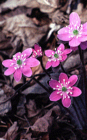

---
aliases:
- Plants
- Plant
- "Green plant"
- "Green plants"
- "land plants"
- Plantae
has_id_wikidata: Q756
title: "Green plants"
---

# [[Plant]] 

#is_a/bio-Kingdom 
#is_a :: [[../../Taxon_Rank/bio~Kingdom|bio~Kingdom]]  

#is_/subject_of ::  [[../../Botany|Botany]]

       

Green plants include all organisms commonly known as green algae and [[Plant/Land_Plant|land plants]], 
including liverworts, [[Plant/Land_Plant/Moss|mosses]], [[Plant/Land_Plant/Fern|ferns]] and other non-seed plants, and seed plants.

The scientific study of plants is known as [[../../Botany|botany]], a branch of biology.

## #has_/text_of_/abstract 

> **Plant**s are the [[../Eukarya|eukaryotes]] that form the kingdom Plantae; they are predominantly photosynthetic. 
> This means that they obtain their energy from sunlight, 
> using chloroplasts derived from [[../../Metabolism/Symbiosis|endosymbiosis]] with [[../Bacteria/Bacillati/Cyanobacteria|cyanobacteria]] 
> to produce sugars from carbon dioxide and water, using the green pigment chlorophyll. 
> 
> Exceptions are parasitic plants that have lost the genes for chlorophyll and photosynthesis, 
> and obtain their energy from other plants or fungi. 
> Most plants are multicellular, except for some green algae.
>
> Historically, as in Aristotle's biology, the plant kingdom 
> encompassed all living things that were not animals, including algae and fungi. 
> Definitions have narrowed since then; 
> current definitions exclude the fungi and some of the algae. 
> 
> By the definition used in this article, plants form the clade Viridiplantae (green plants), 
> which consists of the green algae and the embryophytes or land plants (hornworts, liverworts, mosses, lycophytes, ferns, conifers and other gymnosperms, and flowering plants). 
> A definition based on genomes includes the Viridiplantae, 
> along with the red algae and the glaucophytes, in the clade Archaeplastida.
>
> There are about 380,000 known species of plants, of which the majority, some 260,000, produce seeds. They range in size from single cells to the tallest trees. 
> Green plants provide a substantial proportion of the world's molecular oxygen; 
> the sugars they create supply the energy for most of Earth's ecosystems, 
> and other organisms, including animals, either eat plants directly 
> or rely on organisms which do so.
>
> Grain, fruit, and vegetables are basic human foods and have been domesticated for millennia. 
> People use plants for many purposes, such as building materials, 
> ornaments, writing materials, and, in great variety, for medicines. 
>
> [Wikipedia](https://en.wikipedia.org/wiki/Plant)

## Introduction

[Richard M. McCourt, R. L. Chapman, Mark Buchheim, and Brent D. Mishler](Green_plants)

Green plants as defined here includes a broad assemblage of
photosynthetic organisms that all contain chlorophylls a and b, store
their photosynthetic products as starch inside the
double-membrane-bounded chloroplasts in which it is produced, and have
cell walls made of cellulose (Raven et al., 1992). In this group are
several thousand species of what are classically considered green algae,
plus several hundred thousand land plants.

### Discussion of Phylogenetic Relationships

There are two major lineages of green plants. One consists of most of
what have been classically considered \"green algae\"\--mostly
microscopic freshwater forms and large seaweeds. The other lineage
contains several groups of \"green algae\" that are more closely related
to land plants. Because these two lineages are monophyletic, they have
been placed in a single monophyletic group called green plants, or, in
technical parlance, the subkingdom Chlorobionta (Bremer, 1985).

The groups of the primary \"green algal\" lineage included here
(Prasinophytes, Chlorophyceae, Trebouxiophyceae, and Ulvophyceae)
represent a synthesis of the most recent classifications based primarily
on ultrastructure of motile cells (when present) and analysis of
molecular data (small subunit rDNA) Melkonian and Surek, 1995; Friedl,
1995). The groups represent classes of green algae, except for the
\"Prasinophytes,\" which, although erected as a class (Prasinophyceae),
is apparently a paraphyletic, basal radiation within the \"green algal\"
lineage (Melkonian, 1990; Friedl, 1995; Melkonian and Surek, 1995). The
name for the sister taxon to the Chlorophyceae used here (class
Trebouxiophyceae) is has also been referred to as the order
Microthmaniales (Melkonian and Surek, 1995); recent studies of
small-subunit rDNA sequences led Friedl (1995) to raise the group to
class level.

The other main lineage of green plants has been called the Streptophytes
(Bremer, 1985), which consists of some organisms traditionally
considered green algae plus the more familiar green plants found mostly
on land. This lineage contains green algae that most textbooks include
in the Class Charophyceae, but some members of this class are in fact
more closely related to higher plants than to other members of the class
(Mattox and Stewart, 1984; Mishler and Churchill, 1985; McCourt, 1995;
Melkonian and Surek, 1995). Specifically, *Chara* and related algae
(Order Charales) and *Coleochaete* and related algae (Order
Coleochaetales) are probably the closest living \"green algal\"
relatives of land plants. Ultrastructural and morphological studies were
the first to support the relationship of these orders of green algae to
land plants (embryophytes) (Pickett-Heaps, 1975; Mishler and Churchill,
1985; Graham et al., 1991). The orders were all placed in the class
Charophyceae (Mattox and Stewart, 1984) and retained within the green
algae (Division Chlorophyta in the classical sense \[Bold and Wynne,
1985\]. Recent analyses suggest that the Charophyceae is a paraphyletic
group, and therefore the orders originally circumscribed within it have
been placed within the Streptophyta (Bremer, 1985).

Later molecular studies (reviews in McCourt, 1995 and Melkonian and
Surek, 1995) largely confirmed this close relationship, and confirmed
what the ultrastructural and morphological data had first suggested:
that the Charophyceae is a paraphyletic assemblage. Specifically, the
Charales and Coleochaetales are most closely related to land plants
(Chapman and Buchheim, 1991; Ragan et al. 1993; Surek et al., 1993;
Bhattacharya et al., 1994). The Charales/Coleochaetales/Embryophyte
clade is shown as unresolved because morphological and molecular studies
to date have not fully resolved which of the green algae is the sister
taxon of land plants (McCourt 1995; Melkonian and Surek, 1995).

## Phylogeny 

-   « Ancestral Groups  
    -  [Eukarya](../Eukarya.md))
    -   [Tree of Life](../Tree_of_Life.md)

-   ◊ Sibling Groups of  Eukaryotes
    -  [Choanoflagellates](Choanoflagellates.md))
    -  [Animals](Animals.md))
    -  [Fungi](Fungi.md))
    -  [Stramenopiles](Stramenopiles.md))
    -  [Alveolates](Alveolates.md))
    -  [Rhodophyta](Rhodophyta.md))
    -   Green plants
    -   [The other protists](The_other_protists)

-   » Sub-Groups
    -   [Zygnematales](Plant/Zygnematales.md)
    -   [Charales](Plant/Charales.md)
    -   [Land_Plant](Plant/Land_Plant.md)

#has_/parent ::[[../Eukarya]]] 
#is_/same_as :: [[../../../WikiData/WD~Plant,756]] 

## Title Illustrations

-----------------------------------------------------------------------------
  
Scientific Name ::  Chlamydomonas
Comments          Chlorophyceae
Copyright ::         © 1995 [Richard M. McCourt](http://clade.acnatsci.org/mccourt/) 

-----------------------------------------------------------------------------

Scientific Name ::  Spirogyra
Comments          Zygnemetales
Copyright ::         © 1995 [Richard M. McCourt](http://clade.acnatsci.org/mccourt/) 

-----------------------------------------------------------------------------
 
Scientific Name ::  Coleochaete
Comments          Coleochaetales
Copyright ::         © 1995 [Richard M. McCourt](http://clade.acnatsci.org/mccourt/) 

-----------------------------------------------------------------------------
 
Scientific Name ::  Hepatica
Comments          an embryophyte
Copyright ::         © 1995 [Wayne Maddison](http://salticidae.org/wpm/home.html) 

## Confidential Links & Embeds: 

### #is_/same_as :: [Plant](/_Standards/bio/bio~Domain/Eukarya/Plant.md) 

### #is_/same_as :: [Plant.public](/_public/bio/bio~Domain/Eukarya/Plant.public.md) 

### #is_/same_as :: [Plant.internal](/_internal/bio/bio~Domain/Eukarya/Plant.internal.md) 

### #is_/same_as :: [Plant.protect](/_protect/bio/bio~Domain/Eukarya/Plant.protect.md) 

### #is_/same_as :: [Plant.private](/_private/bio/bio~Domain/Eukarya/Plant.private.md) 

### #is_/same_as :: [Plant.personal](/_personal/bio/bio~Domain/Eukarya/Plant.personal.md) 

### #is_/same_as :: [Plant.secret](/_secret/bio/bio~Domain/Eukarya/Plant.secret.md)

