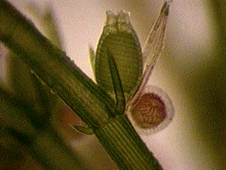

---
aliases:
  - Charales
title: Charales
---

# [[Charales]] 

#is_a/bio-Phylum  
#is_a :: [[../../../Taxon_Rank/bio~Kingdom/bio~Phylum|bio~Phylum]]  

## #has_/text_of_/abstract 

> **Charales** is an order of freshwater green algae in the division Charophyta, class Charophyceae, 
> commonly known as stoneworts. 
> 
> Depending on the treatment of the genus Nitellopsis, living (extant) species are placed into either one family (Characeae) or two (Characeae and Feistiellaceae). Further families are used for fossil members of the order. Linnaeus established the genus Chara in 1753.
>
> [Wikipedia](https://en.wikipedia.org/wiki/Charales) 

## Introduction

[Richard M. McCourt]()

The green algae in the order Charales are commonly called stoneworts or
brittleworts. These algae are common in quiet freshwater habitats such
as ponds and streams; a few are found in brackish water. Stoneworts are
found on all continents except Antarctica. The Charales are the only
living stoneworts; two orders of extinct algae closely related to the
Charales are known only from fossils of their reproductive spores. The
thallus of the plant consists of a series of so-called \"giant cells\"
up to several cm in length, with branches coming off at nodes composed
of smaller cells. Growth occurs at the apex, and the plant is anchored
in mud or silt by translucent rhizoids. Male and female sexual
reproductive structures grow at the nodes. The male antheridia are
spherical and often orange. The female oogonia are oblong, consisting of
a central cell jacketed by five tubular, spiraling cells. A crown of
smaller cells sits atop the jacket cells where they come together.

The thallus in some stoneworts is encrusted with white lime, giving a
crusty texture (hence the name brittlewort). Often the thallus has a
strong unpleasant smell, and the plants are sometimes called skunkweed.

### Discussion of Phylogenetic Relationships

Six living genera in a single family, the Characeae are known. Chara and
Nitella contain the most species. Conventional taxonomy (Wood and
Imahori, 1965) divides the Charales into two tribes: tribe Chareae
(Chara, Nitellopsis, Lamprothamnium, Lychnothamnus), and tribe Nitelleae
(Nitella, Tolypella). The Chareae have a crown of five cells on the
oogonium, whereas the Nitelleae have a crown of ten cells. Recent
molecular studies using rbcL sequences (McCourt et al., 1996) supports
the Chareae as a monophyletic group (with the topology shown), with
Tolypella and Nitella basal to the group However, the rbcL data suggest
that the latter two genera form a basal grade rather than a monophyletic
tribe:

                  === Chara
               ===|
               |  === Lamprothamnium
         ======|
         |     |  === Lychnothamnus
    =====|     ===|
         |        === Nitellopsis
         |
         |=========== Tolypella
         |
         ============ Nitella

## Phylogeny 

-   « Ancestral Groups  
    -  [Green plants](../Plant.md) 
    -  [Eukarya](../../Eukarya.md) 
    -   [Tree of Life](../../Tree_of_Life.md)

-   ◊ Sibling Groups of  Green plants
    -   [Zygnematales](Zygnematales.md)
    -   Charales
    -   [Land_Plant](Land_Plant.md)

-   » Sub-Groups 

### References

McCourt, R. M., Karol, K. G., Guerlesquin, M., and Feist, M. (1996)
Phylogeny of extant genera in the family Characeae (Charales,
Charophyceae) based on rbcL sequences and morphology. Amer. J. Bot. (in
press)

Wood, R. D., and K. Imahori. (1965) Monograph of the Characeae. First
part of a revision of the Characeae. Verlag von J. Cramer, Weinheim.

## Title Illustrations

)

  ---------
  Copyright ::   © 1996 R. M. McCourt
  ---------

## Confidential Links & Embeds: 

### #is_/same_as :: [[/_Standards/bio/bio~Domain/Eukarya/Plant/Charales|Charales]] 

### #is_/same_as :: [[/_public/bio/bio~Domain/Eukarya/Plant/Charales.public|Charales.public]] 

### #is_/same_as :: [[/_internal/bio/bio~Domain/Eukarya/Plant/Charales.internal|Charales.internal]] 

### #is_/same_as :: [[/_protect/bio/bio~Domain/Eukarya/Plant/Charales.protect|Charales.protect]] 

### #is_/same_as :: [[/_private/bio/bio~Domain/Eukarya/Plant/Charales.private|Charales.private]] 

### #is_/same_as :: [[/_personal/bio/bio~Domain/Eukarya/Plant/Charales.personal|Charales.personal]] 

### #is_/same_as :: [[/_secret/bio/bio~Domain/Eukarya/Plant/Charales.secret|Charales.secret]] 

