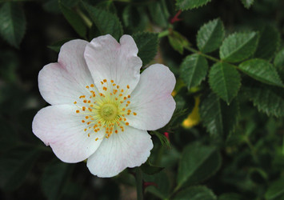
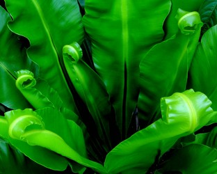

---
aliases:
- Ali bitkilər
- augstākie augi
- embriofito
- Embriòfits
- Embriófita
- Embriófito
- embriós növények
- Embryophyta
- Embryophyte
- Embryophytes
- Joğarğı satıdağı ösimdikter
- Kopnena biljka
- Kopnene biljke
- Land Plant
- land plants
- Landpflanze
- Landplant'n
- landplantar
- landplanter
- Landplanzen
- Landväxter
- Land_Plant
- rośliny telomowe
- Streptophyta
- Stængelplanter
- thực vật có phôi
- vyšší rostliny
- Yuksak oʻsimliklar
- Аслă ӳсентăран
- висши растения
- виши растенија
- высшие растения
- Вышэйшыя расліны
- ембріофіти
- Жоғарғы сатыдағы өсімдіктер
- Копнене биљке
- найвышэйшыя расьліны
- югары төзелешле үсемлекләр
- Юғары төҙөлөшлө үҫемлектәр
- Үрдүкү үүнээйилэр
- բարձրակարգ բույսեր
- צמחי עובר
- ایمبریوفائیٹ
- جوعارعى ساتىداعى وسىمدىكتەر
- رویانداران
- نباتات جنينية
- نباتات جنينيه
- जमीनी पौधा
- ভ্রূণীয়-উদ্ভিদ
- எம்பிரியோபைட்
- พืชบก
- უმაღლესი მცენარეები
- 有胚植物
- 陸上植物
- 유배식물
has_id_wikidata: Q192154
title: Embryophytes
parent_taxon: '[[_Standards/WikiData/WD~Streptophyta,133527]]'
taxon_rank: '[[_Standards/WikiData/WD~superdivision,23760204]]'
union_of: '[[_Standards/WikiData/WD~list_of_values_as_qualifiers,23766486]]'
studied_by: '[[_Standards/WikiData/WD~phytology,133501250]]'
subclass_of: '[[_Standards/WikiData/WD~plant,756]]'
instance_of: '[[_Standards/WikiData/WD~taxon,16521]]'
named_after: '[[_Standards/WikiData/WD~embryo,33196]]'
ITIS_TSN: 954900
montage_image: http://commons.wikimedia.org/wiki/Special:FilePath/Plants.jpg
image: http://commons.wikimedia.org/wiki/Special:FilePath/Plants.jpg
MeSH_tree_code: B01.875.800.575
UMLS_CUI: C1562025
Commons_category: Embryophyta
taxon_name: Embryophytes
dv_has_:
  name_:
    af: Embryophyta
    an: Embryophyta
    ar: نباتات جنينية
    arz: نباتات جنينيه
    ast: Embryophyta
    az: Ali bitkilər
    ba: Юғары төҙөлөшлө үҫемлектәр
    bar: Embryophyta
    be: Вышэйшыя расліны
    be-tarask: найвышэйшыя расьліны
    bg: висши растения
    bho: जमीनी पौधा
    bn: ভ্রূণীয়-উদ্ভিদ
    br: Embryophyta
    bs: Kopnena biljka
    ca: Embriòfits
    ceb: Embryophyta
    co: Embryophyta
    cs: vyšší rostliny
    cv: Аслă ӳсентăран
    cy: Embryophyta
    da: Stængelplanter
    de: Embryophyta
    de-at: Embryophyta
    de-ch: Embryophyta
    en: Embryophytes
    en-ca: Embryophyta
    en-gb: Embryophyta
    eo: embriofito
    es: Embryophyta
    et: Embryophyta
    eu: Embryophyta
    fa: رویانداران
    fi: Streptophyta
    fr: Embryophyta
    frp: Embryophyta
    fur: Embryophyta
    ga: Embryophyta
    gd: Embryophyta
    gl: Embriófita
    gsw: Embryophyta
    he: צמחי עובר
    hr: Embryophyta
    hu: embriós növények
    hy: բարձրակարգ բույսեր
    ia: Embryophyta
    id: Embryophyta
    ie: Embryophyta
    ilo: Embryophyta
    io: Embryophyta
    is: Embryophyta
    it: Embryophyta
    ja: 有胚植物
    ka: უმაღლესი მცენარეები
    kg: Embryophyta
    kk: Жоғарғы сатыдағы өсімдіктер
    kk-arab: جوعارعى ساتىداعى وسىمدىكتەر
    kk-cn: جوعارعى ساتىداعى وسىمدىكتەر
    kk-cyrl: Жоғарғы сатыдағы өсімдіктер
    kk-kz: Жоғарғы сатыдағы өсімдіктер
    kk-latn: Joğarğı satıdağı ösimdikter
    kk-tr: Joğarğı satıdağı ösimdikter
    ko: 유배식물
    la: Embryophyta
    lb: Landplanzen
    li: Embryophyta
    lij: Embryophyta
    lv: augstākie augi
    mg: Embryophyta
    min: Embryophyta
    mk: виши растенија
    ms: Embryophyta
    mul: Embryophytes
    nap: Embryophyta
    nb: landplanter
    nds: Embryophyta
    nds-nl: Embryophyta
    nl: Embryophyta
    nn: landplantar
    nrm: Embryophyta
    oc: Embryophyta
    pcd: Embryophyta
    pl: rośliny telomowe
    pms: Embryophyta
    pt: Embriófito
    pt-br: Embryophyta
    rm: Embryophyta
    ro: Embryophyta
    ru: высшие растения
    sah: Үрдүкү үүнээйилэр
    sc: Embryophyta
    scn: Embryophyta
    sco: Embryophyta
    si: Embryophyte
    sk: Embryophyta
    sl: Embryophyta
    sq: Embryophyta
    sr: Копнене биљке
    sr-ec: Копнене биљке
    sr-el: Kopnene biljke
    su: Embryophyta
    sv: Landväxter
    sw: Embryophyta
    ta: எம்பிரியோபைட்
    th: พืชบก
    tl: Embryophyte
    tr: Embryophyte
    tt: югары төзелешле үсемлекләр
    uk: ембріофіти
    ur: ایمبریوفائیٹ
    uz: Yuksak oʻsimliklar
    vec: Embryophyta
    vi: thực vật có phôi
    vls: Embryophyta
    vo: Embryophyta
    wa: Embryophyta
    war: Embryophyta
    wo: Embryophyta
    wuu: 有胚植物
    yue: 陸上植物
    zea: Landplant'n
    zh: 有胚植物
    zh-cn: 有胚植物
    zh-hans: 有胚植物
    zh-hant: 有胚植物
    zh-hk: 有胚植物
    zh-sg: 有胚植物
    zh-tw: 有胚植物
    zu: Embryophyta
---
# [[Land_Plant]]

#is_a/bio-Phylum  
#is_a :: [[../../../Taxon_Rank/bio~Kingdom/bio~Phylum|bio~Phylum]]  

  

#is_/same_as :: [[../../../../WikiData/WD~Embryophytes,192154 1|WD~Embryophytes,192154 1]] 

## #has_/text_of_/abstract 

> The **Embryophytes** are a clade of plants, 
> also known as Embryophyta (Plantae sensu strictissimo) or land plants. 
> 
> They are the most familiar group of photoautotrophs 
> that make up the vegetation on Earth's dry lands and wetlands. 
> 
> Embryophytes have a common ancestor with green algae, 
> having emerged within the Phragmoplastophyta clade of freshwater charophyte green algae 
> as a sister taxon of Charophyceae, Coleochaetophyceae and Zygnematophyceae. 
> 
> Embryophytes have diplobiontic life cycles. 
> Embryophytes consist of the bryophytes and the polysporangiophytes. 
> Living embryophytes include hornworts, liverworts, mosses, lycophytes, ferns, gymnosperms and angiosperms (flowering plants). 
>
> The embryophytes are informally called "land plants" 
> because they thrive primarily in terrestrial habitats (despite some members having evolved secondarily to live once again in semiaquatic/aquatic habitats), 
> while the related green algae are primarily aquatic. 
> 
> Embryophytes are complex multicellular eukaryotes with specialized reproductive organs. 
> The name derives from their innovative characteristic of nurturing the young embryo sporophyte 
> during the early stages of its multicellular development within the tissues of the parent gametophyte. 
> 
> With very few exceptions, embryophytes obtain biological energy by photosynthesis, 
> using chlorophyll a and b to harvest the light energy in sunlight 
> for carbon fixation from carbon dioxide and water in order to synthesize carbohydrates 
> while releasing oxygen as a byproduct. 
> 
> The study of land plants is called phytology.
>
> [Wikipedia](https://en.wikipedia.org/wiki/Embryophyte) 

## Phylogeny 

-   « Ancestral Groups  
    -  [Green plants](../Plant.md) 
    -  [Eukarya](../../Eukarya.md) 
    -   [Tree of Life](../../Tree_of_Life.md)

-   ◊ Sibling Groups of  Green plants
    -   [Zygnematales](Zygnematales.md)
    -   [Charales](Charales.md)
    -   Embryophytes

-   » Sub-Groups
    -   [Hornwort](Land_Plant/Hornwort.md)
    -   [Moss](Land_Plant/Moss.md)
    -   [Fern](Land_Plant/Fern.md)
    -   [Seed_Plant](Land_Plant/Seed_Plant.md) 

## Title Illustrations

-------------------------------------------------------------
 
scientific_name ::     Rosa canina
location ::           Reed\'s Beach, Cape May County, New Jersey, USA
specimen_condition ::  Live Specimen
Source               [Dog Rose, P6070047](http://www.flickr.com/photos/anitagould/18619347/)
Source Collection    [Flickr](http://flickr.com/)
Image Use ::    [Attribution-NonCommercial 2.0 Creative Commons License](http://creativecommons.org/licenses/by-nc/2.0/).
copyright ::            © 2005 [Anita Gould](http://flickr.com/people/61897811@N00)

------------------------------------------------------------
 
scientific_name ::     Asplenium australasicum
location ::           Cebu, the Philippines
specimen_condition ::  Live Specimen
Source               [manao](http://www.flickr.com/photos/colloidfarl/47048529/)
Source Collection    [Flickr](http://flickr.com/)
Image Use ::    [Attribution-NoDerivs 2.0 Creative Commons License](http://creativecommons.org/licenses/by-nd/2.0/).
copyright ::            © 2005 [Farl](http://flickr.com/people/89972557@N00)

## Confidential Links & Embeds: 

### #is_/same_as :: [[/_Standards/bio/bio~Domain/Eukarya/Plant/Land_Plant|Land_Plant]] 

### #is_/same_as :: [[/_public/bio/bio~Domain/Eukarya/Plant/Land_Plant.public|Land_Plant.public]] 

### #is_/same_as :: [[/_internal/bio/bio~Domain/Eukarya/Plant/Land_Plant.internal|Land_Plant.internal]] 

### #is_/same_as :: [[/_protect/bio/bio~Domain/Eukarya/Plant/Land_Plant.protect|Land_Plant.protect]] 

### #is_/same_as :: [[/_private/bio/bio~Domain/Eukarya/Plant/Land_Plant.private|Land_Plant.private]] 

### #is_/same_as :: [[/_personal/bio/bio~Domain/Eukarya/Plant/Land_Plant.personal|Land_Plant.personal]] 

### #is_/same_as :: [[/_secret/bio/bio~Domain/Eukarya/Plant/Land_Plant.secret|Land_Plant.secret]] 

