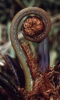
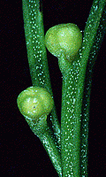
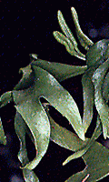
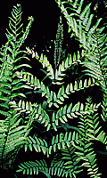

---
aliases:
- Filicopsida
- Polypodiopsida
- Polypodiophyta
- Fern
- Ferns
title: Filicopsida
---

# [[Fern]]

Ferns 

       

## #has_/text_of_/abstract 

> The ferns (Polypodiopsida or Polypodiophyta) are a group of vascular plants 
> (plants with xylem and phloem) that reproduce via spores and have neither seeds nor flowers. 
> 
> They differ from mosses by being vascular, 
> i.e., having specialized tissues that conduct water and nutrients, 
> and in having life cycles in which the branched sporophyte is the dominant phase.
>
> Ferns have complex leaves called megaphylls that are more complex than the microphylls of clubmosses. Most ferns are leptosporangiate ferns. They produce coiled fiddleheads that uncoil and expand into fronds. The group includes about 10,560 known extant species. Ferns are defined here in the broad sense, being all of the Polypodiopsida, comprising both the leptosporangiate (Polypodiidae) and eusporangiate ferns, the latter group including horsetails, whisk ferns, marattioid ferns, and ophioglossoid ferns.
>
> The fern crown group, consisting of the leptosporangiates and eusporangiates, is estimated to have originated in the late Silurian period 423.2 million years ago, but Polypodiales, the group that makes up 80% of living fern diversity, did not appear and diversify until the Cretaceous, contemporaneous with the rise of flowering plants that came to dominate the world's flora.
>
> Ferns are not of major economic importance, but some are used for food, medicine, as biofertilizer, as ornamental plants, and for remediating contaminated soil. They have been the subject of research for their ability to remove some chemical pollutants from the atmosphere. Some fern species, such as bracken (Pteridium aquilinum) and water fern (Azolla filiculoides), are significant weeds worldwide. Some fern genera, such as Azolla, can fix nitrogen and make a significant input to the nitrogen nutrition of rice paddies. They also play certain roles in folklore.
>
> [Wikipedia](https://en.wikipedia.org/wiki/Fern) 

## Phylogeny 

-   « Ancestral Groups  
    -   [Land_Plant](../Land_Plant.md)
    -  [Green plants](../../Plant.md))
    -  [Eukarya](../../../Eukarya.md))
    -   [Tree of Life](../../../Tree_of_Life.md)

-   ◊ Sibling Groups of  Embryophytes
    -   [Hornwort](Hornwort.md)
    -   [Moss](Moss.md)
    -   Filicopsida
    -   [Seed_Plant](Seed_Plant.md)

-   » Sub-Groups
    -  [leptosporangiate ferns](Fern/Leptosporangiate_Ferns.md))

## Confidential Links & Embeds: 

### #is_/same_as :: [Fern](/_Standards/bio/bio~Domain/Eukarya/Plant/Land_Plant/Fern.md) 

### #is_/same_as :: [Fern.public](/_public/bio/bio~Domain/Eukarya/Plant/Land_Plant/Fern.public.md) 

### #is_/same_as :: [Fern.internal](/_internal/bio/bio~Domain/Eukarya/Plant/Land_Plant/Fern.internal.md) 

### #is_/same_as :: [Fern.protect](/_protect/bio/bio~Domain/Eukarya/Plant/Land_Plant/Fern.protect.md) 

### #is_/same_as :: [Fern.private](/_private/bio/bio~Domain/Eukarya/Plant/Land_Plant/Fern.private.md) 

### #is_/same_as :: [Fern.personal](/_personal/bio/bio~Domain/Eukarya/Plant/Land_Plant/Fern.personal.md) 

### #is_/same_as :: [Fern.secret](/_secret/bio/bio~Domain/Eukarya/Plant/Land_Plant/Fern.secret.md)

