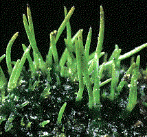

---
aliases:
  - Anthocerotophyta
  - Hornwort
title: Anthocerotophyta
---

# [[Hornwort]]

Hornworts  

## #has_/text_of_/abstract 

> Hornworts are a group of non-vascular Embryophytes (land plants) 
> constituting the division **Anthocerotophyta**. 
> 
> The common name refers to the elongated horn-like structure, which is the sporophyte. 
> As in mosses and liverworts, hornworts have a gametophyte-dominant life cycle, 
> in which cells of the plant carry only a single set of genetic information; 
> the flattened, green plant body of a hornwort is the gametophyte stage of the plant.
>
> Hornworts may be found worldwide, though they tend to grow only in places that are damp or humid. 
> Some species grow in large numbers as tiny weeds in the soil of gardens and cultivated fields. 
> Large tropical and sub-tropical species of Dendroceros may be found growing on the bark of trees.
>
> The total number of species is still uncertain. 
> While there are more than 300 published species names, 
> the actual number could be as low as 100–150 species.
>
> [Wikipedia](https://en.wikipedia.org/wiki/Hornwort)

## Phylogeny 

-   « Ancestral Groups  
    -   [Land_Plant](../Land_Plant.md)
    -  [Green plants](../../Plant.md) 
    -  [Eukarya](../../../Eukarya.md) 
    -   [Tree of Life](../../../Tree_of_Life.md)

-   ◊ Sibling Groups of  Embryophytes
    -   Anthocerotophyta
    -   [Moss](Moss.md)
    -   [Fern](Fern.md)
    -   [Seed_Plant](Seed_Plant.md)

-   » Sub-Groups 

## Confidential Links & Embeds: 

### #is_/same_as :: [[/_Standards/bio/bio~Domain/Eukarya/Plant/Land_Plant/Hornwort|Hornwort]] 

### #is_/same_as :: [[/_public/bio/bio~Domain/Eukarya/Plant/Land_Plant/Hornwort.public|Hornwort.public]] 

### #is_/same_as :: [[/_internal/bio/bio~Domain/Eukarya/Plant/Land_Plant/Hornwort.internal|Hornwort.internal]] 

### #is_/same_as :: [[/_protect/bio/bio~Domain/Eukarya/Plant/Land_Plant/Hornwort.protect|Hornwort.protect]] 

### #is_/same_as :: [[/_private/bio/bio~Domain/Eukarya/Plant/Land_Plant/Hornwort.private|Hornwort.private]] 

### #is_/same_as :: [[/_personal/bio/bio~Domain/Eukarya/Plant/Land_Plant/Hornwort.personal|Hornwort.personal]] 

### #is_/same_as :: [[/_secret/bio/bio~Domain/Eukarya/Plant/Land_Plant/Hornwort.secret|Hornwort.secret]] 

